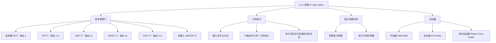

**相关笔记：** [[12.2 布尔函数的表示]] | [[12.4 电路最小化]]

> [!abstract] 概览
> 本节介绍如何用==逻辑门（logic gate）==来实现布尔函数，从而构建==组合电路（combinational circuit）==。逻辑门是电子电路的基本元件，每种门实现一种布尔运算。本节首先定义三种基本门（==反相器==、==OR 门==、==AND 门==）以及常用的==NAND 门==和==NOR 门==，然后讨论如何通过组合这些门来实现任意布尔函数。最后，本节以==半加器（half adder）==、==全加器（full adder）==和==多位加法器（ripple-carry adder）==为例，展示逻辑门在实际计算电路中的应用。
>
> - ==逻辑门（logic gate）==：实现布尔运算的基本电路元件
> - ==反相器（inverter）==：实现补运算 $\bar{x}$，也称 NOT 门
> - ==OR 门==：实现布尔和 $x + y$，可接受两个或多个输入
> - ==AND 门==：实现布尔积 $xy$，可接受两个或多个输入
> - ==组合电路（combinational circuit）==：输出仅取决于输入、无记忆能力的电路
> - ==半加器（half adder）==：将两个位相加，产生和位 $s$ 与进位 $c$
> - ==全加器（full adder）==：将两个位及一个进位输入相加，产生和位与进位输出
> - ==NAND 门==：$\overline{xy}$，仅用 NAND 门即可实现所有布尔函数
> - ==NOR 门==：$\overline{x + y}$，仅用 NOR 门即可实现所有布尔函数

---

## 一、知识结构总览

---

## 二、核心思想

> [!tip] 核心思想
> 本节的核心思想是==将布尔代数的抽象运算映射为具体的物理电路元件==。每个逻辑门实现一种布尔运算，而任意布尔函数都可以通过组合这些门来实现。这种从"代数表达式"到"电路图"的对应关系，使得我们可以用数学方法设计、分析和优化电路。加法器的构造过程尤其体现了"模块化设计"的思想：用简单的半加器作为基本模块，组合构建全加器，再用全加器级联构建多位加法器。

### 1. 基本逻辑门

> [!def] 反相器（Inverter / NOT Gate）
> ==反相器==接受一个布尔变量作为输入，输出其==补（complement）==。若输入为 $x$，则输出为 $\bar{x}$。
>
> | 输入 $x$ | 输出 $\bar{x}$ |
> |:---:|:---:|
> | 0 | 1 |
> | 1 | 0 |

> [!def] OR 门
> ==OR 门==接受两个或多个布尔变量作为输入，输出它们的==布尔和（Boolean sum）==。对于两个输入 $x$ 和 $y$，输出为 $x + y$。
>
> | $x$ | $y$ | $x + y$ |
> |:---:|:---:|:---:|
> | 0 | 0 | 0 |
> | 0 | 1 | 1 |
> | 1 | 0 | 1 |
> | 1 | 1 | 1 |

> [!def] AND 门
> ==AND 门==接受两个或多个布尔变量作为输入，输出它们的==布尔积（Boolean product）==。对于两个输入 $x$ 和 $y$，输出为 $xy$。
>
> | $x$ | $y$ | $xy$ |
> |:---:|:---:|:---:|
> | 0 | 0 | 0 |
> | 0 | 1 | 0 |
> | 1 | 0 | 0 |
> | 1 | 1 | 1 |

> [!def] NAND 门与 NOR 门
> ==NAND 门==输出 $\overline{xy}$，即当且仅当所有输入均为 1 时输出 0，否则输出 1。
>
> ==NOR 门==输出 $\overline{x + y}$，即当且仅当所有输入均为 0 时输出 1，否则输出 0。
>
> NAND 和 NOR 门具有==功能完备性（functional completeness）==：仅用 NAND 门或仅用 NOR 门就可以实现任意布尔函数，无需其他类型的门。

> [!thm] NAND/NOR 的功能完备性
> 仅用 NAND 门（或仅用 NOR 门）可以实现 NOT、AND、OR 三种基本运算：
>
> - 用 NAND 实现 NOT：$x \mid x = \bar{x}$
> - 用 NAND 实现 AND：$(x \mid y) \mid (x \mid y) = xy$
> - 用 NAND 实现 OR：$(x \mid x) \mid (y \mid y) = x + y$
>
> 由于 $\{+, \cdot, \bar{\phantom{x}}\}$ 是功能完备的，因此 $\{\mid\}$ 也是功能完备的。同理 $\{\downarrow\}$ 也是功能完备的。

### 2. 组合电路

> [!def] 组合电路（Combinational Circuit）
> ==组合电路==是由反相器、OR 门和 AND 门通过组合构成的电路，其==输出仅取决于当前输入==，不依赖于电路的历史状态（即无记忆能力）。组合电路也称为==门控网络（gating network）==。

> [!example] 组合电路的构造
> 构造输出为 $(x + y)\bar{x}$ 的组合电路：
> 1. 用一个 OR 门计算 $x + y$
> 2. 用一个反相器计算 $\bar{x}$
> 3. 用一个 AND 门将 $x + y$ 和 $\bar{x}$ 相乘，得到 $(x + y)\bar{x}$
>
> 构造输出为 $x(y + z)$ 的组合电路：
> 1. 用一个 OR 门计算 $y + z$
> 2. 用一个 AND 门将 $x$ 和 $y + z$ 相乘，得到 $x(y + z)$

> [!tip] 电路与布尔表达式的对应
> 每个布尔表达式都对应一个组合电路，反之亦然：
> - 变量 $\to$ 输入信号
> - $\bar{x}$ $\to$ 反相器
> - $x + y$ $\to$ OR 门
> - $xy$ $\to$ AND 门
> - 嵌套表达式 $\to$ 门的级联
>
> 当多个门共享同一输入时，可以用==分支（branching）==表示，也可以分别标出每个输入。

### 3. 组合电路实例

> [!example] 多数表决电路
> 三人委员会投票，每人投"赞成"（1）或"反对"（0），提案获得至少两票赞成则通过。
>
> 设 $x, y, z$ 分别表示三人的投票结果。输出为 1 当且仅当至少两个变量为 1。对应的布尔函数为：
> $$F(x,y,z) = xy + xz + yz$$
>
> 该电路需要三个 AND 门（分别计算 $xy$、$xz$、$yz$）和一个 OR 门（将三个积求和）。

> [!example] 多开关控制电路
> 两个开关控制一盏灯：拨动任意一个开关都会改变灯的状态。
>
> 设 $x, y$ 表示两个开关的状态（1 = 闭合，0 = 断开），$F(x,y)$ 表示灯的状态。真值表如下：
>
> | $x$ | $y$ | $F(x,y)$ |
> |:---:|:---:|:---:|
> | 1 | 1 | 1 |
> | 1 | 0 | 0 |
> | 0 | 1 | 0 |
> | 0 | 0 | 1 |
>
> 对应的布尔函数为 $F(x,y) = xy + \bar{x}\bar{y}$，即==同或（XNOR）==运算。

### 4. 加法器

> [!def] 半加器（Half Adder）
> ==半加器==将两个二进制位 $x$ 和 $y$ 相加，产生两个输出：
> - ==和位（sum bit）==：$s = x\bar{y} + \bar{x}y = x \oplus y$
> - ==进位（carry bit）==：$c = xy$
>
> | $x$ | $y$ | $s$（和） | $c$（进位） |
> |:---:|:---:|:---:|:---:|
> | 1 | 1 | 0 | 1 |
> | 1 | 0 | 1 | 0 |
> | 0 | 1 | 1 | 0 |
> | 0 | 0 | 0 | 0 |
>
> 半加器之所以称为"半"，是因为它==不考虑来自低位的进位==。

> [!def] 全加器（Full Adder）
> ==全加器==将两个二进制位 $x$、$y$ 以及一个来自低位的进位 $c_i$ 相加，产生两个输出：
> - ==和位==：$s = x\bar{y}c_i + \bar{x}yc_i + xy\bar{c}_i + \bar{x}\bar{y}c_i$
> - ==进位输出==：$c_{i+1} = xyc_i + \bar{x}yc_i + xy\bar{c}_i + xyc_i$
>
> 全加器可以用两个半加器和一个 OR 门来构造：
> 1. 第一个半加器计算 $x + y$，得到中间和与中间进位
> 2. 第二个半加器将中间和与 $c_i$ 相加，得到最终和位 $s$
> 3. 用 OR 门将两个中间进位合并，得到最终进位 $c_{i+1}$

> [!example] 多位加法器（Ripple-Carry Adder）
> 要将两个三位整数 $(x_2 x_1 x_0)_2$ 和 $(y_2 y_1 y_0)_2$ 相加，得到四位和 $(s_3 s_2 s_1 s_0)_2$：
>
> 1. 用一个==半加器==计算最低位：输入 $x_0, y_0$，输出 $s_0$ 和进位 $c_0$
> 2. 用两个==全加器==分别计算中间位和最高位：
>    - 全加器 1：输入 $x_1, y_1, c_0$，输出 $s_1$ 和 $c_1$
>    - 全加器 2：输入 $x_2, y_2, c_1$，输出 $s_2$ 和 $c_2$
> 3. 最高位进位 $c_2$ 即为 $s_3$
>
> 这种逐位进位的方式称为==行波进位加法器（ripple-carry adder）==。对于 $n$ 位加法，需要 1 个半加器和 $n - 1$ 个全加器。

---

## 三、补充理解与易混淆点

> [!info] 补充1：逻辑门的历史渊源
> 逻辑门的理论基础可以追溯到 1938 年，Claude Shannon 在其硕士论文中将布尔代数应用于继电器和开关电路的设计，建立了数字电路设计的数学基础。Shannon 证明了布尔代数的所有运算都可以用继电器电路实现，这一开创性工作使得复杂的逻辑电路设计成为可能。此后，随着晶体管和集成电路技术的发展，逻辑门从体积庞大的继电器演变为微米乃至纳米级的晶体管电路，但布尔代数的基本原理始终未变。
>
> > 来源：Shannon, C. E. (1938). "A Symbolic Analysis of Relay and Switching Circuits." Transactions of the AIEE, 57(12), 713–723.

> [!info] 补充2：NAND/NOR 的通用性与实际意义
> NAND 门和 NOR 门之所以在工程实践中特别重要，不仅因为它们各自构成功能完备集，更因为在许多集成电路技术（如 CMOS）中，NAND 门和 NOR 门是最容易实现的门电路。例如，在 CMOS 技术中，一个 NAND 门只需要 4 个晶体管，而一个 AND 门需要 6 个（因为 AND = NAND + NOT）。因此，实际的芯片设计通常以 NAND 或 NOR 门为基础，将其他逻辑运算转换为 NAND/NOR 的组合来实现。
>
> > 来源：Rosen, K. H. (2019). Discrete Mathematics and Its Applications (8th ed.), McGraw-Hill, Section 12.3.

> [!info] 补充3：组合电路与时序电路的区别
> 本节讨论的组合电路（combinational circuit）的输出仅取决于当前输入，不具有记忆功能。与之相对的是==时序电路（sequential circuit）==，其输出不仅取决于当前输入，还取决于电路的历史状态。时序电路通过引入==触发器（flip-flop）==等存储元件来实现记忆功能，是构建计数器、寄存器、处理器等复杂数字系统的关键。理解组合电路是学习时序电路的前提。
>
> > 来源：Rosen, K. H. (2019). Discrete Mathematics and Its Applications (8th ed.), McGraw-Hill, Section 12.3.

---

## 四、习题精选

> [!problem] 习题 1
> **题目：** 用反相器、AND 门和 OR 门构造一个电路，使其输出为 $xyz + \bar{x}\bar{y}\bar{z}$。
>
> **解题思路：** 该表达式为两个小项的和。第一个小项 $xyz$ 可用一个三输入 AND 门实现；第二个小项 $\bar{x}\bar{y}\bar{z}$ 需要先用三个反相器得到 $\bar{x}$、$\bar{y}$、$\bar{z}$，再用一个三输入 AND 门。最后用一个 OR 门将两个积项相加。
>
> **答案：** 电路包含 3 个反相器、2 个三输入 AND 门和 1 个二输入 OR 门。

> [!problem] 习题 2
> **题目：** 设计一个半加器，仅使用 NAND 门。
>
> **解题思路：** 半加器的两个输出为 $s = x \oplus y = x\bar{y} + \bar{x}y$ 和 $c = xy$。利用 NAND 门的性质：$xy = \overline{x \mid y}$，$x \oplus y = (x \mid (x \mid y)) \mid ((x \mid y) \mid y)$。
>
> **答案：** 使用 5 个 NAND 门即可构造半加器。其中 $c = \overline{x \mid y}$（1 个 NAND 门），$s$ 需要 4 个 NAND 门来实现异或运算。

> [!problem] 习题 3
> **题目：** 一个四人委员会进行多数表决（至少三票赞成则通过），设计对应的组合电路。
>
> **解题思路：** 设四人的投票为 $x_1, x_2, x_3, x_4$。输出为 1 当且仅当至少三个变量为 1。对应的布尔函数为：
> $$F = x_1 x_2 x_3 + x_1 x_2 x_4 + x_1 x_3 x_4 + x_2 x_3 x_4$$
>
> **答案：** 电路包含 4 个三输入 AND 门（分别计算四个积项）和 1 个四输入 OR 门（将四个积项求和）。

> [!problem] 习题 4
> **题目：** 使用全加器和半加器，说明如何将两个五位整数相加。
>
> **解题思路：** 对于两个五位整数 $(x_4 x_3 x_2 x_1 x_0)_2$ 和 $(y_4 y_3 y_2 y_1 y_0)_2$ 的加法：
> - 最低位用 1 个半加器（输入 $x_0, y_0$）
> - 其余 4 位各用 1 个全加器，依次传递进位
> - 最终产生 6 位和 $(s_5 s_4 s_3 s_2 s_1 s_0)_2$
>
> **答案：** 共需 1 个半加器和 4 个全加器。

> [!problem] 习题 5
> **题目：** 证明仅用 NOR 门可以实现 AND 运算，即用 NOR 门构造输出为 $xy$ 的电路。
>
> **解题思路：** 利用 NOR 门的性质逐步构造：
> 1. NOT：$x \downarrow x = \bar{x}$
> 2. OR：$(x \downarrow y) \downarrow (x \downarrow y) = x + y$
> 3. AND：由德摩根定律，$xy = \overline{\bar{x} + \bar{y}}$，因此 $xy = (\bar{x}) \downarrow (\bar{y})$
>
> **答案：** 先用两个 NOR 门分别得到 $\bar{x} = x \downarrow x$ 和 $\bar{y} = y \downarrow y$，再用一个 NOR 门计算 $(\bar{x}) \downarrow (\bar{y}) = xy$。共需 3 个 NOR 门。

---

## 五、视频学习指南

> [!quote] 视频学习指南
> - **Neso Academy - Digital Electronics**：Logic Gates 系列视频，详细讲解各种逻辑门的工作原理和真值表，配有动画演示
> - **3Blue1Brown - "But what is a Boolean?"**：从数学角度解释布尔代数与逻辑门的关系
> - **Ben Eater - Build an 8-bit computer**：从逻辑门出发，逐步构建完整的计算机电路，包括加法器的设计与实现
> - **Computerphile - "Logic Gates"**：简短精炼的逻辑门入门介绍

---

## 六、教材原文

> [!quote] 教材原文
> 本节内容对应 Rosen《离散数学及其应用》（第8版）第12章第3节 "Logic Gates"，页码范围 pp. 858–863。
>
> 主要内容包括：逻辑门的基本定义（反相器、OR 门、AND 门），门的组合与组合电路的构造，多数表决电路与多开关控制电路等实例，以及半加器、全加器和多位加法器的设计。
>
> 习题部分（pp. 863–864）包含 20 道练习题，涵盖电路输出分析、电路构造、NAND/NOR 门应用、半加器/全减器设计、多位运算电路、比较器与乘法器电路，以及多路复用器和电路深度等进阶主题。

---

## 七、参见Wiki

- [[离散数学/concepts/逻辑电路]]
- [[离散数学/concepts/命题逻辑]]

---

#学习/离散数学/布尔代数
