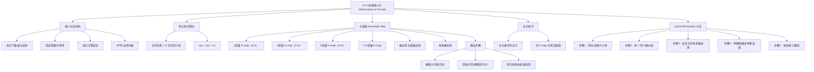

**相关笔记：** [[12.3 逻辑门]] | [[第13章 计算建模 — 章节汇总|第13章汇总]]

> [!abstract] 概览
> 本节讨论如何==最小化（minimize）==布尔函数的积之和展开，从而用最少的逻辑门构建等价电路。本节介绍两种核心方法：==卡诺图（Karnaugh map / K-map）==是一种直观的图形化方法，适用于变量数较少（通常不超过 6 个）的情况；==Quine-McCluskey 方法==是一种系统化的表格方法，可适用于任意数量的变量，且易于计算机实现。两种方法的核心思想都是识别可以合并的小项，找到覆盖所有小项的最小积项集合。
>
> - ==最小化（minimization）==：将布尔函数表示为含最少积项、且每个积项含最少文字的积之和形式
> - ==蕴含项（implicant）==：一个文字之积，若其值为 1 则布尔函数值为 1
> - ==质蕴含项（prime implicant）==：不被任何更大蕴含项包含的蕴含项
> - ==本质蕴含项（essential prime implicant）==：覆盖某个不被其他任何质蕴含项覆盖的小项的质蕴含项
> - ==卡诺图（K-map）==：用二维网格表示小项，通过相邻格的合并来简化布尔表达式
> - ==相邻格==：所代表的小项恰好在一个文字上不同的两个格子
> - ==无关条件（don't care condition）==：电路中不可能出现或无需关心的输入组合
> - ==Quine-McCluskey 方法==：通过反复合并小项找质蕴含项，再通过覆盖表选最小覆盖

---

## 一、知识结构总览

---

## 二、核心思想

> [!tip] 核心思想
> 本节的核心思想是==通过合并小项来减少布尔表达式中积项的数量和每个积项中文字的数量==。两个仅在一个变量上不同的小项可以合并为一个少一个文字的积项（利用 $x + \bar{x} = 1$）。卡诺图通过将相邻小项放在相邻位置来可视化这种合并关系；Quine-McCluskey 方法则通过系统化的表格运算来实现同样的目标。两种方法最终都归结为==寻找覆盖所有小项的最小质蕴含项集合==。

### 1. 最小化的动机

> [!def] 最小化（Minimization）
> ==最小化==一个布尔函数，是指找到该函数的一个积之和表示，使得：
> 1. 积项的数量最少
> 2. 在满足条件 1 的前提下，每个积项中的文字数量最少
>
> 最小化后的布尔表达式对应==使用最少逻辑门、最少输入==的电路。

> [!example] 简化的直观理解
> 考虑布尔函数 $F(x,y,z) = xyz + x\bar{y}z$。
>
> 两个积项仅差一个文字（$y$ vs $\bar{y}$），可以合并：
> $$xyz + x\bar{y}z = (y + \bar{y})(xz) = 1 \cdot xz = xz$$
>
> 原表达式需要 3 个 AND 门、1 个 OR 门和 2 个反相器（共 6 个元件），简化后仅需 1 个 AND 门（2 个输入），电路大大简化。

> [!warning] 最小化的计算复杂性
> 布尔函数最小化是一个==NP 完全问题==，不存在多项式时间的算法。Quine-McCluskey 方法具有指数级复杂度，实际中仅适用于不超过 10 个文字的情况。目前最好的算法也只能处理不超过 25 个变量的情况。对于更大规模的问题，需要使用启发式方法进行近似简化。

### 2. 卡诺图（Karnaugh Map）

#### 2.1 基本概念

> [!def] 卡诺图（K-map）
> ==卡诺图==（Karnaugh map，简称 K-map）是一种用于简化积之和展开的==图形化工具==，由 Maurice Karnaugh 于 1953 年提出。其核心思想是将布尔函数的小项排列在二维网格中，使得==仅在一个文字上不同的小项占据相邻位置==，从而可以直观地识别可合并的小项组。

> [!def] 相邻格（Adjacent Cells）
> 在卡诺图中，两个格子称为==相邻==的，如果它们所代表的小项恰好在一个文字上不同。
>
> 例如，小项 $xy$ 和 $\bar{x}y$ 仅在 $x$ 上不同，因此它们在卡诺图中是相邻的。

#### 2.2 两变量卡诺图

> [!def] 两变量 K-map
> 两变量 $x, y$ 的卡诺图是一个 $2 \times 2$ 的网格，包含 4 个格子，分别对应 4 个小项：
>
> | | $y$ | $\bar{y}$ |
> |:---:|:---:|:---:|
> | **$x$** | $xy$ | $x\bar{y}$ |
> | **$\bar{x}$** | $\bar{x}y$ | $\bar{x}\bar{y}$ |
>
> 每个格子中填入 1（如果该小项出现在展开中）或 0（否则）。

> [!example] 两变量 K-map 的简化
> 简化 $xy + \bar{x}y$：
>
> | | $y$ | $\bar{y}$ |
> |:---:|:---:|:---:|
> | **$x$** | 1 | 0 |
> | **$\bar{x}$** | 1 | 0 |
>
> 两个 1 位于同一列（$y$ 列），对应小项 $xy$ 和 $\bar{x}y$。它们可以合并为 $y$（因为 $xy + \bar{x}y = (x + \bar{x})y = y$）。
>
> 简化结果：$y$。

#### 2.3 三变量卡诺图

> [!def] 三变量 K-map
> 三变量 $x, y, z$ 的卡诺图是一个 $2 \times 4$ 的网格，包含 8 个格子。行对应 $x$ 和 $\bar{x}$，列按 Gray 码排列为 $yz, \bar{y}z, \bar{y}\bar{z}, y\bar{z}$：
>
> | | $yz$ | $\bar{y}z$ | $\bar{y}\bar{z}$ | $y\bar{z}$ |
> |:---:|:---:|:---:|:---:|:---:|
> | **$x$** | $xyz$ | $x\bar{y}z$ | $x\bar{y}\bar{z}$ | $xy\bar{z}$ |
> | **$\bar{x}$** | $\bar{x}yz$ | $\bar{x}\bar{y}z$ | $\bar{x}\bar{y}\bar{z}$ | $\bar{x}y\bar{z}$ |
>
> ==重要==：三变量 K-map 可以看作卷在一个==圆柱体==上，因此==最左列和最右列也是相邻的==。

> [!def] 三变量 K-map 中的块
> - ==1-立方（1-cube）==：2 个相邻格，合并后为 2 个文字的积（如 $xz = xyz + x\bar{y}z$）
> - ==2-立方（2-cube）==：4 个相邻格（$2 \times 2$ 或 $4 \times 1$），合并后为 1 个文字（如 $z = xyz + x\bar{y}z + \bar{x}\bar{y}z + \bar{x}yz$）
> - ==4-立方==：全部 8 个格，合并后为常量 1

> [!example] 三变量 K-map 的简化
> 简化 $xyz + x\bar{y}z + \bar{x}yz + \bar{x}\bar{y}z + x\bar{y}\bar{z}$：
>
> | | $yz$ | $\bar{y}z$ | $\bar{y}\bar{z}$ | $y\bar{z}$ |
> |:---:|:---:|:---:|:---:|:---:|
> | **$x$** | 1 | 1 | 1 | 0 |
> | **$\bar{x}$** | 1 | 1 | 0 | 0 |
>
> - $2 \times 2$ 块（左半部分）：$xyz + x\bar{y}z + \bar{x}yz + \bar{x}\bar{y}z = z$
> - 1-立方（$x\bar{y}z + x\bar{y}\bar{z}$）：$x\bar{y}$
>
> 简化结果：$z + x\bar{y}$。

#### 2.4 四变量卡诺图

> [!def] 四变量 K-map
> 四变量 $w, x, y, z$ 的卡诺图是一个 $4 \times 4$ 的网格，包含 16 个格子。行按 Gray 码排列为 $wx, w\bar{x}, \bar{w}\bar{x}, \bar{w}x$，列按 Gray 码排列为 $yz, \bar{y}z, \bar{y}\bar{z}, y\bar{z}$：
>
> | | $yz$ | $\bar{y}z$ | $\bar{y}\bar{z}$ | $y\bar{z}$ |
> |:---:|:---:|:---:|:---:|:---:|
> | **$wx$** | $wxyz$ | $wx\bar{y}z$ | $wx\bar{y}\bar{z}$ | $wxy\bar{z}$ |
> | **$w\bar{x}$** | $w\bar{x}yz$ | $w\bar{x}\bar{y}z$ | $w\bar{x}\bar{y}\bar{z}$ | $w\bar{x}y\bar{z}$ |
> | **$\bar{w}\bar{x}$** | $\bar{w}\bar{x}yz$ | $\bar{w}\bar{x}\bar{y}z$ | $\bar{w}\bar{x}\bar{y}\bar{z}$ | $\bar{w}\bar{x}y\bar{z}$ |
> | **$\bar{w}x$** | $\bar{w}xyz$ | $\bar{w}x\bar{y}z$ | $\bar{w}x\bar{y}\bar{z}$ | $\bar{w}xy\bar{z}$ |
>
> ==重要==：四变量 K-map 可以看作贴在==环面（torus）==上，因此==最上行和最下行相邻，最左列和最右列也相邻==。每个格子与 4 个格子相邻。

> [!def] 四变量 K-map 中的块
> - ==1-立方==：2 个相邻格 $\to$ 3 个文字的积
> - ==2-立方==：4 个相邻格（$2 \times 2$、$4 \times 1$、$1 \times 4$）$\to$ 2 个文字的积
> - ==3-立方==：8 个相邻格 $\to$ 1 个文字
> - ==4-立方==：全部 16 个格 $\to$ 常量 1

> [!example] 四变量 K-map 的简化
> 简化 $wxy\bar{z} + wx\bar{y}\bar{z} + w\bar{x}y\bar{z} + w\bar{x}\bar{y}\bar{z} + \bar{w}xy\bar{z} + \bar{w}x\bar{y}\bar{z} + \bar{w}\bar{x}y\bar{z}$：
>
> | | $yz$ | $\bar{y}z$ | $\bar{y}\bar{z}$ | $y\bar{z}$ |
> |:---:|:---:|:---:|:---:|:---:|
> | **$wx$** | 0 | 0 | 1 | 1 |
> | **$w\bar{x}$** | 0 | 0 | 1 | 1 |
> | **$\bar{w}\bar{x}$** | 0 | 0 | 0 | 1 |
> | **$\bar{w}x$** | 0 | 0 | 1 | 1 |
>
> - $2 \times 2$ 块（前两行，右半部分）：$w\bar{z}$
> - $4 \times 1$ 块（最右列）：$y\bar{z}$
> - $2 \times 1$ 块（第3、4行，第3列）：$\bar{x}\bar{y}\bar{z}$ 被 $w\bar{z}$ 和 $y\bar{z}$ 覆盖
>
> 简化结果：$\bar{z} + wy\bar{z}$（注意需要根据实际圈法确定）。

#### 2.5 蕴含项与质蕴含项

> [!def] 蕴含项（Implicant）
> 在 K-map 中，一个全为 1 的块所对应的文字之积称为该布尔函数的一个==蕴含项==。蕴含项的特点是：当该积取值为 1 时，布尔函数也取值为 1。

> [!def] 质蕴含项（Prime Implicant）
> ==质蕴含项==是一个==不被任何更大的全 1 块包含==的蕴含项。换句话说，质蕴含项对应的最大全 1 块中，==无法通过扩大块来减少文字数量==。
>
> 在 K-map 中，质蕴含项对应==最大的可能圈==（不能被更大的圈包含）。

> [!def] 本质蕴含项（Essential Prime Implicant）
> ==本质蕴含项==是一个质蕴含项，它==覆盖了至少一个不被任何其他质蕴含项覆盖的小项==（即某个 1 只被这一个质蕴含项覆盖）。
>
> 本质蕴含项==必须==出现在最小化表达式中。

#### 2.6 卡诺图的使用步骤

> [!tip] K-map 简化步骤
> 使用卡诺图简化布尔函数的标准步骤：
>
> 1. **绘制 K-map**：根据变量数选择合适大小的网格
> 2. **填入 1**：将积之和展开中的每个小项对应的格子标记为 1
> 3. **识别所有质蕴含项**：找出所有最大的全 1 块（$2^k$ 个相邻格，$k \geq 1$）
> 4. **确定本质蕴含项**：找出覆盖"唯一 1"的质蕴含项，这些必须选用
> 5. **选择剩余覆盖**：用最少数量的剩余质蕴含项覆盖尚未被覆盖的 1
> 6. **写出结果**：将所有选中的质蕴含项用 OR 连接
>
> **关键原则**：
> - ==优先圈最大的块==（减少文字数量）
> - ==用最少的块覆盖所有 1==
> - ==每个块的大小必须是 $2^k$（2、4、8、16...）==
> - ==不要遗漏本质蕴含项==

> [!example] 完整的 K-map 简化过程
> 简化 $xyz + x\bar{y}z + \bar{x}yz + \bar{x}\bar{y}z + \bar{x}\bar{y}\bar{z}$：
>
> | | $yz$ | $\bar{y}z$ | $\bar{y}\bar{z}$ | $y\bar{z}$ |
> |:---:|:---:|:---:|:---:|:---:|
> | **$x$** | 1 | 1 | 0 | 0 |
> | **$\bar{x}$** | 1 | 1 | 1 | 0 |
>
> **步骤 1**：识别质蕴含项：
> - $2 \times 2$ 块（左半部分 4 格）：$z$（覆盖 $xyz, x\bar{y}z, \bar{x}yz, \bar{x}\bar{y}z$）
> - 1-立方（第2行第3、4列）：$\bar{x}\bar{y}$（覆盖 $\bar{x}\bar{y}z, \bar{x}\bar{y}\bar{z}$）
>
> **步骤 2**：确定本质蕴含项：
> - $\bar{x}\bar{y}\bar{z}$ 只被 $\bar{x}\bar{y}$ 覆盖，因此 $\bar{x}\bar{y}$ 是本质蕴含项
> - $z$ 覆盖的 4 个格子中，$\bar{x}\bar{y}z$ 也被 $\bar{x}\bar{y}$ 覆盖，但其他 3 个只被 $z$ 覆盖
>
> **步骤 3**：$z$ 覆盖了不被 $\bar{x}\bar{y}$ 覆盖的格子，因此 $z$ 也必须选用
>
> **结果**：$z + \bar{x}\bar{y}$

### 3. 无关条件（Don't Care Conditions）

> [!def] 无关条件（Don't Care Condition）
> ==无关条件==是指电路中==不可能出现或无需关心的输入组合==。对于这些组合，输出值可以任意指定为 0 或 1。
>
> 在 K-map 中，无关条件用 ==d== 标记。在圈块时，可以==灵活选择将 d 视为 1 或 0==，以获得最大的块和最简的表达式。

> [!example] 无关条件的应用
> 设计一个电路，判断一个 BCD 编码的十进制数字是否 $\geq 5$。4 位二进制编码有 16 种组合，但十进制数字只用 10 种（0000-1001），剩余 6 种（1010-1111）为无关条件。
>
> | 数字 | $w$ | $x$ | $y$ | $z$ | $F$ |
> |:---:|:---:|:---:|:---:|:---:|:---:|
> | 0-4 | 0 | - | - | - | 0 |
> | 5-9 | - | - | - | - | 1 |
> | 10-15 | 1 | 0/1 | 0/1 | 0/1 | d |
>
> 在 K-map 中将无关条件标记为 d，然后选择将某些 d 视为 1 以形成更大的块，可以得到比不利用无关条件更简化的表达式。

### 4. Quine-McCluskey 方法

#### 4.1 方法概述

> [!def] Quine-McCluskey 方法
> ==Quine-McCluskey 方法==是一种==系统化的布尔函数最小化方法==，由 W.V.O. Quine 和 E.J. McCluskey 在 1950 年代独立提出。与卡诺图依赖视觉判断不同，该方法完全基于表格运算，可以==机械化==且适用于任意数量的变量。
>
> 该方法分为两个主要阶段：
> 1. **找所有质蕴含项**：通过反复合并小项
> 2. **选择最小覆盖**：从质蕴含项中选出覆盖所有小项的最小子集

#### 4.2 步骤详解

> [!tip] Quine-McCluskey 方法的详细步骤
>
> **第一阶段：寻找所有质蕴含项**
>
> **步骤 1**：将每个小项表示为长度为 $n$ 的位串。第 $i$ 位为 1 表示 $x_i$ 出现，为 0 表示 $\bar{x}_i$ 出现。
>
> **步骤 2**：按位串中 1 的个数将小项分组。
>
> **步骤 3**：合并仅差一位的小项对。合并后的积用 $n-1$ 个文字表示，在位串中用短横线 `-` 标记被消去的变量位置。标记已被合并的小项。
>
> **步骤 4**：对步骤 3 得到的积继续合并（要求两个积在相同位置有 `-`，且在其余位置恰好差一位）。标记已被合并的积。
>
> **步骤 5**：重复合并过程直到无法继续合并。所有==未被标记==的积即为==质蕴含项==。
>
> **第二阶段：选择最小覆盖**
>
> **步骤 6**：构建==质蕴含项覆盖表==。行对应每个质蕴含项，列对应每个原始小项。若质蕴含项覆盖某小项，则在对应位置标记 X。
>
> **步骤 7**：找出==本质蕴含项==（某列中只有一个 X 的行），将其选入最终表达式。
>
> **步骤 8**：删除已被本质蕴含项覆盖的列，以及被选入质蕴含项支配（覆盖子集）的行。
>
> **步骤 9**：对剩余的表重复步骤 7-8，或使用回溯法选择最优解。

> [!example] Quine-McCluskey 方法完整示例
> 简化 $xyz + x\bar{y}z + \bar{x}yz + \bar{x}\bar{y}z + \bar{x}\bar{y}\bar{z}$。
>
> **步骤 1-2**：用位串表示并分组：
>
> | 小项 | 位串 | 1 的个数 |
> |:---:|:---:|:---:|
> | $xyz$ | 111 | 3 |
> | $x\bar{y}z$ | 101 | 2 |
> | $\bar{x}yz$ | 011 | 2 |
> | $\bar{x}\bar{y}z$ | 001 | 1 |
> | $\bar{x}\bar{y}\bar{z}$ | 000 | 0 |
>
> **步骤 3**：合并相邻组中仅差一位的小项：
>
> | 合并 | 结果 | 位串 |
> |:---:|:---:|:---:|
> | (1,2) $xyz + x\bar{y}z$ | $xz$ | 1-1 |
> | (1,3) $xyz + \bar{x}yz$ | $yz$ | -11 |
> | (2,4) $x\bar{y}z + \bar{x}\bar{y}z$ | $\bar{y}z$ | -01 |
> | (3,4) $\bar{x}yz + \bar{x}\bar{y}z$ | $\bar{x}z$ | 0-1 |
> | (4,5) $\bar{x}\bar{y}z + \bar{x}\bar{y}\bar{z}$ | $\bar{x}\bar{y}$ | 00- |
>
> **步骤 4**：继续合并（要求 `-` 位置相同，其余位差一位）：
>
> | 合并 | 结果 | 位串 |
> |:---:|:---:|:---:|
> | (1,2,3,4) $xz$ 和 $yz$ $\to$ $z$ | --1 |
>
> 注意：$xz$（1-1）和 $\bar{x}z$（0-1）不能合并（第一位不同但无 `-`）；$yz$（-11）和 $\bar{y}z$（-01）可以合并为 $z$（--1）。
>
> **步骤 5**：未被标记的积为质蕴含项：$z$（--1）和 $\bar{x}\bar{y}$（00-）。
>
> **步骤 6-7**：构建覆盖表：
>
> | | $xyz$ | $x\bar{y}z$ | $\bar{x}yz$ | $\bar{x}\bar{y}z$ | $\bar{x}\bar{y}\bar{z}$ |
> |:---:|:---:|:---:|:---:|:---:|:---:|
> | $z$ | X | X | X | X | |
> | $\bar{x}\bar{y}$ | | | | X | X |
>
> $\bar{x}\bar{y}\bar{z}$ 列只有 $\bar{x}\bar{y}$ 覆盖 $\to$ $\bar{x}\bar{y}$ 是本质蕴含项。$xyz$ 列只有 $z$ 覆盖 $\to$ $z$ 是本质蕴含项。
>
> **结果**：$z + \bar{x}\bar{y}$

> [!example] 四变量的 Quine-McCluskey 方法
> 简化 $wxyz + wx\bar{y}z + \bar{w}xyz + w\bar{x}yz + \bar{w}x\bar{y}z + \bar{w}\bar{x}yz + \bar{w}\bar{x}\bar{y}z$。
>
> **步骤 1-2**：位串表示与分组：
>
> | 小项 | 位串 | 1 的个数 |
> |:---:|:---:|:---:|
> | $wxyz$ | 1110 | 3 |
> | $wx\bar{y}z$ | 1011 | 3 |
> | $\bar{w}xyz$ | 0111 | 3 |
> | $w\bar{x}yz$ | 1010 | 2 |
> | $\bar{w}x\bar{y}z$ | 0101 | 2 |
> | $\bar{w}\bar{x}yz$ | 0011 | 2 |
> | $\bar{w}\bar{x}\bar{y}z$ | 0001 | 1 |
>
> **步骤 3**：第一次合并：
>
> | 合并 | 结果 | 位串 |
> |:---:|:---:|:---:|
> | (1,4) | $wyz$ | 1-10 |
> | (2,4) | $wxy$ | 101- |
> | (2,6) | $xyz$ | -011 |
> | (3,5) | $\bar{w}xz$ | 01-1 |
> | (3,6) | $\bar{w}yz$ | 0-11 |
> | (5,7) | $\bar{w}\bar{x}z$ | 0-01 |
> | (6,7) | $\bar{w}\bar{y}z$ | 00-1 |
>
> **步骤 4**：第二次合并：
>
> | 合并 | 结果 | 位串 |
> |:---:|:---:|:---:|
> | (3,5,6,7) | $\bar{w}z$ | 0--1 |
>
> **质蕴含项**：$wyz$（1-10）、$wxy$（101-）、$xyz$（-011）、$\bar{w}z$（0--1）。
>
> **覆盖表**：
>
> | | $wxyz$ | $wx\bar{y}z$ | $\bar{w}xyz$ | $w\bar{x}yz$ | $\bar{w}x\bar{y}z$ | $\bar{w}\bar{x}yz$ | $\bar{w}\bar{x}\bar{y}z$ |
> |:---:|:---:|:---:|:---:|:---:|:---:|:---:|:---:|
> | $\bar{w}z$ | | | X | | X | X | X |
> | $wyz$ | X | | | X | | | |
> | $wxy$ | | X | | | | | |
> | $xyz$ | | | X | | | X | |
>
> **本质蕴含项**：$\bar{w}z$（覆盖 $\bar{w}x\bar{y}z$ 唯一）、$wxy$（覆盖 $wx\bar{y}z$ 唯一）。
>
> 选中 $\bar{w}z$ 和 $wxy$ 后，剩余未覆盖的小项为 $wxyz$ 和 $\bar{w}xyz$。需要从 $wyz$ 和 $xyz$ 中选择：
> - 选 $wyz$：覆盖 $wxyz$ 和 $w\bar{x}yz$
> - 选 $xyz$：覆盖 $\bar{w}xyz$ 和 $\bar{w}\bar{x}yz$
>
> 由于 $\bar{w}xyz$ 和 $wxyz$ 都需要被覆盖，需要选择 $wyz$ 或 $xyz$ 中的一个（或两个）。
>
> **结果**：$\bar{w}z + wxy + wyz$ 或 $\bar{w}z + wxy + xyz$。

#### 4.3 Quine-McCluskey vs 卡诺图

> [!tip] 两种方法的比较
>
> | 特性 | 卡诺图 | Quine-McCluskey |
> |:---|:---|:---|
> | **适用变量数** | $\leq 6$ 个变量 | 任意数量（实际 $\leq 10$） |
> | **操作方式** | 图形化、依赖视觉判断 | 表格化、系统化运算 |
> | **自动化程度** | 难以自动化 | 易于编程实现 |
> | **学习曲线** | 较低（直观） | 较高（步骤多） |
> | **最优性保证** | 小规模问题可保证 | 小规模问题可保证 |
> | **计算复杂度** | 人工操作受限 | 指数级 |
> | **核心思想** | 相邻格合并 | 反复合并位串 |
>
> 两种方法共享相同的核心原理：==识别质蕴含项并选择最小覆盖==。卡诺图适合手工操作和教学，Quine-McCluskey 适合计算机实现和大规模问题。

---

## 三、补充理解与易混淆点

> [!info] 补充1：卡诺图的历史与 Gray 码的关系
> 卡诺图由贝尔实验室的 Maurice Karnaugh 于 1953 年提出，其核心创新在于使用 Gray 码（格雷码）来排列变量组合。Gray 码的特点是相邻两个码字恰好相差一位，这保证了在 K-map 中相邻格子所代表的小项恰好在一个文字上不同，从而可以直接合并。K-map 的思想可以追溯到 E.W. Veitch 的早期工作（1952 年），但 Karnaugh 的版本因使用 Gray 码排列而更加系统化和实用化。理解 Gray 码是理解 K-map 相邻关系的关键。
>
> > 来源：Karnaugh, M. (1953). "The Map Method for Synthesis of Combinational Logic Circuits." Transactions of the AIEE, 72(9), 593–599.

> [!info] 补充2：Quine-McCluskey 方法的哲学渊源
> Quine-McCluskey 方法有着有趣的跨学科起源。W.V.O. Quine（1908-2000）是 20 世纪最著名的哲学家之一，他在数理逻辑和哲学领域做出了基础性贡献。Quine 发现这一方法时，其初衷是作为教授数理逻辑的教学工具，而非作为电路简化的工程方法。McCluskey 则从工程角度独立发展了类似的方法，并将其应用于实际的电路设计问题。这一历史事实揭示了纯数学（逻辑学）与工程应用之间深刻的联系。
>
> > 来源：Quine, W. V. O. (1952). "The Problem of Simplifying Truth Functions." American Mathematical Monthly, 59(8), 521–531.

> [!info] 补充3：卡诺图的局限性与现代替代方法
> 卡诺图的主要局限在于：当变量数超过 4-6 个时，图形变得极其复杂，相邻关系难以直观识别。此外，卡诺图的简化过程依赖人工判断，对于大规模问题不够可靠。自 1970 年代以来，研究者开发了多种更高效的算法（如 Espresso 启发式算法），可以在合理时间内处理更大规模的问题。然而，K-map 中蕴含的核心概念——蕴含项、质蕴含项、本质蕴含项、覆盖选择——构成了所有现代最小化算法的理论基础。掌握 K-map 的概念是理解这些高级算法的前提。
>
> > 来源：McCluskey, E. J. (1956). "Minimization of Boolean Functions." Bell System Technical Journal, 35(6), 1417–1444.

---

## 四、习题精选

> [!problem] 习题 1
> **题目：** 使用卡诺图简化布尔函数 $F(x,y) = xy + \bar{x}y + x\bar{y}$。
>
> **解题思路：** 绘制两变量 K-map，填入三个 1（分别在 $xy$、$\bar{x}y$、$x\bar{y}$ 位置）。$xy$ 和 $\bar{x}y$ 可以合并为 $y$；$xy$ 和 $x\bar{y}$ 可以合并为 $x$。
>
> **答案：** $x + y$。

> [!problem] 习题 2
> **题目：** 使用三变量卡诺图简化 $F(x,y,z) = xyz + x\bar{y}z + \bar{x}\bar{y}z + \bar{x}\bar{y}\bar{z}$。
>
> **解题思路：** 绘制三变量 K-map 并填入 1：
>
> | | $yz$ | $\bar{y}z$ | $\bar{y}\bar{z}$ | $y\bar{z}$ |
> |:---:|:---:|:---:|:---:|:---:|
> | **$x$** | 1 | 1 | 0 | 0 |
> | **$\bar{x}$** | 0 | 1 | 1 | 0 |
>
> - $xyz + x\bar{y}z = xz$（1-立方）
> - $x\bar{y}z + \bar{x}\bar{y}z = \bar{y}z$（1-立方）
> - $\bar{x}\bar{y}z + \bar{x}\bar{y}\bar{z} = \bar{x}\bar{y}$（1-立方）
>
> 质蕴含项为 $xz$、$\bar{y}z$、$\bar{x}\bar{y}$。其中 $\bar{x}\bar{y}\bar{z}$ 只被 $\bar{x}\bar{y}$ 覆盖，$xyz$ 只被 $xz$ 覆盖。选中 $\bar{x}\bar{y}$ 和 $xz$ 后，$\bar{x}\bar{y}z$ 和 $x\bar{y}z$ 均已被覆盖。
>
> **答案：** $xz + \bar{x}\bar{y}$。

> [!problem] 习题 3
> **题目：** 使用四变量卡诺图简化 $F(w,x,y,z) = wxyz + w\bar{x}yz + \bar{w}xyz + \bar{w}\bar{x}yz + wxy\bar{z} + \bar{w}xy\bar{z}$。
>
> **解题思路：** 绘制四变量 K-map 并填入 1：
>
> | | $yz$ | $\bar{y}z$ | $\bar{y}\bar{z}$ | $y\bar{z}$ |
> |:---:|:---:|:---:|:---:|:---:|
> | **$wx$** | 1 | 0 | 0 | 1 |
> | **$w\bar{x}$** | 1 | 0 | 0 | 0 |
> | **$\bar{w}\bar{x}$** | 0 | 0 | 0 | 0 |
> | **$\bar{w}x$** | 1 | 0 | 0 | 1 |
>
> - 第 1 列（$yz$ 列）4 格中的 3 格：$wxyz + w\bar{x}yz + \bar{w}xyz = yz$（注意 $\bar{w}\bar{x}yz$ 为 0，不能形成完整 4 格块，但 $wxyz + w\bar{x}yz = wyz$，$\bar{w}xyz + wxyz = xyz$）
> - 最右列 2 格：$wxy\bar{z} + \bar{w}xy\bar{z} = xy\bar{z}$
>
> 质蕴含项为 $wyz$、$xyz$、$xy\bar{z}$。其中 $w\bar{x}yz$ 只被 $wyz$ 覆盖，$\bar{w}xyz$ 只被 $xyz$ 覆盖，$wxy\bar{z}$ 只被 $xy\bar{z}$ 覆盖。
>
> **答案：** $wyz + xyz + xy\bar{z}$。

> [!problem] 习题 4
> **题目：** 使用 Quine-McCluskey 方法简化 $F(x,y,z) = x\bar{y}\bar{z} + \bar{x}y\bar{z} + \bar{x}\bar{y}z + \bar{x}\bar{y}\bar{z}$。
>
> **解题思路：**
>
> **步骤 1-2**：位串表示与分组：
>
> | 小项 | 位串 | 1 的个数 |
> |:---:|:---:|:---:|
> | $x\bar{y}\bar{z}$ | 100 | 1 |
> | $\bar{x}y\bar{z}$ | 010 | 1 |
> | $\bar{x}\bar{y}z$ | 001 | 1 |
> | $\bar{x}\bar{y}\bar{z}$ | 000 | 0 |
>
> **步骤 3**：合并：
>
> | 合并 | 结果 | 位串 |
> |:---:|:---:|:---:|
> | (1,4) | $\bar{y}\bar{z}$ | -00 |
> | (2,4) | $\bar{x}\bar{z}$ | 0-0 |
> | (3,4) | $\bar{x}\bar{y}$ | 00- |
>
> 无法继续合并。质蕴含项为 $\bar{y}\bar{z}$、$\bar{x}\bar{z}$、$\bar{x}\bar{y}$。
>
> **覆盖表**：
>
> | | $x\bar{y}\bar{z}$ | $\bar{x}y\bar{z}$ | $\bar{x}\bar{y}z$ | $\bar{x}\bar{y}\bar{z}$ |
> |:---:|:---:|:---:|:---:|:---:|
> | $\bar{y}\bar{z}$ | X | | | X |
> | $\bar{x}\bar{z}$ | | X | | X |
> | $\bar{x}\bar{y}$ | | | X | X |
>
> 每列都只有一个 X 的行，三个都是本质蕴含项。
>
> **答案：** $\bar{y}\bar{z} + \bar{x}\bar{z} + \bar{x}\bar{y}$。

> [!problem] 习题 5
> **题目：** 某电路有 4 个输入变量 $w, x, y, z$，其中输入组合 $wxyz = 1010$、$1100$、$1101$、$1110$、$1111$ 为无关条件。使用卡诺图简化函数 $F(w,x,y,z) = \bar{w}\bar{x}\bar{y}\bar{z} + \bar{w}\bar{x}\bar{y}z + \bar{w}\bar{x}y\bar{z} + \bar{w}xy\bar{z} + w\bar{x}\bar{y}\bar{z}$。
>
> **解题思路：** 在四变量 K-map 中填入 1 和 d：
>
> | | $yz$ | $\bar{y}z$ | $\bar{y}\bar{z}$ | $y\bar{z}$ |
> |:---:|:---:|:---:|:---:|:---:|
> | **$wx$** | d | d | d | d |
> | **$w\bar{x}$** | 0 | 0 | 1 | 0 |
> | **$\bar{w}\bar{x}$** | 0 | 1 | 1 | 1 |
> | **$\bar{w}x$** | 0 | 0 | 1 | 1 |
>
> 将 d 视为 1 可以形成更大的块：
> - 最右两列的 $2 \times 4$ 块（利用 d）：$\bar{y}$（覆盖所有 $\bar{y}\bar{z}$ 和 $\bar{y}z$ 的 1 和 d）
> - 第 3 列的 $4 \times 1$ 块（全部为 1 或 d）：$\bar{z}$
>
> 选择最优的圈法，将 d 尽量利用以扩大块。
>
> **答案：** 利用无关条件后，简化结果为 $\bar{y} + \bar{z}$（具体结果取决于 d 的选取策略）。

---

## 五、视频学习指南

> [!quote] 视频学习指南
> - **Neso Academy - Digital Electronics**：K-map 系列视频，从 2 变量到 5 变量 K-map 的详细讲解，配有大量例题
> - **Computerphile - "Karnaugh Maps"**：简短精炼的 K-map 入门介绍
> - **EEVblog - "Logic Gate Tutorial"**：从工程角度讲解逻辑门最小化的实际意义
> - **Ben Eater - Boolean Logic & K-maps**：将 K-map 与实际电路设计结合讲解
> - **NPTEL - "Digital Logic Design"**：包含 Quine-McCluskey 方法的系统讲解，适合深入学习

---

## 六、教材原文

> [!quote] 教材原文
> 本节内容对应 Rosen《离散数学及其应用》（第8版）第12章第4节 "Minimization of Circuits"，页码范围 pp. 864–878。
>
> 主要内容包括：电路最小化的动机与意义（pp. 864-866），卡诺图的定义与使用方法（pp. 866-873），无关条件的概念与应用（pp. 872-873），Quine-McCluskey 方法的详细步骤（pp. 873-877），以及两种方法的比较。
>
> 习题部分（pp. 877-878）包含 33 道练习题，涵盖 2-6 变量 K-map 的绘制与简化、蕴含项与质蕴含项的识别、无关条件的应用、Quine-McCluskey 方法的练习，以及 K-map 与 $n$-维超立方体的关系等进阶主题。

---

## 七、参见Wiki

- [[离散数学/concepts/逻辑电路]]
- [[离散数学/concepts/命题逻辑]]

---

#学习/离散数学/布尔代数
