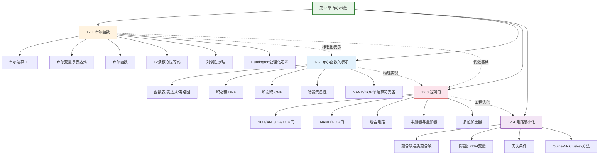

# 第12章 布尔代数 — 章节汇总

> [!abstract] 概览
> 第12章系统介绍了==布尔代数==（Boolean Algebra）这一离散数学的核心代数结构，并展示了它在数字电路设计中的直接应用。全章从布尔代数的公理化定义出发，建立布尔运算、布尔变量、布尔表达式和布尔函数的形式体系（12.1）；然后讨论布尔函数的标准化表示——==积之和展开式==（DNF）和==和之积展开式==（CNF），并证明==功能完备性==（12.2）；接着将布尔表达式映射到物理实现——==逻辑门==（NOT/AND/OR/NAND/NOR）和==组合电路==，并以半加器/全加器为例展示电路设计（12.3）；最后聚焦布尔表达式的==最小化==问题，介绍==卡诺图==（Karnaugh Map）和==Quine-McCluskey 方法==两种经典化简技术（12.4）。全章体现了从"抽象代数→标准化表示→物理实现→工程优化"的递进知识链条，与第1章命题逻辑紧密衔接（布尔代数是命题逻辑的代数化），为第13章计算建模奠定基础。

---

## 全章知识框架



---

## 各节核心知识点汇总

| 小节 | 核心概念 | 关键公式/定理 | 与前后节的关联 |
|:-----|:---------|:-------------|:---------------|
| 12.1 布尔函数 | 布尔运算、布尔表达式、布尔函数、恒等式、对偶性 | 12条恒等式；对偶性原理；Huntington公理；$n$度布尔函数共 $2^{2^n}$ 个 | 全章基础，定义布尔代数的形式体系；与第1章命题逻辑衔接 |
| 12.2 布尔函数的表示 | DNF、CNF、功能完备性 | 每个布尔函数可唯一表示为DNF；$\{\cdot,+,\bar{}\}$ 功能完备；NAND/NOR 单运算符完备 | 12.1 恒等式的直接应用；为 12.3 电路设计提供理论基础 |
| 12.3 逻辑门 | NOT/AND/OR/XOR/NAND/NOR门、组合电路、加法器 | 半加器：$s = x \oplus y$, $c = xy$；全加器：$s = x \oplus y \oplus c_{in}$ | 12.2 布尔表达式的物理实现；加法器是电路设计的经典实例 |
| 12.4 电路最小化 | 卡诺图、蕴含项、质蕴含项、Quine-McCluskey | $xyz + x\bar{z} = xy$（合并律）；K-map圈法；QM方法两阶段 | 12.3 电路设计的优化——减少门数量、降低成本 |

---

## 学习脉络

```
布尔代数的公理化定义与恒等式（12.1）— 掌握12条恒等式和对偶性原理，理解布尔代数的三个实例
  ↓
布尔函数的标准化表示（12.2）— DNF/CNF 是核心，功能完备性是重要理论结果
  ↓
逻辑门与组合电路（12.3）— 将布尔表达式映射到物理电路，半加器/全加器是经典实例
  ↓
电路最小化（12.4）— 卡诺图适合≤4变量，Quine-McCluskey适合任意变量数
```

**学习建议**：12.1 节的==12条布尔恒等式==必须全部熟记，它们是后续所有化简操作的基础；12.2 节的==DNF 构造方法==（从函数表找小项）是核心技能，==功能完备性==的证明思路（用 NAND 实现 NOT/AND/OR）需要理解；12.3 节的==半加器/全加器==需要手动推导布尔表达式并画出电路图；12.4 节的==卡诺图==必须手动练习 3 变量和 4 变量的化简，==Quine-McCluskey 方法==需要理解两阶段流程（找质蕴含项→选最小覆盖）。

---

## 跨节综合复习题

> [!problem] 综合复习题 1（跨 12.1 / 12.2 / 12.3）
> **题目：**
> (a) 证明 $\{+,\bar{}\}$ 是功能完备的运算集合。
> (b) 用 NAND 门构造一个半加器电路（输入 $x, y$，输出和 $s$ 与进位 $c$）。
> (c) 将布尔函数 $F(x,y,z) = \sum m(1,3,5,7)$ 化简为最简积之和形式。

> [!faq]- 解答
> **(a)** 已知 $\{\cdot,\bar{}\}$ 功能完备（因为 $\{\cdot,+,\bar{}\}$ 功能完备且 $x+y = \overline{\bar{x} \cdot \bar{y}}$）。只需用 $+$ 和 $\bar{}$ 表示 $\cdot$：
>
> $$x \cdot y = \overline{\bar{x} + \bar{y}}$$
>
> 因此 $\{+,\bar{}\}$ 功能完备。$\blacksquare$
>
> **(b)** 半加器：$s = x \oplus y = \overline{\overline{x \cdot \bar{y}} \cdot \overline{\bar{x} \cdot y}}$，$c = x \cdot y$。
>
> 用 NAND（$\mid$）实现：
> - NOT：$\bar{x} = x \mid x$
> - AND：$x \cdot y = \overline{x \mid y} = (x \mid y) \mid (x \mid y)$
> - OR：$x + y = \overline{\bar{x}} \cdot \overline{\bar{y}} = \overline{(x \mid x)} \mid \overline{(y \mid y)}$
>
> 半加器需要 5 个 NAND 门：$\bar{x}$, $\bar{y}$, $x \cdot y$（进位），$\overline{x \cdot \bar{y}}$, $\overline{\bar{x} \cdot y}$, 以及最终的 XOR。
>
> **(c)** $F(x,y,z) = \sum m(1,3,5,7)$，对应的小项为 $\bar{x}\bar{y}z + \bar{x}yz + x\bar{y}z + xyz$。
>
> 用卡诺图化简（3变量）：
> - $\bar{x}\bar{y}z + \bar{x}yz = \bar{x}z$（合并第1、3列）
> - $x\bar{y}z + xyz = xz$（合并第5、7列）
> - $\bar{x}z + xz = z$
>
> 最简形式：$F(x,y,z) = z$。$\blacksquare$

> [!problem] 综合复习题 2（跨 12.2 / 12.4）
> **题目：**
> (a) 用 Quine-McCluskey 方法化简 $F(x,y,z) = \sum m(0,2,4,5,6)$。
> (b) 画出 (a) 中函数的 3 变量卡诺图，验证结果一致。
> (c) 用最少的 NAND 门实现化简后的函数。

> [!faq]- 解答
> **(a) Quine-McCluskey 方法：**
>
> 步骤1：按 1 的个数分组
> - 组0（0个1）：$000$
> - 组1（1个1）：$010, 100, 001$ → 注意 $m(0)=000, m(2)=010, m(4)=100, m(5)=101, m(6)=110$
> - 组1（1个1）：$010, 100$
> - 组2（2个1）：$101, 110$
>
> 步骤2：合并
> - $000 + 010 = \_00$（合并 $m(0), m(2)$）
> - $000 + 100 = 0\_0$（合并 $m(0), m(4)$）
> - $010 + 110 = \_10$（合并 $m(2), m(6)$）
> - $100 + 101 = 10\_$（合并 $m(4), m(5)$）
> - $100 + 110 = 1\_0$（合并 $m(4), m(6)$）
>
> 第二轮合并：$0\_0 + 1\_0 = \_0$（合并 $m(0,4,2,6)$）✓
>
> 质蕴含项：$\bar{x}\bar{z}$（$\_0$），$\bar{y}z$（$10\_$），$y\bar{z}$（$\_10$）
>
> 步骤3：覆盖表
> - $m(0)$：$\bar{x}\bar{z}$ ✓
> - $m(2)$：$\bar{x}\bar{z}$ ✓, $y\bar{z}$ ✓
> - $m(4)$：$\bar{x}\bar{z}$ ✓, $\bar{y}z$ ✓
> - $m(5)$：$\bar{y}z$ ✓（本质蕴含项）
> - $m(6)$：$\bar{x}\bar{z}$ ✓, $y\bar{z}$ ✓
>
> 最小覆盖：$\bar{x}\bar{z} + \bar{y}z$（2项，4个文字）
>
> **(b)** 卡诺图验证：
> | $yz$ \ $x$ | 0 | 1 |
> |:-----------|:-:|:-:|
> | 00 | 1 | 1 |
> | 01 | 0 | 1 |
> | 11 | 0 | 0 |
> | 10 | 1 | 1 |
>
> 圈法：$m(0,2,4,6)$ 形成一个4格块 = $\bar{z}$；$m(4,5)$ 形成一个2格块 = $x\bar{y}$。
>
> 最简形式：$F = \bar{z} + x\bar{y}$（与QM结果等价，但卡诺图找到了更大的块）。
>
> **(c)** 用 NAND 门实现 $F = \bar{z} + x\bar{y}$：
> - $\bar{z} = z \mid z$（1个NAND）
> - $\bar{y} = y \mid y$（1个NAND）
> - $x\bar{y} = \overline{\overline{x \cdot \bar{y}}} = (x \cdot \bar{y}) \mid (x \cdot \bar{y})$（2个NAND：先AND再NOT）
> - $F = \overline{\bar{F}} = \overline{\bar{z} \cdot \overline{x\bar{y}}}$（2个NAND）
>
> 总计约 6 个 NAND 门。$\blacksquare$

---

## 与其他章节的关联

| 关联章节 | 关联方式 |
|:---------|:---------|
| 第1章 命题逻辑 | 布尔代数是命题逻辑的代数化：$\vee \to +$，$\wedge \to \cdot$，$\neg \to \bar{}$ |
| 第1章 逻辑等价 | 布尔恒等式 = 逻辑等价式的代数版本 |
| 第2章 集合运算 | 集合的幂集代数是布尔代数的经典实例（$\cup \to +$，$\cap \to \cdot$，$\bar{A} \to \bar{}$） |
| 第6章 计数 | $n$度布尔函数共 $2^{2^n}$ 个；卡诺图的几何化简利用计数直觉 |
| 第9章 零一矩阵 | 布尔矩阵运算是布尔代数的矩阵推广 |
| 第11章 树 | Huffman 编码树（12.2提及）与第11章的树结构直接关联 |
