**相关笔记：** [[第12章_布尔代数-章节汇总|第12章汇总]] | [[13.2 带输出的有限状态机]]

> [!abstract] 概览
> 本节系统介绍了==形式语言（formal language）==与==短语结构文法（phrase-structure grammar）==的基本理论。首先定义了字母表、字符串、字符串的连接与==Kleene 闭包== $\Sigma^*$ 等基础概念，然后给出了文法的四元组形式化定义 $G = (V, T, S, P)$，包括变量集、终结符集、起始符号和产生式集。接着介绍了==派生（derivation）==的概念，以及如何通过产生式从起始符号逐步生成终结符串。随后详细阐述了==乔姆斯基文法分类（Chomsky hierarchy）==——0 型（无限制）、1 型（上下文相关）、2 型（上下文无关）、3 型（正则文法），并说明了各类文法与不同计算模型（图灵机、线性有界自动机、下推自动机、有限状态机）的对应关系。最后介绍了==派生树（derivation tree）==和用于描述编程语言语法的==Backus-Naur 形式（BNF）==。
>
> - ==字母表（alphabet）== $\Sigma$：有限非空符号集
> - ==字符串（string）==：$\Sigma$ 中符号的有限长度序列
> - ==空字符串（empty string）== $\lambda$：不包含任何符号的字符串
> - ==Kleene 闭包== $\Sigma^*$：$\Sigma$ 上所有字符串（含 $\lambda$）的集合
> - ==形式语言==：$\Sigma^*$ 的任意子集
> - ==短语结构文法== $G = (V, T, S, P)$：由词汇表、终结符集、起始符号、产生式集组成的四元组
> - ==产生式（production）==：形如 $w_1 \to w_2$ 的替换规则
> - ==派生（derivation）==：从 $S$ 出发通过产生式逐步替换得到终结符串的过程
> - ==语言 $L(G)$==：文法 $G$ 生成的所有终结符串的集合
> - ==乔姆斯基层次==：0 型 $\supset$ 1 型 $\supset$ 2 型 $\supset$ 3 型的文法分类体系
> - ==派生树（parse tree）==：上下文无关文法派生过程的树形表示
> - ==Backus-Naur 形式（BNF）==：描述上下文无关文法的紧凑记法

---

## 一、知识结构总览

```mermaid
graph TB
    A["13.1 语言与文法 Languages and Grammars"] --> B["基础概念：字母表与字符串"]
    A --> C["短语结构文法"]
    A --> D["派生与语言生成"]
    A --> E["乔姆斯基文法分类"]
    A --> F["派生树"]
    A --> G["Backus-Naur 形式"]

    B --> B1["字母表 Σ：有限非空符号集"]
    B --> B2["字符串：Σ 上符号的有限序列"]
    B --> B3["连接（concatenation）：xy"]
    B --> B4["Kleene 闭包 Σ*：所有字符串的集合"]
    B --> B5["形式语言：Σ* 的子集"]

    C --> C1["四元组 G = (V, T, S, P)"]
    C --> C2["变量集 V（非终结符 N）"]
    C --> C3["终结符集 T"]
    C --> C4["起始符号 S"]
    C --> C5["产生式集 P"]

    D --> D1["直接派生 w₀ ⇒ w₁"]
    D --> D2["多步派生 w₀ ⇒* wₙ"]
    D --> D3["语言 L(G) = {w ∈ T* | S ⇒* w}"]

    E --> E1["0 型：无限制文法"]
    E --> E2["1 型：上下文相关文法"]
    E --> E3["2 型：上下文无关文法"]
    E --> E4["3 型：正则文法（右线性/左线性）"]
    E --> E5["各类文法与识别器的对应关系"]

    F --> F1["根 = 起始符号 S"]
    F --> F2["内部节点 = 非终结符"]
    F --> F3["叶节点 = 终结符"]
    F --> F4["自顶向下解析 vs 自底向上解析"]

    G --> G1["⟨nonterminal⟩ ::= ..."]
    G --> G2["用 | 分隔多个右部"]
    G --> G3["应用：编程语言语法定义"]
```



---

## 二、核心思想

> [!tip] 核心思想
> 本节的核心思想是==用数学方法精确描述"语言的生成规则"==。自然语言（如英语）的语法规则过于复杂，难以完全形式化；但通过==文法==（grammar）这一数学工具，我们可以精确地定义哪些字符串属于某个语言、如何系统地生成这些字符串。乔姆斯基提出的四层文法分类体系——从最一般的无限制文法到最受限的正则文法——不仅为形式语言理论奠定了基础，更揭示了"语言的复杂度"与"识别该语言所需的计算能力"之间的深刻对应关系：正则语言可被有限状态机识别，上下文无关语言可被下推自动机识别，上下文相关语言可被线性有界自动机识别，而无限制语言对应图灵机。这一对应关系是计算理论的核心内容之一。

### 1. 字母表、字符串与形式语言

> [!def] 字母表与字符串
> - ==字母表（alphabet/vocabulary）== $\Sigma$（或 $V$）：一个有限非空集合，其元素称为==符号==（symbol）
> - ==字符串（string/word/sentence）==：由 $\Sigma$ 中符号组成的有限长度序列
> - ==空字符串（empty string/null string）== $\lambda$（有时记为 $\epsilon$）：不包含任何符号的字符串
> - ==字符串的长度== $|w|$：字符串 $w$ 中符号的个数，$|\lambda| = 0$
> - $\Sigma^*$：$\Sigma$ 上所有字符串的集合（包括 $\lambda$）
> - $\Sigma^+$：$\Sigma$ 上所有非空字符串的集合（$\Sigma^+ = \Sigma^* \setminus \{\lambda\}$）

> [!def] 字符串的连接（Concatenation）
> 设 $x = x_1 x_2 \cdots x_m$ 和 $y = y_1 y_2 \cdots y_n$ 是 $\Sigma$ 上的字符串，则 $x$ 和 $y$ 的==连接==定义为
> $$xy = x_1 x_2 \cdots x_m y_1 y_2 \cdots y_n$$
>
> 连接满足以下性质：
> - $|xy| = |x| + |y|$
> - 对所有字符串 $x$，$\lambda x = x\lambda = x$（$\lambda$ 是连接的单位元）
> - 连接运算满足结合律：$(xy)z = x(yz)$

> [!def] Kleene 闭包（Kleene Closure）
> 设 $\Sigma$ 是字母表，定义：
> - $\Sigma^0 = \{\lambda\}$
> - $\Sigma^{n+1} = \Sigma^n \cdot \Sigma$（即 $\Sigma^n$ 中每个字符串与 $\Sigma$ 中每个符号连接）
> - ==Kleene 闭包== $\Sigma^* = \displaystyle\bigcup_{n=0}^{\infty} \Sigma^n$
>
> $\Sigma^*$ 包含 $\Sigma$ 上所有可能的字符串（含空字符串）。

> [!def] 形式语言（Formal Language）
> 字母表 $\Sigma$ 上的一个==形式语言== $L$ 是 $\Sigma^*$ 的任意子集，即 $L \subseteq \Sigma^*$。
>
> 例如，设 $\Sigma = \{0, 1\}$，则以下都是 $\Sigma$ 上的形式语言：
> - $L_1 = \{0, 1, 00, 11, 000, 111, \ldots\} = \{0^n, 1^n \mid n \geq 1\}$
> - $L_2 = \{0^n 1^n \mid n = 0, 1, 2, \ldots\}$
> - $L_3 = \emptyset$（空语言，注意与 $\{\lambda\}$ 不同）

> [!warning] 注意：空字符串 $\lambda$ 与空集 $\emptyset$ 的区别
> - $\lambda$ 是一个字符串（长度为 0 的字符串）
> - $\emptyset$ 是一个集合（不包含任何元素的集合）
> - $\{\lambda\}$ 是一个只含一个元素（即空字符串）的集合
> - 因此 $\emptyset \neq \{\lambda\}$，$\emptyset$ 是空语言，$\{\lambda\}$ 是只含空字符串的语言

### 2. 短语结构文法

> [!def] 短语结构文法（Phrase-Structure Grammar）
> 一个==短语结构文法== $G = (V, T, S, P)$ 由以下四部分组成：
> - $V$：==词汇表==（vocabulary），一个有限非空符号集
> - $T \subseteq V$：==终结符集==（terminal symbols），不能被进一步替换的符号
> - $N = V \setminus T$：==非终结符集==（nonterminal symbols），可以被替换的符号
> - $S \in V$：==起始符号==（start symbol），派生过程的起点
> - $P$：==产生式集==（productions），有限规则集，每条规则形如 $w_1 \to w_2$，其中 $w_1, w_2 \in V^*$，且 $w_1$ 中至少含一个非终结符

> [!example] 英语子集的文法
> 考虑以下生成英语子句的文法：
> - $V = \{\text{sentence}, \text{noun phrase}, \text{verb phrase}, \text{article}, \text{adjective}, \text{noun}, \text{verb}, \text{adverb}, \text{the}, \text{a}, \text{large}, \text{hungry}, \text{rabbit}, \text{mathematician}, \text{eats}, \text{hops}, \text{quickly}, \text{wildly}\}$
> - $T = \{\text{the}, \text{a}, \text{large}, \text{hungry}, \text{rabbit}, \text{mathematician}, \text{eats}, \text{hops}, \text{quickly}, \text{wildly}\}$
> - $S = \text{sentence}$
> - 产生式包括：$\text{sentence} \to \text{noun phrase verb phrase}$，$\text{noun phrase} \to \text{article adjective noun}$ 等
>
> 派生 "the hungry rabbit eats quickly" 的过程：
> $$\text{sentence} \Rightarrow \text{noun phrase verb phrase} \Rightarrow \text{article adjective noun verb phrase}$$
> $$\Rightarrow \text{article adjective noun verb adverb} \Rightarrow \text{the adjective noun verb adverb}$$
> $$\Rightarrow \text{the hungry noun verb adverb} \Rightarrow \text{the hungry rabbit verb adverb}$$
> $$\Rightarrow \text{the hungry rabbit eats adverb} \Rightarrow \text{the hungry rabbit eats quickly}$$

> [!example] 构造文法生成 $\{0^n 1^n \mid n = 0, 1, 2, \ldots\}$
> **解**：文法 $G = (V, T, S, P)$，其中：
> - $V = \{0, 1, S\}$，$T = \{0, 1\}$，$S$ 为起始符号
> - $P = \{S \to 0S1,\ S \to \lambda\}$
>
> 派生过程示例：
> - $S \Rightarrow \lambda$（生成空字符串，对应 $n = 0$）
> - $S \Rightarrow 0S1 \Rightarrow 01$（对应 $n = 1$）
> - $S \Rightarrow 0S1 \Rightarrow 00S11 \Rightarrow 0011$（对应 $n = 2$）
> - $S \Rightarrow 0S1 \Rightarrow 00S11 \Rightarrow 000S111 \Rightarrow 000111$（对应 $n = 3$）

### 3. 派生与语言生成

> [!def] 派生（Derivation）
> 设 $G = (V, T, S, P)$ 是文法。设 $w_0 = l z_0 r$ 和 $w_1 = l z_1 r$ 是 $V^*$ 上的字符串。若 $z_0 \to z_1$ 是 $G$ 的一条产生式，则称 $w_1$ ==可由 $w_0$ 直接派生==，记为 $w_0 \Rightarrow w_1$。
>
> 若存在字符串序列 $w_0, w_1, \ldots, w_n$ 使得 $w_0 \Rightarrow w_1 \Rightarrow w_2 \Rightarrow \cdots \Rightarrow w_n$，则称 $w_n$ ==可由 $w_0$ 派生==，记为 $w_0 \Rightarrow^* w_n$。该替换序列称为一个==派生==（derivation）。

> [!def] 文法生成的语言 $L(G)$
> 文法 $G = (V, T, S, P)$ ==生成的语言==（language generated by $G$）定义为：
> $$L(G) = \{w \in T^* \mid S \Rightarrow^* w\}$$
>
> 即 $L(G)$ 是所有可由起始符号 $S$ 派生出的终结符串的集合。

> [!example] 求文法生成的语言
> 设文法 $G$ 的词汇表 $V = \{S, 0, 1\}$，终结符集 $T = \{0, 1\}$，起始符号为 $S$，产生式为 $P = \{S \to 11S,\ S \to 0\}$。求 $L(G)$。
>
> **解**：从 $S$ 出发：
> - 使用 $S \to 0$：得到 $0$
> - 使用 $S \to 11S$，再使用 $S \to 0$：得到 $110$
> - 使用 $S \to 11S \to 1111S \to 11110$：得到 $11110$
>
> 一般地，使用 $n-1$ 次 $S \to 11S$ 后使用 $S \to 0$，得到 $(11)^{n-1}0$，即由偶数个 $1$ 后跟一个 $0$ 组成的字符串。
> $$L(G) = \{0, 110, 11110, 1111110, \ldots\} = \{(11)^n 0 \mid n = 0, 1, 2, \ldots\}$$

### 4. 乔姆斯基文法分类

> [!def] 乔姆斯基层次（Chomsky Hierarchy）
> 根据产生式形式的不同限制，短语结构文法可分为四类：
>
> | 类型 | 名称 | 产生式限制 | 生成的语言 |
> |:----:|:-----|:-----------|:-----------|
> | ==0 型== | 无限制文法（Unrestricted） | $w_1 \to w_2$，$w_1$ 中至少含一个非终结符 | 递归可枚举语言 |
> | ==1 型== | 上下文相关文法（Context-Sensitive） | $w_1 = lAr \to w_2 = lwr$，其中 $A \in N$，$l, r \in (N \cup T)^*$，$w \neq \lambda$；或 $S \to \lambda$（$S$ 不出现在其他产生式右部） | 上下文相关语言 |
> | ==2 型== | 上下文无关文法（Context-Free） | $w_1 = A \to w_2$，其中 $A$ 是单个非终结符 | 上下文无关语言 |
> | ==3 型== | 正则文法（Regular） | $A \to aB$ 或 $A \to a$（右线性），其中 $A, B \in N$，$a \in T$；或 $S \to \lambda$ | 正则语言 |
>
> 各类语言之间存在严格的包含关系：
> $$\text{正则语言} \subsetneq \text{上下文无关语言} \subsetneq \text{上下文相关语言} \subsetneq \text{递归可枚举语言}$$

> [!thm] 各类文法与识别器的对应关系
> | 文法类型 | 生成的语言 | 识别器（计算模型） |
> |:--------:|:-----------|:-------------------|
> | 0 型 | 递归可枚举语言 | 图灵机（Turing Machine） |
> | 1 型 | 上下文相关语言 | 线性有界自动机（LBA） |
> | 2 型 | 上下文无关语言 | 下推自动机（PDA） |
> | 3 型 | 正则语言 | 有限状态自动机（FSA） |

> [!example] 文法类型的判断
> 判断以下文法的类型：
>
> **(a)** $P = \{S \to aAB,\ A \to Bb,\ B \to \lambda\}$
> - $A \to Bb$：左侧 $A$ 是单个非终结符，但右侧 $Bb$ 中 $B$ 是非终结符——这不是 3 型（正则）的形式
> - $B \to \lambda$：左侧是单个非终结符，但 $B$ 不是起始符号 $S$——1 型文法不允许 $B \to \lambda$
> - 这是 **0 型文法**（但不是 1 型）
>
> **(b)** $P = \{S \to aA,\ A \to a,\ A \to b\}$
> - 所有产生式左侧都是单个非终结符，右侧要么是单个终结符，要么是终结符后跟非终结符
> - 这是 **3 型文法（正则文法，右线性）**

> [!example] $\{0^n 1^n \mid n \geq 0\}$ 是上下文无关语言但不是正则语言
> 由例 5 可知，该语言可由文法 $P = \{S \to 0S1,\ S \to \lambda\}$ 生成。所有产生式左侧都是单个非终结符 $S$，因此这是 **2 型文法（上下文无关文法）**。
>
> 然而，该语言**不是正则语言**——没有正则文法能够生成它（将在 13.4 节中证明）。这说明上下文无关语言严格包含正则语言。

### 5. 派生树（Derivation Tree / Parse Tree）

> [!def] 派生树
> 上下文无关文法的一个派生可以用一棵有序根树来图形化表示，称为==派生树==（derivation tree）或==分析树==（parse tree）：
> - **根节点**：表示起始符号 $S$
> - **内部节点**：表示派生过程中出现的非终结符
> - **叶节点**：表示终结符或空字符串 $\lambda$
> - 若产生式 $A \to w$（$w = X_1 X_2 \cdots X_k$）在派生中使用，则表示 $A$ 的节点有 $k$ 个子节点，从左到右分别表示 $X_1, X_2, \ldots, X_k$

> [!example] 派生树的构造
> 对于英语子集文法，"the hungry rabbit eats quickly" 的派生树为：
> ```
>              sentence
>             /          \
>     noun phrase      verb phrase
>      /  |  \          /      \
>  article adj. noun  verb    adverb
>     |     |    |     |        |
>    the  hungry rabbit eats  quickly
> ```

> [!info] 自顶向下解析与自底向上解析
> 判断一个字符串是否属于某上下文无关文法生成的语言，有两种基本策略：
>
> **自顶向下解析（top-down parsing）**：从起始符号 $S$ 出发，尝试通过选择产生式逐步替换非终结符，目标是得到给定的字符串。需要"向前看几步"来选择正确的产生式。
>
> **自底向上解析（bottom-up parsing）**：从给定的字符串出发，逆向应用产生式（将右部替换为左部），目标是最终到达起始符号 $S$。
>
> 这两种方法在实际的编译器设计中都有广泛应用，但解析问题本身可能非常具有挑战性。

### 6. Backus-Naur 形式（BNF）

> [!def] Backus-Naur 形式（BNF）
> ==Backus-Naur 形式==（BNF）是描述上下文无关文法的一种紧凑记法，由 John Backus 发明、Peter Naur 改进：
> - 用 `::=` 代替 `→` 表示产生式
> - 非终结符用尖括号 `⟨ ⟩` 括起来
> - 具有相同左部的多条产生式合并为一条，用 `|` 分隔右部
>
> 例如，产生式 $A \to Aa$、$A \to a$、$A \to AB$ 合并为：
> $$\langle A \rangle ::= \langle A \rangle a \mid a \mid \langle A \rangle \langle B \rangle$$

> [!example] 用 BNF 描述 ALGOL 60 标识符
> ALGOL 60 中标识符由字母和数字组成，且必须以字母开头：
> ```
> ⟨identifier⟩ ::= ⟨letter⟩ | ⟨identifier⟩⟨letter⟩ | ⟨identifier⟩⟨digit⟩
> ⟨letter⟩    ::= a | b | ... | y | z
> ⟨digit⟩     ::= 0 | 1 | 2 | 3 | 4 | 5 | 6 | 7 | 8 | 9
> ```
>
> 派生 `x99a` 的过程：
> $\langle \text{identifier} \rangle \Rightarrow \langle \text{identifier} \rangle \langle \text{letter} \rangle \Rightarrow \langle \text{identifier} \rangle a$
> $\Rightarrow \langle \text{identifier} \rangle \langle \text{digit} \rangle \langle \text{digit} \rangle a \Rightarrow \langle \text{identifier} \rangle 99a$
> $\Rightarrow \langle \text{letter} \rangle 99a \Rightarrow x99a$

> [!example] 用 BNF 描述带符号整数
> ```
> ⟨signed integer⟩ ::= ⟨sign⟩⟨integer⟩
> ⟨sign⟩           ::= + | −
> ⟨integer⟩        ::= ⟨digit⟩ | ⟨digit⟩⟨integer⟩
> ⟨digit⟩          ::= 0 | 1 | 2 | 3 | 4 | 5 | 6 | 7 | 8 | 9
> ```

---

## 三、补充理解与易混淆点

### 补充理解

> [!info] 补充1：乔姆斯基层次的历史意义与计算理论视角
> 1956 年，Noam Chomsky 在其开创性论文中提出了文法的分类体系，最初的目标是为自然语言建立数学模型。然而，这一分类体系的意义远超语言学——它揭示了"语言的复杂度"与"识别该语言所需的计算资源"之间的精确对应关系。具体而言，正则语言对应有限状态机（常数空间），上下文无关语言对应下推自动机（对数空间/栈），上下文相关语言对应线性有界自动机（线性空间），递归可枚举语言对应图灵机（无界空间）。这一对应关系是==计算复杂性理论==的基石，也为编译器设计（词法分析用正则文法、语法分析用上下文无关文法）提供了理论依据。
>
> > 来源：Chomsky, N. (1956). "Three Models for the Description of Language." IRE Transactions on Information Theory, 2(3), 113–124.

> [!info] 补充2：上下文无关文法在编程语言中的核心地位
> 上下文无关文法（2 型文法）在编程语言的理论与实践中占据核心地位。几乎所有编程语言的语法都使用上下文无关文法来定义，原因在于：(1) 上下文无关文法足够强大，能够描述编程语言中大多数语法结构（如嵌套的括号、if-else 语句、函数调用等）；(2) 存在高效的解析算法（如 LL 解析、LR 解析），可以在 $O(n)$ 时间内判断一个字符串是否符合文法。相比之下，正则文法无法描述嵌套结构（如匹配的括号），而上下文相关文法虽然更强大，但其解析问题是 NP-hard 的。BNF 及其扩展形式（EBNF）至今仍是编程语言标准文档中描述语法的首选工具。
>
> > 来源：Chomsky, N. (1959). "On Certain Formal Properties of Grammars." Information and Control, 2(2), 137–167.

### 易混淆点

> [!warning] 误区1：$\lambda$ 与 $\emptyset$ 的混淆
> - ❌ 认为 $\lambda$ 和 $\emptyset$ 是同一个东西
> - ✅ $\lambda$ 是一个字符串（空字符串），$\emptyset$ 是一个集合（空集）
> - $\{\lambda\}$ 是只含空字符串的语言，$L = \{\lambda\} \neq \emptyset$
> - 空语言 $\emptyset$ 不包含任何字符串，而 $\{\lambda\}$ 恰好包含一个字符串

> [!warning] 误区2：上下文无关 vs 上下文相关
> - ❌ 认为"上下文无关"意味着产生式右部与左部无关
> - ✅ "上下文无关"的含义是：产生式 $A \to \gamma$ 中，非终结符 $A$ 可以在字符串中的**任何位置**被替换为 $\gamma$，不需要考虑 $A$ 周围的符号（即"上下文"）
> - "上下文相关"的含义是：产生式形如 $lAr \to lwr$，$A$ 只有在左边是 $l$、右边是 $r$ 的"上下文"中才能被替换为 $w$

> [!warning] 误区3：正则文法的左线性和右线性
> - ❌ 在同一个正则文法中混用左线性和右线性产生式
> - ✅ 一个正则文法要么全部使用右线性产生式（$A \to aB$ 或 $A \to a$），要么全部使用左线性产生式（$A \to Ba$ 或 $A \to a$），不能混用
> - 右线性和左线性文法生成的语言类是相同的，但混合使用后可能生成非正则语言

---

## 四、习题精选

> [!todo] 习题概览
> | 题号范围 | 核心考点 | 难度 |
> |---------|---------|------|
> | 1-3 | 用给定文法验证/生成句子 | ⭐ |
> | 4-5 | 判断字符串是否属于 $L(G)$ | ⭐⭐ |
> | 6 | 求文法生成的语言 | ⭐⭐ |
> | 13-18 | 构造文法生成指定语言 | ⭐⭐⭐ |
> | 19 | 判断文法的 Chomsky 类型 | ⭐⭐ |
> | 22-23 | 构造/读取派生树 | ⭐⭐ |
> | 25-26 | 自顶向下/自底向上解析 | ⭐⭐⭐ |
> | 31 | 用 BNF 描述标识符规则 | ⭐⭐ |

### 题1：求文法生成的语言

> [!problem] 题目
> 设 $V = \{S, A, B, a, b\}$，$T = \{a, b\}$，求以下产生式集分别生成的语言：
> (a) $P = \{S \to AB,\ A \to ab,\ B \to bb\}$
> (b) $P = \{S \to AB,\ S \to aA,\ A \to a,\ B \to ba\}$

> [!faq]- 解答
> (a) 从 $S$ 出发：$S \Rightarrow AB \Rightarrow abB \Rightarrow abbb$。只有一条派生路径，因此 $L(G) = \{abbb\}$。
>
> (b) 从 $S$ 出发有两条路径：
> - $S \Rightarrow AB \Rightarrow aB \Rightarrow aba$
> - $S \Rightarrow aA \Rightarrow aa$
> 因此 $L(G) = \{aba, aa\}$。

### 题2：构造文法生成指定语言

> [!problem] 题目
> 构造一个短语结构文法来生成集合 $\{0^n 1^n \mid n = 0, 1, 2, \ldots\}$。

> [!faq]- 解答
> 文法 $G = (V, T, S, P)$，其中：
> - $V = \{0, 1, S\}$，$T = \{0, 1\}$，起始符号为 $S$
> - $P = \{S \to 0S1,\ S \to \lambda\}$
>
> **验证**：
> - $n = 0$：$S \Rightarrow \lambda$，生成 $\lambda$ ✓
> - $n = 1$：$S \Rightarrow 0S1 \Rightarrow 01$ ✓
> - $n = 2$：$S \Rightarrow 0S1 \Rightarrow 00S11 \Rightarrow 0011$ ✓
> - 一般地，使用 $n$ 次 $S \to 0S1$ 再使用 $S \to \lambda$，得到 $0^n 1^n$ ✓

### 题3：判断文法的 Chomsky 类型

> [!problem] 题目
> 设 $V = \{S, A, B, a, b\}$，$T = \{a, b\}$。判断以下产生式集定义的文法属于哪种 Chomsky 类型：
> (a) $P = \{S \to aA,\ A \to a,\ A \to b\}$
> (b) $P = \{S \to ABa,\ AB \to a\}$

> [!faq]- 解答
> (a) 检查每条产生式：
> - $S \to aA$：左侧是单个非终结符，右侧是终结符后跟非终结符 → 符合 3 型（右线性）
> - $A \to a$：左侧是单个非终结符，右侧是单个终结符 → 符合 3 型
> - $A \to b$：同上
> 结论：这是 **3 型文法（正则文法）**，且不是 2 型（因为 3 型 ⊂ 2 型，所以也是 2 型）。
>
> (b) 检查每条产生式：
> - $S \to ABa$：左侧是单个非终结符 → 符合 2 型
> - $AB \to a$：左侧 $AB$ 含两个符号，不满足 2 型（左侧不是单个非终结符）；也不满足 1 型（左侧不是 $lAr$ 的形式，其中 $A$ 是单个非终结符）
> 结论：这是 **0 型文法**，但不是 1 型文法。

### 题4：构造文法生成位串语言

> [!problem] 题目
> 构造一个短语结构文法，生成由 $0$ 后跟偶数个 $1$ 组成的位串集合。

> [!faq]- 解答
> 目标语言：$\{01^{2n} \mid n = 0, 1, 2, \ldots\} = \{0, 011, 01111, 0111111, \ldots\}$
>
> 文法 $G = (V, T, S, P)$，其中：
> - $V = \{0, 1, S, A\}$，$T = \{0, 1\}$，起始符号为 $S$
> - $P = \{S \to 0A,\ A \to 11A,\ A \to \lambda\}$
>
> **验证**：
> - $n = 0$：$S \Rightarrow 0A \Rightarrow 0$ ✓
> - $n = 1$：$S \Rightarrow 0A \Rightarrow 011A \Rightarrow 011$ ✓
> - $n = 2$：$S \Rightarrow 0A \Rightarrow 011A \Rightarrow 01111A \Rightarrow 01111$ ✓
>
> 这是 **3 型文法（正则文法，右线性）**。

### 题5：自顶向下解析

> [!problem] 题目
> 用自顶向下解析判断字符串 `cbab` 是否属于以下文法生成的语言：
> $V = \{a, b, c, A, B, C, S\}$，$T = \{a, b, c\}$，$S$ 为起始符号，产生式为：
> $S \to AB$，$A \to Ca$，$B \to Ba$，$B \to Cb$，$B \to b$，$C \to cb$，$C \to b$。

> [!faq]- 解答
> 自顶向下解析过程：
> 1. $S \Rightarrow AB$（唯一选择）
> 2. $AB \Rightarrow CaB$（$A \to Ca$ 是唯一选择）
> 3. 目标字符串以 `cb` 开头，所以使用 $C \to cb$：$CaB \Rightarrow cbaB$
> 4. 目标字符串以 `b` 结尾，所以使用 $B \to b$：$cbaB \Rightarrow cbab$
>
> 派生成功：$S \Rightarrow AB \Rightarrow CaB \Rightarrow cbaB \Rightarrow cbab$。
>
> 结论：`cbab` **属于**该文法生成的语言。

> [!tip] 解题思路提示
> 文法与形式语言问题的解题方法论：
> 1. **求 $L(G)$**：从 $S$ 出发，系统地尝试所有可能的派生路径，归纳出规律
> 2. **构造文法**：分析目标语言的结构特征，设计非终结符来"记住"关键信息（如计数、配对等）
> 3. **判断 Chomsky 类型**：从最严格的 3 型开始检查，逐步放宽条件
> 4. **解析问题**：自顶向下从 $S$ 出发正向推导，自底向上从目标串出发逆向归约
> 5. **BNF 写法**：将标准文法产生式转换为 BNF 记法，注意用 `|` 合并同左部产生式

---

## 五、视频学习指南

> [!info] 视频资源
> | 资源 | 链接 | 对应内容 | 备注 |
> |:-----|:-----|:---------|:-----|
> | Rosen 8e Section 13.1 | [教材原文](https://www.mheducation.com/highered/product/discrete-mathematics-applications-rosen/M9781259676512.html) | 完整定义、定理与例题 | 英文教材 |
> | Neso Academy - Formal Languages | [链接](https://www.youtube.com/playlist?list=PLBwIK6Xnq3UWwLlgFmBiuT0MbzK5UqyvE) | 形式语言与文法系列 | 英文，系统讲解 |
> | CS Theory 累 - Chomsky Hierarchy | [链接](https://www.youtube.com/watch?v=6j3bYATq6RM) | 乔姆斯基层次可视化 | 英文，动画演示 |

---

## 六、教材原文

> [!quote] 教材原文
> "A vocabulary (or alphabet) $V$ is a finite, nonempty set of elements called symbols. A word (or sentence) over $V$ is a string of finite length of elements of $V$. The empty string or null string, denoted by $\lambda$, is the string containing no symbols. The set of all words over $V$ is denoted by $V^*$. A language over $V$ is a subset of $V^*$."
>
> "A phrase-structure grammar $G = (V, T, S, P)$ consists of a vocabulary $V$, a subset $T$ of $V$ consisting of terminal symbols, a start symbol $S$ from $V$, and a finite set of productions $P$."
>
> "The language generated by $G$ (or the language of $G$), denoted by $L(G)$, is the set of all strings of terminals that are derivable from the starting state $S$."
>
> "Type 2 grammars are called context-free grammars because a nonterminal symbol that is the left side of a production can be replaced in a string whenever it occurs, no matter what else is in the string."
>
> "A derivation in the language generated by a context-free grammar can be represented graphically using an ordered rooted tree, called a derivation, or parse tree."
>
> —— Rosen, Section 13.1, pp. 885–894

---

## 参见 Wiki

- [[离散数学/concepts/递归定义]] -- 字符串与语言的递归定义（第5章）
- [[离散数学/concepts/递归算法]] -- 递归与文法派生的关系（第5章）

#学习/离散数学/计算建模
