**相关笔记：** [[13.1 语言与文法]] | [[13.3 不带输出的有限状态机]]

> [!abstract] 概览
> 本节系统介绍了==带输出的有限状态机（finite-state machine with output）==的基本概念与构造方法。首先通过自动售货机的实例引入有限状态机的直觉理解，然后给出形式化定义——六元组 $M = (S, I, O, f, g, s_0)$，其中 $S$ 是有限状态集、$I$ 是输入字母表、$O$ 是输出字母表、$f$ 是转移函数、$g$ 是输出函数、$s_0$ 是初始状态。接着介绍了两种表示方法：==状态转移表==（state transition table）和==状态转移图==（state transition diagram）。随后通过三个经典实例展示了有限状态机的应用：单位延迟机、二进制加法器和模式识别机。最后介绍了两种主要类型的有限状态机——==Mealy 机==（输出与转移关联）和==Moore 机==（输出与状态关联），以及语言识别的基本概念。
>
> - ==有限状态机（FSM）== $M = (S, I, O, f, g, s_0)$：六元组形式化定义
> - ==状态转移函数== $f$：$f : S \times I \to S$，给定当前状态和输入，确定下一状态
> - ==输出函数== $g$：$g : S \times I \to O$，给定当前状态和输入，确定输出
> - ==状态转移表==：用表格列出所有 (状态, 输入) 对应的下一状态和输出
> - ==状态转移图==：用有向图表示状态转移，边上标注 (输入, 输出)
> - ==Mealy 机==：输出函数 $g(s, i)$ 依赖于当前状态和输入
> - ==Moore 机==：输出函数 $g(s)$ 仅依赖于当前状态
> - ==单位延迟机==：将输入串延迟一个时间单位输出
> - ==语言识别==：通过输出位的末位判断输入串是否属于某语言

---

## 一、知识结构总览

```mermaid
graph TB
    A["13.2 带输出的有限状态机 FSM with Output"] --> B["基本概念与直觉"]
    A --> C["形式化定义"]
    A --> D["表示方法"]
    A --> E["经典应用实例"]
    A --> F["Mealy 机与 Moore 机"]
    A --> G["语言识别"]

    B --> B1["有限状态集 S"]
    B --> B2["输入字母表 I"]
    B --> B3["输出字母表 O"]
    B --> B4["初始状态 s₀"]

    C --> C1["六元组 M = (S, I, O, f, g, s₀)"]
    C --> C2["转移函数 f: S × I → S"]
    C --> C3["输出函数 g: S × I → O"]
    C --> C4["输入串的处理与输出串的生成"]

    D --> D1["状态转移表（State Table）"]
    D --> D2["状态转移图（State Diagram）"]

    E --> E1["自动售货机模型"]
    E --> E2["单位延迟机（Unit-Delay Machine）"]
    E --> E3["二进制加法器（Binary Adder）"]
    E --> E4["模式识别机（111 检测器）"]

    F --> F1["Mealy 机：输出 = g(s, i)"]
    F --> F2["Moore 机：输出 = g(s)"]
    F --> F3["Mealy 机与 Moore 机的等价性"]

    G --> G1["识别的定义"]
    G --> G2["输出末位 = 1 ⟺ 输入属于语言"]
```

---

## 二、核心思想

> [!tip] 核心思想
> 本节的核心思想是==用"有限个状态 + 转移规则"来模拟具有有限记忆的计算过程==。有限状态机（FSM）是计算理论中最基本的计算模型之一，它只有有限个内部状态，通过读取输入符号来决定状态转移和输出。尽管 FSM 的记忆能力非常有限（只能记住"当前处于哪个状态"），但它足以模拟许多实际系统：自动售货机、交通信号灯、文本搜索、通信协议等。FSM 的关键洞察在于：==状态的本质就是"有限记忆"==——机器通过切换状态来"记住"已经读取的输入的某些关键特征。本节讨论的带输出 FSM（又称==有限状态转换器==，transducer）进一步在每次转移时产生输出，使得 FSM 不仅能识别模式，还能执行计算（如二进制加法）。

### 1. 有限状态机的形式化定义

> [!def] 有限状态机（Finite-State Machine with Output）
> 一个==有限状态机==（又称==有限自动机==）是一个六元组 $M = (S, I, O, f, g, s_0)$，其中：
> - $S$：==有限状态集==（finite set of states）
> - $I$：==输入字母表==（input alphabet）
> - $O$：==输出字母表==（output alphabet）
> - $f : S \times I \to S$：==转移函数==（transition function），对每个状态-输入对指定下一状态
> - $g : S \times I \to O$：==输出函数==（output function），对每个状态-输入对指定输出
> - $s_0 \in S$：==初始状态==（initial/start state）

> [!info] 有限状态机的直觉理解
> 可以把有限状态机想象成一个"简单的机器人"：
> - 机器人有有限种"心情"（状态），初始心情为 $s_0$
> - 每当机器人收到一个输入信号，它会根据当前心情和输入信号决定：
>   - 切换到什么新心情（转移函数 $f$）
>   - 产生什么反应/输出（输出函数 $g$）
> - 机器人逐个读取输入串中的每个符号，产生一个对应的输出串

### 2. 状态转移表与状态转移图

> [!def] 状态转移表（State Transition Table）
> ==状态转移表==用表格形式列出转移函数 $f$ 和输出函数 $g$ 的所有值。对于每个状态 $s \in S$ 和每个输入 $i \in I$，表格给出：
> - 下一状态 $f(s, i)$
> - 输出 $g(s, i)$

> [!example] 状态转移表的读取
> 以下状态转移表描述了一个 FSM，$S = \{s_0, s_1, s_2, s_3\}$，$I = \{0, 1\}$，$O = \{0, 1\}$：
>
> | 状态 | $f$（下一状态） | | $g$（输出） | |
> |:----:|:----:|:----:|:----:|:----:|
> | | 输入 0 | 输入 1 | 输入 0 | 输入 1 |
> | $\to s_0$ | $s_1$ | $s_0$ | $1$ | $0$ |
> | $s_1$ | $s_3$ | $s_0$ | $1$ | $1$ |
> | $s_2$ | $s_1$ | $s_2$ | $0$ | $1$ |
> | $s_3$ | $s_2$ | $s_1$ | $0$ | $0$ |
>
> 其中 $\to$ 标记初始状态 $s_0$。

> [!def] 状态转移图（State Transition Diagram）
> ==状态转移图==是一个有向图，用于图形化表示 FSM：
> - 每个状态用一个==圆圈==表示，初始状态用箭头 $\to$ 标记
> - 每条转移用一条==有向边==表示
> - 边上标注==输入, 输出==对，表示"在当前状态下收到该输入时转移到下一状态并产生该输出"

> [!example] 从状态转移表构造状态转移图
> 根据上表，状态转移图包含：
> - $s_0 \xrightarrow{0, 1} s_1$（在 $s_0$ 收到输入 0，转移到 $s_1$，输出 1）
> - $s_0 \xrightarrow{1, 0} s_0$（在 $s_0$ 收到输入 1，保持 $s_0$，输出 0）
> - $s_1 \xrightarrow{0, 1} s_3$，$s_1 \xrightarrow{1, 1} s_0$
> - $s_2 \xrightarrow{0, 0} s_1$，$s_2 \xrightarrow{1, 1} s_2$
> - $s_3 \xrightarrow{0, 0} s_2$，$s_3 \xrightarrow{1, 0} s_1$

### 3. 输入串的处理与输出串的生成

> [!def] 输入串的逐步处理
> 设输入串为 $x = x_1 x_2 \cdots x_k$。FSM 从初始状态 $s_0$ 出发，逐个读取输入符号：
> - $s_1 = f(s_0, x_1)$，输出 $y_1 = g(s_0, x_1)$
> - $s_2 = f(s_1, x_2)$，输出 $y_2 = g(s_1, x_2)$
> - 一般地，$s_j = f(s_{j-1}, x_j)$，输出 $y_j = g(s_{j-1}, x_j)$，$j = 1, 2, \ldots, k$
>
> 最终状态为 $s_k = f(s_{k-1}, x_k)$，输出串为 $y = y_1 y_2 \cdots y_k$。
>
> 可以将输出函数扩展到输入串上：$g(x) = y$，其中 $y$ 是输入串 $x$ 对应的输出串。

> [!example] 计算输入串的输出
> 给定状态转移图，输入串为 $101011$，求输出串。
>
> **解**：逐步跟踪状态和输出：
>
> | 输入 | 当前状态 | 下一状态 | 输出 |
> |:----:|:--------:|:--------:|:----:|
> | $1$ | $s_0$ | $s_0$ | $0$ |
> | $0$ | $s_0$ | $s_1$ | $1$ |
> | $1$ | $s_1$ | $s_0$ | $1$ |
> | $0$ | $s_0$ | $s_1$ | $1$ |
> | $1$ | $s_1$ | $s_0$ | $1$ |
> | $1$ | $s_0$ | $s_0$ | $0$ |
>
> 输出串为 $011110$。

### 4. 经典应用实例

#### 4.1 自动售货机

> [!example] 自动售货机模型
> 一台自动售货机接受 5 分、10 分、25 分硬币，当累计投入 30 分或更多时立即返还多余金额。投入恰好 30 分后，顾客可以按橙色按钮（O）获得橙汁，或按红色按钮（R）获得苹果汁。
>
> **状态设计**：$s_i$ 表示已收集 $5i$ 分，$i = 0, 1, \ldots, 6$
> - $s_0$：初始状态（0 分）
> - $s_6$：已投入 30 分或更多（多余金额已返还）
>
> **输入**：$5$（5 分）、$10$（10 分）、$25$（25 分）、$O$（橙汁按钮）、$R$（苹果汁按钮）
> **输出**：$n$（无输出）、$5$（返还 5 分）、$10$（返还 10 分）、$15$、$20$、$25$、$OJ$（橙汁）、$AJ$（苹果汁）
>
> **关键转移**：
> - $s_0 \xrightarrow{10, n} s_2$（投入 10 分，无输出，状态变为已收 10 分）
> - $s_2 \xrightarrow{25, 5} s_6$（投入 25 分，返还 5 分，进入 $s_6$）
> - $s_6 \xrightarrow{O, OJ} s_0$（按橙色按钮，输出橙汁，回到初始状态）

#### 4.2 单位延迟机

> [!example] 单位延迟机（Unit-Delay Machine）
> 构造一个 FSM，将输入位串延迟一个时间单位输出：给定输入 $x_1 x_2 \cdots x_k$，输出 $0x_1 x_2 \cdots x_{k-1}$。
>
> **状态设计**：
> - $s_0$：初始状态（尚未读取任何输入）
> - $s_1$：上一个输入是 $1$
> - $s_2$：上一个输入是 $0$
>
> **转移与输出**：
> - 从 $s_0$ 出发，无论输入 $0$ 还是 $1$，都输出 $0$（延迟的第一个输出位）
> - $s_1 \xrightarrow{0, 1} s_2$（上一次输入是 $1$，本次输入 $0$，输出上一次的值 $1$）
> - $s_1 \xrightarrow{1, 1} s_1$（上一次输入是 $1$，本次输入 $1$，输出 $1$）
> - $s_2 \xrightarrow{0, 0} s_2$（上一次输入是 $0$，本次输入 $0$，输出 $0$）
> - $s_2 \xrightarrow{1, 0} s_1$（上一次输入是 $0$，本次输入 $1$，输出 $0$）
>
> **本质**：状态 $s_1$ 和 $s_2$ 分别"记住"了上一个输入是 $1$ 还是 $0$。

#### 4.3 二进制加法器

> [!example] 二进制加法器
> 构造一个 FSM，实现两个正整数的二进制加法。
>
> **状态设计**（仅需 2 个状态）：
> - $s_0$：上一步的进位为 $0$（或正在处理最低位）
> - $s_1$：上一步的进位为 $1$
>
> **输入**：两个二进制位的组合——$00$、$01$、$10$、$11$
> **输出**：当前位的和（$0$ 或 $1$）
>
> **转移逻辑**（当前状态表示进位 $c$，输入为 $ab$）：
> - 和 $= (a + b + c) \bmod 2$（输出）
> - 新进位 $= \lfloor (a + b + c) / 2 \rfloor$（下一状态）
>
> | 当前状态 | 输入 | 输出 | 下一状态 | 说明 |
> |:--------:|:----:|:----:|:--------:|:-----|
> | $s_0$（进位 0） | $00$ | $0$ | $s_0$ | $0+0+0=0$，进位 0 |
> | $s_0$（进位 0） | $01$ | $1$ | $s_0$ | $0+1+0=1$，进位 0 |
> | $s_0$（进位 0） | $10$ | $1$ | $s_0$ | $1+0+0=1$，进位 0 |
> | $s_0$（进位 0） | $11$ | $0$ | $s_1$ | $1+1+0=10_2$，进位 1 |
> | $s_1$（进位 1） | $00$ | $1$ | $s_0$ | $0+0+1=1$，进位 0 |
> | $s_1$（进位 1） | $01$ | $0$ | $s_1$ | $0+1+1=10_2$，进位 1 |
> | $s_1$（进位 1） | $10$ | $0$ | $s_1$ | $1+0+1=10_2$，进位 1 |
> | $s_1$（进位 1） | $11$ | $1$ | $s_1$ | $1+1+1=11_2$，进位 1 |

#### 4.4 模式识别机（111 检测器）

> [!example] 检测连续三个 1 的 FSM
> 在某种编码方案中，当消息中出现连续三个 $1$ 时，接收方知道发生了传输错误。构造一个 FSM，当且仅当最后三个接收到的位都是 $1$ 时，当前输出位为 $1$。
>
> **状态设计**：
> - $s_0$：上一个输入（若存在）不是 $1$（即没有连续的 $1$）
> - $s_1$：上一个输入是 $1$，但再上一个不是 $1$（即恰好连续 1 个 $1$）
> - $s_2$：上两个输入都是 $1$（即至少连续 2 个 $1$）
>
> **转移与输出**：
> - 输入 $1$：$s_0 \xrightarrow{1, 0} s_1$，$s_1 \xrightarrow{1, 0} s_2$，$s_2 \xrightarrow{1, 1} s_2$
> - 输入 $0$：所有状态都转移到 $s_0$，输出 $0$
>
> **关键**：只有当处于 $s_2$（已连续读到两个 $1$）且输入为 $1$ 时，才输出 $1$，表示检测到 $111$。

### 5. Mealy 机与 Moore 机

> [!def] Mealy 机
> ==Mealy 机==是一种有限状态机，其输出==同时依赖于当前状态和当前输入==。前面定义的六元组 $M = (S, I, O, f, g, s_0)$ 就是 Mealy 机，其中输出函数为 $g : S \times I \to O$。
>
> 在 Mealy 机的状态转移图中，输出标注在==边上==（与输入一起）。

> [!def] Moore 机
> ==Moore 机==是另一种有限状态机，其输出==仅依赖于当前状态==，与输入无关。形式化定义为六元组 $M = (S, I, O, f, g, s_0)$，其中：
> - $f : S \times I \to S$：转移函数（与 Mealy 机相同）
> - $g : S \to O$：==输出函数==，仅将状态映射到输出（注意与 Mealy 机的区别）
>
> 在 Moore 机的状态转移图中，输出标注在==状态节点上==（而非边上）。
>
> Moore 机对输入串 $a_1 a_2 \cdots a_k$ 产生的输出串为 $g(s_0)\ g(s_1)\ \cdots\ g(s_k)$，其中 $s_i = f(s_{i-1}, a_i)$。

> [!thm] Mealy 机与 Moore 机的等价性
> 对于任何 Mealy 机，都存在一个 Moore 机产生相同的输出串（忽略初始输出的差异）；反之亦然。因此，这两种模型在计算能力上是==等价的==。
>
> **注意**：Moore 机的输出串比 Mealy 机多一位（因为 Moore 机会为初始状态产生一个输出），但在实际应用中这种差异通常可以忽略。

> [!info] Mealy 机与 Moore 机的对比
> | 特征 | Mealy 机 | Moore 机 |
> |:-----|:---------|:---------|
> | 输出函数 | $g(s, i)$：依赖状态和输入 | $g(s)$：仅依赖状态 |
> | 输出标注位置 | 转移图的边上 | 转移图的状态节点上 |
> | 输出时机 | 转移发生时 | 进入状态时 |
> | 输出串长度 | 与输入串相同 | 比输入串多一位 |
> | 响应速度 | 输入变化立即反映 | 需要等待状态转移 |
> | 状态数量 | 通常较少 | 通常较多 |

### 6. 语言识别

> [!def] 有限状态机的语言识别
> 设 $M = (S, I, O, f, g, s_0)$ 是有限状态机，$L \subseteq I^*$ 是一个语言。若对任意输入串 $x \in I^*$，
> $$x \in L \iff \text{M 处理 } x \text{ 后的最后一个输出位为 } 1$$
> 则称 $M$ ==识别==（recognizes/accepts）语言 $L$。

> [!example] 识别以 111 结尾的位串
> 前面的 111 检测器 FSM 就是一个语言识别器。它识别的语言是：
> $$L = \{x \in \{0, 1\}^* \mid x \text{ 以 } 111 \text{ 结尾}\}$$
>
> 因为该 FSM 当且仅当输入串以 $111$ 结尾时，最后一个输出位为 $1$。

---

## 三、补充理解与易混淆点

### 补充理解

> [!info] 补充1：有限状态机的历史与应用
> 有限状态机的概念起源于 20 世纪 40-50 年代对继电器电路和时序电路的研究。1955 年，G. H. Mealy 在其论文中首次系统研究了输出与转移关联的有限状态机（即 Mealy 机），将其作为时序电路的数学模型。1956 年，E. F. Moore 在"思维实验"（Gedanken-Experiments）的框架下研究了输出与状态关联的有限状态机（即 Moore 机）。此后，有限状态机成为数字电路设计、编译器词法分析、网络协议验证、自然语言处理等领域的核心工具。在现代软件工程中，FSM 被广泛应用于用户界面流程控制、游戏 AI、文本模式匹配（如正则表达式引擎）等场景。
>
> > 来源：Mealy, G. H. (1955). "A Method for Synthesizing Sequential Circuits." Bell System Technical Journal, 34(5), 1045–1079.

> [!info] 补充2：Moore 机的输出特性与实际意义
> Moore 机的核心特征是输出仅取决于当前状态，这一特性在实际系统设计中具有重要意义：(1) ==时序确定性==：由于输出不依赖输入，Moore 机的输出在时钟周期内是稳定的，不会出现输入变化导致的输出毛刺（glitch），这在硬件设计中非常重要；(2) ==状态即输出==：Moore 机中每个状态都关联一个固定的输出，因此可以通过观察输出直接推断当前状态，便于调试和验证；(3) ==与 Mealy 机的转换==：将 Mealy 机转换为 Moore 机时，需要将"状态 + 输入"的组合拆分为多个独立状态，因此 Moore 机通常需要更多的状态，但输出行为更加可预测。
>
> > 来源：Moore, E. F. (1956). "Gedanken-Experiments on Sequential Machines." Automata Studies, 34, 129–153.

### 易混淆点

> [!warning] 误区1：Mealy 机与 Moore 机的输出函数签名
> - ❌ 认为 Mealy 机和 Moore 机的输出函数相同
> - ✅ Mealy 机的输出函数是 $g : S \times I \to O$（两个参数），Moore 机的输出函数是 $g : S \to O$（一个参数）
> - 在 Mealy 机中，输出标注在转移图的**边上**；在 Moore 机中，输出标注在**状态节点上**

> [!warning] 误区2：状态转移图中边的标注格式
> - ❌ 混淆状态转移图中输入和输出的标注顺序
> - ✅ 在本书的约定中，边的标注格式为"**输入, 输出**"（input, output），即先写输入符号，再写输出符号
> - 例如，$s_0 \xrightarrow{1, 0} s_1$ 表示：在状态 $s_0$ 下输入 $1$，转移到 $s_1$，输出 $0$

> [!warning] 误区3：有限状态机的"有限记忆"限制
> - ❌ 认为有限状态机可以解决任意计算问题
> - ✅ FSM 只有有限个状态，因此只能"记住"有限种不同的信息
> - 例如，FSM **无法**判断一个位串中 $0$ 的个数是否等于 $1$ 的个数（因为需要计数，而计数可能无限增长）
> - 能识别 $\{0^n 1^n \mid n \geq 0\}$ 需要更强的计算模型（如下推自动机），这正对应了 13.1 节中该语言不是正则语言的结论

---

## 四、习题精选

> [!todo] 习题概览
> | 题号范围 | 核心考点 | 难度 |
> |---------|---------|------|
> | 1-2 | 状态转移表与状态转移图的互译 | ⭐⭐ |
> | 3-4 | 给定输入串求输出串 | ⭐ |
> | 5-6 | 跟踪 FSM 的状态转移过程 | ⭐ |
> | 7-8 | 构造实际系统的 FSM 模型 | ⭐⭐⭐ |
> | 9-10 | 构造特定功能的 FSM | ⭐⭐⭐ |
> | 16-19 | 构造模式识别 FSM | ⭐⭐⭐ |

### 题1：从状态转移表求输出串

> [!problem] 题目
> 给定以下状态转移表，求输入串 $01110$ 对应的输出串：
>
> | 状态 | $f$（下一状态） | | $g$（输出） | |
> |:----:|:----:|:----:|:----:|:----:|
> | | 输入 0 | 输入 1 | 输入 0 | 输入 1 |
> | $\to s_0$ | $s_1$ | $s_0$ | $1$ | $0$ |
> | $s_1$ | $s_0$ | $s_2$ | $1$ | $0$ |
> | $s_2$ | $s_1$ | $s_2$ | $0$ | $1$ |

> [!faq]- 解答
> 逐步跟踪：
>
> | 步骤 | 输入 | 当前状态 | 下一状态 | 输出 |
> |:----:|:----:|:--------:|:--------:|:----:|
> | 1 | $0$ | $s_0$ | $s_1$ | $1$ |
> | 2 | $1$ | $s_1$ | $s_2$ | $0$ |
> | 3 | $1$ | $s_2$ | $s_2$ | $1$ |
> | 4 | $1$ | $s_2$ | $s_2$ | $1$ |
> | 5 | $0$ | $s_2$ | $s_1$ | $0$ |
>
> 输出串为 **$10110$**。

### 题2：构造单位延迟机

> [!problem] 题目
> 构造一个有限状态机，将输入位串延迟一个时间单位输出。即输入 $x_1 x_2 \cdots x_k$，输出 $0x_1 x_2 \cdots x_{k-1}$。

> [!faq]- 解答
> **状态设计**：
> - $s_0$：初始状态（尚未读取输入，或上一次输入不存在）
> - $s_1$：上一次输入为 $1$
> - $s_2$：上一次输入为 $0$
>
> **状态转移表**：
>
> | 状态 | $f$ | | $g$ | |
> |:----:|:----:|:----:|:----:|:----:|
> | | 输入 0 | 输入 1 | 输入 0 | 输入 1 |
> | $\to s_0$ | $s_2$ | $s_1$ | $0$ | $0$ |
> | $s_1$ | $s_2$ | $s_1$ | $1$ | $1$ |
> | $s_2$ | $s_2$ | $s_1$ | $0$ | $0$ |
>
> **验证**：输入 $110$，输出应为 $011$。
> - $s_0 \xrightarrow{1, 0} s_1$（输出 $0$）
> - $s_1 \xrightarrow{1, 1} s_1$（输出 $1$，即上一次输入）
> - $s_1 \xrightarrow{0, 1} s_2$（输出 $1$，即上一次输入）
> 输出 $011$ ✓

### 题3：构造二进制加法器 FSM

> [!problem] 题目
> 构造一个有限状态机，实现两个二进制数的加法。输入为两个二进制位的组合 $(a_i, b_i)$，输出为和的第 $i$ 位。

> [!faq]- 解答
> **状态设计**（2 个状态）：
> - $s_0$：进位为 $0$
> - $s_1$：进位为 $1$
>
> **输入**：$00, 01, 10, 11$
> **输出**：当前位的和 $z_i = (a_i + b_i + c_{i-1}) \bmod 2$
>
> **状态转移表**：
>
> | 状态 | $f$（下一状态） | | | | $g$（输出） | | | |
> |:----:|:----:|:----:|:----:|:----:|:----:|:----:|:----:|:----:|
> | | $00$ | $01$ | $10$ | $11$ | $00$ | $01$ | $10$ | $11$ |
> | $\to s_0$ | $s_0$ | $s_0$ | $s_0$ | $s_1$ | $0$ | $1$ | $1$ | $0$ |
> | $s_1$ | $s_0$ | $s_1$ | $s_1$ | $s_1$ | $1$ | $0$ | $0$ | $1$ |
>
> **验证**：计算 $11_2 + 01_2 = 100_2$。
> - 输入序列（从低位到高位）：$(1,1), (1,0)$
> - $s_0 \xrightarrow{11, 0} s_1$（和位 $0$，进位 $1$）
> - $s_1 \xrightarrow{10, 0} s_1$（和位 $0$，进位 $1$）
> - 输出 $00$，加上最终进位 $1$，结果 $100_2$ ✓

### 题4：构造模式识别 FSM

> [!problem] 题目
> 构造一个有限状态机，当且仅当已读取的输入符号个数能被 $3$ 整除时输出 $1$，否则输出 $0$。

> [!faq]- 解答
> **状态设计**（3 个状态，分别记录已读取符号个数模 3 的余数）：
> - $s_0$：已读取 $0$ 个符号（或读取个数 $\equiv 0 \pmod{3}$）
> - $s_1$：已读取个数 $\equiv 1 \pmod{3}$
> - $s_2$：已读取个数 $\equiv 2 \pmod{3}$
>
> **状态转移表**（输入字母表为 $\{0, 1\}$）：
>
> | 状态 | $f$ | | $g$ | |
> |:----:|:----:|:----:|:----:|:----:|
> | | 输入 0 | 输入 1 | 输入 0 | 输入 1 |
> | $\to s_0$ | $s_1$ | $s_1$ | $1$ | $1$ |
> | $s_1$ | $s_2$ | $s_2$ | $0$ | $0$ |
> | $s_2$ | $s_0$ | $s_0$ | $0$ | $0$ |
>
> **验证**：输入 $0110$（4 个符号）。
> - $s_0 \xrightarrow{0, 1} s_1$（已读 1 个，输出 $1$）
> - $s_1 \xrightarrow{1, 0} s_2$（已读 2 个，输出 $0$）
> - $s_2 \xrightarrow{1, 0} s_0$（已读 3 个，输出 $0$）
> - $s_0 \xrightarrow{0, 1} s_1$（已读 4 个，输出 $1$）
> 输出 $1001$：第 3 个输出为 $0$（$3 \bmod 3 = 0$），第 4 个输出为 $1$（$4 \bmod 3 = 1$）。
>
> 注意：这里输出 $1$ 表示"读取个数被 3 整除"，即第 0 步和第 3 步时输出 $1$。

### 题5：构造 111 检测器

> [!problem] 题目
> 构造一个有限状态机，当且仅当最后三个接收到的位都是 $1$ 时，当前输出位为 $1$。

> [!faq]- 解答
> **状态设计**（3 个状态）：
> - $s_0$：上一位不是 $1$（或尚未读取）
> - $s_1$：上一位是 $1$，但再上一位不是 $1$
> - $s_2$：上两位都是 $1$
>
> **状态转移表**：
>
> | 状态 | $f$ | | $g$ | |
> |:----:|:----:|:----:|:----:|:----:|
> | | 输入 0 | 输入 1 | 输入 0 | 输入 1 |
> | $\to s_0$ | $s_0$ | $s_1$ | $0$ | $0$ |
> | $s_1$ | $s_0$ | $s_2$ | $0$ | $0$ |
> | $s_2$ | $s_0$ | $s_2$ | $0$ | $1$ |
>
> **验证**：输入 $0111$。
> - $s_0 \xrightarrow{0, 0} s_0$
> - $s_0 \xrightarrow{1, 0} s_1$
> - $s_1 \xrightarrow{1, 0} s_2$
> - $s_2 \xrightarrow{1, 1} s_2$
> 输出 $0001$：只有最后一个输出为 $1$，对应检测到 $111$ ✓

> [!tip] 解题思路提示
> 有限状态机问题的解题方法论：
> 1. **确定状态**：分析问题需要"记住"哪些信息，每个不同的信息组合对应一个状态
> 2. **确定转移**：对每个状态和每个输入，确定下一状态和输出
> 3. **验证**：用具体输入串走一遍状态转移过程，确认行为正确
> 4. **表与图的互译**：状态转移表和状态转移图是同一 FSM 的两种等价表示
> 5. **识别问题**：将"判断条件"转化为"最后一个输出位是否为 1"的问题

---

## 五、视频学习指南

> [!info] 视频资源
> | 资源 | 链接 | 对应内容 | 备注 |
> |:-----|:-----|:---------|:-----|
> | Rosen 8e Section 13.2 | [教材原文](https://www.mheducation.com/highered/product/discrete-mathematics-applications-rosen/M9781259676512.html) | 完整定义、定理与例题 | 英文教材 |
> | Neso Academy - FSM | [链接](https://www.youtube.com/playlist?list=PLBwIK6Xnq3U4MkGzL_PQDJqKqzG0-wykJ) | 有限状态机系列 | 英文，系统讲解 |
> | Easy Theory - Mealy vs Moore | [链接](https://www.youtube.com/watch?v=iYfEpXkgQj8) | Mealy 机与 Moore 机的对比 | 英文，直观演示 |

---

## 六、教材原文

> [!quote] 教材原文
> "A finite-state machine $M = (S, I, O, f, g, s_0)$ consists of a finite set $S$ of states, a finite input alphabet $I$, a finite output alphabet $O$, a transition function $f$ that assigns to each state and input pair a new state, an output function $g$ that assigns to each state and input pair an output, and an initial state $s_0$."
>
> "We can use a state table to represent the values of the transition function $f$ and the output function $g$ for all pairs of states and input."
>
> "Another way to represent a finite-state machine is to use a state diagram, which is a directed graph with labeled edges."
>
> "Machines of this type are known as Mealy machines, because they were first studied by G. H. Mealy in 1955. There is another important type of finite-state machine with output, where the output is determined only by the state. This type of finite-state machine is known as a Moore machine, because E. F. Moore introduced this type of machine in 1956."
>
> —— Rosen, Section 13.2, pp. 897–902

---

## 参见 Wiki

- [[离散数学/concepts/二元关系|关系]] -- 状态转移函数作为关系（第9章）

#学习/离散数学/计算建模
