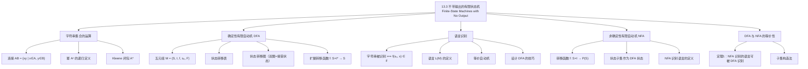

**相关笔记：** [[13.2 带输出的有限状态机]] | [[13.4 语言识别]]

> [!abstract] 概览
> 本节介绍了不带输出的有限状态机，即==有限状态自动机（finite-state automaton）==。与第 13.2 节的带输出有限状态机不同，自动机没有输出，而是通过一组==接受状态（accepting states）==来判定输入字符串是否属于某个语言。本节首先引入字符串集合上的==连接运算==与==Kleene 闭包==，然后给出==确定性有限自动机（DFA）==的严格五元组定义，讨论其状态转移表、状态转移图以及扩展转移函数。接着介绍了==非确定性有限自动机（NFA）==的概念，并证明了 NFA 与 DFA 的识别能力等价（定理 1）。
>
> - ==字符串集合的连接==：$AB = \{xy \mid x \in A, y \in B\}$
> - ==Kleene 闭包==：$A^* = \bigcup_{k=0}^{\infty} A^k$，其中 $A^0 = \{\lambda\}$
> - ==有限状态自动机==：五元组 $M = (S, I, f, s_0, F)$
> - ==状态转移函数==：$f: S \times I \to S$（确定性）或 $f: S \times I \to \mathcal{P}(S)$（非确定性）
> - ==接受状态/最终状态==：$F \subseteq S$，字符串将起始状态带到接受状态则被识别
> - ==语言 $L(M)$==：自动机 $M$ 识别的所有字符串的集合
> - ==等价自动机==：识别相同语言的两个自动机
> - ==NFA 与 DFA 等价==：每个 NFA 识别的语言都可以被某个 DFA 识别

---

## 一、知识结构总览

---

## 二、核心思想

> [!tip] 核心思想
> 本节的核心思想是==用"接受状态"替代"输出"来实现语言识别==。在带输出的有限状态机中，我们通过输出 $1$ 或 $0$ 来判断字符串是否属于目标语言；而在自动机中，我们只需检查处理完整个字符串后，机器是否停在接受状态。这种模型更简洁，且与形式语言理论中的核心概念（正则语言、正则表达式）直接对应。另一个重要思想是==非确定性并不增加计算能力==：NFA 允许在每个步骤有多个可能的转移，但通过"子集构造法"可以将任意 NFA 转化为等价的 DFA。

### 1. 字符串集合的运算

> [!def] 字符串集合的连接（Concatenation）
> 设 $A$ 和 $B$ 是 $V^*$ 的子集（$V$ 为字母表），则 $A$ 和 $B$ 的==连接==定义为：
> $$AB = \{xy \mid x \in A, y \in B\}$$
>
> 注意：一般情况下 $AB \neq BA$。

> [!example] 连接运算
> 设 $A = \{0, 11\}$，$B = \{1, 10, 110\}$，则：
> - $AB = \{01, 010, 0110, 111, 1110, 11110\}$
> - $BA = \{10, 111, 100, 1011, 1100, 11011\}$

> [!def] 字符串集合的幂与 Kleene 闭包
> 设 $A \subseteq V^*$，定义：
> - $A^0 = \{\lambda\}$（仅含空串的集合）
> - $A^{n+1} = A^n A$（递归定义，$n = 0, 1, 2, \ldots$）
>
> $A$ 的==Kleene 闭包==（Kleene closure）定义为：
> $$A^* = \bigcup_{k=0}^{\infty} A^k = \{\lambda\} \cup A \cup A^2 \cup A^3 \cup \cdots$$

> [!example] Kleene 闭包
> - $\{0\}^* = \{0^n \mid n = 0, 1, 2, \ldots\} = \{\lambda, 0, 00, 000, \ldots\}$
> - $\{0, 1\}^* = V^*$（所有由 $0$ 和 $1$ 组成的字符串）
> - $\{11\}^* = \{1^{2n} \mid n = 0, 1, 2, \ldots\}$（由偶数个 $1$ 组成的字符串）

### 2. 确定性有限自动机（DFA）

> [!def] 有限状态自动机（Finite-State Automaton）
> 一个==有限状态自动机== $M = (S, I, f, s_0, F)$ 由以下五部分组成：
> - $S$：==有限状态集==
> - $I$：==有限输入字母表==
> - $f: S \times I \to S$：==转移函数==，为每个（状态，输入）对指定唯一的下一状态
> - $s_0 \in S$：==起始状态==
> - $F \subseteq S$：==接受状态集==（也称最终状态集）
>
> 在状态转移图中，接受状态用==双圈==表示，起始状态用指向它的箭头标注 "Start" 表示。

> [!def] 扩展转移函数
> 转移函数 $f$ 可以扩展为 $\bar{f}: S \times I^* \to S$，递归定义为：
> - $(i)$ $\bar{f}(s, \lambda) = s$，对所有 $s \in S$
> - $(ii)$ $\bar{f}(s, xa) = f(\bar{f}(s, x), a)$，对所有 $s \in S$，$x \in I^*$，$a \in I$
>
> 直观含义：从状态 $s$ 开始，依次读取字符串 $x$ 的每个符号，逐步转移。

> [!def] 语言识别
> - 字符串 $x$ 被 $M$ ==识别==（或接受）：$\bar{f}(s_0, x) \in F$
> - $M$ ==识别的语言==：$L(M) = \{x \in I^* \mid \bar{f}(s_0, x) \in F\}$
> - 两个自动机==等价==：它们识别相同的语言

> [!example] 确定自动机识别的语言
> 考虑自动机 $M_1$：起始状态 $s_0$，接受状态 $\{s_0\}$，输入 $0$ 和 $1$ 都使 $s_0$ 转移到自身。
>
> 则 $L(M_1) = \{1^n \mid n = 0, 1, 2, \ldots\}$。
>
> 等等——这里需要检查转移表。如果 $0$ 和 $1$ 都使 $s_0$ 转移到 $s_0$，则 $L(M_1) = I^*$（所有字符串）。如果只有 $1$ 使 $s_0$ 转移到 $s_0$，则 $L(M_1) = \{1^n \mid n \geq 0\}$。

> [!example] 设计 DFA：识别以两个 0 开头的位串
> 构造 DFA 识别 $\{x \in \{0,1\}^* \mid x \text{ 以 } 00 \text{ 开头}\}$。
>
> **设计思路**：
> - $s_0$：起始状态（尚未读入任何字符）
> - $s_1$：已读入一个 $0$（非接受状态）
> - $s_2$：已读入两个 $0$（==接受状态==），此后无论读入什么都留在 $s_2$
> - $s_3$：第一个字符为 $1$（死状态），此后无论读入什么都留在 $s_3$
>
> 转移规则：$f(s_0, 0) = s_1$，$f(s_0, 1) = s_3$，$f(s_1, 0) = s_2$，$f(s_1, 1) = s_3$，$f(s_2, 0) = f(s_2, 1) = s_2$，$f(s_3, 0) = f(s_3, 1) = s_3$。

> [!example] 设计 DFA：识别含两个连续 0 的位串
> 构造 DFA 识别 $\{x \in \{0,1\}^* \mid x \text{ 含子串 } 00\}$。
>
> **设计思路**：
> - $s_0$：起始状态（尚未看到连续的 $0$）
> - $s_1$：最后一个字符是 $0$（但前面不是连续的 $0$）
> - $s_2$：已看到两个连续的 $0$（==接受状态==），此后留在 $s_2$
>
> 转移规则：$f(s_0, 0) = s_1$，$f(s_0, 1) = s_0$，$f(s_1, 0) = s_2$，$f(s_1, 1) = s_0$，$f(s_2, 0) = f(s_2, 1) = s_2$。

> [!example] 设计 DFA：识别以两个 0 结尾的位串
> 构造 DFA 识别 $\{x \in \{0,1\}^* \mid x \text{ 以 } 00 \text{ 结尾}\}$。
>
> **设计思路**：
> - $s_0$：起始状态（尚未看到末尾的 $0$）
> - $s_1$：最后一个字符是 $0$（非接受状态）
> - $s_2$：最后两个字符都是 $0$（==接受状态==）
>
> 转移规则：$f(s_0, 0) = s_1$，$f(s_0, 1) = s_0$，$f(s_1, 0) = s_2$，$f(s_1, 1) = s_0$，$f(s_2, 0) = s_2$，$f(s_2, 1) = s_0$。

> [!tip] DFA 设计方法论
> 设计 DFA 识别特定语言的一般步骤：
> 1. **分析目标语言的特征**：确定需要"记住"哪些信息（如已看到的字符数、奇偶性、末尾字符等）
> 2. **为每种需要记忆的状态分配一个状态**：DFA 的"记忆"完全由其当前状态体现
> 3. **确定接受状态**：哪些记忆状态对应"字符串属于目标语言"
> 4. **补全转移函数**：确保每个状态对每个输入符号都有转移
> 5. **验证**：用若干正例和反例测试自动机是否正确

### 3. 非确定性有限自动机（NFA）

> [!def] 非确定性有限自动机
> 一个==非确定性有限自动机== $M = (S, I, f, s_0, F)$ 的结构与 DFA 类似，但转移函数的值域不同：
> $$f: S \times I \to \mathcal{P}(S)$$
>
> 即对于每个（状态，输入）对，$f$ 返回一个==状态集合==（可能为空、单元素或多元素），而非唯一状态。
>
> 在状态转移图中，一个状态可以有多条标有相同输入的边指向不同状态。

> [!def] NFA 识别语言
> 字符串 $x = x_1 x_2 \ldots x_k$ 被 NFA $M$ 识别，当且仅当存在从 $s_0$ 出发、依次使用 $x_1, x_2, \ldots, x_k$ 作为输入的某条转移路径，最终到达 $F$ 中的某个状态。
>
> 直观理解：NFA 在每一步可以"猜测"正确的转移方向；只要存在至少一条猜测路径到达接受状态，字符串就被识别。

> [!thm] NFA 与 DFA 的等价性（定理 1）
> 若语言 $L$ 被某个 NFA $M_0$ 识别，则 $L$ 也被某个 DFA $M_1$ 识别。
>
> **证明思路（子集构造法）**：
> 1. DFA $M_1$ 的每个状态是 NFA $M_0$ 的状态集的一个==子集==
> 2. $M_1$ 的起始状态为 $\{s_0\}$（$M_0$ 的起始状态构成的单元素集）
> 3. 对于 $M_1$ 中的状态 $\{s_{i_1}, s_{i_2}, \ldots, s_{i_k}\}$ 和输入 $x$，$M_1$ 转移到 $\bigcup_{j=1}^{k} f(s_{i_j}, x)$
> 4. $M_1$ 的接受状态是所有包含 $M_0$ 接受状态的子集
> 5. 若 $M_0$ 识别 $x$，则存在一条路径使 $M_0$ 从 $s_0$ 到达接受状态，对应地 $M_1$ 从 $\{s_0\}$ 到达包含该接受状态的子集
>
> 注意：$M_1$ 最多有 $2^n$ 个状态（$n$ 为 $M_0$ 的状态数），但通常远少于此。
>
> $\blacksquare$

> [!example] NFA 转化为 DFA
> 给定 NFA：$S = \{s_0, s_1, s_2, s_3\}$，接受状态 $\{s_0, s_4\}$，转移为 $f(s_0, 0) = \{s_0, s_2\}$，$f(s_0, 1) = \{s_1\}$，$f(s_1, 0) = \{s_3\}$，$f(s_1, 1) = \{s_4\}$，$f(s_2, 1) = \{s_4\}$，$f(s_3, 0) = \{s_3\}$，$f(s_3, 1) = \{s_3\}$，$f(s_4, 0) = \{s_3\}$，$f(s_4, 1) = \{s_3\}$。
>
> 构造等价 DFA：起始状态 $\{s_0\}$，在输入 $0$ 下转移到 $\{s_0, s_2\}$，在输入 $1$ 下转移到 $\{s_1\}$。$\{s_0, s_2\}$ 在输入 $1$ 下转移到 $\{s_1, s_4\}$（因为 $s_0$ 经 $1$ 到 $s_1$，$s_2$ 经 $1$ 到 $s_4$）。接受状态包括 $\{s_0\}$、$\{s_0, s_2\}$、$\{s_1, s_4\}$ 等包含 $s_0$ 或 $s_4$ 的子集。

---

## 三、补充理解与易混淆点

### 补充理解

> [!info] 补充1：DFA 与 NFA 的等价性——子集构造法的实际意义
> DFA 与 NFA 的等价性是自动机理论中最基础的结果之一，由 Rabin 和 Scott 于 1959 年证明。这一结论的实际意义在于：在理论分析中，NFA 通常更简洁、更容易构造（因为不需要处理"记住所有可能性"的复杂性）；而在实际实现中（如正则表达式引擎），DFA 的确定性使其更适合硬件实现和高效的模式匹配。子集构造法是将理论上的简洁性转化为实际上的高效性的桥梁。然而，最坏情况下子集构造法会产生指数级的状态数，这也是正则表达式匹配可能出现"正则表达式拒绝服务攻击"（ReDoS）的理论根源之一。
>
> > 来源：Rabin, M. O. & Scott, D. (1959). "Finite Automata and Their Decision Problems." IBM Journal of Research and Development, 3(2), 114-125.

> [!info] 补充2：有限状态机的广泛应用
> 有限状态自动机不仅是理论计算机科学的基石，在实际工程中也有极为广泛的应用。在编译器设计中，词法分析器（lexer）本质上就是一个 DFA，用于从源代码中识别出标识符、关键字、数字常量等词法单元（token）。在网络协议中，TCP 协议的状态机就是一个有限状态自动机，用于管理连接的建立、数据传输和断开。在文本处理中，grep、sed 等工具的正则表达式匹配引擎底层也是基于有限状态自动机实现的。此外，在硬件设计中，有限状态机是数字电路控制逻辑的核心建模工具。
>
> > 来源：Hopcroft, J. E., Motwani, R. & Ullman, J. D. (2006). Introduction to Automata Theory, Languages, and Computation (3rd ed.). Pearson.

### 易混淆点

> [!warning] 误区1：NFA 比 DFA "更强大"
> - ❌ 认为 NFA 能识别更多语言
> - ✅ NFA 和 DFA 的识别能力完全等价（定理 1），NFA 只是描述更简洁
> - NFA 的"非确定性"是构造上的便利，不增加计算能力

> [!warning] 误区2：混淆接受状态与输出
> - ❌ 将自动机的接受状态与带输出有限状态机的输出混淆
> - ✅ 自动机没有输出；判断字符串是否被识别的唯一标准是最终状态是否属于 $F$
> - 带输出有限状态机（Mealy/Moore 机）和自动机是不同的计算模型

> [!warning] 误区3：忽略空串 $\lambda$ 的处理
> - ❌ 忘记考虑空串是否被自动机识别
> - ✅ 空串被识别当且仅当起始状态 $s_0$ 本身就是接受状态（$s_0 \in F$）
> - 在扩展转移函数中，$\bar{f}(s_0, \lambda) = s_0$，因此空串是否被识别完全取决于 $s_0$ 是否在 $F$ 中

---

## 四、习题精选

> [!todo] 习题概览
> | 题号范围 | 核心考点 | 难度 |
> |---------|---------|------|
> | 1-4 | 字符串集合的连接与 Kleene 闭包 | ⭐ |
> | 9-10 | 判断字符串是否属于给定集合 | ⭐⭐ |
> | 11-13 | 判断字符串是否被 DFA 识别 | ⭐⭐ |
> | 16-22 | 确定给定 DFA 识别的语言 | ⭐⭐ |
> | 23-37 | 设计 DFA 识别特定语言 | ⭐⭐⭐ |
> | 43-49 | 确定给定 NFA 识别的语言 | ⭐⭐ |
> | 50-54 | NFA 转化为 DFA | ⭐⭐⭐ |

### 题1：字符串集合的运算

> [!problem] 题目
> 设 $A = \{0, 11\}$，$B = \{00, 01\}$。求：(a) $AB$；(b) $BA$；(c) $A^2$；(d) $B^3$。

> [!faq]- 解答
> (a) $AB = \{0 \cdot 00, 0 \cdot 01, 11 \cdot 00, 11 \cdot 01\} = \{000, 001, 1100, 1101\}$
>
> (b) $BA = \{00 \cdot 0, 00 \cdot 11, 01 \cdot 0, 01 \cdot 11\} = \{000, 0011, 010, 0111\}$
>
> (c) $A^2 = AA = \{0 \cdot 0, 0 \cdot 11, 11 \cdot 0, 11 \cdot 11\} = \{00, 011, 110, 1111\}$
>
> (d) $B^3 = B^2 \cdot B$。先算 $B^2 = \{00 \cdot 00, 00 \cdot 01, 01 \cdot 00, 01 \cdot 01\} = \{0000, 0001, 0100, 0101\}$。再算 $B^3 = B^2 \cdot B$，共 $4 \times 2 = 8$ 个元素，每个长度为 $4 + 2 = 6$。

### 题2：设计 DFA 识别含子串 "01" 的位串

> [!problem] 题目
> 构造一个 DFA，识别所有含子串 $01$ 的位串。

> [!faq]- 解答
> **状态设计**：
> - $s_0$：起始状态，尚未看到可能形成 $01$ 的前缀
> - $s_1$：最后一个字符是 $0$（可能接下来出现 $1$ 形成 $01$）
> - $s_2$：已经看到子串 $01$（==接受状态==）
>
> **转移函数**：
>
> | | $0$ | $1$ |
> |:---:|:---:|:---:|
> | $\to s_0$ | $s_1$ | $s_0$ |
> | $s_1$ | $s_1$ | $s_2$ |
> | $*s_2$ | $s_2$ | $s_2$ |
>
> （$\to$ 表示起始状态，$*$ 表示接受状态）

### 题3：确定 DFA 识别的语言

> [!problem] 题目
> 给定 DFA：$S = \{s_0, s_1, s_2\}$，$I = \{0, 1\}$，$F = \{s_2\}$，转移为 $f(s_0, 0) = s_1$，$f(s_0, 1) = s_0$，$f(s_1, 0) = s_2$，$f(s_1, 1) = s_0$，$f(s_2, 0) = s_2$，$f(s_2, 1) = s_2$。求 $L(M)$。

> [!faq]- 解答
> 分析状态含义：
> - $s_0$：起始状态，尚未看到连续的 $0$
> - $s_1$：刚看到一个 $0$
> - $s_2$：已看到两个连续的 $0$（接受状态，此后留在 $s_2$）
>
> 因此 $L(M) = \{x \in \{0, 1\}^* \mid x \text{ 含有两个连续的 } 0\}$。

### 题4：NFA 转化为 DFA

> [!problem] 题目
> 给定 NFA：$S = \{s_0, s_1, s_2\}$，$I = \{0, 1\}$，$F = \{s_2\}$，转移为 $f(s_0, 0) = \{s_0, s_1\}$，$f(s_0, 1) = \{s_0\}$，$f(s_1, 0) = \emptyset$，$f(s_1, 1) = \{s_2\}$，$f(s_2, 0) = \emptyset$，$f(s_2, 1) = \emptyset$。构造等价的 DFA。

> [!faq]- 解答
> 使用子集构造法：
>
> - 起始状态：$\{s_0\}$
> - $\{s_0\} \xrightarrow{0} \{s_0, s_1\}$，$\{s_0\} \xrightarrow{1} \{s_0\}$
> - $\{s_0, s_1\} \xrightarrow{0} \{s_0, s_1\}$（$s_0 \to \{s_0,s_1\}$，$s_1 \to \emptyset$，取并集），$\{s_0, s_1\} \xrightarrow{1} \{s_0, s_2\}$（$s_0 \to \{s_0\}$，$s_1 \to \{s_2\}$）
> - $\{s_0, s_2\} \xrightarrow{0} \{s_0, s_1\}$，$\{s_0, s_2\} \xrightarrow{1} \{s_0\}$
>
> 接受状态：$\{s_0, s_2\}$（包含 $s_2$）。
>
> DFA 共有 3 个状态：$\{s_0\}$、$\{s_0, s_1\}$、$\{s_0, s_2\}$。

### 题5：证明等价自动机

> [!problem] 题目
> 证明以下两个 DFA 识别相同的语言：
> - $M_0$：$S = \{s_0, s_1, s_2, s_3, s_4\}$，$F = \{s_1, s_4\}$，其中 $s_0 \xrightarrow{1} s_1$，$s_0 \xrightarrow{0} s_2$，$s_2 \xrightarrow{0} s_2$，$s_2 \xrightarrow{1} s_4$，$s_1$ 和 $s_4$ 在任何输入下转移到自身
> - $M_1$：$S = \{s_0, s_1, s_2\}$，$F = \{s_1\}$，其中 $s_0 \xrightarrow{0} s_0$，$s_0 \xrightarrow{1} s_1$，$s_1$ 在任何输入下转移到 $s_2$，$s_2$ 在任何输入下转移到 $s_2$

> [!faq]- 解答
> **分析 $L(M_0)$**：
> - 从 $s_0$ 经 $1$ 到达 $s_1$（接受状态）：识别字符串 $1$
> - 从 $s_0$ 经 $0$ 到 $s_2$，然后经若干 $0$ 留在 $s_2$，再经 $1$ 到达 $s_4$（接受状态）：识别 $0^n 1$（$n \geq 1$）
> - 因此 $L(M_0) = \{1\} \cup \{0^n 1 \mid n \geq 1\} = \{0^n 1 \mid n \geq 0\}$
>
> **分析 $L(M_1)$**：
> - 从 $s_0$ 经若干 $0$ 留在 $s_0$，然后经 $1$ 到达 $s_1$（接受状态）：识别 $0^n 1$（$n \geq 0$）
> - 一旦到达 $s_1$，后续输入转移到 $s_2$（非接受状态），所以只有恰好一个 $1$ 在末尾的字符串被识别
> - 因此 $L(M_1) = \{0^n 1 \mid n \geq 0\}$
>
> $L(M_0) = L(M_1)$，两者等价。$\blacksquare$

> [!tip] 解题思路提示
> 有限状态自动机问题的解题方法论：
> 1. **确定识别的语言**：从起始状态出发，追踪各种可能的输入路径，归纳哪些字符串到达接受状态
> 2. **设计 DFA**：先确定需要"记住"的信息，为每种信息分配状态，再补全转移函数
> 3. **NFA 转 DFA**：使用子集构造法，将 NFA 状态的子集作为 DFA 的状态
> 4. **证明等价**：分别分析两个自动机识别的语言，证明它们是同一集合

---

## 五、视频学习指南

> [!info] 视频资源
> | 资源 | 链接 | 对应内容 | 备注 |
> |:-----|:-----|:---------|:-----|
> | Rosen 8e Section 13.3 | [教材原文](https://www.mheducation.com/highered/product/discrete-mathematics-applications-rosen/M9781259676512.html) | 完整定义、定理与例题 | 英文教材 |
> | Neso Academy - DFA | [链接](https://www.youtube.com/watch?v=7lG1PpcYBfQ) | DFA 的定义与例题 | 英文，适合入门 |
> | Neso Academy - NFA | [链接](https://www.youtube.com/watch?v=3Nv0N8GVUwc) | NFA 与子集构造法 | 英文 |

---

## 六、教材原文

> [!quote] 教材原文
> "A finite-state automaton $M = (S, I, f, s_0, F)$ consists of a finite set $S$ of states, a finite input alphabet $I$, a transition function $f$ that assigns a next state to every pair of state and input (so that $f: S \times I \to S$), an initial or start state $s_0$, and a subset $F$ of $S$ consisting of final (or accepting) states."
>
> "A string $x$ is said to be recognized or accepted by the machine $M = (S, I, f, s_0, F)$ if it takes the initial state $s_0$ to a final state, that is, $\bar{f}(s_0, x)$ is a state in $F$."
>
> "A nondeterministic finite-state automaton $M = (S, I, f, s_0, F)$ consists of a set $S$ of states, an input alphabet $I$, a transition function $f$ that assigns a set of states to each pair of state and input (so that $f: S \times I \to \mathcal{P}(S)$), a starting state $s_0$, and a subset $F$ of $S$ consisting of the final states."
>
> "If the language $L$ is recognized by a nondeterministic finite-state automaton $M_0$, then $L$ is also recognized by a deterministic finite-state automaton $M_1$."
>
> —— Rosen, Section 13.3, pp. 904-914

---

## 参见 Wiki

- [[离散数学/concepts/二元关系|关系]] -- 等价关系在自动机最小化中的应用（第9章）
- [[离散数学/concepts/命题逻辑]] -- 自动机与逻辑系统的对应关系（第1章）

#学习/离散数学/计算建模
