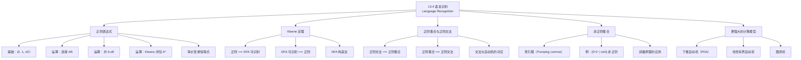

**相关笔记：** [[13.3 不带输出的有限状态机]] | [[13.5 图灵机]]

> [!abstract] 概览
> 本节回答了一个核心问题：有限状态自动机能识别哪些集合？答案是==正则集合（regular set）==。本节首先给出==正则表达式（regular expression）==的递归定义，包括基础元素（$\emptyset$、$\lambda$、单符号）和三种运算（连接、并、Kleene 闭包），然后给出正则表达式的等价变换恒等式。核心结果是==Kleene 定理==：一个集合是正则的当且仅当它可以被有限状态自动机识别。此外，本节证明了正则集合与==正则文法（3 型文法）==的等价性，并利用==泵引理==（pumping lemma）的思路展示了非正则集合的例子（如 $\{0^n 1^n \mid n \geq 0\}$）。最后简要介绍了下推自动机和图灵机等更强大的计算模型。
>
> - ==正则表达式==：在字母表 $I$ 上递归定义的表达式，基础为 $\emptyset$、$\lambda$、$x \in I$，运算为连接 $AB$、并 $A \cup B$、Kleene 闭包 $A^*$
> - ==正则集合==：由正则表达式表示的集合
> - ==Kleene 定理==：集合是正则的 $\Leftrightarrow$ 它可以被有限状态自动机识别
> - ==正则文法（3 型文法）==：产生式形如 $S \to \lambda$、$A \to a$、$A \to aB$ 的文法
> - ==泵引理==：判断集合非正则的重要工具
> - ==下推自动机==：带栈的有限状态机，识别上下文无关语言

---

## 一、知识结构总览

---

## 二、核心思想

> [!tip] 核心思想
> 本节的核心思想是==正则表达式、有限状态自动机和正则文法三者描述的是完全相同的语言类——正则语言==。Kleene 定理建立了正则表达式与有限状态自动机之间的桥梁，而正则文法则从文法（生成式）的角度刻画了同一类语言。这三种等价的描述方式各有优势：正则表达式简洁直观，适合声明式描述模式；有限状态自动机适合算法实现和高效匹配；正则文法则将语言识别与形式文法理论联系起来。此外，本节还展示了有限状态自动机的局限性——存在不能被任何有限状态自动机识别的集合（如 $\{0^n 1^n\}$），引出了更强大的计算模型。

### 1. 正则表达式的定义

> [!def] 正则表达式（Regular Expression）
> 字母表 $I$ 上的==正则表达式==递归定义如下：
>
> **基础**：
> - $\emptyset$ 是正则表达式（表示空集）
> - $\lambda$ 是正则表达式（表示集合 $\{\lambda\}$）
> - $x$ 是正则表达式，其中 $x \in I$（表示集合 $\{x\}$）
>
> **递归规则**：若 $A$ 和 $B$ 是正则表达式，则以下也是正则表达式：
> - $(AB)$：表示集合 $A$ 和 $B$ 的==连接==
> - $(A \cup B)$：表示集合 $A$ 和 $B$ 的==并==
> - $A^*$：表示集合 $A$ 的==Kleene 闭包==
>
> 由正则表达式表示的集合称为==正则集合==（regular set）。

> [!example] 正则表达式及其表示的集合
>
> | 正则表达式 | 表示的集合 |
> |:-----------|:-----------|
> | $10^*$ | $1$ 后跟任意多个 $0$（含零个），即 $\{1, 10, 100, 1000, \ldots\}$ |
> | $(10)^*$ | 任意多个 $10$ 的连接（含空串），即 $\{\lambda, 10, 1010, 101010, \ldots\}$ |
> | $0 \cup 01$ | 字符串 $0$ 或字符串 $01$ |
> | $0(0 \cup 1)^*$ | 以 $0$ 开头的所有位串 |
> | $(0^*1)^*$ | 不以 $0$ 结尾的所有位串 |

> [!example] 构造正则表达式
> (a) **偶数长度的位串**：每个长度为 $2$ 的块可以是 $00, 01, 10, 11$，因此正则表达式为 $(00 \cup 01 \cup 10 \cup 11)^*$。
>
> (b) **以 $0$ 结尾且不含 $11$ 的位串**：每个块要么是 $0$，要么是 $10$（因为不能出现 $11$，每个 $1$ 后面必须跟 $0$），因此正则表达式为 $(0 \cup 10)^*(0 \cup 10)$。
>
> (c) **含奇数个 $0$ 的位串**：这样的位串可以分解为若干块，每块形如 $1^j 0 1^k$（含一个 $0$），因此正则表达式为 $1^*01^*(01^*01^*)^*$。

### 2. 正则表达式的等价变换

> [!thm] 正则表达式的恒等式
> 以下恒等式对任意正则表达式 $A, B, C$ 成立：
>
> | 恒等式 | 说明 |
> |:-------|:-----|
> | $\emptyset \cup A = A$ | $\emptyset$ 是并的幺元 |
> | $\emptyset A = A\emptyset = \emptyset$ | $\emptyset$ 是连接的零元 |
> | $\{\lambda\} A = A\{\lambda\} = A$ | $\{\lambda\}$ 是连接的幺元 |
> | $(A^*)^* = A^*$ | 闭包的幂等性 |
> | $A \cup B = B \cup A$ | 并的交换律 |
> | $A(B \cup C) = AB \cup AC$ | 连接对并的分配律 |
> | $(A \cup B)C = AC \cup BC$ | 并对连接的分配律 |
> | $(AB)C = A(BC)$ | 连接的结合律 |
> | $A^* = \{\lambda\} \cup AA^*$ | 闭包的展开 |

> [!tip] 正则表达式化简技巧
> 化简正则表达式时常用以下策略：
> 1. 利用 $\emptyset A = \emptyset$ 消除含 $\emptyset$ 的连接
> 2. 利用 $\{\lambda\} A = A$ 消除冗余的 $\lambda$
> 3. 利用 $(A^*)^* = A^*$ 简化嵌套闭包
> 4. 利用分配律展开或合并表达式

### 3. Kleene 定理

> [!thm] Kleene 定理（Kleene's Theorem）
> 一个集合是正则的当且仅当它可以被有限状态自动机识别。
>
> 即：正则集合 $\Leftrightarrow$ 有限状态自动机识别的语言。
>
> **证明思路（正则 $\Rightarrow$ DFA 可识别）**：
> 由于正则表达式是递归定义的，只需证明以下六点：
> 1. $\emptyset$ 可被 NFA 识别（无接受状态的自动机）
> 2. $\{\lambda\}$ 可被 NFA 识别（起始状态即为接受状态，无转移）
> 3. $\{a\}$ 可被 NFA 识别（起始状态经 $a$ 到接受状态）
> 4. 若 $A$ 和 $B$ 可被识别，则 $AB$ 可被识别（串联两个自动机）
> 5. 若 $A$ 和 $B$ 可被识别，则 $A \cup B$ 可被识别（并联两个自动机，加新起始状态）
> 6. 若 $A$ 可被识别，则 $A^*$ 可被识别（加新起始状态，从接受状态回到起始状态）
>
> 由于 NFA 与 DFA 等价（13.3 节定理 1），以上均可转化为 DFA。
>
> $\blacksquare$

> [!example] 用 Kleene 定理构造自动机
> 构造识别正则集合 $1^* \cup 01$ 的 NFA。
>
> **步骤**：
> 1. 先构造识别 $1^*$ 的 NFA（识别 $1$ 的自动机加 Kleene 闭包构造）
> 2. 再构造识别 $01$ 的 NFA（识别 $0$ 和识别 $1$ 的自动机串联）
> 3. 最后用并集构造将两者合并（加新起始状态，$\epsilon$-转移分别指向两者）
>
> 注意：这种构造方法不产生最简自动机。$1^* \cup 01$ 可以用一个更简单的 3 状态自动机识别。

### 4. 正则集合与正则文法

> [!thm] 正则集合与正则文法的等价性（定理 2）
> 一个集合由正则文法生成当且仅当它是正则集合。
>
> **证明思路（正则文法 $\Rightarrow$ 正则集合）**：
> 设 $G = (V, T, S, P)$ 是正则文法。构造 NFA $M$：
> - 每个非终结符对应一个状态，另加一个接受状态 $s_F$
> - 起始状态 $s_0$ 对应起始符号 $S$
> - 产生式 $A \to a$ 对应转移 $s_A \xrightarrow{a} s_F$
> - 产生式 $A \to aB$ 对应转移 $s_A \xrightarrow{a} s_B$
> - 若 $S \to \lambda$ 在 $P$ 中，则 $s_0$ 也是接受状态
>
> **证明思路（正则集合 $\Rightarrow$ 正则文法）**：
> 设 $M$ 是识别正则集合的 DFA。构造正则文法 $G$：
> - 每个状态对应一个非终结符
> - 终结符集 = 输入字母表
> - 若 $f(s, a) = t$（$t$ 非接受状态），则 $A_s \to aA_t$
> - 若 $f(s, a) = t$（$t$ 是接受状态），则 $A_s \to a$
> - 若 $\lambda \in L(M)$，则 $S \to \lambda$
>
> $\blacksquare$

> [!example] 从正则文法构造 NFA
> 正则文法 $G$：$V = \{0, 1, A, S\}$，$T = \{0, 1\}$，产生式为 $S \to 1A$，$S \to 0$，$S \to \lambda$，$A \to 0A$，$A \to 1A$，$A \to 1$。
>
> 构造 NFA：
> - $s_0$（对应 $S$），$s_1$（对应 $A$），$s_2$（接受状态）
> - $s_0 \xrightarrow{1} s_1$，$s_0 \xrightarrow{0} s_2$，$s_1 \xrightarrow{0} s_1$，$s_1 \xrightarrow{1} s_1$，$s_1 \xrightarrow{1} s_2$
> - $s_0$ 也是接受状态（因为 $S \to \lambda$）

> [!example] 从 DFA 构造正则文法
> DFA：$S = \{s_0, s_1, s_2\}$，$F = \{s_2\}$，$f(s_0, 0) = s_1$，$f(s_0, 1) = s_2$，$f(s_1, 0) = s_1$，$f(s_1, 1) = s_2$，$f(s_2, 0) = s_1$，$f(s_2, 1) = s_2$。
>
> 正则文法 $G$：$V = \{S, A, B, 0, 1\}$，$T = \{0, 1\}$，产生式为 $S \to 0A$，$S \to 1B$，$S \to 1$，$S \to \lambda$，$A \to 0A$，$A \to 1B$，$A \to 1$，$B \to 0A$，$B \to 1B$，$B \to 1$。

### 5. 非正则集合

> [!thm] 泵引理（Pumping Lemma）
> 设 $M = (S, I, f, s_0, F)$ 是 DFA，$x \in L(M)$ 且 $l(x) \geq |S|$，则存在 $u, v, w \in I^*$ 使得：
> - $x = uvw$
> - $l(uv) \leq |S|$
> - $l(v) \geq 1$
> - 对所有 $i = 0, 1, 2, \ldots$，$uv^iw \in L(M)$
>
> **直观理解**：如果字符串足够长（至少等于状态数），则在处理前 $|S|+1$ 个符号时，由鸽巢原理必然有某个状态被重复访问。因此存在一个"循环"（对应 $v$），可以重复任意多次而不影响最终是否到达接受状态。

> [!example] 证明 $\{0^n 1^n \mid n \geq 0\}$ 不是正则集合
> **反证法**：假设该集合是正则的，则存在 DFA $M$ 识别它。设 $M$ 有 $N$ 个状态。
>
> 考虑字符串 $0^N 1^N \in L(M)$。处理前 $N+1$ 个符号（即 $0^N$）时，由鸽巢原理，$N+1$ 个状态中必有重复。设第 $i$ 个和第 $j$ 个状态相同（$0 \leq i < j \leq N$），令 $t = j - i$。
>
> 这意味着从状态 $s_i$ 出发，读入 $t$ 个 $0$ 后回到 $s_i$（存在循环）。
>
> 现在考虑字符串 $0^{N+t} 1^N$。额外的 $t$ 个 $0$ 使我们多绕循环一次，最终仍到达与处理 $0^N 1^N$ 时相同的状态（接受状态）。但 $0^{N+t} 1^N$ 中 $0$ 的个数多于 $1$ 的个数，不属于 $\{0^n 1^n\}$，矛盾！
>
> 因此 $\{0^n 1^n \mid n \geq 0\}$ 不是正则集合。$\blacksquare$

> [!info] 更多非正则集合的例子
> 以下集合都不是正则的（可用泵引理证明）：
> - $\{0^{2^n} \mid n \geq 0\}$（$0$ 的个数为 $2$ 的幂）
> - $\{1^p \mid p \text{ 是素数}\}$
> - $\{0^n 1^n 2^n \mid n \geq 0\}$
> - $\{0, 1\}^*$ 上所有回文串的集合

### 6. 更强大的计算模型

> [!def] 下推自动机（Pushdown Automaton）
> ==下推自动机==是在有限状态自动机的基础上增加了一个==栈==（stack）的计算模型。
>
> - 栈提供无限记忆，但只能按后进先出（LIFO）方式访问
> - 下推自动机识别的语言类恰好是==上下文无关语言==（由 2 型文法生成的语言）
> - 例如，$\{0^n 1^n \mid n \geq 0\}$ 可以被下推自动机识别（用栈记录 $0$ 的个数），但不能被有限状态自动机识别

> [!def] 线性有界自动机与图灵机
> - ==线性有界自动机==：比下推自动机更强大，可以识别上下文有关语言（1 型文法）
> - ==图灵机==：最通用的计算模型，可以识别所有由短语结构文法（0 型文法）生成的语言
> - 图灵机具有双向无限带，读写头可以左右移动并改写带上的符号

---

## 三、补充理解与易混淆点

### 补充理解

> [!info] 补充1：Kleene 定理的历史意义
> Kleene 定理由美国数学家 Stephen Kleene 于 1956 年证明，是自动机理论中最重要的基础定理之一。这一定理建立了正则表达式（一种代数/描述性工具）与有限状态自动机（一种机器模型）之间的精确对应关系。在实际应用中，这一对应关系使得我们可以用简洁的正则表达式声明式地描述模式，然后通过算法自动将其编译为高效的有限状态自动机来执行匹配。现代编程语言中的正则表达式引擎（如 PCRE、Java 的 java.util.regex）正是基于这一理论基础。
>
> > 来源：Kleene, S. C. (1956). "Representation of Events in Nerve Nets and Finite Automata." Automata Studies, 34, 3-41.

> [!info] 补充2：正则表达式的实际应用与局限性
> 正则表达式是计算机科学中最广泛使用的模式匹配工具之一。在文本编辑器（如 vim、emacs）中用于搜索替换，在编程语言中用于输入验证（如邮箱格式、电话号码格式），在编译器中用于词法分析，在网络安全中用于入侵检测系统的规则匹配。Friedl 的《Mastering Regular Expressions》是这一领域的经典参考书。然而，正则表达式只能描述正则语言，无法处理需要"计数"的模式（如匹配成对的括号、检查 HTML 标签是否正确嵌套等）。这些任务需要上下文无关文法或更强大的工具来处理。
>
> > 来源：Friedl, J. E. F. (2006). Mastering Regular Expressions (3rd ed.). O'Reilly Media.

### 易混淆点

> [!warning] 误区1：正则表达式的连接 vs 字符串的连接
> - ❌ 混淆正则表达式层面的连接与字符串层面的连接
> - ✅ 正则表达式 $AB$ 表示集合 $A$ 中每个字符串与集合 $B$ 中每个字符串的连接，结果是集合的连接
> - 例如，$\{0, 1\}\{0, 1\} = \{00, 01, 10, 11\}$（所有长度为 2 的位串）

> [!warning] 误区2：$A^*$ 包含空串
> - ❌ 认为 $A^*$ 不包含空串
> - ✅ $A^* = \bigcup_{k=0}^{\infty} A^k$，而 $A^0 = \{\lambda\}$，因此 $A^*$ 始终包含空串
> - 例如，$(01)^* = \{\lambda, 01, 0101, 010101, \ldots\}$

> [!warning] 误区3：正则表达式 $\neq$ 编程语言中的正则表达式
> - ❌ 将理论上的正则表达式与现代编程语言中的"正则表达式"（如 PCRE）等同
> - ✅ 理论上的正则表达式只能描述正则语言；现代正则表达式引擎通常支持回溯引用（backreference）等扩展特性，可以描述非正则语言
> - 例如，`(a|b)\1` 可以匹配 $aa$ 和 $bb$ 但不匹配 $ab$ 和 $ba$，这种"回溯引用"能力超出了正则表达式的理论范畴

---

## 四、习题精选

> [!todo] 习题概览
> | 题号范围 | 核心考点 | 难度 |
> |---------|---------|------|
> | 1-2 | 描述正则表达式表示的集合 | ⭐ |
> | 3-4 | 判断字符串是否属于正则集合 | ⭐⭐ |
> | 5-7 | 用正则表达式描述给定集合 | ⭐⭐ |
> | 8-10 | 构造 DFA/NFA 识别正则集合 | ⭐⭐ |
> | 11 | 正则集合的逆也是正则的 | ⭐⭐⭐ |
> | 12-13 | 用 Kleene 定理构造 NFA | ⭐⭐⭐ |
> | 15-17 | 构造正则文法 | ⭐⭐ |
> | 23-25 | 用泵引理证明非正则 | ⭐⭐⭐ |

### 题1：描述正则表达式表示的集合

> [!problem] 题目
> 用文字描述以下正则表达式表示的集合：(a) $1^*0$；(b) $1^*00^*$；(c) $111 \cup 001$；(d) $(1 \cup 00)^*$。

> [!faq]- 解答
> (a) $1^*0$：任意多个 $1$（含零个）后跟一个 $0$。即所有以 $0$ 结尾的位串。
>
> (b) $1^*00^*$：任意多个 $1$ 后跟至少一个 $0$，再跟任意多个 $0$。即所有至少含一个 $0$ 的位串。
>
> (c) $111 \cup 001$：字符串 $111$ 或字符串 $001$。
>
> (d) $(1 \cup 00)^*$：由任意多个块组成，每个块要么是 $1$，要么是 $00$。即所有不含连续奇数个 $0$ 的位串（或者说，每个 $0$ 都必须成对出现，除非 $0$ 出现在末尾且前面有奇数个 $0$...实际上更精确地说，是所有由 $1$ 和 $00$ 组成的位串）。

### 题2：构造正则表达式

> [!problem] 题目
> 用正则表达式描述以下集合：(a) 恰好含一个 $1$ 的位串；(b) 以 $1$ 结尾且不含 $000$ 的位串。

> [!faq]- 解答
> (a) 恰好含一个 $1$：这个 $1$ 可以出现在任意位置，其余全是 $0$。
> $$0^*10^*$$
>
> (b) 以 $1$ 结尾且不含 $000$：每个 $0$ 块的长度不超过 $2$。
> $$((0 \cup 00)1)^*(0 \cup 00 \cup \lambda)1$$
> 简化思路：不含 $000$ 意味着连续的 $0$ 最多两个，所以每个 $0$-块是 $0$ 或 $00$，后面必须跟 $1$（除了末尾）。因此：
> $$((0 \cup 00)^*1)^*(0 \cup 00)^*1$$

### 题3：用泵引理证明非正则

> [!problem] 题目
> 证明集合 $\{0^{2^n} \mid n = 0, 1, 2, \ldots\}$ 不是正则的。

> [!faq]- 解答
> **反证法**：假设该集合是正则的，则存在 DFA $M$ 识别它，设 $M$ 有 $N$ 个状态。
>
> 取 $x = 0^{2^N} \in L(M)$（因为 $2^N \geq N$）。由泵引理，$x = uvw$，其中 $l(v) \geq 1$，且对所有 $i \geq 0$，$uv^iw \in L(M)$。
>
> 取 $i = 2$，则 $uv^2w = 0^{2^N + l(v)}$。要使 $0^{2^N + l(v)} \in L(M)$，需要 $2^N + l(v) = 2^m$（某个 $m$）。
>
> 但 $2^N < 2^N + l(v) \leq 2^N + N < 2^N + 2^N = 2^{N+1}$（因为 $l(v) \leq N$），而 $2^N$ 和 $2^{N+1}$ 之间没有 $2$ 的幂，矛盾！
>
> 因此该集合不是正则的。$\blacksquare$

### 题4：从 DFA 构造正则文法

> [!problem] 题目
> 给定 DFA：$S = \{s_0, s_1, s_2\}$，$I = \{0, 1\}$，$F = \{s_2\}$，$f(s_0, 0) = s_1$，$f(s_0, 1) = s_0$，$f(s_1, 0) = s_2$，$f(s_1, 1) = s_0$，$f(s_2, 0) = s_2$，$f(s_2, 1) = s_2$。构造等价的正则文法。

> [!faq]- 解答
> 设 $S$（起始符号）对应 $s_0$，$A$ 对应 $s_1$，$B$ 对应 $s_2$。
>
> 转移对应产生式：
> - $f(s_0, 0) = s_1$（$s_1$ 非接受）：$S \to 0A$
> - $f(s_0, 1) = s_0$（$s_0$ 非接受）：$S \to 1S$
> - $f(s_1, 0) = s_2$（$s_2$ 是接受）：$A \to 0$
> - $f(s_1, 1) = s_0$（$s_0$ 非接受）：$A \to 1S$
> - $f(s_2, 0) = s_2$（$s_2$ 是接受）：$B \to 0$
> - $f(s_2, 1) = s_2$（$s_2$ 是接受）：$B \to 1$
>
> 正则文法 $G = (V, T, S, P)$，其中 $V = \{S, A, B, 0, 1\}$，$T = \{0, 1\}$，产生式为 $S \to 0A \mid 1S$，$A \to 0 \mid 1S$，$B \to 0 \mid 1$。

### 题5：判断字符串是否属于正则集合

> [!problem] 题目
> 判断字符串 $1011$ 是否属于以下正则集合：(a) $10^*1^*$；(b) $0^*(10 \cup 11)^*$；(c) $1(01)^*1^*$。

> [!faq]- 解答
> (a) $10^*1^*$：以 $1$ 开头，后跟任意多个 $0$，再跟任意多个 $1$。$1011$ 以 $1$ 开头，$0$ 部分为 "$0$"（一个 $0$），$1$ 部分为 "$11$"（两个 $1$）。**属于**。
>
> (b) $0^*(10 \cup 11)^*$：以任意多个 $0$ 开头，后跟若干块（每块为 $10$ 或 $11$）。$1011$ 不以 $0$ 开头，$0^*$ 部分为空串。剩余 "$1011$" 需要分解为 $10$ 和 $11$ 的连接：$10 \cdot 11$。**属于**。
>
> (c) $1(01)^*1^*$：以 $1$ 开头，后跟若干 $01$ 块，再跟任意多个 $1$。$1011 = 1 \cdot 01 \cdot 1$，其中 $(01)^*$ 部分为 "$01$"，$1^*$ 部分为 "$1$"。**属于**。

> [!tip] 解题思路提示
> 语言识别问题的解题方法论：
> 1. **描述正则集合**：从内到外分析正则表达式的结构，先理解基础部分，再理解运算效果
> 2. **构造正则表达式**：分析目标语言的结构特征，选择合适的基础块和运算组合
> 3. **用泵引理证非正则**：选择足够长的字符串，利用鸽巢原理找到可"泵"的循环，导出矛盾
> 4. **文法与自动机的互转**：状态对应非终结符，转移对应产生式，接受状态对应终结产生式

---

## 五、视频学习指南

> [!info] 视频资源
> | 资源 | 链接 | 对应内容 | 备注 |
> |:-----|:-----|:---------|:-----|
> | Rosen 8e Section 13.4 | [教材原文](https://www.mheducation.com/highered/product/discrete-mathematics-applications-rosen/M9781259676512.html) | 完整定义、定理与例题 | 英文教材 |
> | Neso Academy - Regular Expressions | [链接](https://www.youtube.com/watch?v=2Kl5u5KKA58) | 正则表达式基础 | 英文，适合入门 |
> | Neso Academy - Kleene's Theorem | [链接](https://www.youtube.com/watch?v=7lG1PpcYBfQ) | Kleene 定理与证明 | 英文 |
> | Neso Academy - Pumping Lemma | [链接](https://www.youtube.com/watch?v=i2c5s0MqC8Y) | 泵引理及其应用 | 英文 |

---

## 六、教材原文

> [!quote] 教材原文
> "The regular expressions over a set $I$ are defined recursively by: the symbol $\emptyset$ is a regular expression; the symbol $\lambda$ is a regular expression; the symbol $x$ is a regular expression whenever $x \in I$; the symbols $(AB)$, $(A \cup B)$, and $A^*$ are regular expressions whenever $A$ and $B$ are regular expressions."
>
> "A set is regular if and only if it is recognized by a finite-state automaton."
>
> "A set is generated by a regular grammar if and only if it is a regular set."
>
> "Suppose that this set $\{0^n 1^n \mid n = 0, 1, 2, \ldots\}$ were regular. Then there would be a nondeterministic finite-state automaton $M = (S, I, f, s_0, F)$ recognizing it... This contradiction shows that $\{0^n 1^n \mid n = 0, 1, 2, \ldots\}$ is not regular."
>
> —— Rosen, Section 13.4, pp. 917-925

---

## 参见 Wiki

- [[离散数学/concepts/递归定义]] -- 正则表达式的递归定义（第5章）

#学习/离散数学/计算建模
