**相关笔记：** [[13.4 语言识别]] | 📚 全书完结

> [!abstract] 概览
> 本节介绍了计算理论中最核心的概念——==图灵机（Turing machine）==，由英国数学家 Alan Turing 于 1936 年发明。图灵机由一个有限状态控制器和一条双向无限带组成，读写头可以左右移动并改写带上的符号，这使其拥有远超有限状态自动机的计算能力。本节首先给出图灵机的严格定义（四元组/五元组表示），展示如何用图灵机识别集合和计算函数。然后介绍==Church-Turing 论题==：任何"能有效计算的"函数都可以被图灵机计算。接着讨论了==可判定性==与==不可判定性==，重点证明了==停机问题==的不可解性。最后介绍了图灵机的变体（多带图灵机、非确定性图灵机等），并利用图灵机精确化了==P 与 NP== 的定义。
>
> - ==图灵机==：$T = (S, I, f, s_0)$，含有限状态集、带字母表、偏转移函数和起始状态
> - ==五元组表示==：$(s, x, s', x', d)$ 表示在状态 $s$ 读到 $x$ 时写入 $x'$、移至状态 $s'$、方向 $d \in \{R, L\}$
> - ==最终状态==：不出现在任何五元组第一个位置的状态
> - ==Church-Turing 论题==：能有效计算的函数 $\Leftrightarrow$ 图灵可计算函数
> - ==停机问题==：不存在图灵机能判定任意图灵机在给定输入上是否停机
> - ==可计算函数 vs 不可计算函数==
> - ==P 类==：确定性图灵机在多项式时间内可解的决策问题
> - ==NP 类==：非确定性图灵机在多项式时间内可解的决策问题

---

## 一、知识结构总览

```mermaid
graph TB
    A["13.5 图灵机<br>Turing Machines"] --> B["图灵机的定义"]
    A --> C["用图灵机识别集合"]
    A --> D["用图灵机计算函数"]
    A --> E["图灵机的变体"]
    A --> F["Church-Turing 论题"]
    A --> G["可判定性与停机问题"]
    A --> H["计算复杂度：P 与 NP"]

    B --> B1["四元组 T = (S, I, f, s₀)"]
    B --> B2["五元组 (s, x, s', x', d)"]
    B --> B3["双向无限带"]
    B --> B4["偏转移函数"]

    C --> C1["最终状态与识别定义"]
    C --> C2["识别正则集合"]
    C --> C3["识别非正则集合 {0ⁿ1ⁿ}"]

    D --> D1["一元表示法"]
    D --> D2["加法、乘法等算术运算"]
    D --> D3["函数复合"]

    E --> E1["多带图灵机"]
    E --> E2["非确定性图灵机"]
    E --> E3["二维带图灵机"]
    E --> E4["等价性：变体不改变计算能力"]

    F --> F1["论题内容（非定理）"]
    F --> F2["多种等价的形式化理论"]
    F --> F3["lambda-演算、递归函数等"]

    G --> G1["决策问题"]
    G --> G2["可判定 vs 不可判定"]
    G --> G3["停机问题（定理1）"]
    G --> G4["其他不可判定问题"]

    H --> H1["P 类的定义"]
    H --> H2["NP 类的定义"]
    H --> H3["P ⊆ NP"]
    H --> H4["P = NP?（开放问题）"]
    H --> H5["NP 完全性"]
```

---

## 二、核心思想

> [!tip] 核心思想
> 本节的核心思想是==图灵机是最通用的计算模型==。有限状态自动机受限于有限记忆，无法识别 $\{0^n 1^n\}$ 等简单语言；图灵机通过双向无限带获得了无限记忆，可以执行任意算法。Church-Turing 论题断言，图灵机能计算的恰好是"人能有效计算的"——这一论题虽然无法证明（因为"有效计算"是直觉概念），但得到了压倒性的证据支持。图灵机还揭示了计算的固有极限：停机问题的不可解性表明，存在一些问题是计算机在原则上无法解决的。最后，图灵机为计算复杂度的精确研究提供了基础框架，使我们能够严格定义 P 类和 NP 类。

### 1. 图灵机的定义

> [!def] 图灵机（Turing Machine）
> 一个==图灵机== $T = (S, I, f, s_0)$ 由以下四部分组成：
> - $S$：==有限状态集==
> - $I$：==带字母表==（tape alphabet），包含==空白符号== $B$
> - $f: S \times I \to S \times I \times \{R, L\}$：==偏转移函数==（partial function）
> - $s_0 \in S$：==起始状态==
>
> 其中 $f$ 是==偏函数==，即对于某些（状态，符号）对，$f$ 可能无定义。当 $f$ 无定义时，图灵机==停机==（halt）。
>
> 图灵机的操作可以用==五元组==（five-tuples）表示：
> $$(s, x, s', x', d)$$
> 含义：当前状态为 $s$、读写头读到符号 $x$ 时，将 $x$ 改写为 $x'$，转移到状态 $s'$，读写头向 $d$ 方向移动一格（$R$ = 右，$L$ = 左）。

> [!def] 图灵机的物理直觉
> 想象一条无限长的纸带，被划分为一个个格子（单元），每个格子可以写一个符号。一个读写头位于某个格子上方，可以读取该格子的符号、改写该符号、然后向左或向右移动一格。一个有限状态控制器根据当前状态和读到的符号决定下一步操作。
>
> **初始位置**：图灵机从起始状态 $s_0$ 开始，读写头位于最左边的非空白符号上。如果带全为空白，读写头可以位于任意位置。
>
> **运行过程**：在每个步骤中，根据当前状态和当前读写头下的符号，查找匹配的五元组，执行写入、转移和移动操作。如果没有匹配的五元组，图灵机停机。

> [!def] 最终状态（Final State）
> 一个状态 $s$ 是==最终状态==（或停机状态），当且仅当 $s$ 不出现在任何五元组的第一个位置。即：没有任何转移规则以 $s$ 作为当前状态。
>
> 当图灵机进入最终状态时，它必然停机（因为没有下一步操作）。

> [!example] 图灵机的执行过程
> 图灵机 $T$ 由以下七个五元组定义：
> $(s_0, 0, s_0, 0, R)$，$(s_0, 1, s_1, 1, R)$，$(s_0, B, s_3, B, R)$，$(s_1, 0, s_0, 0, R)$，$(s_1, 1, s_2, 0, L)$，$(s_2, B, s_3, B, R)$，$(s_2, 1, s_3, 0, R)$
>
> 初始带：$\cdots BB\ 0\ 1\ 0\ 1\ 1\ 0\ BB \cdots$，读写头在最左边的 $0$ 上。
>
> **执行步骤**：
> 1. 状态 $s_0$，读到 $0$：写入 $0$，移至 $s_0$，右移 → $\cdots BB\ 0\ 1\ 0\ 1\ 1\ 0\ BB \cdots$
> 2. 状态 $s_0$，读到 $1$：写入 $1$，移至 $s_1$，右移 → $\cdots BB\ 0\ 1\ 0\ 1\ 1\ 0\ BB \cdots$
> 3. 状态 $s_1$，读到 $0$：写入 $0$，移至 $s_0$，右移 → $\cdots BB\ 0\ 1\ 0\ 1\ 1\ 0\ BB \cdots$
> 4. 状态 $s_0$，读到 $1$：写入 $1$，移至 $s_1$，右移 → $\cdots BB\ 0\ 1\ 0\ 1\ 1\ 0\ BB \cdots$
> 5. 状态 $s_1$，读到 $1$：写入 $0$，移至 $s_2$，左移 → $\cdots BB\ 0\ 1\ 0\ 1\ \mathbf{0}\ 0\ BB \cdots$
> 6. 状态 $s_2$，读到 $1$：写入 $0$，移至 $s_3$，右移 → $\cdots BB\ 0\ 1\ 0\ \mathbf{0}\ 0\ 0\ BB \cdots$
> 7. 状态 $s_3$，读到 $0$：无匹配五元组，**停机**。
>
> 最终带：$\cdots BB\ 0\ 1\ 0\ 0\ 0\ 0\ BB \cdots$
>
> 该图灵机将带上第一对连续的 $1$ 替换为 $0$，然后停机。

### 2. 用图灵机识别集合

> [!def] 图灵机识别集合
> 设 $V \subseteq I$，图灵机 $T = (S, I, f, s_0)$ ==识别==字符串 $x \in V^*$，当且仅当 $T$ 从初始位置开始（$x$ 写在带上），最终停在一个==最终状态==。
>
> $T$ ==识别==集合 $A \subseteq V^*$，当且仅当 $x$ 被 $T$ 识别 $\Leftrightarrow$ $x \in A$。
>
> 注意：$T$ 不识别 $x$ 有两种情况：(1) $T$ 不停机（无限循环）；(2) $T$ 停在非最终状态。

> [!example] 图灵机识别正则集合
> 构造图灵机识别第二位为 $1$ 的位串，即正则集合 $(0 \cup 1)1(0 \cup 1)^*$。
>
> 五元组：$(s_0, 0, s_1, 0, R)$，$(s_0, 1, s_1, 1, R)$，$(s_1, 0, s_2, 0, R)$，$(s_1, 1, s_3, 1, R)$，$(s_3, 0, s_3, 0, R)$，$(s_3, 1, s_3, 1, R)$，$(s_3, B, s_3, B, R)$，$(s_0, B, s_2, 0, R)$，$(s_1, B, s_2, 0, R)$。
>
> 其中 $s_3$ 是最终状态（不出现在任何五元组第一个位置）。$s_2$ 不是最终状态（处理长度不足 2 或第二位为 $0$ 的情况）。

> [!example] 图灵机识别非正则集合 $\{0^n 1^n \mid n \geq 1\}$
> 构造图灵机识别 $\{0^n 1^n \mid n \geq 1\}$。使用辅助符号 $M$ 作为标记。
>
> **算法思路**：
> 1. 将最左边的 $0$ 替换为 $M$，向右扫描找到最右边的 $1$，替换为 $M$
> 2. 向左扫描回到最左边的未标记 $0$，重复上述过程
> 3. 如果所有 $0$ 和 $1$ 都被标记（带变为 $MMMM\cdots M$），则接受
> 4. 如果在某一步发现不匹配（如 $0$ 和 $1$ 数量不等），则拒绝
>
> 例如，输入 $000111$ 的变化过程：
> $000111 \to M00111 \to M0011M \to MM011M \to MM01MM \to MMM1MM \to MMMMMM$
>
> 该图灵机使用 12 个五元组和 7 个状态（$s_0$ 到 $s_6$，其中 $s_6$ 是最终状态）。

> [!thm] 图灵机与短语结构文法
> 一个集合能被图灵机识别当且仅当它能被 0 型文法（短语结构文法）生成。
>
> 即：图灵机识别的语言类 = 递归可枚举语言。

### 3. 用图灵机计算函数

> [!def] 图灵机计算函数
> 设图灵机 $T$ 在输入字符串 $x$ 时停机，且带上最终内容为字符串 $y$。则定义 $T(x) = y$。
>
> $T$ 的==定义域==是使 $T$ 停机的所有输入字符串的集合。若 $T$ 在输入 $x$ 上不停机，则 $T(x)$ 无定义。
>
> 因此，图灵机计算的是==偏函数==（partial function）。

> [!def] 整数的一元表示
> 为了用图灵机计算数论函数，需要将整数编码为带上的字符串。使用==一元表示法==：
> - 非负整数 $n$ 用 $n+1$ 个 $1$ 表示（例如 $0 = 1$，$5 = 111111$）
> - $k$ 元组 $(n_1, n_2, \ldots, n_k)$ 用 $n_1+1$ 个 $1$，后跟 $*$，后跟 $n_2+1$ 个 $1$，后跟 $*$，$\ldots$，后跟 $n_k+1$ 个 $1$ 表示
> - 例如，$(2, 0, 1, 3)$ 表示为 $111 * 1 * 11 * 1111$

> [!example] 图灵机计算加法
> 构造图灵机计算 $f(n_1, n_2) = n_1 + n_2$。
>
> 输入：$(n_1+1)$ 个 $1$，后跟 $*$，后跟 $(n_2+1)$ 个 $1$。
> 输出：$(n_1 + n_2 + 1)$ 个 $1$。
>
> **算法**：擦除最左边的 $1$，将 $*$ 替换为 $1$，然后停机。
>
> 五元组：$(s_0, 1, s_1, B, R)$（擦除第一个 $1$），$(s_1, *, s_3, B, R)$（找到 $*$，准备替换），$(s_1, 1, s_2, B, R)$（跳过中间的 $1$），$(s_2, *, s_3, B, R)$（找到 $*$），$(s_3, 1, s_3, 1, R)$（跳过剩余的 $1$），$(s_3, *, s_3, 1, R)$（将 $*$ 替换为 $1$）。
>
> 注意：擦除第一个 $1$（减少 $n_1+1$ 为 $n_1$），再将 $*$ 替换为 $1$，总共有 $n_1 + (n_2 + 1) = n_1 + n_2 + 1$ 个 $1$。

> [!tip] 函数复合与多带图灵机
> 构造图灵机计算复杂函数的实用策略：
> 1. **函数复合**：将复杂函数分解为简单函数的复合，分别构造每个简单函数的图灵机，然后串联
> 2. **多带图灵机**：使用多条带分别存储中间结果，简化设计（多带图灵机与单带图灵机等价）
> 3. 例如，乘法图灵机可以通过反复使用加法图灵机来构造

### 4. 图灵机的变体

> [!thm] 图灵机变体的等价性
> 图灵机有多种变体，但它们的计算能力完全相同：
>
> | 变体 | 描述 | 与标准图灵机等价？ |
> |:-----|:-----|:-------------------|
> | 允许不移动 | 每步可选择 $R$、$L$ 或 $S$（stay） | 是 |
> | 多带图灵机 | 使用 $n$ 条带，每条带有独立的读写头 | 是 |
> | 二维带图灵机 | 带是二维网格，可上下左右移动 | 是 |
> | 多读写头 | 一条带上有多个读写头 | 是 |
> | 非确定性图灵机 | 一个（状态，符号）对可有多个转移 | 是 |
> | 单向无限带 | 带只在右方向无限 | 是 |
> | 二符号字母表 | 带字母表只有 $\{0, 1\}$（或 $\{B, 1\}$） | 是 |
>
> **关键结论**：这些变体都不改变图灵机的计算能力。任何变体能计算的，标准图灵机也能计算，反之亦然。变体的价值在于某些任务用特定变体更容易描述。

> [!def] 非确定性图灵机
> ==非确定性图灵机==允许一个（状态，符号）对出现在多个五元组的第一个位置。在运行时，机器在每个步骤"猜测"选择一个转移。
>
> 字符串 $x$ 被非确定性图灵机 $T$ 识别，当且仅当==存在==至少一条转移路径使 $T$ 从初始位置出发、处理完 $x$ 后到达最终状态。
>
> 与 NFA 类似，非确定性只是描述上的便利，不增加计算能力。

> [!def] 通用图灵机（Universal Turing Machine）
> Turing 还证明了可以构造一台==通用图灵机==，当给定任意图灵机 $T$ 的编码和输入 $x$ 时，它可以模拟 $T$ 在输入 $x$ 上的计算过程。
>
> 通用图灵机的存在是现代通用计算机的理论基础——一台计算机可以运行任意程序，本质上就是一台通用图灵机。

### 5. Church-Turing 论题

> [!thm] Church-Turing 论题（Church-Turing Thesis）
> ==Church-Turing 论题==：任何能用有效算法（effective algorithm）求解的问题，都存在图灵机来求解。
>
> **注意**：这是一个==论题（thesis）==而非==定理（theorem）==，因为"有效算法"是一个直觉性的、非形式化的概念，无法给出严格的数学定义。因此，Church-Turing 论题无法被证明，但有以下强有力的证据支持：
>
> 1. **多种等价的形式化理论**：Turing 的图灵机、Church 的 $\lambda$-演算、Kleene 的递归函数理论、Post 的 Post 机——这些表面上完全不同的理论都定义了完全相同的函数类
> 2. **广泛的尝试**：至今没有人找到一种"有效计算"方法能计算图灵机不能计算的函数
> 3. **物理可实现性**：所有已知的物理计算设备（包括量子计算机在特定意义下）都不超出图灵机的计算能力

> [!info] 可计算函数与不可计算函数
> - ==可计算函数==（computable function）：能被图灵机计算的函数
> - ==不可计算函数==（uncomputable function）：不能被任何图灵机计算的函数
>
> 由可数性论证可知，数论函数是不可数集，而图灵机是可数集，因此不可计算函数远多于可计算函数。但具体构造一个不可计算函数并不容易。
>
> ==忙海狸函数==（Busy Beaver function）$B(n)$ 是一个著名的不可计算函数：$n$ 个状态的图灵机（字母表 $\{1, B\}$）在空白带上启动后最多能打印的 $1$ 的个数。已知 $B(2) = 4$，$B(3) = 6$，$B(4) = 13$，但 $B(n)$ 对 $n \geq 5$ 未知，且该函数增长极快（$B(5) \geq 4098$，$B(6) \geq 3.5 \times 10^{18267}$）。

### 6. 可判定性与停机问题

> [!def] 决策问题（Decision Problem）
> 一个==决策问题==询问某个命题类中的命题是否为真。决策问题也称为==是-否问题==（yes-or-no problem）。
>
> 求解决策问题等价于识别一个语言：答案是"是"的所有输入构成的语言。

> [!def] 可判定与不可判定
> - ==可判定==（decidable / solvable）：存在有效算法能判定该决策问题的所有实例
> - ==不可判定==（undecidable / unsolvable）：不存在有效算法能判定该决策问题的所有实例
>
> 要证明一个问题可判定，只需构造一个算法。要证明一个问题不可判定，则必须证明==不存在==任何算法——这通常通过==反证法==完成。

> [!thm] 停机问题（Halting Problem）——定理 1
> ==停机问题是不可解的==。即：不存在图灵机 $H$，当给定任意图灵机 $T$ 的编码和输入字符串 $x$ 时，能判定 $T$ 在输入 $x$ 上是否最终停机。
>
> **证明思路（对角线论证）**：
> 假设存在这样的图灵机 $H$。构造一个新的图灵机 $D$：
> - $D$ 在输入为图灵机 $T$ 的编码时，运行 $H$ 来判断 $T$ 在输入 $T$ 自身的编码上是否停机
> - 如果 $H$ 说 $T(T)$ 停机，则 $D$ 进入无限循环
> - 如果 $H$ 说 $T(T)$ 不停机，则 $D$ 停机
>
> 现在问：$D$ 在输入 $D$ 自身的编码上会怎样？
> - 如果 $D(D)$ 停机，则由 $D$ 的定义，$H$ 说 $D(D)$ 不停机，矛盾
> - 如果 $D(D)$ 不停机，则由 $D$ 的定义，$H$ 说 $D(D)$ 停机，矛盾
>
> 因此，假设 $H$ 存在导致矛盾，停机问题是不可解的。$\blacksquare$

> [!warning] 停机问题的深远影响
> 停机问题的不可解性是计算机科学中最深刻的结果之一。它意味着：
> - 不存在通用的程序调试工具能检测任意程序是否会死循环
> - 不存在万能的软件验证工具能检测任意程序是否满足任意规范
> - 编译器不可能在所有情况下检测出程序中的所有错误
>
> 这些限制不是技术上的，而是==数学上的==——无论计算机多快、内存多大，这些任务在原则上就是不可能完成的。

> [!info] 其他不可判定问题
> 以下问题也都是不可判定的：
> 1. 判断两个上下文无关文法是否生成相同的语言
> 2. 判断给定的一组瓷砖是否能铺满整个平面（无重叠）
> 3. ==Hilbert 第十问题==：判断一个整系数多项式方程是否有整数解（1970 年由 Matiyasevich 证明不可判定）

### 7. 计算复杂度：P 与 NP

> [!def] P 类与 NP 类
> 利用图灵机，可以精确化第 3 章中引入的计算复杂度概念：
>
> **P 类**（polynomial-time）：决策问题在 P 中，当且仅当存在==确定性图灵机== $T$ 和多项式 $p(n)$，使得对长度为 $n$ 的输入，$T$ 在至多 $p(n)$ 步内停机在最终状态。
>
> **NP 类**（nondeterministic polynomial-time）：决策问题在 NP 中，当且仅当存在==非确定性图灵机== $T$ 和多项式 $p(n)$，使得对长度为 $n$ 的输入，$T$ 的==所有==转移路径都在至多 $p(n)$ 步内停机。
>
> P 中的问题是==易处理的==（tractable），NP 中的问题可以在多项式时间内==验证==（给定一个"证书"或"猜测"，可以高效验证其正确性）。

> [!thm] P 与 NP 的关系
> - $P \subseteq NP$：每个确定性图灵机都可以看作一个特殊的非确定性图灵机（每步恰好有一个选择）
> - $P = NP$？这是==理论计算机科学中最著名的开放问题==，也是 Clay 千禧年七大数学难题之一
> - 如果 $P = NP$，则所有可以在多项式时间内验证的问题都可以在多项式时间内求解，这将深刻改变密码学、优化等领域

> [!def] NP 完全性（NP-Completeness）
> 一个决策问题是==NP 完全的==，如果：
> 1. 它属于 NP
> 2. 如果它属于 P，则 NP 中的所有问题都属于 P
>
> NP 完全问题是 NP 中"最难"的问题。已知的 NP 完全问题包括：
> - 判断一个简单图是否有哈密顿回路
> - 判断一个 $n$ 变量命题公式是否为重言式
> - 旅行商问题的判定版本
> - 布尔可满足性问题（SAT）——这是第一个被证明为 NP 完全的问题（Cook-Levin 定理）

---

## 三、补充理解与易混淆点

### 补充理解

> [!info] 补充1：图灵机的历史背景
> 图灵机由英国数学家 Alan Mathison Turing（1912-1954）于 1936 年在其开创性论文 "On Computable Numbers, with an Application to the Entscheidungsproblem" 中提出。Turing 的动机是解决德国数学家 Hilbert 提出的"判定问题"（Entscheidungsproblem）：是否存在一个通用方法来判断任意数学命题的真假？Turing 通过定义图灵机并证明停机问题的不可解性，给出了判定问题的否定答案。值得注意的是，图灵机被发明时，现代电子计算机尚未存在——Turing 的理论工作先于工程实践，为后来的计算机科学奠定了理论基础。Turing 在二战期间参与了破解德国 Enigma 密码的工作，为盟军胜利做出了重大贡献。
>
> > 来源：Turing, A. M. (1936). "On Computable Numbers, with an Application to the Entscheidungsproblem." Proceedings of the London Mathematical Society, s2-42(1), 230-265.

> [!info] 补充2：Church-Turing 论题的哲学意义
> Church-Turing 论题（由 Alonzo Church 和 Alan Turing 分别独立提出）不仅是计算机科学的基石，也具有深刻的哲学意义。它将"计算"这一看似模糊的直觉概念精确化为一个数学对象（图灵机），从而使得关于"什么是可计算的"这一问题有了明确的答案。这一论题暗示了人类思维的某些方面可能也受到计算极限的约束——如果人的思维过程是"有效计算"的一种形式，那么人脑也无法解决停机问题。当然，这一推论是否成立取决于人类认知是否完全等价于图灵机计算，这是一个至今仍有争议的哲学问题。
>
> > 来源：Church, A. (1936). "An Unsolvable Problem of Elementary Number Theory." American Journal of Mathematics, 58(2), 345-363.

> [!info] 补充3：停机问题的证明方法——对角线论证
> 停机问题的不可解性证明本质上是一种==对角线论证==（diagonalization argument），这一方法由 Georg Cantor 首创，用于证明实数集的不可数性。Turing 将对角线论证巧妙地应用于计算理论：通过让图灵机"检查自身"，构造出自指的悖论。这种"自指导致矛盾"的证明模式在不可判定性理论中反复出现，是理解计算极限的核心思想工具。对角线论证也暗示了不可判定问题的存在与自指（self-reference）有着深刻的内在联系。
>
> > 来源：Turing, A. M. (1936). "On Computable Numbers, with an Application to the Entscheidungsproblem." Proceedings of the London Mathematical Society, s2-42(1), 230-265, Section 8.

### 易混淆点

> [!warning] 误区1：图灵机与实际计算机的区别
> - ❌ 认为图灵机就是现代计算机
> - ✅ 图灵机是==理论模型==，具有无限长的带（无限内存）；实际计算机只有有限内存
> - 图灵机比任何实际计算机都更强大（因为有无穷内存），但 Church-Turing 论题表明，对于"有效计算"而言，这种差异不影响能计算什么

> [!warning] 误区2：Church-Turing 论题是定理
> - ❌ 将 Church-Turing 论题当作已证明的定理
> - ✅ 它是==论题==（thesis），不是定理（theorem），因为"有效算法"无法被严格定义
> - 虽然无法证明，但有压倒性的证据支持其正确性

> [!warning] 误区3：不可判定 = 无法解决某些实例
> - ❌ 认为不可判定问题意味着所有实例都无法解决
> - ✅ 不可判定意味着==不存在通用算法==能解决==所有==实例；某些特定实例仍然可以被解决
> - 例如，虽然停机问题不可判定，但对于很多具体的程序，我们确实可以判断它是否会停机

---

## 四、习题精选

> [!todo] 习题概览
> | 题号范围 | 核心考点 | 难度 |
> |---------|---------|------|
> | 1-2 | 图灵机的执行过程追踪 | ⭐⭐ |
> | 3-5 | 分析图灵机的行为 | ⭐⭐ |
> | 6-10 | 构造简单图灵机 | ⭐⭐ |
> | 11-17 | 构造识别集合的图灵机 | ⭐⭐⭐ |
> | 18-25 | 构造计算函数的图灵机 | ⭐⭐⭐ |
> | 29-30 | 判断决策问题 | ⭐ |
> | 31-32 | 忙海狸问题 | ⭐⭐⭐ |

### 题1：图灵机执行过程追踪

> [!problem] 题目
> 图灵机 $T$ 由以下五元组定义：$(s_0, 0, s_1, 1, R)$，$(s_0, 1, s_0, 0, R)$，$(s_0, B, s_1, 0, R)$，$(s_1, 0, s_2, 1, L)$，$(s_1, 1, s_1, 0, R)$，$(s_1, B, s_2, 0, L)$。
>
> 给定初始带 $\cdots BB\ 0\ 0\ 1\ 1\ BB \cdots$（读写头在第一个 $0$ 上），求最终带内容。

> [!faq]- 解答
> 逐步追踪：
> 1. $s_0$ 读 $0$：写 $1$，移至 $s_1$，右移 → $1\ 0\ 1\ 1$
> 2. $s_1$ 读 $0$：写 $1$，移至 $s_2$，左移 → $1\ 1\ 1\ 1$（读写头在第二个位置）
> 3. $s_2$ 读 $1$：无匹配五元组，**停机**。
>
> 最终带：$\cdots BB\ 1\ 1\ 1\ 1\ BB \cdots$

### 题2：构造图灵机识别集合

> [!problem] 题目
> 构造图灵机识别所有以 $0$ 结尾的位串。

> [!faq]- 解答
> **策略**：从左到右扫描，跳过所有符号，直到遇到 $B$（空白），然后检查 $B$ 前面的符号是否为 $0$。
>
> 五元组：
> - $(s_0, 0, s_0, 0, R)$ — 跳过 $0$，继续右移
> - $(s_0, 1, s_0, 1, R)$ — 跳过 $1$，继续右移
> - $(s_0, B, s_1, B, L)$ — 遇到空白，左移检查最后一个符号
> - $(s_1, 0, s_2, 0, R)$ — 最后一个符号是 $0$，进入最终状态 $s_2$
> - $(s_1, 1, s_3, 1, R)$ — 最后一个符号是 $1$，进入非最终状态 $s_3$
>
> 其中 $s_2$ 和 $s_3$ 都是最终状态（不出现在任何五元组第一个位置），但只有 $s_2$ 对应"接受"。

### 题3：构造图灵机计算函数

> [!problem] 题目
> 构造图灵机计算函数 $f(n) = n + 2$（对所有非负整数 $n$）。

> [!faq]- 解答
> 输入：$n+1$ 个 $1$。输出：$n+3$ 个 $1$（即 $f(n)+1 = n+2+1 = n+3$）。
>
> **策略**：在输入串末尾添加两个 $1$。
>
> 五元组：
> - $(s_0, 1, s_0, 1, R)$ — 跳过所有 $1$，向右移动
> - $(s_0, B, s_1, 1, R)$ — 在第一个空白处写 $1$
> - $(s_1, B, s_2, 1, R)$ — 在第二个空白处写 $1$
>
> $s_2$ 是最终状态。输入 $n+1$ 个 $1$ 变为 $n+3$ 个 $1$，表示 $f(n) = n+2$。

### 题4：判断决策问题

> [!problem] 题目
> 以下哪些是决策问题？
> (a) 比 $n$ 大的最小素数是多少？
> (b) 图 $G$ 是否是二部图？
> (c) 给定一组字符串，是否存在有限状态自动机识别该集合？
> (d) 给定棋盘和某种多米诺骨牌，能否用该骨牌铺满棋盘？

> [!faq]- 解答
> (a) **不是**决策问题。答案是一个数，不是"是"或"否"。
>
> (b) **是**决策问题。答案为"是"或"否"。
>
> (c) **是**决策问题。答案为"是"或"否"。
>
> (d) **是**决策问题。答案为"是"或"否"。

### 题5：停机问题的理解

> [!problem] 题目
> 解释为什么以下论证不能证明停机问题是可判定的："我可以编写一个程序来检测某些特定程序是否会死循环，因此停机问题是可判定的。"

> [!faq]- 解答
> 该论证混淆了"解决某些实例"与"解决所有实例"。
>
> 停机问题的不可判定性说的是：==不存在==单一算法能对==所有==（图灵机，输入）对判断是否停机。
>
> 对于某些特定的程序（如 `while(true){}`），我们确实可以判断它会死循环。但对于任意程序，不存在通用方法。
>
> 类比：我们无法构造一台"万能翻译机"将所有语言互译，但这不意味着我们无法翻译某些特定的句子。

> [!tip] 解题思路提示
> 图灵机问题的解题方法论：
> 1. **追踪执行过程**：逐步模拟图灵机的运行，记录每步的状态、带内容和读写头位置
> 2. **构造识别图灵机**：设计"扫描-标记-验证"的算法，将直觉转化为五元组
> 3. **构造计算图灵机**：利用一元表示法编码输入输出，设计状态转移实现算术运算
> 4. **理解不可判定性**：掌握对角线论证的核心思想——自指导致矛盾
> 5. **区分 P 与 NP**：P 强调"求解"的多项式时间，NP 强调"验证"的多项式时间

---

## 五、视频学习指南

> [!info] 视频资源
> | 资源 | 链接 | 对应内容 | 备注 |
> |:-----|:-----|:---------|:-----|
> | Rosen 8e Section 13.5 | [教材原文](https://www.mheducation.com/highered/product/discrete-mathematics-applications-rosen/M9781259676512.html) | 完整定义、定理与例题 | 英文教材 |
> | Neso Academy - Turing Machines | [链接](https://www.youtube.com/watch?v=7K2m0FfNlYg) | 图灵机基础概念 | 英文，适合入门 |
> | Crash Course CS - Turing Machines | [链接](https://www.youtube.com/watch?v=IL2Sv0kPb2o) | 图灵机直观介绍 | 英文，可视化 |
> | PBS Infinite Series - Halting Problem | [链接](https://www.youtube.com/watch?v=92WHN-pAFCs) | 停机问题的直觉理解 | 英文 |
> | Computerphile - Busy Beaver | [链接](https://www.youtube.com/watch?v=CE8UhcyYN0A) | 忙海狸问题 | 英文 |

---

## 六、教材原文

> [!quote] 教材原文
> "A Turing machine $T = (S, I, f, s_0)$ consists of a finite set $S$ of states, an alphabet $I$ containing the blank symbol $B$, a partial function $f$ from $S \times I$ to $S \times I \times \{R, L\}$, and a starting state $s_0$."
>
> "The Church-Turing thesis states that given any problem that can be solved with an effective algorithm, there is a Turing machine that can solve this problem. The reason this is called a thesis rather than a theorem is that the concept of solvability by an effective algorithm is informal and imprecise, as opposed to the notion of solvability by a Turing machine, which is formal and precise."
>
> "The halting problem is an unsolvable decision problem. That is, no Turing machine exists that, when given an encoding of a Turing machine $T$ and its input string $x$ as input, can determine whether $T$ eventually halts when started with $x$ written on its tape."
>
> "A decision problem is in P, the class of polynomial-time problems, if it can be solved by a deterministic Turing machine in polynomial time in terms of the size of its input."
>
> —— Rosen, Section 13.5, pp. 927-936

---

## 参见 Wiki

- [[离散数学/concepts/算法]] -- 图灵机作为算法的精确化模型（第3章）
- [[离散数学/concepts/算法复杂度]] -- P 与 NP 的直觉定义（第3章）

#学习/离散数学/计算建模
