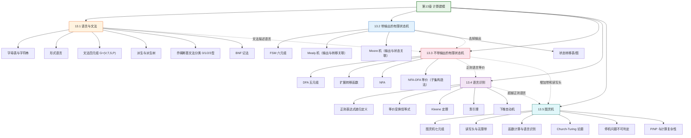

# 第13章 计算建模 — 章节汇总

> [!abstract] 概览
> 第13章是离散数学的收官之章，系统介绍了==计算建模==（Modeling Computation）的理论基础。全章从形式语言和文法的数学定义出发（13.1），建立描述语言的形式化工具；然后引入==有限状态机==（Finite-State Machine）作为最简单的计算模型——先介绍带输出的 Mealy 机和 Moore 机（13.2），再介绍不带输出的 DFA 和 NFA（13.3）；接着讨论==正则语言==和==正则表达式==，通过 Kleene 定理建立正则语言与有限自动机的等价关系（13.4）；最后以==图灵机==（Turing Machine）作为通用计算模型的终极形式，引入 Church-Turing 论题和停机问题的不可判定性（13.5）。全章体现了从"语言描述→简单计算模型→复杂度层次→通用计算模型"的递进知识链条，将离散数学的各个分支（逻辑、集合、关系、算法、图论、布尔代数）统一在"什么是可计算性"这一根本问题之下。

---

## 全章知识框架



---

## 各节核心知识点汇总

| 小节 | 核心概念 | 关键公式/定理 | 与前后节的关联 |
|:-----|:---------|:-------------|:---------------|
| 13.1 语言与文法 | 字母表、字符串、Kleene 闭包、文法四元组、派生、派生树、乔姆斯基分类 | $L(G)$ = {w ∈ T* : S ⇒* w}；0型 ⊃ 1型 ⊃ 2型 ⊃ 3型 | 全章基础，定义语言和文法的形式体系 |
| 13.2 带输出的 FSM | Mealy 机、Moore 机、状态转移表/图 | Mealy: g: S×I→O；Moore: h: S→O | 13.1 文法的物理实现雏形；去掉输出→13.3 |
| 13.3 不带输出的 FSM | DFA 五元组、NFA、语言识别、子集构造法 | M = (S,I,f,s₀,F)；NFA-DFA 等价 | 13.2 去掉输出的特例；为 13.4 正则语言提供识别器 |
| 13.4 语言识别 | 正则表达式、Kleene 定理、泵引理、下推自动机 | Kleene 定理：正则 ⟺ DFA 可识别；泵引理 | 13.3 DFA 的理论深化；超越正则→13.5 |
| 13.5 图灵机 | 图灵机、Church-Turing 论题、停机问题、P/NP | Church-Turing 论题；停机问题不可判定 | 全章终极模型，统一所有计算概念 |

---

## 学习脉络

```
形式语言与文法（13.1）— 掌握文法四元组和乔姆斯基分类，理解语言的形式化描述
  ↓
带输出的有限状态机（13.2）— 理解 Mealy/Moore 机的区别，学会画状态转移图
  ↓
不带输出的有限状态机（13.3）— DFA/NFA 的定义和等价性，学会设计 DFA
  ↓
语言识别与正则表达式（13.4）— 正则表达式的定义和运算，Kleene 定理，泵引理
  ↓
图灵机（13.5）— 图灵机的定义和执行，Church-Turing 论题，停机问题
```

**学习建议**：13.1 节的==乔姆斯基文法分类==是核心框架，需要记住 0-3 型文法的产生式限制和对应的识别器；13.2-13.3 节的==有限状态机==需要手动练习状态转移图的设计（如识别特定模式的 DFA）；13.4 节的==正则表达式==需要掌握递归定义和等价变换；13.5 节的==图灵机==需要理解其与 DFA 的本质区别（无限带+读写头），并理解 Church-Turing 论题的哲学意义。

---

## 跨节综合复习题

> [!problem] 综合复习题 1（跨 13.1 / 13.3 / 13.4）
> **题目：**
> (a) 构造一个 DFA，识别字母表 {0, 1} 上所有包含偶数个 0 的字符串。
> (b) 写出 (a) 中语言的正则表达式。
> (c) 构造一个文法 G，使得 L(G) = (a) 中的语言。G 属于乔姆斯基的哪一型？

> [!faq]- 解答
> **(a) DFA 设计：**
> 状态集 S = {s₀, s₁}，其中 s₀ 表示"已见过偶数个 0"，s₁ 表示"已见过奇数个 0"。
> - s₀ 是接受状态（空串有 0 个 0，是偶数）
> - 转移函数：
>   - f(s₀, 0) = s₁, f(s₀, 1) = s₀
>   - f(s₁, 0) = s₀, f(s₁, 1) = s₁
>
> **(b) 正则表达式：**
> 该语言的正则表达式为 $(1^*01^*01^*)^*$
>
> **(c) 文法构造：**
> $G = (V, T, S, P)$，其中 $V = \{S, A\}$，$T = \{0, 1\}$，$P$：
> - $S \to 1S \mid 0A \mid \varepsilon$
> - $A \to 1A \mid 0S$
>
> $G$ 属于==3型文法==（正则文法/右线性文法），因为每个产生式的左侧是单个非终结符，右侧最多有一个非终结符且在最右端。$\blacksquare$

> [!problem] 综合复习题 2（跨 13.4 / 13.5）
> **题目：**
> (a) 用泵引理证明 $L = \{0^n 1^n : n \geq 1\}$ 不是正则语言。
> (b) 构造一个图灵机来识别 L。
> (c) 这是否与 Church-Turing 论题矛盾？为什么？

> [!faq]- 解答
> **(a) 泵引理证明：**
> 假设 L 是正则的，设泵长度为 p。取字符串 $w = 0^p 1^p$。
>
> 由泵引理，$w = xyz$，其中 $|xy| \leq p$，$|y| \geq 1$，且对所有 $i \geq 0$，$xy^iz \in L$。
>
> 由于 $|xy| \leq p$，$y$ 只包含 0（即 $y = 0^k$，$k \geq 1$）。
>
> 取 $i = 0$：$xz = 0^{p-k}1^p$。由于 $k \geq 1$，$p - k < p$，所以 $xz \notin L$。矛盾。
>
> 因此 L 不是正则语言。$\blacksquare$
>
> **(b) 图灵机设计：**
> 图灵机 M 的工作方式：
> 1. 从左到右扫描输入，将第一个 0 标记为 X，然后向右找到第一个 1，标记为 Y
> 2. 重复步骤 1，直到所有 0 和 1 都被标记
> 3. 检查是否还有未标记的 0 或 1（如果有则拒绝）
> 4. 如果全部标记完毕且 0 和 1 数量相同，则接受
>
> **(c) 不矛盾。** Church-Turing 论题说的是"任何能有效计算的函数都可以被图灵机计算"。泵引理证明 L 不能被 DFA（或正则表达式）识别，但 L 可以被图灵机识别（如 (b) 所示）。这恰恰说明了图灵机的计算能力强于有限自动机，与 Church-Turing 论题一致。$\blacksquare$

---

## 与其他章节的关联

| 关联章节 | 关联方式 |
|:---------|:---------|
| 第1章 命题逻辑 | 有限状态机的状态转移可以用逻辑命题描述；布尔电路是有限状态机的物理实现 |
| 第2章 集合 | 形式语言是字符串集合；Kleene 闭包是集合运算 |
| 第3章 算法 | 图灵机是算法的数学模型；Church-Turing 论题定义了"算法"的边界 |
| 第5章 递归 | 文法的产生式是递归定义；递归下降解析器直接实现文法 |
| 第6章 计数 | 字符串计数与 Kleene 闭包有关；泵引理利用鸽巢原理 |
| 第9章 关系 | 状态转移函数本质上是关系；NFA 的转移关系是二元关系 |
| 第12章 布尔代数 | 有限状态机的电路实现；状态编码使用布尔代数 |

---

## 📚 全书完结

> [!tip] 离散数学知识库编译完成
>
> 至此，Rosen《离散数学及其应用》第8版全部 13 章的学习笔记和章节汇总已编译完成。
>
> - **笔记总数**：84 篇（79 篇节笔记 + 5 篇章节汇总）
> - **概念页总数**：122 个
> - **知识库总页数**：214+
>
> 从第1章的逻辑与证明基础，到第13章的图灵机与可计算性，离散数学的完整知识体系已在 Obsidian 知识库中构建完成。每篇笔记都包含核心概念讲解、补充理解、习题精选和学术来源引用，并通过双向链接和概念页构建了跨章节的知识关联网络。
>
> **下一步**：执行第13章的 Wiki Ingest（概念页编译），完成知识库的最后一块拼图。
