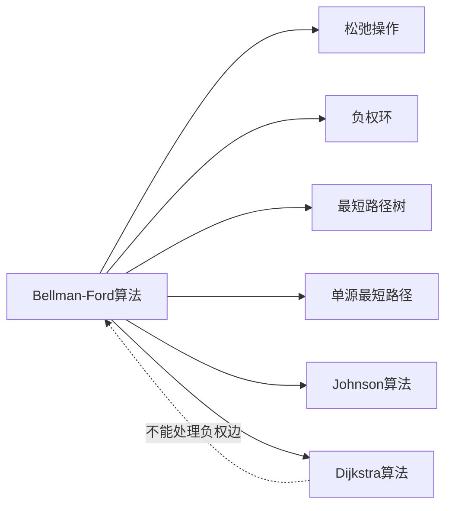

# Bellman-Ford算法

> [!abstract] 通过对图中所有边进行|V|-1轮松弛操作来逐步逼近最短路径，能处理负权边并检测负权环

## 定义

> [!def] 形式化定义
> **输入：** 带权有向图 $G = (V, E)$，权函数 $w$，源点 $s$
> **输出：**
> - 若图中不存在从 $s$ 可达的负权环：返回 TRUE，且对所有 $v \in V$，$d[v] = \delta(s, v)$
> - 若存在从 $s$ 可达的负权环：返回 FALSE
>
> **算法步骤：**
> 1. **初始化：** $d[s] = 0$，其余 $d[v] = \infty$，$\pi[v] = \text{NIL}$
> 2. **松弛循环：** 对所有边进行 $\|V\|-1$ 轮松弛
> 3. **负权环检测：** 再检查所有边，若仍可松弛则存在负权环

## 核心性质

| 性质 | 描述 |
|:-----|:-----|
| 时间复杂度 | $\Theta(VE)$ |
| 空间复杂度 | $O(V)$（$d$ 数组和 $\pi$ 数组） |
| 负权边 | 可以正确处理 |
| 负权环检测 | 第 $\|V\|$ 轮仍可松弛则存在从 $s$ 可达的负权环 |
| 松弛轮数 | 第 $i$ 轮后找到所有最多 $i$ 条边的最短路径 |
| 提前终止 | 若某轮无更新可提前终止（习题22.1-3） |

## 关系网络



## 章节扩展

### 第22章：单源最短路径

Bellman-Ford算法是CLRS第22.1节介绍的通用单源最短路径算法，能处理Dijkstra无法应对的负权边场景。

**算法伪代码：**
```
BELLMAN-FORD(G, w, s)
1  INITIALIZE-SINGLE-SOURCE(G, s)
2  for i = 1 to |G.V| - 1
3      for each edge (u, v) ∈ G.E
4          RELAX(u, v, w)
5  for each edge (u, v) ∈ G.E
6      if d[v] > d[u] + w(u, v)
7          return FALSE
8  return TRUE
```

**正确性（定理22.3）：**
- 循环不变式：第 $i$ 轮后，$d[v] \leq \delta_i(s,v)$（最多 $i$ 条边的最短路径权重）
- 初始化：$d[s] = 0 = \delta_0(s,s)$，其余 $d[v] = \infty$
- 维护：路径 $s \leadsto u \to v$（最多 $i+1$ 条边），由归纳 $d[u] \leq \delta_i(s,u)$，松弛后 $d[v] \leq \delta_{i+1}(s,v)$
- 终止：$\|V\|-1$ 条边覆盖所有简单路径，$d[v] = \delta(s,v)$

**负权环检测（引理22.2）：**
- 返回TRUE $\Rightarrow$ 不存在负权环（否则 $\delta = -\infty$，但 $d$ 有限）
- 存在负权环 $\Rightarrow$ 返回FALSE（$\|V\|-1$ 轮不足以覆盖绕行路径）

## 补充

> [!info] 补充说明
> - Bellman-Ford算法由Richard Bellman（1958）、Edward F. Moore（1956）和Lester R. Ford Jr.（1956）独立发现
> - RIP路由协议的核心机制基于分布式Bellman-Ford（距离向量路由）
> - SPFA（Shortest Path Faster Algorithm）是Bellman-Ford的队列加速版本，平均接近 $O(E)$，但最坏仍为 $O(VE)$
> - 金融套利检测：将货币视为顶点，汇率取负对数作为边权，负权环对应套利机会

## 参见

- [[算法导论/concepts/松弛操作]]
- [[算法导论/concepts/负权环]]
- [[算法导论/concepts/最短路径树]]
- [[算法导论/concepts/Dijkstra算法]]
- [[算法导论/concepts/Johnson算法]]
