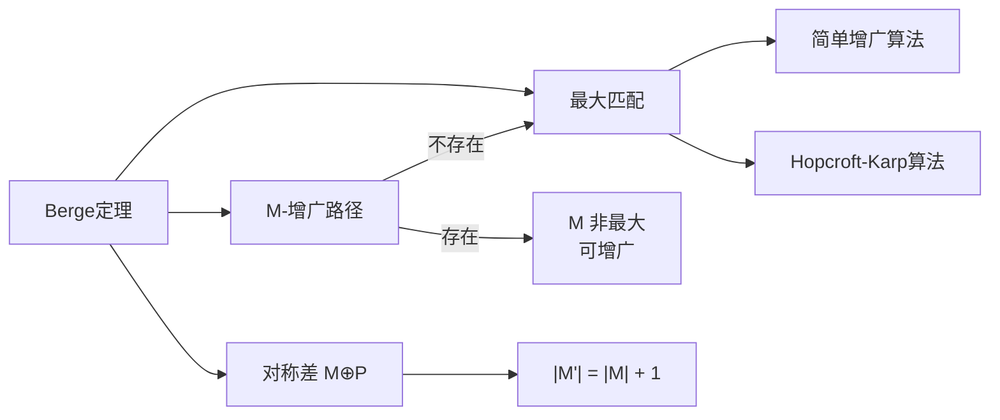

# Berge定理

> [!abstract] Berge定理指出匹配M是最大匹配当且仅当图中不存在M-增广路径，为所有基于增广的匹配算法提供了理论基础。

## 定义

> [!def] 形式化定义
> **Berge定理**（定理25.4）：图 $G = (V, E)$ 中的匹配 $M$ 是**最大匹配**，当且仅当 $G$ 中不存在 $M$-增广路径。
>
> 等价表述：
> - $M$ 是最大匹配 $\Rightarrow$ 不存在 $M$-增广路径（充分性）
> - 不存在 $M$-增广路径 $\Rightarrow$ $M$ 是最大匹配（必要性）

## 核心性质

| 性质 | 描述 |
|:-----|:-----|
| 充要条件 | 无增广路径是最大匹配的充分必要条件 |
| 算法终止条件 | 所有基于增广的匹配算法的终止判据 |
| 通用性 | 适用于任意无向图，不限于二部图 |
| 与引理24.2类比 | 在最大流中对应"无增广路径 $\Leftrightarrow$ 最大流" |

## 关系网络

## 章节扩展

### 第25章：二部图匹配

Berge定理在25.1节中作为匹配算法的核心理论基础引入。

**完整证明**：

**方向一（$\Rightarrow$ 的逆否：存在增广路径 $\Rightarrow$ 非最大）**：

设 $P$ 是一条 $M$-增广路径，$P$ 包含 $q$ 条边。$P$ 中属于 $E \setminus M$ 的边有 $\lceil q/2 \rceil$ 条，属于 $M$ 的边有 $\lfloor q/2 \rfloor$ 条。由于 $\lceil q/2 \rceil = \lfloor q/2 \rfloor + 1$，非匹配边比匹配边多1条。做对称差 $M' = M \oplus P$，翻转后每个顶点在 $M'$ 中至多关联一条边，$M'$ 仍是合法匹配，且 $|M'| = |M| + 1$。故 $M$ 不是最大匹配。

**方向二（$\Leftarrow$ 的逆否：非最大 $\Rightarrow$ 存在增广路径）**：

设 $M^*$ 是最大匹配，$|M^*| > |M|$。考虑 $E' = M \oplus M^*$，图 $G' = (V, E')$ 中每个顶点度数至多为2（引理25.3），因此 $G'$ 由孤立顶点、偶长度环和简单路径组成。偶长度环中 $M$ 和 $M^*$ 的边数相等，多出的 $|M^*| - |M|$ 条 $M^*$ 的边全部出现在简单路径中。那些以 $M^*$ 的边为起点和终点的路径就是 $M$-增广路径，且至少有 $|M^*| - |M| > 0$ 条。

**算法意义**：Berge定理为所有基于增广的匹配算法提供了正确的终止条件和最优性保证。算法只需反复寻找增广路径并增广，当找不到增广路径时即可保证当前匹配为最大匹配。

## 补充

> [!info] 补充说明
> Berge定理由法国数学家Claude Berge于1957年证明，是匹配理论中最基本也最重要的定理之一。该定理不仅适用于二部图，也适用于一般无向图。在一般图中，Edmonds的开花算法（Blossom Algorithm, 1965）同样基于Berge定理，通过特殊处理奇数长度的环（"花"）来搜索增广路径。

## 参见

- [[算法导论/concepts/二分匹配]] — 二分匹配的定义与求解方法
- [[算法导论/concepts/增广路径]] — 增广路径的定义与性质
- [[算法导论/concepts/对称差]] — 对称差运算在增广路径中的应用
