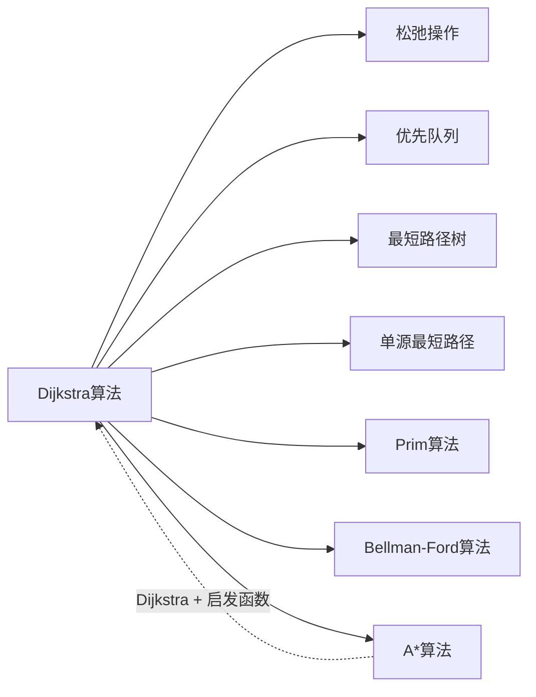

# Dijkstra算法

> [!abstract] 在所有边权非负的图中，贪心地选择当前距离源点最近的未确定顶点，通过松弛操作更新邻接顶点

## 定义

> [!def] 形式化定义
> **输入：** 带权有向图 $G = (V, E)$，所有边权 $w(u,v) \geq 0$，源点 $s$
> **输出：** 对每个从 $s$ 可达的顶点 $v$，$d[v] = \delta(s, v)$，前驱子图 $G_\pi$ 是最短路径树
>
> **关键变量：**
> - $d[v]$：从源点 $s$ 到顶点 $v$ 的当前最短路径估计值（上界）
> - $\pi[v]$：顶点 $v$ 在最短路径树中的前驱
> - $S$：已确定最短路径的顶点集合
> - $Q$：优先队列（最小堆），存储未确定顶点，以 $d$ 值为key
>
> **算法步骤：**
> 1. 初始化 $d[s] = 0$，其余 $d[v] = \infty$，所有顶点加入 $Q$
> 2. 当 $Q$ 非空时：取出 $d$ 最小的顶点 $u$，加入 $S$，对 $u$ 的每条出边执行 RELAX

## 核心性质

| 性质 | 描述 |
|:-----|:-----|
| 前提条件 | 所有边权 $w(u,v) \geq 0$ |
| 数组实现 | $O(V^2)$，适合稠密图 |
| 二叉堆实现 | $O((V+E) \lg V)$，适合稀疏图 |
| 斐波那契堆实现 | $O(V \lg V + E)$ |
| 负权边 | **不适用**，可能产生错误结果 |
| BFS特例 | 当所有边权为1时退化为BFS |

## 关系网络



## 章节扩展

### 第22章：单源最短路径

Dijkstra算法是CLRS第22.3节介绍的高效单源最短路径算法，由Edsger W. Dijkstra于1956年提出。

**算法伪代码：**
```
DIJKSTRA(G, w, s)
1  INITIALIZE-SINGLE-SOURCE(G, s)
2  S ← ∅
3  Q ← G.V
4  while Q ≠ ∅
5      u ← EXTRACT-MIN(Q)
6      S ← S ∪ {u}
7      for each vertex v ∈ G.Adj[u]
8          RELAX(u, v, w)
```

**正确性（定理22.6）：**
- 循环不变式：每次 EXTRACT-MIN 之前，对所有 $v \in S$，$v.d = \delta(s, v)$
- 初始化：$S = \emptyset$，空集上全称命题平凡成立
- 维护：反证法——设取出 $u$ 时 $u.d > \delta(s,u)$，考虑最短路径上第一个不在 $S$ 中的顶点 $y$，则 $y.d = \delta(s,y)$（由归纳），且 $\delta(s,u) \geq \delta(s,y) = y.d \geq u.d$（边权非负 + EXTRACT-MIN），矛盾
- 终止：$S = V$，所有 $d[v] = \delta(s,v)$

**不适用于负权边的原因：**
证明依赖 $\delta(s,u) \geq \delta(s,y)$（从 $y$ 到 $u$ 的路径边权非负）。若存在负权边，此不等式不成立，已加入 $S$ 的顶点可能需要被重新更新，但算法不会回头。

## 补充

> [!info] 补充说明
> - Dijkstra于1956年在阿姆斯特丹咖啡馆构思了该算法，1959年发表在《Numerische Mathematik》上
> - GPS导航系统的核心路径规划引擎基于Dijkstra算法或其变种（A*、双向Dijkstra、收缩层次等）
> - OSPF路由协议使用Dijkstra算法计算最短路径树
> - A*算法 = Dijkstra + 启发函数 $h(v)$，当 $h(v) = 0$ 时A*退化为Dijkstra

## 参见

- [[算法导论/concepts/松弛操作]]
- [[算法导论/concepts/优先队列]]
- [[算法导论/concepts/最短路径树]]
- [[算法导论/concepts/Bellman-Ford算法]]
- [[算法导论/concepts/Prim算法]]
