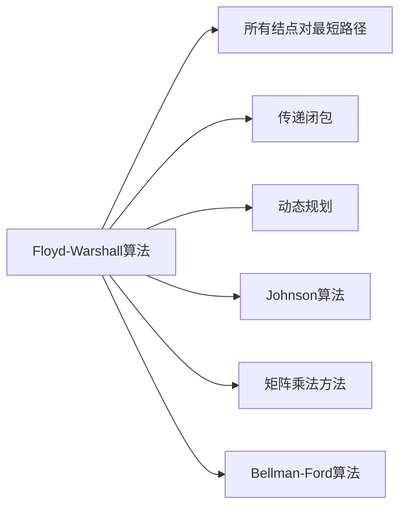

# Floyd-Warshall算法

> [!abstract] 通过逐步放宽中间顶点约束，用三重循环在$\Theta(V^3)$时间内求解所有结点对最短路径

## 定义

> [!def] 形式化定义
> 设图的顶点编号为 $1, 2, \ldots, n$。定义 $D^{(k)}_{ij}$ 为从顶点 $i$ 到顶点 $j$ 的**所有中间顶点编号均不超过 $k$** 的最短路径权重。
>
> **递推关系：**
> $$D^{(k)}_{ij} = \min\left(D^{(k-1)}_{ij},\; D^{(k-1)}_{ik} + D^{(k-1)}_{kj}\right) \quad \text{对 } k \ge 1$$
>
> **初始条件：** $D^{(0)}_{ij} = w_{ij}$（权重矩阵）
> **最终结果：** $D^{(n)}_{ij} = \delta(i, j)$

## 核心性质

| 性质 | 描述 |
|:-----|:-----|
| 时间复杂度 | $\Theta(V^3)$ |
| 空间复杂度 | $\Theta(V^2)$（就地更新版本） |
| 负权边 | 可以正确处理 |
| 负权环检测 | 检查 $D^{(n)}_{ii} < 0$ |
| 就地更新 | 安全，因为 $d_{ik}^{(k)} \leq d_{ik}^{(k-1)}$ |
| 传递闭包 | 布尔半环上的特例，将 min 替换为 OR，+ 替换为 AND |

## 关系网络



## 章节扩展

### 第23章：所有结点对的最短路径

Floyd-Warshall算法是CLRS第23.2节介绍的经典APSP算法，由Robert W. Floyd（1962）和Stephen Warshall（1962）独立发现。

**算法伪代码：**
```
FLOYD-WARSHALL(W)
1  n = W.rows
2  D^(0) = W
3  for k = 1 to n
4      let D^(k) = (d^(k)_{ij}) be a new n x n matrix
5      for i = 1 to n
6          for j = 1 to n
7              d^(k)_{ij} = min(d^(k-1)_{ij}, d^(k-1)_{ik} + d^(k-1)_{kj})
8  return D^(n)
```

**就地更新版本：**
```
FLOYD-WARSHALL'(W)
1  n = W.rows
2  D = W
3  for k = 1 to n
4      for i = 1 to n
5          for j = 1 to n
6              d[i][j] = min(d[i][j], d[i][k] + d[k][j])
7  return D
```

**正确性（定理23.4）：**
- 对 $k$ 进行数学归纳法
- 基础情况：$D^{(0)}_{ij} = w_{ij}$，等于无中间顶点的最短路径权重
- 归纳步：中间顶点不超过 $k+1$ 的最短路径，要么不经过 $k+1$（取 $D^{(k)}_{ij}$），要么经过 $k+1$（分为两段，各段中间顶点不超过 $k$）
- 终止：$k = n$ 时所有顶点均可作为中间顶点

**前驱矩阵维护：**
可同时维护 $\Pi^{(k)}_{ij}$ 记录最短路径上 $j$ 的前驱，用于重建路径。当选择经过 $k$ 中转时，$\Pi^{(k)}_{ij} = \Pi^{(k-1)}_{kj}$。

## 补充

> [!info] 补充说明
> - Bernard Roy于1959年最早发表了本质相同的算法，但Floyd和Warshall的论文影响力最大
> - Robert Floyd还发明了龟兔赛跑算法（判圈）、Floyd-Steinberg抖动算法，1978年获图灵奖
> - 传递闭包是Floyd-Warshall在布尔半环上的特例，时间同样为 $\Theta(V^3)$
> - Floyd-Warshall的代码极其简洁（三重循环 + 一行递推），常数因子小，是稠密图上APSP的实用首选

## 参见

- [[算法导论/concepts/所有结点对最短路径]]
- [[算法导论/concepts/传递闭包]]
- [[算法导论/concepts/动态规划]]
- [[算法导论/concepts/Johnson算法]]
