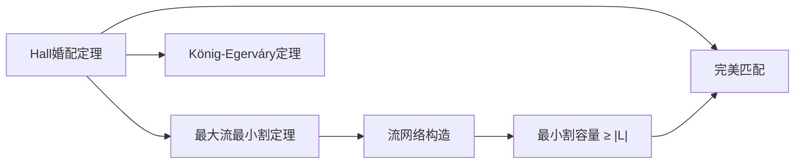

# Hall婚配定理

> [!abstract] Hall婚配定理给出了二部图存在完美匹配的充要条件：左部任意子集的邻居数不少于该子集的大小。

## 定义

> [!def] 形式化定义
> 设 $G = (V, E)$ 是二部图，$V = L \cup R$，$|L| = |R|$。对于 $L$ 的任意子集 $A$，定义 $A$ 的**邻域**：
> $$N(A) = \{v \in R : \exists\, u \in A,\, (u,v) \in E\}$$
>
> **Hall条件**：对 $L$ 的**每个**子集 $A$，都有 $|A| \leq |N(A)|$。
>
> **Hall婚配定理**：$G$ 中存在**完美匹配**当且仅当 Hall 条件成立。

## 核心性质

| 性质 | 描述 |
|:-----|:-----|
| 充要条件 | Hall条件是完美匹配存在的充分必要条件 |
| 邻域约束 | 左部任意 $k$ 个顶点至少连接右部 $k$ 个不同顶点 |
| 与最大流的关系 | 可通过最大流最小割定理证明 |
| 必要性显然 | 若 $|A| > |N(A)|$，$A$ 中至少一个顶点无法被匹配 |
| 充分性非平凡 | 需要借助流网络或交替路径论证 |

## 关系网络

## 章节扩展

### 第24章：最大流

Hall婚配定理在24.3节中作为最大二分匹配的扩展理论引入。

**与最大流的关系**：考虑二部图 $G = (L \cup R, E)$ 对应的流网络 $G'$（源 $s$ 连接 $L$，$R$ 连接汇 $t$，所有边容量为1）。Hall定理可以通过最大流最小割定理来证明：

- **($\Rightarrow$) 方向**：若 $G$ 存在完美匹配 $M$，对任意 $A \subseteq L$，$A$ 中每个顶点在 $M$ 中匹配到 $N(A)$ 中的不同顶点，因此 $|N(A)| \geq |A|$。
- **($\Leftarrow$) 方向**：设对所有 $A \subseteq L$ 都有 $|A| \leq |N(A)|$。考虑 $G'$ 中任意割 $(S, T)$，其中 $s \in S$，$t \in T$。令 $S_1 = L \cap S$，$S_2 = R \cap S$。割的容量为 $(|L| - |S_1|) + |S_2| + $（从 $S_1$ 到 $R \setminus S_2$ 的边数）。由Hall条件，从 $S_1$ 到 $R$ 的边数 $\geq |S_1|$，因此从 $S_1$ 到 $R \setminus S_2$ 的边数 $\geq |S_1| - |S_2|$。割的总容量 $\geq (|L| - |S_1|) + |S_2| + (|S_1| - |S_2|) = |L|$。因此最大流值 $\geq |L|$，存在大小为 $|L|$ 的完美匹配。

## 补充

> [!info] 补充说明
> Hall婚配定理由英国数学家Philip Hall于1935年发表，最初称为"婚配定理"（Marriage Theorem），因为可以用"男士和女士的匹配"来直观解释：如果任意一组男士认识的女士数量不少于该组男士的人数，那么所有人都能够找到合适的伴侣。
>
> Hall定理是组合数学中多个重要定理的等价形式之一。Borgersen (2004) 证明了Menger定理、König定理、Hall定理、最大流最小割定理等七个主要定理实际上是互相等价的。

## 参见

- [[算法导论/concepts/二分匹配]] — 二分匹配的定义与求解方法
- [[算法导论/concepts/最大流]] — 最大流问题与最大流最小割定理
