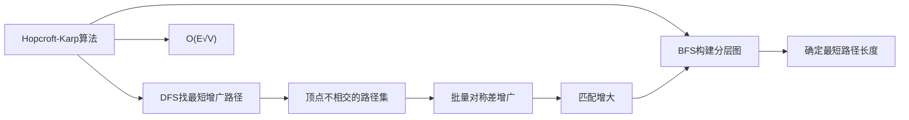

# Hopcroft-Karp算法

> [!abstract] Hopcroft-Karp算法通过BFS构建分层图并批量寻找最短增广路径，在 $O(E\sqrt{V})$ 时间内求解最大二分匹配。

## 定义

> [!def] 形式化定义
> **Hopcroft-Karp算法**是求解二部图最大匹配的高效算法，由John Hopcroft和Richard Karp于1973年提出。
>
> **算法框架**：
> 1. 初始化匹配 $M$ 为空集
> 2. **BFS阶段**：从所有未匹配的左部顶点出发，沿交替边构建**分层图**（层次图）。BFS只沿非匹配边从左到右、沿匹配边从右到左。当到达未匹配的右部顶点时停止，确定当前最短增广路径长度。
> 3. 若BFS未到达任何未匹配的右部顶点，算法终止，返回 $M$
> 4. **DFS阶段**：在分层图上从各未匹配的左部顶点出发，只沿层次递增方向做DFS，找到一组**顶点不相交**的最短 $M$-增广路径
> 5. $M = M \oplus (P_1 \cup P_2 \cup \cdots \cup P_k)$，回到步骤2
>
> **时间复杂度**：$O(E\sqrt{V})$

## 核心性质

| 性质 | 描述 |
|:-----|:-----|
| 时间复杂度 | $O(E\sqrt{V})$，优于基于最大流的 $O(VE)$ |
| 轮数上界 | 最多 $O(\sqrt{V})$ 轮BFS+DFS |
| 批量增广 | 每轮同时增广多条顶点不相交的最短增广路径 |
| 路径长度单调不减 | 每轮的最短增广路径长度单调递增 |
| 无需流网络 | 直接在二部图上操作，无需构造流网络 |

## 关系网络

## 章节扩展

### 第25章：二部图匹配

Hopcroft-Karp算法在25.1节中详细介绍，是简单增广算法的显著改进。

**核心创新**：简单增广算法每次只找一条增广路径，而Hopcroft-Karp算法在每一"阶段"中同时找出**一组顶点不相交的最短增广路径**，然后一次性将它们全部应用到匹配上。

**$O(\sqrt{V})$ 轮终止的证明要点**：
- 设第 $i$ 轮后最短增广路径长度为 $l_i$，则 $l_1 \leq l_2 \leq \cdots$（路径长度单调不减）
- 经过 $\sqrt{V}$ 轮后，若算法未终止，则 $l_{\sqrt{V}+1} \geq 2\sqrt{V} + 1$
- 此时匹配 $M$ 与最大匹配 $M^*$ 之间至少有 $|M^*| - |M|$ 条 $M$-增广路径，每条长度 $\geq 2\sqrt{V} + 1$
- 每条这样的路径至少包含 $\sqrt{V} + 1$ 条 $M$ 的边，因此 $|M^*| - |M| \leq V/(2(\sqrt{V}+1)) < \sqrt{V}$
- 故最多还需 $\sqrt{V}$ 轮即可终止，总轮数 $\leq 2\sqrt{V} = O(\sqrt{V})$

**与最大流归约方法的对比**：

| 对比维度 | 最大流归约 | Hopcroft-Karp |
|:---------|:-----------|:--------------|
| 时间复杂度 | $O(VE)$ | $O(E\sqrt{V})$ |
| 空间开销 | 需构造流网络 | 直接在原图操作 |
| 适用范围 | 可推广到一般流问题 | 专为二部图匹配设计 |

## 补充

> [!info] 补充说明
> Hopcroft-Karp算法由John E. Hopcroft和Richard M. Karp于1973年发表在SIAM Journal on Computing上。该算法在稀疏图（$E = o(V^{3/2})$）上明显优于基于最大流的 $O(VE)$ 方法。在实际应用中，Hopcroft-Karp算法是求解无权二分匹配的标准算法之一，广泛用于计算机视觉的特征匹配、数据库查询优化等场景。

## 参见

- [[算法导论/concepts/二分匹配]] — 二分匹配的定义与问题背景
- [[算法导论/concepts/增广路径]] — 增广路径的定义与性质
- [[算法导论/concepts/Berge定理]] — 增广路径与最大匹配的充要条件
