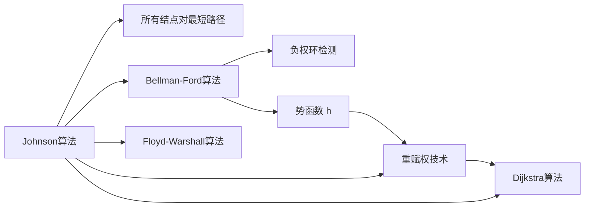

# Johnson算法

> [!abstract] 先用Bellman-Ford重赋权消除负权边，再对每个顶点运行Dijkstra，在稀疏图上高效求解所有结点对最短路径

## 定义

> [!def] 形式化定义
> **输入：** 带权有向图 $G = (V, E)$，权函数 $w$
> **输出：** 所有顶点对之间的最短路径权重矩阵 $d$
>
> **算法步骤：**
> 1. **构造 $G'$**：添加超级源点 $s$，$s$ 到每个顶点添加权为 $0$ 的边
> 2. **Bellman-Ford**：在 $G'$ 上以 $s$ 为源点运行，计算 $h(v) = \delta(s, v)$；若检测到负权环则报错
> 3. **重赋权**：$w'(u,v) = w(u,v) + h(u) - h(v)$，由三角不等式保证 $w' \geq 0$
> 4. **$V$ 次 Dijkstra**：对每个顶点 $u$ 在重赋权图上运行 Dijkstra，得到 $d'[u][v]$
> 5. **恢复距离**：$d[u][v] = d'[u][v] + h[v] - h[u]$

## 核心性质

| 性质 | 描述 |
|:-----|:-----|
| 时间复杂度 | $O(V^2 \lg V + VE)$ |
| 空间复杂度 | $O(V^2)$ |
| 稀疏图 $E = O(V)$ | $O(V^2 \lg V)$，优于 Floyd-Warshall 的 $O(V^3)$ |
| 稠密图 $E = \Theta(V^2)$ | $O(V^3)$，与 Floyd-Warshall 相当 |
| 负权边 | 支持（通过重赋权消除） |
| 负权环 | Bellman-Ford阶段自动检测 |

## 关系网络



## 章节扩展

### 第23章：所有结点对的最短路径

Johnson算法是CLRS第23.3节介绍的稀疏图APSP算法，由Donald B. Johnson于1977年提出。

**重赋权的两个关键引理：**

**引理23.1（边权非负）：**
由三角不等式 $\delta(s,v) \leq \delta(s,u) + w(u,v)$，即 $h(v) \leq h(u) + w(u,v)$，得 $w'(u,v) = w(u,v) + h(u) - h(v) \geq 0$。

**引理23.2（保持最短路径）：**
对任意路径 $p = \langle v_0, \ldots, v_k \rangle$，$w'(p) = w(p) + h(v_0) - h(v_k)$（望远镜求和，中间项全部抵消）。偏移量仅取决于起终点，与中间顶点无关，因此最短路径选择不变。

**算法伪代码：**
```
JOHNSON(G, w)
1  G' ← (V' = G.V ∪ {s}, E' = G.E ∪ {(s, v) : v ∈ G.V})
2  for each vertex v ∈ G.V
3      w(s, v) ← 0
4  if BELLMAN-FORD(G', w, s) == FALSE
5      error "图包含负权环"
6  for each vertex v ∈ G.V
7      h(v) ← s.d
8  for each edge (u, v) ∈ G.E
9      w'(u, v) ← w(u, v) + h(u) - h(v)
10 for each vertex u ∈ G.V
11     run DIJKSTRA(G, w', u) to compute d'[u][v] for all v
12     for each vertex v ∈ G.V
13         d[u][v] ← d'[u][v] + h[v] - h[u]
14 return d
```

**正确性（定理23.3）：**
由引理23.1，$w' \geq 0$，Dijkstra可正确运行。由引理23.2，$d'[u][v] = \delta_w(u,v) + h(u) - h(v)$。恢复后 $d[u][v] = d'[u][v] + h[v] - h[u] = \delta_w(u,v)$。

## 补充

> [!info] 补充说明
> - Johnson算法的精妙之处：用Bellman-Ford（能处理负权边但较慢）只运行一次消除负权边，然后用Dijkstra（快但不能处理负权边）运行多次求解
> - 超级源点保证所有顶点可达（避免 $\infty - \infty$），并确保能检测到任何负权环
> - 势函数 $h$ 的思想与物理学中的势能、线性规划的对偶理论有深刻类比
> - 当所有边权非负时，$h(v) = 0$ 对所有 $v$，重赋权后 $w' = w$，Johnson退化为 $V$ 次 Dijkstra

## 参见

- [[算法导论/concepts/所有结点对最短路径]]
- [[算法导论/concepts/Bellman-Ford算法]]
- [[算法导论/concepts/Dijkstra算法]]
- [[算法导论/concepts/Floyd-Warshall算法]]
