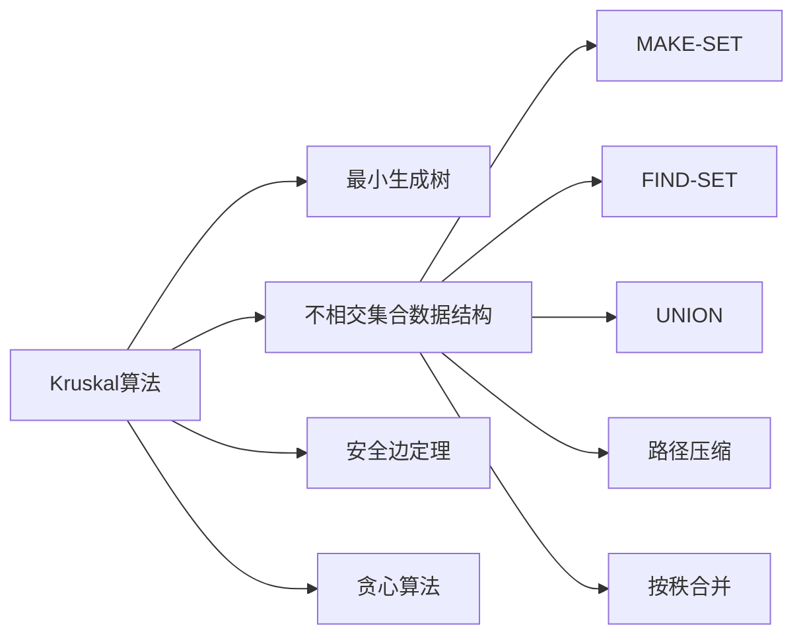

# Kruskal算法

> [!abstract] 将所有边按权排序，依次选取不形成环的最小权边，构建最小生成树

## 定义

> [!def] 形式化定义
> **输入：** 连通无向图 $G = (V, E)$，权值函数 $w: E \to \mathbb{R}$
> **输出：** 最小生成树的边集 $A$
>
> **算法步骤：**
> 1. **初始化：** $A \leftarrow \emptyset$，为每个顶点 $v$ 创建一个单元素集合（MAKE-SET）
> 2. **排序：** 将 $E$ 中的边按权值 $w$ 非递减排序
> 3. **贪心选择：** 依次考虑每条边 $(u, v)$：
>    - 若 FIND-SET$(u) \neq$ FIND-SET$(v)$（$u$ 和 $v$ 在不同集合中），则 $(u,v)$ 不形成环
>    - 将 $(u,v)$ 加入 $A$，调用 UNION$(u,v)$ 合并集合
> 4. **返回：** $A$ 即为最小生成树的边集

## 核心性质

| 性质 | 描述 |
|:-----|:-----|
| 时间复杂度 | $O(E \lg V)$，主要瓶颈为排序 $O(E \lg E) = O(E \lg V)$ |
| 并查集开销 | $O(E \cdot \alpha(V))$，$\alpha$ 为反阿克曼函数，实践中视为常数 |
| 数据结构 | 并查集（不相交集合数据结构）维护连通分量 |
| 贪心策略 | 全局视角——按边权排序，逐条考虑 |
| 适用场景 | 稀疏图（$E = O(V)$） |
| 正确性依据 | 割性质：被选边是横跨割 $(C, V-C)$ 的轻量边，故为安全边 |

## 关系网络



## 章节扩展

### 第21章：最小生成树

Kruskal算法是CLRS第21.2节介绍的两种经典MST算法之一，属于GENERIC-MST框架的具体实现。

**正确性证明要点：**
- 在算法执行过程中，森林 $A$ 将 $V$ 划分为若干连通分量，每个分量对应一个并查集集合
- 设算法正在考虑边 $(u,v)$ 且 FIND-SET$(u) \neq$ FIND-SET$(v)$，令 $C$ 为包含 $u$ 的连通分量
- 割 $(C, V-C)$ 尊重 $A$（$A$ 中无横跨割的边），$(u,v)$ 是该割的轻量边（边已按权排序）
- 由[[算法导论/concepts/安全边定理]]，$(u,v)$ 对 $A$ 是安全边

**算法伪代码：**
```
MST-KRUSKAL(G, w)
1  A ← ∅
2  for each vertex v ∈ G.V
3      MAKE-SET(v)
4  sort the edges of G.E into nondecreasing order by weight w
5  for each edge (u, v) ∈ G.E, taken in nondecreasing order by weight
6      if FIND-SET(u) ≠ FIND-SET(v)
7          A ← A ∪ {(u, v)}
8          UNION(u, v)
9  return A
```

**与Prim算法的对比：**
- Kruskal从**边**的视角出发，维护一个森林；Prim从**顶点**的视角出发，维护一棵树
- Kruskal适合稀疏图（排序开销小），Prim适合稠密图（优先队列效率高）
- 两者使用二叉堆时时间复杂度相同，均为 $O(E \lg V)$

## 补充

> [!info] 补充说明
> - Kruskal算法由Joseph Kruskal于1956年在贝尔实验室提出，发表时年仅23岁
> - 对每棵MST都存在一种边的排序方式使得Kruskal返回该MST（习题21.2-1）
> - 当边权在 $[0,1)$ 上均匀分布时，可用桶排序将排序降至期望 $O(E)$，总期望时间为 $O(E \alpha(V))$

## 参见

- [[算法导论/concepts/最小生成树]]
- [[算法导论/concepts/不相交集合数据结构]]
- [[算法导论/concepts/安全边定理]]
- [[算法导论/concepts/Prim算法]]
