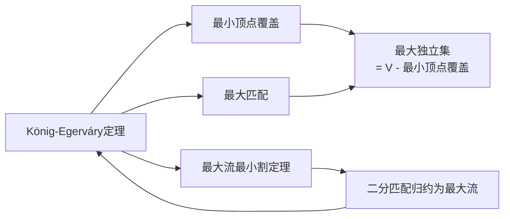

# König-Egerváry定理

> [!abstract] König-Egerváry定理指出在二部图中最大匹配的边数等于最小顶点覆盖的顶点数，是最大流最小割定理在二部图上的特化。

## 定义

> [!def] 形式化定义
> **顶点覆盖**：给定图 $G = (V, E)$，一个顶点覆盖 $C \subseteq V$ 是满足以下条件的顶点集：$E$ 中的每条边至少有一个端点在 $C$ 中。
>
> **最小顶点覆盖**：所有顶点覆盖中顶点数最少的那个。
>
> **König-Egerváry定理**：在任何**二部图**中，**最大匹配的边数等于最小顶点覆盖的顶点数**。即：
> $$\text{最大匹配大小} = \text{最小顶点覆盖大小}$$

## 核心性质

| 性质 | 描述 |
|:-----|:-----|
| 等式关系 | 二部图中最大匹配 = 最小顶点覆盖 |
| 仅适用于二部图 | 一般图中该等式不成立（一般图是NP难的） |
| 与最大流最小割的关系 | 可通过二分匹配到最大流的归约推导 |
| 推导最大独立集 | 最大独立集 = $V$ - 最小顶点覆盖 = $V$ - 最大匹配 |
| 构造性证明 | 可从最大匹配直接构造出等大的顶点覆盖 |

## 关系网络

## 章节扩展

### 第25章：二部图匹配

König-Egerváry定理在25.1节中作为匹配理论的重要扩展引入。

**构造性证明**：

设 $M$ 是二部图 $G = (L \cup R, E)$ 中的一个最大匹配。构造顶点覆盖 $U$ 如下：

1. 从所有未匹配的左部顶点出发，沿交替路径做BFS/DFS搜索
2. 将所有**被访问到的右部顶点**和所有**未被访问到的左部顶点**加入集合 $U$

验证：
- **$U$ 是顶点覆盖**：对于任意边 $(u,v)$（$u \in L$, $v \in R$），若 $u$ 未被访问则 $u \in U$；若 $u$ 被访问则 $v$ 也必然被访问（否则 $(u,v)$ 可延伸为增广路径，与 $M$ 最大矛盾），此时 $v \in U$。
- **$|U| = |M|$**：$M$ 中每条边恰好有一个端点在 $U$ 中（左端点被访问则右端点在 $U$ 中，左端点未被访问则左端点在 $U$ 中），因此 $|U| \leq |M|$。又因为任何顶点覆盖至少包含 $|M|$ 个顶点（每条匹配边至少需要一个端点），所以 $|U| = |M|$。

**与最大流最小割定理的关系**：通过二分匹配到最大流的归约，König-Egerváry定理可以视为最大流最小割定理的推论。流网络中的最小割对应二部图中的最小顶点覆盖，最大流值对应最大匹配大小。

## 补充

> [!info] 补充说明
> König-Egerváry定理由匈牙利数学家Dénes Kőnig于1931年和匈牙利数学家Jenő Egerváry于1931年独立证明。该定理是二部图理论中最重要的结果之一，它将边集优化问题（最大匹配）和顶点集优化问题（最小顶点覆盖）联系在一起。
>
> 在一般图中，求最小顶点覆盖是NP难的，最大匹配与最小顶点覆盖之间不存在简单的等式关系。König-Egerváry定理的成立依赖于二部图的结构特性——二部图中不包含奇数长度的环，这保证了交替路径搜索的正确性。

## 参见

- [[算法导论/concepts/二分匹配]] — 二分匹配的定义与求解方法
- [[算法导论/concepts/最小割]] — 最大流最小割定理
- [[算法导论/concepts/最大流]] — 最大流问题与Ford-Fulkerson方法
