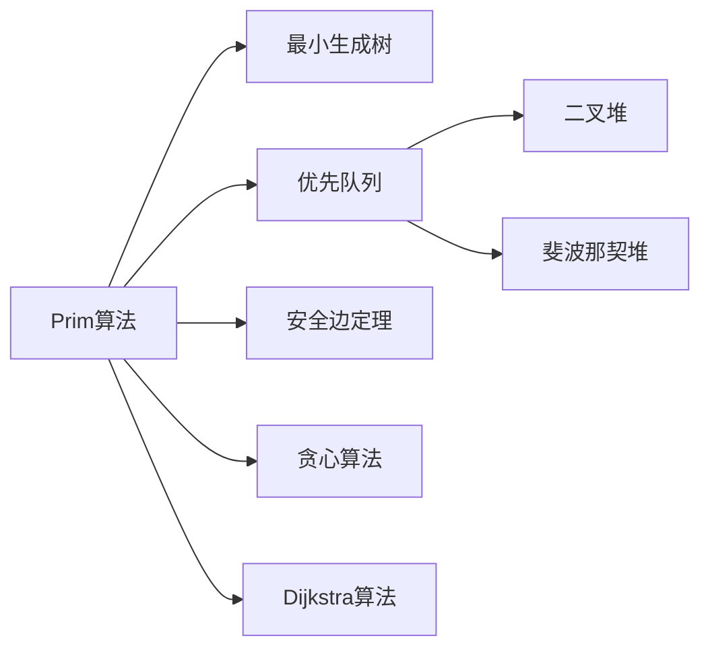

# Prim算法

> [!abstract] 从一个起始顶点出发，每次选择连接已到达集与未到达集的最小权边，逐步扩展生成树

## 定义

> [!def] 形式化定义
> **输入：** 连通无向图 $G = (V, E)$，权值函数 $w: E \to \mathbb{R}$，起始顶点 $r \in V$
> **输出：** 最小生成树，由前驱子图 $\{(v, \pi[v]) : v \in V - \{r\}\}$ 给出
>
> **关键数据结构：**
> - `key[u]`：顶点 $u$ 连接到当前生成树的最小边权（初始为 $\infty$，起始顶点 $r$ 的 key 为 $0$）
> - $\pi[u]$：$u$ 在最小生成树中的父节点
> - $Q$：包含所有未加入MST的顶点的最小优先队列，以 `key` 值为优先级
>
> **算法步骤：**
> 1. **初始化：** 所有 `key` 设为 $\infty$，所有 $\pi$ 设为 NIL，`key[r] = 0`
> 2. **主循环：** 当 $Q$ 非空时：
>    - 从 $Q$ 中取出 `key` 最小的顶点 $u$（EXTRACT-MIN）
>    - 对 $u$ 的每个邻居 $v$，若 $v$ 仍在 $Q$ 中且 $w(u,v) < \text{key}[v]$，则更新 $\pi[v] = u$，`key[v] = w(u,v)`

## 核心性质

| 性质 | 描述 |
|:-----|:-----|
| 二叉堆实现 | $O(E \lg V)$ |
| 斐波那契堆实现 | $O(E + V \lg V)$ |
| 邻接矩阵实现 | $O(V^2)$，适合稠密图 |
| 数据结构 | 优先队列（最小堆） |
| 贪心策略 | 局部视角——从一个顶点向外扩展 |
| 适用场景 | 稠密图（$E = \Omega(V^2)$） |
| 正确性依据 | 割性质：每次选取的边是横跨割 $(S, V-S)$ 的轻量边 |

## 关系网络



## 章节扩展

### 第21章：最小生成树

Prim算法是CLRS第21.2节介绍的两种经典MST算法之一。算法结构与Dijkstra算法高度相似，但语义有本质区别。

**算法伪代码：**
```
MST-PRIM(G, w, r)
1  for each u ∈ G.V
2      key[u] ← ∞
3      π[u] ← NIL
4  key[r] ← 0
5  Q ← G.V
6  while Q ≠ ∅
7      u ← EXTRACT-MIN(Q)
8      for each v ∈ G.Adj[u]
9          if v ∈ Q and w(u, v) < key[v]
10             π[v] ← u
11             key[v] ← w(u, v)
```

**正确性证明要点：**
- 令 $S$ 为已从 $Q$ 中取出的顶点集合，$(S, V-S)$ 构成割
- 对每个 $v \in V-S$，`key[v]` 等于连接 $v$ 与 $S$ 中顶点的最小边权
- 取出 `key` 最小的顶点 $u$ 时，边 $(\pi[u], u)$ 是横跨割 $(S, V-S)$ 的轻量边
- 由[[算法导论/concepts/安全边定理]]，$(\pi[u], u)$ 是安全边

**与Dijkstra算法的关键区别：**

| 维度 | Prim 的 `key[v]` | Dijkstra 的 `d[v]` |
|------|:-----------------|:---------------------|
| 含义 | $v$ 连接到当前生成树的最小边权 | 源点到 $v$ 的最短路径估计 |
| 更新条件 | $w(u,v) < \text{key}[v]$ | $\text{dist}[u] + w(u,v) < \text{dist}[v]$ |
| 是否累加 | 否，只看直接边权 | 是，累加路径上的边权 |

## 补充

> [!info] 补充说明
> - Prim算法由Robert C. Prim于1957年提出，Vojtěch Jarník于1930年独立发现，Edsger Dijkstra也于1959年独立发现
> - 使用斐波那契堆时，DECREASE-KEY的摊还代价为 $O(1)$（vs 二叉堆的 $O(\lg V)$），这是Prim在稠密图上优于Kruskal的关键
> - 当边权为 $1$ 到 $W$（$W$ 为常数）的整数时，可用桶数组代替优先队列，达到线性时间 $O(V + E)$

## 参见

- [[算法导论/concepts/最小生成树]]
- [[算法导论/concepts/优先队列]]
- [[算法导论/concepts/安全边定理]]
- [[算法导论/concepts/Kruskal算法]]
