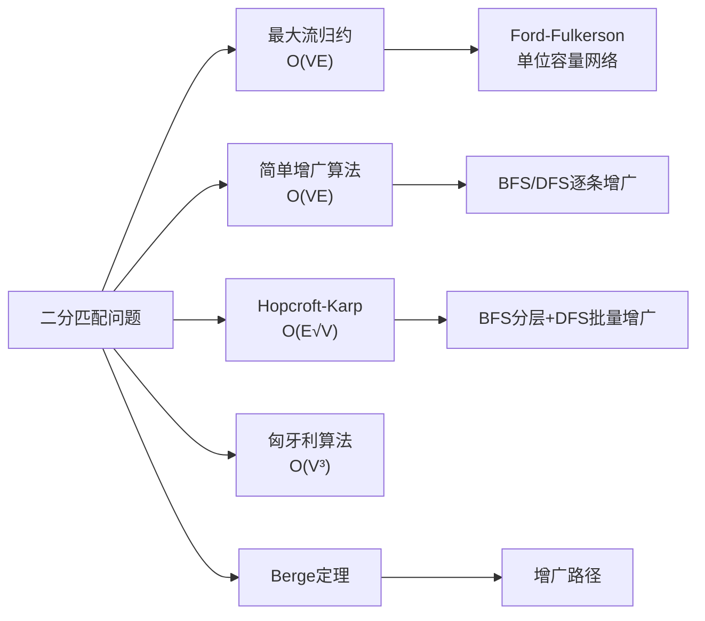

# 二分匹配

> [!abstract] 二分匹配是在二部图中找到最多的两两不共享端点的边集，可通过归约为最大流问题或使用专门的匹配算法高效求解。

## 定义

> [!def] 形式化定义
> 给定二部图 $G = (V, E)$，其中 $V = L \cup R$，$L \cap R = \emptyset$，$E$ 中每条边的一个端点在 $L$ 中、另一个在 $R$ 中。
>
> **匹配** $M$ 是 $E$ 的一个子集，使得 $M$ 中任意两条边不共享端点。
>
> - **匹配大小**：$|M|$，即 $M$ 中边的数量
> - **最大匹配**：所有匹配中边数最多的匹配
> - **完美匹配**：$|M| = |V|/2$，即每个顶点都被匹配
> - **已匹配/未匹配顶点**：在匹配 $M$ 下，有边关联的顶点为已匹配顶点，否则为未匹配顶点（自由顶点）
>
> **最大二分匹配问题**：在二部图中找到最大匹配。

## 核心性质

| 性质 | 描述 |
|:-----|:-----|
| 最大匹配 = 最大流值 | 通过构造单位容量流网络，$|M| = |f|$（定理24.10） |
| Berge判据 | $M$ 是最大匹配 $\Leftrightarrow$ 不存在 $M$-增广路径 |
| 完美匹配条件 | $|L| = |R|$ 且满足Hall条件时存在完美匹配 |
| König-Egerváry | 二部图中最大匹配 = 最小顶点覆盖 |
| 容量1保证 | 流网络中所有边容量为1，天然保证每个顶点最多被匹配一次 |

## 关系网络

## 章节扩展

### 第24章：最大流

24.3节展示了如何将最大二分匹配归约为最大流问题。构造方法：
1. 添加源 $s$ 和汇 $t$
2. 从 $s$ 到 $L$ 中每个顶点 $u$ 添加边 $(s,u)$，容量为1
3. 从 $R$ 中每个顶点 $v$ 到 $t$ 添加边 $(v,t)$，容量为1
4. 原图中每条边 $(u,v)$（$u \in L$, $v \in R$）设为有向边，容量为1
5. 在此流网络上求最大流，流量为1的 $L \to R$ 边构成最大匹配

在单位容量网络上，Edmonds-Karp算法的复杂度从 $O(VE^2)$ 改进到 $O(VE)$：每次增广使流值恰好增加1，最多增广 $O(V)$ 次，每次BFS耗时 $O(E)$。

### 第25章：二部图匹配

25.1节介绍了不依赖最大流框架的直接匹配算法。

**简单增广算法**：从空匹配出发，反复用BFS/DFS搜索增广路径并沿路径翻转匹配状态，每次使匹配规模增加1。时间复杂度 $O(VE)$。

**Hopcroft-Karp算法**：每轮BFS构建分层图，然后DFS同时找出多条顶点不相交的最短增广路径，一次性增广。总轮数 $O(\sqrt{V})$，总时间 $O(E\sqrt{V})$。

## 补充

> [!info] 补充说明
> 二分匹配在求职者-岗位匹配、课程-教室分配、肾交换程序、推荐系统与在线广告等领域有广泛应用。匹配理论的历史跨越一个多世纪：König (1916) 证明König定理，Hall (1935) 发表婚配定理，Kuhn (1955) 和 Munkres (1957) 提出匈牙利算法，Hopcroft和Karp (1973) 提出 $O(E\sqrt{V})$ 算法。

## 参见

- [[算法导论/concepts/增广路径]] — 增广路径的定义与在匹配中的角色
- [[算法导论/concepts/Berge定理]] — 增广路径与最大匹配的充要条件
- [[算法导论/concepts/最大流]] — 最大流问题与Ford-Fulkerson方法
- [[算法导论/concepts/Hall婚配定理]] — 完美匹配存在的充要条件
- [[算法导论/concepts/Hopcroft-Karp算法]] — $O(E\sqrt{V})$ 的最大二分匹配算法
