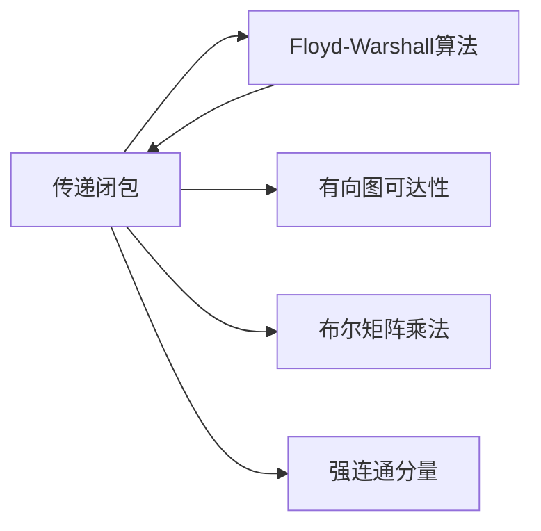

# 传递闭包

> [!abstract] 计算有向图中每对顶点之间的可达性关系，是Floyd-Warshall算法在布尔半环上的特例

## 定义

> [!def] 形式化定义
> 给定有向图 $G = (V, E)$，$G$ 的**传递闭包** $G^* = (V, E^*)$ 满足：$(i, j) \in E^*$ 当且仅当从 $i$ 到 $j$ 存在一条路径（路径长度至少为0，即每个顶点到自身可达）。
>
> 用布尔矩阵 $T^{(k)}_{ij}$ 表示，其中 $T^{(k)}_{ij} = \text{TRUE}$ 当且仅当从 $i$ 到 $j$ 存在一条所有中间顶点编号不超过 $k$ 的路径。
>
> **递推关系：**
> $$T^{(k)}_{ij} = T^{(k-1)}_{ij} \lor (T^{(k-1)}_{ik} \land T^{(k-1)}_{kj})$$

## 核心性质

| 性质 | 描述 |
|:-----|:-----|
| 时间复杂度 | $\Theta(V^3)$ |
| 空间复杂度 | $\Theta(V^2)$（就地更新） |
| 与FW的关系 | Floyd-Warshall在布尔半环上的特例（min→OR，+→AND） |
| BFS/DFS方法 | 对每个顶点运行BFS/DFS，$O(VE)$，适合稀疏图 |
| 自反性 | 对角线元素 $T_{ii} = \text{TRUE}$（每个顶点到自身可达） |

## 关系网络



## 章节扩展

### 第23章：所有结点对的最短路径

传递闭包是CLRS第23.2节中Floyd-Warshall算法的自然扩展，将数值计算替换为布尔运算。

**算法伪代码：**
```
TRANSITIVE-CLOSURE(G)
1  n = |G.V|
2  for i = 1 to n
3      for j = 1 to n
4          if i == j or (i, j) ∈ G.E
5              t^(0)_{ij} = 1
6          else
7              t^(0)_{ij} = 0
8  for k = 1 to n
9      for i = 1 to n
10         for j = 1 to n
11             t^(k)_{ij} = t^(k-1)_{ij} OR (t^(k-1)_{ik} AND t^(k-1)_{kj})
12 return T^(n)
```

**与Floyd-Warshall的对应关系：**

| Floyd-Warshall | 传递闭包 |
|:---|:---|
| $\min$ | $\lor$（OR） |
| $+$ | $\land$（AND） |
| $\infty$ | $0$（FALSE） |
| 权重矩阵 $W$ | 邻接矩阵 |
| $D^{(k)}_{ij}$ | $T^{(k)}_{ij}$ |

**稀疏图上的高效方法：**
对每个顶点 $u$ 运行一次BFS或DFS，找出从 $u$ 可达的所有顶点。总时间 $O(V(V+E)) = O(V^2 + VE)$，当 $E \geq V$ 时为 $O(VE)$，对稀疏图优于 $O(V^3)$。

## 补充

> [!info] 补充说明
> - 传递闭包在社交网络分析中回答"A能否通过朋友链到达B？"这类可达性问题
> - 数据库中SQL的递归公共表表达式（Recursive CTE）本质上计算传递闭包
> - 编译器的数据流分析中，传递闭包用于计算变量活跃范围和可达定义
> - 操作系统中资源分配图的传递闭包可用于死锁检测
> - 传递闭包也可用Warshall算法（1962）直接计算，与Floyd的版本等价

## 参见

- [[算法导论/concepts/Floyd-Warshall算法]]
- [[算法导论/concepts/所有结点对最短路径]]
