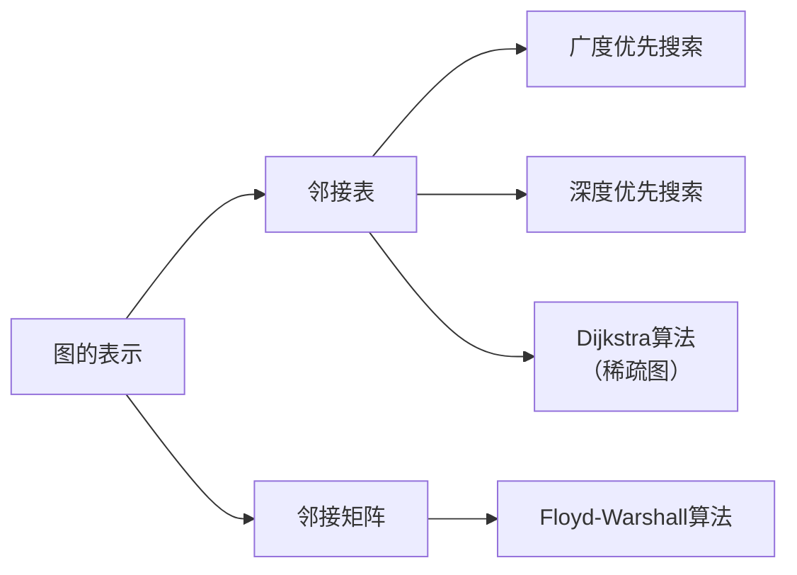

# 图的表示

> [!abstract] 图的两种标准计算机表示方法：邻接表（空间 $O(V+E)$，适合稀疏图）和邻接矩阵（空间 $O(V^2)$，适合稠密图），本质是在存储效率与操作效率之间做权衡。

## 定义

> [!def] 图（Graph）
> 一个**图** $G = (V, E)$ 由**顶点集** $V$ 和**边集** $E$ 组成。每条边是一个顶点对 $(u, v)$，其中 $u, v \in V$。在有向图中边是有序对，在无向图中边是无序对。

> [!def] 邻接表（Adjacency List）
> 图 $G = (V, E)$ 的**邻接表**表示由一个包含 $|V|$ 条链表的数组 $\text{Adj}$ 组成。对于每个顶点 $u \in V$，$\text{Adj}[u]$ 包含所有满足 $(u, v) \in E$ 的顶点 $v$。空间复杂度为 $O(V + E)$。

> [!def] 邻接矩阵（Adjacency Matrix）
> 图 $G = (V, E)$ 的**邻接矩阵**表示使用一个 $|V| \times |V|$ 的矩阵 $A$，其中 $A[i][j] = 1$ 当 $(i, j) \in E$，否则为 $0$。带权图中 $A[i][j]$ 存储边权值。空间复杂度为 $O(V^2)$。

## 核心性质

| 性质 | 邻接表 | 邻接矩阵 |
|:-----|:-----|:-----|
| 空间复杂度 | $O(V + E)$ | $O(V^2)$ |
| 判断边 $(u,v)$ 是否存在 | $O(\text{degree}(u))$ | $O(1)$ |
| 枚举 $u$ 的所有邻居 | $O(\text{degree}(u))$ | $O(V)$ |
| 枚举所有边 | $O(V + E)$ | $O(V^2)$ |
| 添加边 | $O(1)$ | $O(1)$ |
| 删除边 | $O(\text{degree}(u))$ | $O(1)$ |
| 适合场景 | 稀疏图（$|E| \ll |V|^2$） | 稠密图（$|E| \approx |V|^2$） |
| 自环/多重边 | 自然支持 | 需特殊处理 |

## 关系网络

## 章节扩展

### 第20章：基本图算法

图的表示是所有图算法的基础。CLRS 默认假设输入图使用邻接表表示。邻接表的核心优势在于空间紧凑——对于稀疏图（如社交网络，$|E| \approx O(|V|)$），邻接表的 $O(V + E)$ 空间远优于邻接矩阵的 $O(V^2)$。邻接矩阵的优势在于 $O(1)$ 的边查询，适合需要频繁判断边存在性的算法（如 Floyd-Warshall）。

**无向图的特殊性质：** 在无向图的邻接表中，每条边 $(u, v)$ 同时出现在 $\text{Adj}[u]$ 和 $\text{Adj}[v]$ 中，总长度为 $2|E|$。无向图的邻接矩阵是对称矩阵，可利用对称性将空间减半。

**工程扩展：** 大规模图计算中常用 CSR（Compressed Sparse Row）格式，空间 $O(V + E)$ 但缓存友好；散列邻接表将链表替换为散列表，边查询降至 $O(1)$ 期望时间。

## 补充

> [!info] 选型经验法则
> 当 $|E| < |V|^2 / 100$（平均度数小于 $|V|/50$）时，邻接表几乎总是更好的选择。对于稠密图（$|E| = \Theta(V^2)$），邻接矩阵的 $O(V^2)$ 空间与邻接表同级，且连续内存布局带来更好的缓存性能。

## 参见

- [[算法导论/concepts/广度优先搜索]]
- [[算法导论/concepts/深度优先搜索]]
