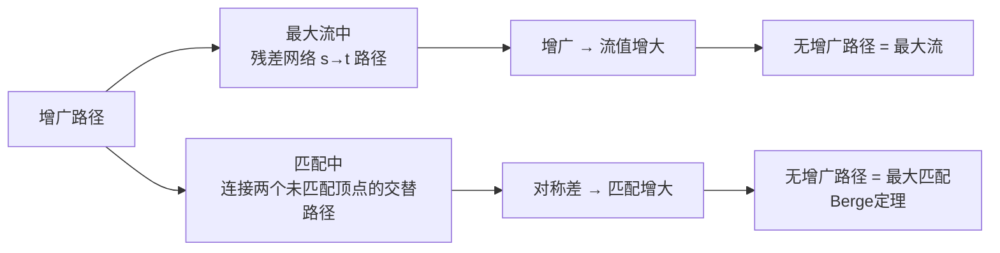

# 增广路径

> [!abstract] 增广路径是最大流和二分匹配算法的核心操作对象——在残差网络中沿增广路径增广可增大流量，在匹配中沿增广路径做对称差可增大匹配。

## 定义

> [!def] 形式化定义
> **最大流中的增广路径**：在残差网络 $G_f$ 中，一条从源 $s$ 到汇 $t$ 的**简单路径** $p$ 称为**增广路径**。其残差容量为：
> $$c_f(p) = \min\{c_f(u,v) : (u,v) \text{ 在 } p \text{ 上}\}$$
> 沿 $p$ 增广后，流值恰好增加 $c_f(p)$。
>
> **匹配中的增广路径**：给定图 $G = (V, E)$ 和匹配 $M$：
> - **M-交替路径**：一条简单路径，其边在 $M$ 和 $E \setminus M$ 之间交替出现
> - **M-增广路径**：一条M-交替路径，且其第一条边和最后一条边都不属于 $M$。增广路径的两个端点都是未匹配顶点，且包含奇数条边（非匹配边比匹配边多1条）

## 核心性质

| 性质 | 描述 |
|:-----|:-----|
| 最大流判据 | $G_f$ 中不存在增广路径 $\Leftrightarrow$ $f$ 是最大流（引理24.2） |
| 最大匹配判据 | 不存在 $M$-增广路径 $\Leftrightarrow$ $M$ 是最大匹配（Berge定理） |
| 增广效果（流） | 沿增广路径增广后，流值增加 $c_f(p)$ |
| 增广效果（匹配） | 沿增广路径做对称差 $M' = M \oplus P$，匹配大小增加1 |
| 路径长度单调性 | Edmonds-Karp和Hopcroft-Karp中，增广路径长度单调不减 |

## 关系网络

## 章节扩展

### 第24章：最大流

在24.2节中，增广路径定义在残差网络 $G_f$ 上，是从源 $s$ 到汇 $t$ 的简单路径。Ford-Fulkerson方法的核心循环就是反复在 $G_f$ 中寻找增广路径并沿路径增广。

增广路径的残差容量 $c_f(p)$ 决定了本次能增加的流量。沿路径增广时：
- 正向边 $(u,v)$：$f(u,v)$ 增加 $c_f(p)$
- 反向边 $(u,v)$：$f(v,u)$ 减少 $c_f(p)$（即撤销部分流量）

Edmonds-Karp算法通过BFS选择最短增广路径，保证路径长度单调递增（引理24.4），从而获得 $O(VE^2)$ 的多项式时间复杂度。

### 第25章：二部图匹配

在25.1节中，增广路径的定义从残差网络转移到匹配的交替路径框架。

**M-增广路径**是一条连接两个未匹配顶点的M-交替路径，包含奇数条边。非匹配边有 $\lceil q/2 \rceil$ 条，匹配边有 $\lfloor q/2 \rfloor$ 条，因此非匹配边比匹配边多1条。沿增广路径做对称差操作 $M' = M \oplus P$，将 $P$ 中原属于 $M$ 的边移出、原不属于 $M$ 的边加入，得到 $|M'| = |M| + 1$。

Berge定理建立了增广路径与最大匹配之间的充要关系：$M$ 是最大匹配 $\Leftrightarrow$ 不存在 $M$-增广路径。这是所有基于增广的匹配算法（简单增广、Hopcroft-Karp）的理论基础。

## 补充

> [!info] 补充说明
> 增广路径在最大流和匹配两个领域中扮演着相同的结构性角色——它们都是"当前解不是最优"的证书，也是"改进当前解"的操作对象。这种统一性不是巧合：二分匹配可以通过归约为最大流来求解，而匹配中的增广路径恰好对应流网络中残差网络的增广路径。两种定义在流网络归约框架下是完全一致的。

## 参见

- [[算法导论/concepts/二分匹配]] — 二分匹配的定义与求解方法
- [[算法导论/concepts/残差网络]] — 残差网络与增广操作
- [[算法导论/concepts/对称差]] — 对称差运算在增广路径中的应用
- [[算法导论/concepts/Berge定理]] — 增广路径与最大匹配的充要条件
