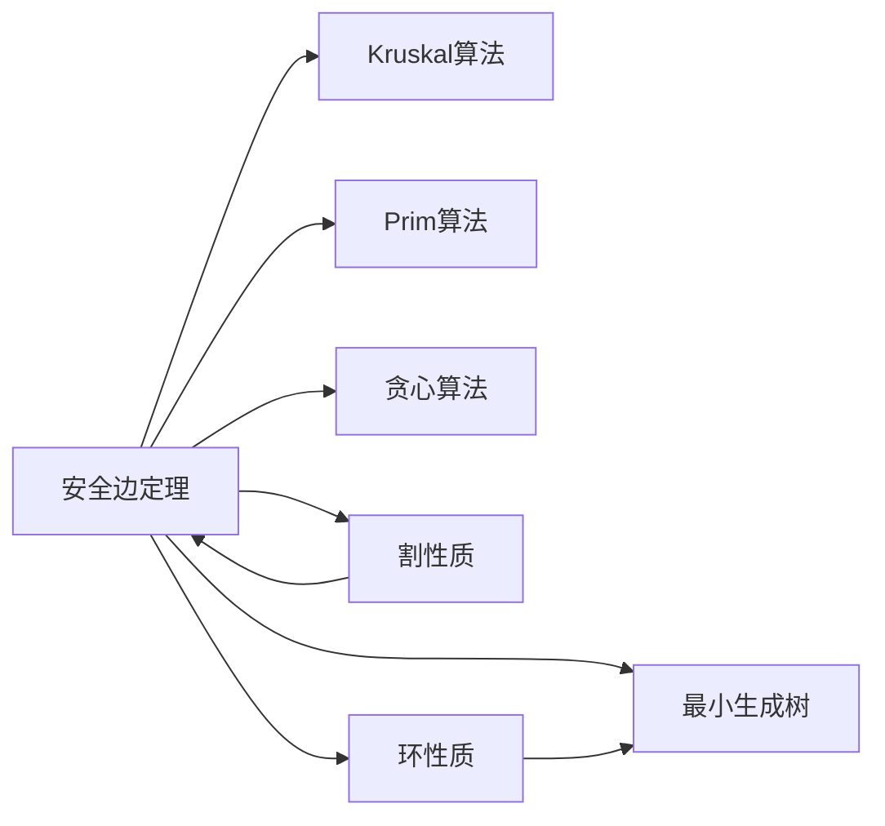

# 安全边定理

> [!abstract] 尊重边集A的割的轻量边一定是安全边，这是所有MST贪心算法的理论基石

## 定义

> [!def] 形式化定义（定理21.1）
> 设 $G = (V, E)$ 是一个连通无向图，$A \subseteq E$ 是包含在某棵 MST 中的边集，$(S, V - S)$ 是 $G$ 中**尊重** $A$ 的任意割，$(u, v)$ 是穿过割 $(S, V - S)$ 的一条**轻量边**。则边 $(u, v)$ 对 $A$ 是**安全的**。
>
> **相关定义：**
> - **安全边**：若 $A \cup \{(u,v)\}$ 也包含在某棵MST中，则 $(u,v)$ 是 $A$ 的安全边
> - **尊重割**：若 $A$ 中没有边穿过割 $(S, V-S)$，则该割尊重 $A$
> - **轻量边**：穿过割的边中权值最小的边

## 核心性质

| 性质 | 描述 |
|:-----|:-----|
| 核心结论 | 轻量边一定是安全边（在尊重 $A$ 的割中） |
| 逆命题 | 安全边不一定是轻量边（习题21.1-2给出反例） |
| 贪心选择性质 | 安全边定理是MST问题贪心选择性质的严格表述 |
| 环性质（推论21.2） | 环上唯一最大权边不属于任何包含 $A$ 的MST |
| 割性质（推论21.3） | 割的唯一最小权边属于某棵MST（令 $A = \emptyset$ 的特例） |

## 关系网络

## 章节扩展

### 第21章：最小生成树

安全边定理是CLRS第21.1节的核心理论结果，为GENERIC-MST算法及Kruskal、Prim算法提供了严格的数学基础。

**定理21.1证明概要：**
1. 设 $T$ 是一棵包含 $A$ 的MST
2. $T$ 中存在穿过割 $(S, V-S)$ 的边 $(x,y)$（因为 $T$ 连通所有顶点）
3. 将 $(u,v)$ 加入 $T$ 形成环 $C$，$(u,v)$ 和 $(x,y)$ 都穿过割
4. 构造 $T' = T - \{(x,y)\} \cup \{(u,v)\}$，$T'$ 连通且有 $\|V\|-1$ 条边，是生成树
5. $w(u,v) \leq w(x,y)$（轻量边），故 $w(T') \leq w(T)$，$T'$ 也是MST
6. $(x,y) \notin A$（割尊重 $A$），故 $A \subseteq T'$，$(u,v)$ 对 $A$ 安全

**推论21.3（割性质）：**
令 $A = \emptyset$，割显然尊重空集，由定理21.1直接得：割的唯一最小权边属于某棵MST。

**推论21.2（环性质）：**
若 $(u,v)$ 是环 $C$ 中唯一最大权边，则 $(u,v)$ 不属于任何包含 $A$ 的MST。用反证法：若MST $T$ 包含 $(u,v)$，则环 $C$ 上存在 $w(x,y) < w(u,v)$，替换后 $w(T') < w(T)$，矛盾。

**与GENERIC-MST的关系：**
GENERIC-MST通过循环不变式"$A$ 是某棵MST的子集"保证正确性。每次加入安全边后该性质保持，终止时 $A$ 形成生成树且是MST子集，故 $A$ 本身就是MST。

## 补充

> [!info] 补充说明
> - 安全边定理揭示了MST问题的贪心选择性质的数学本质：不需要考虑所有可能的边，只需选择"安全"的边
> - 轻量边和安全边是不同层次的概念：轻量边相对于某个割，安全边相对于某个边集。轻量边一定是安全边，但反过来不成立
> - 当所有边权不同时，每个割有唯一的轻量边，MST也唯一；但MST唯一不要求所有割都有唯一轻量边

## 参见

- [[算法导论/concepts/最小生成树]]
- [[算法导论/concepts/Kruskal算法]]
- [[算法导论/concepts/Prim算法]]
- [[算法导论/concepts/贪心算法]]
