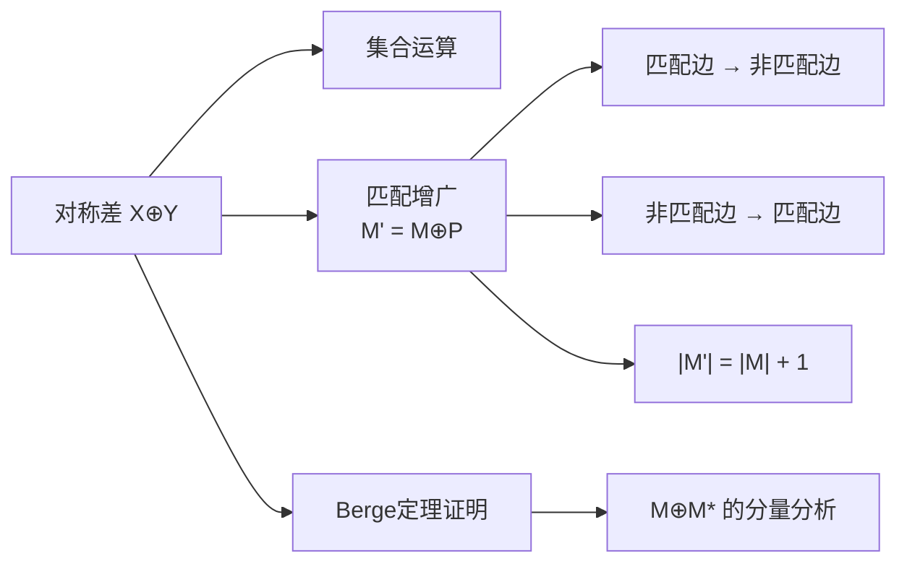

# 对称差

> [!abstract] 对称差是两个集合的运算，返回属于其中一个集合但不同时属于两个集合的元素，在匹配算法中用于沿增广路径翻转匹配状态。

## 定义

> [!def] 形式化定义
> 两个集合 $X$ 和 $Y$ 的**对称差**定义为：
> $$X \oplus Y = (X \setminus Y) \cup (Y \setminus X)$$
> 即属于 $X$ 或 $Y$ 但**不同时**属于两者的元素集合。
>
> **基本性质**：
> - 交换律：$X \oplus Y = Y \oplus X$
> - 结合律：$(X \oplus Y) \oplus Z = X \oplus (Y \oplus Z)$
> - $X \oplus X = \emptyset$（自反性）
> - $X \oplus \emptyset = X$（空集是单位元）

## 核心性质

| 性质 | 描述 |
|:-----|:-----|
| 交换律 | $X \oplus Y = Y \oplus X$ |
| 结合律 | $(X \oplus Y) \oplus Z = X \oplus (Y \oplus Z)$ |
| 自反性 | $X \oplus X = \emptyset$ |
| 在增广路径中的应用 | $M' = M \oplus P$ 使匹配大小增加1 |
| 翻转效果 | 将增广路径中匹配边变为非匹配边，非匹配边变为匹配边 |

## 关系网络

## 章节扩展

### 第25章：二部图匹配

对称差在25.1节中作为匹配增广的核心操作引入。

**在增广路径中的应用**：

给定匹配 $M$ 和 $M$-增广路径 $P$，做对称差 $M' = M \oplus P$：
- $P$ 中原属于 $M$ 的边被**移出** $M'$
- $P$ 中原不属于 $M$ 的边被**加入** $M'$
- 不在 $P$ 上的边保持不变

由于 $P$ 是增广路径（包含奇数条边，非匹配边比匹配边多1条），翻转后：
- $|M'| = |M| + 1$（匹配增大1）
- $M'$ 仍是合法匹配（$P$ 是简单路径，翻转后每个顶点至多关联一条 $M'$ 中的边）

**在Berge定理证明中的应用**：

考虑当前匹配 $M$ 和最大匹配 $M^*$，令 $E' = M \oplus M^*$。引理25.3指出 $G' = (V, E')$ 中每个顶点度数至多为2，因此 $G'$ 的连通分量要么是孤立顶点，要么是偶长度环，要么是简单路径。偶长度环中 $M$ 和 $M^*$ 的边数相等，多出的 $|M^*| - |M|$ 条边全部出现在以 $M^*$ 的边为端点的简单路径中——这些正是 $M$-增广路径。

## 补充

> [!info] 补充说明
> 对称差在数学和计算机科学中有广泛应用。在匹配理论中，对称差是增广操作的形式化描述。在最大流中，沿增广路径增广流量本质上也是一种对称差操作——将残差网络中的路径边"翻转"到流中。在集合论中，对称差与异或（XOR）运算有着深刻的对应关系：特征函数的对称差对应于布尔值的异或。

## 参见

- [[算法导论/concepts/增广路径]] — 增广路径的定义与性质
- [[算法导论/concepts/二分匹配]] — 二分匹配的定义与求解方法
- [[算法导论/concepts/Berge定理]] — 对称差在Berge定理证明中的角色
