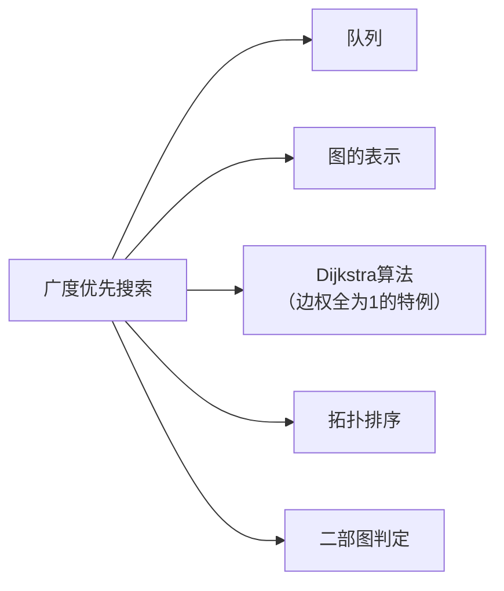

# 广度优先搜索

> [!abstract] BFS 从源顶点出发，使用队列逐层向外扩展，在无权图中找到从源点到所有可达顶点的最短路径（以边数计），时间复杂度 $O(V + E)$。

## 定义

> [!def] 广度优先搜索（BFS）
> 给定图 $G = (V, E)$ 和源顶点 $s$，BFS 系统地探索 $G$ 的边以发现从 $s$ 可达的所有顶点。算法使用**队列**（FIFO）管理待探索顶点，通过**颜色标记**（WHITE/GRAY/BLACK）、**距离** $d$ 和**前驱** $\pi$ 三个属性记录搜索状态。

> [!def] BFS 顶点属性
> - $v.\text{color}$：WHITE（未发现）、GRAY（已发现，在队列中）、BLACK（已完成探索）
> - $v.d$：从源点 $s$ 到 $v$ 的最短路径距离（边数）
> - $v.\pi$：BFS 树中 $v$ 的前驱（父节点）

## 核心性质

| 性质 | 描述 |
|:-----|:-----|
| 队列性质 | 队列中顶点按 $d$ 值非递减排列，队首与队尾 $d$ 值之差不超过 1 |
| 最短路径 | 对每个从 $s$ 可达的顶点 $v$，$v.d = \delta(s, v)$ |
| 前驱子图 | $G_\pi$ 是一棵以 $s$ 为根的 BFS 树，包含所有可达顶点 |
| 时间复杂度 | 邻接表 $O(V + E)$，邻接矩阵 $O(V^2)$ |
| $d$ 值不变性 | $v.d$ 在 $v$ 入队时设置一次，此后不再改变 |

## 关系网络

## 章节扩展

### 第20章：基本图算法

**算法流程：** 初始化所有顶点为 WHITE，源点 $s$ 设为 GRAY、$d[s]=0$、入队。循环取出队首顶点 $u$，标记为 BLACK，遍历 $\text{Adj}[u]$ 中每个 WHITE 邻居 $v$，设置 $v.d = u.d + 1$、$v.\pi = u$，将 $v$ 入队。

**引理 22.3（队列性质）：** 队列中顶点按 $d$ 值非递减排列。证明通过对主循环迭代次数归纳——出队 $v_1$ 后新入队的 WHITE 邻居 $d$ 值为 $d[v_1]+1$，不小于队尾的 $d$ 值。

**定理 22.4（最短路径）：** BFS 执行后，对每个从 $s$ 可达的顶点 $v$，$v.d = \delta(s, v)$。证明对 $\delta(s, v)$ 归纳——取最短路径上前驱 $u$，由归纳假设 $u.d = \delta(s, u)$，当 $u$ 出队时松弛 $(u, v)$ 使 $v.d = \delta(s, v)$。

**推论 22.5（BFS 树）：** 前驱子图 $G_\pi$ 是一棵以 $s$ 为根的树，$G_\pi$ 中从 $s$ 到 $v$ 的唯一简单路径就是 $G$ 中的一条最短路径。证明利用 $d$ 值严格递减保证连通性，反证 $d$ 值求和矛盾保证无环性。

## 补充

> [!info] BFS 与 Dijkstra 的关系
> BFS 是 Dijkstra 算法在所有边权重相等（如全为 1）时的特例。此时 Dijkstra 的优先队列退化为 FIFO 队列，两者行为完全一致。

## 参见

- [[算法导论/concepts/图的表示]]
- [[算法导论/concepts/队列]]
- [[算法导论/concepts/深度优先搜索]]
