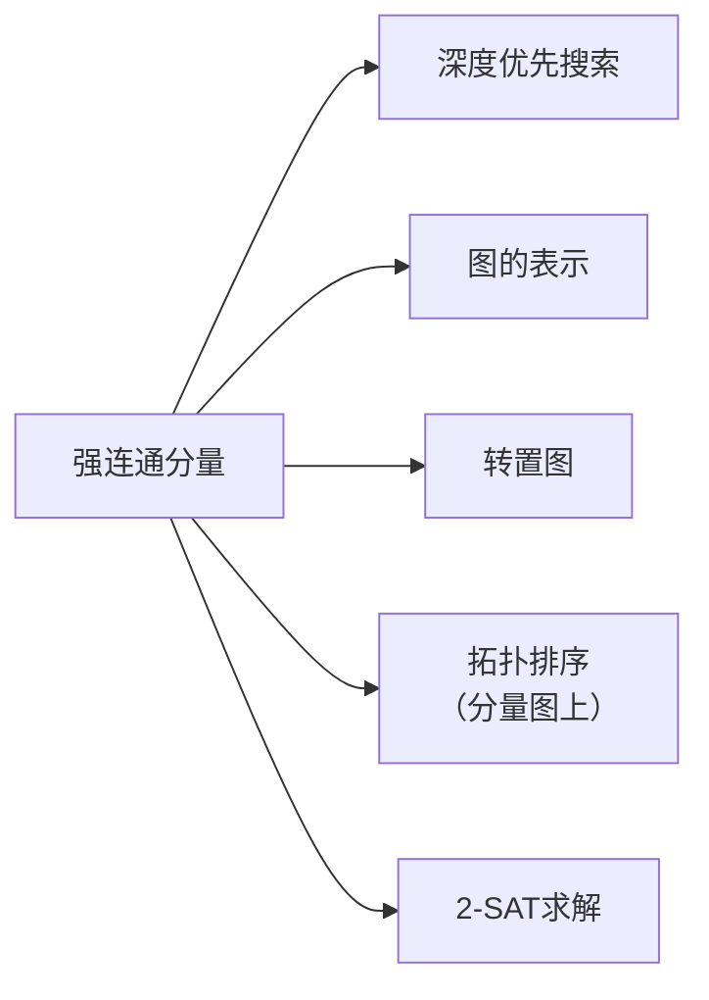

# 强连通分量

> [!abstract] 有向图中顶点间互相可达的最大子集。Kosaraju 算法通过两次 DFS（原图 + 转置图）在 $O(V + E)$ 时间内找出所有 SCC，核心是利用完成时间确定分量图的拓扑序。

## 定义

> [!def] 强连通（Strongly Connected）
> 在有向图 $G$ 中，两个顶点 $u$、$v$ **强连通**当且仅当 $u$ 可达 $v$ 且 $v$ 可达 $u$。强连通关系是等价关系（自反、对称、传递）。

> [!def] 强连通分量（SCC）
> 有向图 $G$ 的一个**强连通分量**是最大顶点集合 $C \subseteq V$，使得 $C$ 中任意两个顶点互相可达。SCC 是强连通等价关系的等价类。

> [!def] 转置图 $G^T$
> 将 $G$ 中所有边的方向反转得到的图。$G^T$ 与 $G$ 具有完全相同的 SCC。

## 核心性质

| 性质 | 描述 |
|:-----|:-----|
| 分量图是 DAG | 将每个 SCC 缩为一个超顶点，得到的分量图是有向无环图 |
| Kosaraju 三步 | ① DFS(G) 计算完成时间 ② 构造 $G^T$ ③ 按完成时间递减 DFS($G^T$) |
| DFS 树 = SCC | 第二次 DFS 中每棵 DFS 树恰好包含一个 SCC 的所有顶点 |
| 时间复杂度 | $O(V + E)$ |

## 关系网络

## 章节扩展

### 第20章：基本图算法

**Kosaraju 算法流程：**
1. 对原图 $G$ 调用 DFS，记录每个顶点的完成时间 $f[v]$
2. 计算转置图 $G^T$（所有边方向反转，$O(V + E)$）
3. 按完成时间递减的顺序对 $G^T$ 调用 DFS
4. 第二次 DFS 中每棵 DFS 树就是一个 SCC

**核心直觉：** 第一次 DFS 中完成时间最晚的顶点位于分量图中的"源 SCC"（无入边的 SCC）。转置后源 SCC 变为"汇 SCC"，按完成时间递减处理就先处理汇 SCC，从中探索恰好收集一个完整 SCC。

**正确性证明链（引理 20.10 ~ 20.14）：**
- 引理 20.10：若 SCC $C$ 有边指向 $C'$，则 $f(C) > f(C')$
- 引理 20.12：$G^T$ 的 DFS 树恰好包含一个 SCC 的所有顶点
- 引理 20.13：DFS 树的根对应分量图中的源 SCC
- 引理 20.14：每个源 SCC 都会成为 DFS 树的根
- 定理 20.9：综合以上，算法正确计算所有 SCC

## 补充

> [!info] Kosaraju vs Tarjan SCC
> Kosaraju（1978）需要两次 DFS 和转置图，实现简单；Tarjan（1972）只需一次 DFS + 栈，但需维护 lowlink 值，实现较复杂。竞赛编程中 Kosaraju 更受欢迎。

## 参见

- [[算法导论/concepts/深度优先搜索]]
- [[算法导论/concepts/图的表示]]
- [[算法导论/concepts/拓扑排序]]
