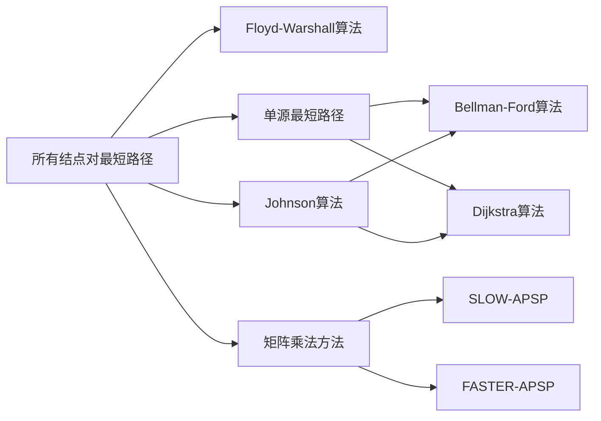

# 所有结点对最短路径

> [!abstract] 计算带权有向图中每对顶点之间的最短路径权重，可用动态规划、矩阵乘法或组合单源算法求解

## 定义

> [!def] 形式化定义
> **输入：** 带权有向图 $G = (V, E)$，权重函数 $w: E \to \mathbb{R}$，以权重矩阵 $W = (w_{ij})_{n \times n}$ 表示
> - 若 $(i, j) \in E$，则 $w_{ij}$ 为边 $(i, j)$ 的权重
> - 若 $(i, j) \notin E$ 且 $i \ne j$，则 $w_{ij} = \infty$
> - 对所有 $i$，$w_{ii} = 0$
>
> **输出：** 一个 $n \times n$ 矩阵 $D = (d_{ij})$，其中 $d_{ij}$ 为从顶点 $i$ 到顶点 $j$ 的最短路径权重
> - 若从 $i$ 到 $j$ 不存在路径，则 $d_{ij} = \infty$
> - 若存在从 $i$ 可达的负权环，则 $d_{ij} = -\infty$

## 核心性质

| 性质 | 描述 |
|:-----|:-----|
| 朴素方法 | 对每个顶点运行单源算法：Bellman-Ford $O(V^2 E)$，Dijkstra $O(V(V+E)\lg V)$ |
| Floyd-Warshall | $O(V^3)$，动态规划，适合稠密图 |
| Johnson算法 | $O(V^2 \lg V + VE)$，组合Bellman-Ford + Dijkstra，适合稀疏图 |
| 矩阵乘法（慢速） | $O(V^4)$，逐步扩展路径边数 |
| 矩阵乘法（快速） | $O(V^3 \lg V)$，重复平方技术 |
| Strassen优化 | $O(V^{\lg 7} \lg V) \approx O(V^{2.807} \lg V)$，理论意义 |

## 关系网络

## 章节扩展

### 第23章：所有结点对的最短路径

CLRS第23章介绍了三种解决APSP问题的方法：

**1. 矩阵乘法方法（23.1节）：**
- 定义 $L^{(m)}_{ij}$ 为从 $i$ 到 $j$ 的最多 $m$ 条边的最短路径权重
- 递推：$L^{(m)}_{ij} = \min_k \{L^{(m-1)}_{ik} + w_{kj}\}$，等价于 $(\min, +)$ 半环上的矩阵乘法
- 慢速版本：$O(V^4)$；快速版本（重复平方）：$O(V^3 \lg V)$
- 理论价值：揭示APSP与矩阵乘法的代数联系，可用Strassen算法突破立方复杂度

**2. Floyd-Warshall算法（23.2节）：**
- 定义 $D^{(k)}_{ij}$ 为中间顶点编号不超过 $k$ 的最短路径权重
- 递推：$D^{(k)}_{ij} = \min(D^{(k-1)}_{ij}, D^{(k-1)}_{ik} + D^{(k-1)}_{kj})$
- 时间 $\Theta(V^3)$，空间 $\Theta(V^2)$（就地更新），代码极其简洁

**3. Johnson算法（23.3节）：**
- 用Bellman-Ford计算势函数 $h$，重赋权 $w'(u,v) = w(u,v) + h(u) - h(v)$ 使所有边权非负
- 对重赋权后的图运行 $V$ 次 Dijkstra
- 总时间 $O(V^2 \lg V + VE)$，稀疏图上优于Floyd-Warshall

## 补充

> [!info] 补充说明
> - $(\min, +)$ 半环（热带半环）上的矩阵乘法不仅用于最短路径，还广泛应用于调度问题、自动机理论、图像处理等领域
> - 重复平方技术是一种通用加速方法，与快速幂思想一致：利用结合律将线性次数迭代压缩为对数次数
> - APSP问题的下界为 $\Omega(V^2)$（需要输出 $V^2$ 个值），但目前未知的下界是否更高

## 参见

- [[算法导论/concepts/Floyd-Warshall算法]]
- [[算法导论/concepts/Johnson算法]]
- [[算法导论/concepts/Bellman-Ford算法]]
- [[算法导论/concepts/Dijkstra算法]]
