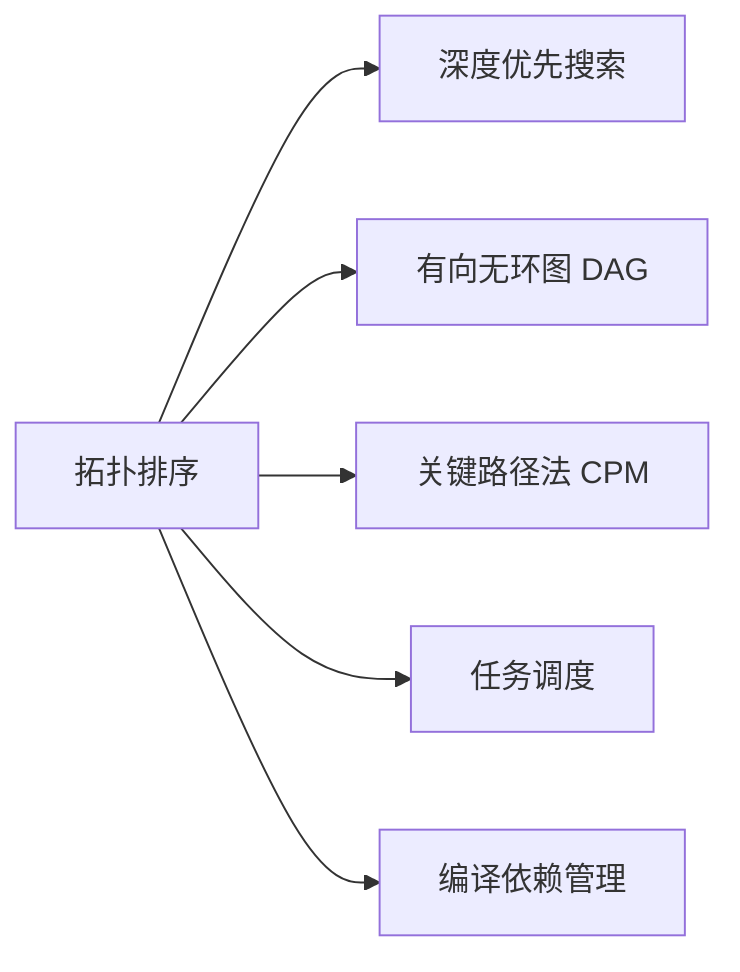

# 拓扑排序

> [!abstract] 对有向无环图（DAG）的顶点排成线性序列，使得对每条边 $(u, v)$，$u$ 排在 $v$ 之前。基于 DFS 的算法按完成时间递减排列顶点，时间 $O(V + E)$。

## 定义

> [!def] 有向无环图（DAG）
> 不包含任何有向回路的有向图。等价表述：对任意顶点 $v$，不存在从 $v$ 出发经过若干有向边回到 $v$ 的路径。

> [!def] 拓扑排序（Topological Sort）
> 对有向图 $G = (V, E)$ 的一个**拓扑排序**是 $V$ 中所有顶点的线性排列，使得对每条边 $(u, v) \in E$，$u$ 在排列中出现在 $v$ 之前。形式化地，双射 $f: V \to \{1, \ldots, |V|\}$ 满足对每条边 $(u, v)$ 有 $f(u) < f(v)$。

## 核心性质

| 性质 | 描述 |
|:-----|:-----|
| 存在性 | 有向图存在拓扑排序当且仅当它是 DAG |
| DFS 方法 | 按完成时间 $f$ 递减排列顶点 |
| Kahn 方法 | 不断删除入度为 0 的顶点，天然支持回路检测 |
| 时间复杂度 | $O(V + E)$ |
| 唯一性 | DAG 的拓扑排序不唯一（无依赖关系的顶点可任意排列） |

## 关系网络

## 章节扩展

### 第20章：基本图算法

**DFS 拓扑排序算法：** 对图调用 DFS，当顶点完成探索（变为 BLACK）时将其插入链表头部。DFS 全部完成后，链表中的顶点顺序即为拓扑序（完成时间递减）。

**核心直觉：** 一个顶点只有当其所有可达后代都完成探索后才会被"完成"，因此完成时间蕴含了依赖关系——完成时间晚的顶点"依赖"完成时间早的顶点。

**定理 20.6（正确性）：** 如果 $G$ 是 DAG，则算法产生拓扑排序。证明按边分类验证：树边（$f[v] < f[u]$）、前向边（$f[v] < f[u]$）、横边（$f[v] < d[u] < f[u]$）均满足 $f[u] > f[v]$；后向边由引理 20.7 保证不存在。

**引理 20.7（DAG 与后向边）：** 有向图是 DAG 当且仅当 DFS 不产生后向边。必要性：后向边 $(u, v)$ 加上 DFS 树路径 $v \leadsto u$ 形成有向回路。充分性：有向回路中第一个被发现的顶点 $u$ 的前驱 $w$ 检查 $(w, u)$ 时 $u$ 为 GRAY（尚未完成），$(w, u)$ 是后向边。

**Kahn 算法：** 计算所有顶点入度，将入度为 0 的顶点入队。循环出队并删除其出边，若最终输出顶点数 $< |V|$ 则存在回路。优势：天然支持回路检测、易于并行化。

## 补充

> [!info] 拓扑排序 + 动态规划
> 拓扑排序确定处理顺序后，可以在线性时间内解决 DAG 上的路径计数、最长路径等问题——按拓扑序递推，保证处理每个顶点时所有前驱已被处理。

## 参见

- [[算法导论/concepts/深度优先搜索]]
- [[算法导论/concepts/强连通分量]]
