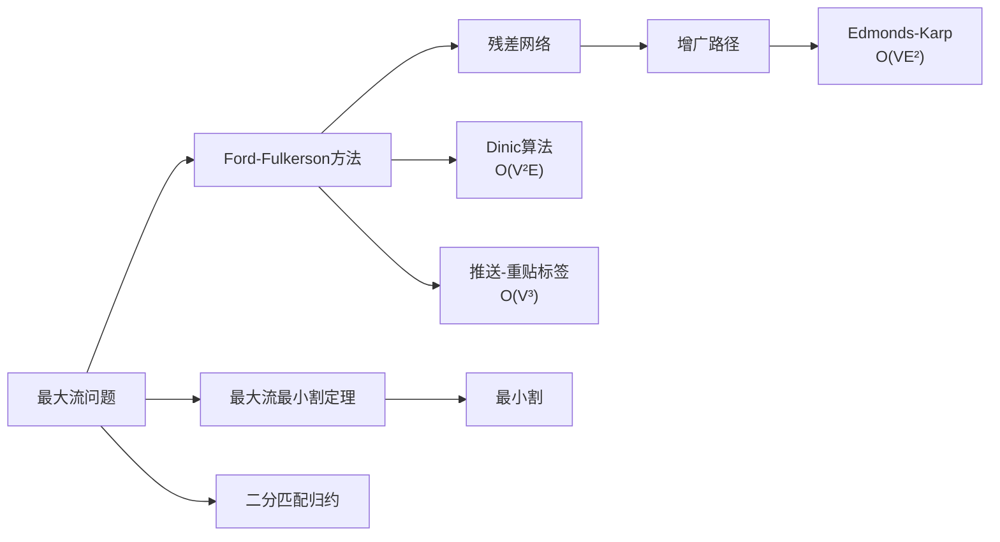

# 最大流

> [!abstract] 最大流问题是在流网络中找到从源到汇的最大流量值，Ford-Fulkerson方法通过反复寻找增广路径来求解，Edmonds-Karp算法保证 $O(VE^2)$ 的多项式时间。

## 定义

> [!def] 形式化定义
> 给定流网络 $G = (V, E, s, t, c)$，**最大流问题**的目标是找到一个流 $f^*$，使得 $|f^*|$ 在所有合法流中最大。
>
> **Ford-Fulkerson方法**是一个算法框架：
> 1. 初始化流 $f$ 为零流
> 2. 在残差网络 $G_f$ 中寻找增广路径 $p$
> 3. 沿 $p$ 增广流量，增大量为 $c_f(p) = \min\{c_f(u,v) : (u,v) \text{ 在 } p \text{ 上}\}$
> 4. 重复步骤2-3，直到 $G_f$ 中不存在增广路径
> 5. 返回 $f$ 即为最大流
>
> **Edmonds-Karp算法**是Ford-Fulkerson方法的具体实现，使用BFS选择最短增广路径，时间复杂度为 $O(VE^2)$。

## 核心性质

| 性质 | 描述 |
|:-----|:-----|
| 最大流最小割定理 | 最大流的值等于最小割的容量（推论24.3） |
| 增广路径判据 | 流 $f$ 是最大流当且仅当 $G_f$ 中不含增广路径（引理24.2） |
| 整数流性质 | 所有容量为整数时，Ford-Fulkerson方法产生整数流且一定终止 |
| Edmonds-Karp复杂度 | 使用BFS选最短增广路径，保证 $O(VE^2)$ |
| 路径长度单调递增 | Edmonds-Karp中每次增广路径长度单调不减（引理24.4） |

## 关系网络

## 章节扩展

### 第24章：最大流

最大流问题是第24章的核心。24.2节介绍了Ford-Fulkerson方法框架和Edmonds-Karp算法。

**Ford-Fulkerson方法**本身是一个框架而非具体算法——第3行"寻找增广路径"的策略未指定。不同的选择策略产生不同的算法：
- DFS选择（朴素Ford-Fulkerson）：可能不终止，时间复杂度无多项式保证
- BFS选择（Edmonds-Karp）：$O(VE^2)$，保证多项式时间
- 最大容量增广路径：$O(E^2 \lg C)$，其中 $C$ 为最大容量

**Edmonds-Karp算法**的核心改进是使用BFS选择最短增广路径。引理24.4证明最短增广路径的边数单调递增，由此推导出每条边最多成为 $O(V)$ 次关键边，总增广次数为 $O(VE)$，每次BFS耗时 $O(E)$，总时间为 $O(VE^2)$。

### 第24章：最大二分匹配

24.3节展示了如何将最大二分匹配问题归约为最大流问题。通过构造特殊的单位容量流网络（源连接左部、右部连接汇、所有边容量为1），最大匹配的大小恰好等于最大流的值。在单位容量网络上，Edmonds-Karp的复杂度可改进到 $O(VE)$。

## 补充

> [!info] 补充说明
> 除Edmonds-Karp外，重要的最大流算法还包括：
> - **Dinic算法**（1970）：$O(V^2 E)$，通过分层网络和阻塞流实现
> - **推送-重贴标签算法**（Goldberg-Tarjan, 1986）：基本版本 $O(V^3)$，FIFO改进版 $O(V^2\sqrt{E})$
> - 最大流在图像分割、棒球淘汰判定、项目选择等实际问题中有广泛应用。

## 参见

- [[算法导论/concepts/流网络]] — 流网络的定义与基本性质
- [[算法导论/concepts/残差网络]] — 残差网络与增广操作
- [[算法导论/concepts/最小割]] — 最大流最小割定理
- [[算法导论/concepts/二分匹配]] — 二分匹配到最大流的归约
