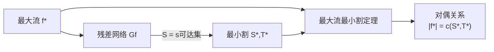

# 最小割

> [!abstract] 最小割是流网络中将源与汇分离且容量最小的顶点划分，最大流最小割定理表明最大流的值恰好等于最小割的容量。

## 定义

> [!def] 形式化定义
> 给定流网络 $G = (V, E)$，源 $s$，汇 $t$，一个 **s-t割** $(S, T)$ 是顶点集 $V$ 的一个划分，满足 $s \in S$，$t \in T$。
>
> **割的容量**定义为从 $S$ 到 $T$ 的所有边的容量之和：
> $$c(S, T) = \sum_{u \in S, v \in T} c(u, v)$$
>
> **割的净流**定义为从 $S$ 到 $T$ 的流量减去从 $T$ 到 $S$ 的流量：
> $$f(S, T) = \sum_{u \in S, v \in T} f(u, v) - \sum_{u \in T, v \in S} f(u, v)$$
>
> **最小割**是所有 s-t 割中容量最小的那个。
>
> **最大流最小割定理**（定理24.2 / 推论24.3）：设 $f^*$ 是最大流，$(S^*, T^*)$ 是最小割，则 $|f^*| = c(S^*, T^*)$。

## 核心性质

| 性质 | 描述 |
|:-----|:-----|
| 流值不超过割容量 | 对任意流 $f$ 和任意割 $(S,T)$，有 $\|f\| = f(S,T) \leq c(S,T)$ |
| 最大流最小割等价 | 最大流的值等于最小割的容量（推论24.3） |
| 三条件等价 | (1) $f$ 是最大流 $\Leftrightarrow$ (2) $G_f$ 无增广路径 $\Leftrightarrow$ (3) $\|f\| = c(S,T)$ |
| 对偶关系 | 最大流（最大化）与最小割（最小化）是线性规划对偶问题 |
| 构造性证明 | 从最大流的残差网络可直接构造出对应的最小割 |

## 关系网络

## 章节扩展

### 第24章：最大流

最大流最小割定理是24.2节的核心定理，也是网络流理论的基石。

**定理的证明**通过三个引理完成：
1. **引理24.2**：$f$ 是最大流 $\Leftrightarrow$ $G_f$ 中不含增广路径
   - ($\Rightarrow$) 反证：若存在增广路径，沿其增广可得更大流
   - ($\Leftarrow$) 构造割：令 $S$ 为 $G_f$ 中 $s$ 可达的顶点集，证明 $|f| = c(S,T)$
2. **引理24.3**：$|f| = c(S,T)$ $\Leftrightarrow$ $f$ 是最大流
3. **推论24.3**：最大流值 = 最小割容量

**最小割的实际意义**：最小割指出了网络的"瓶颈"——切断哪些边能以最小代价中断从源到汇的所有流量。在图像分割中，最小割直接给出前景与背景的最优分割边界。

## 补充

> [!info] 补充说明
> 最大流最小割定理是组合优化中"强对偶性"的经典例子。在线性规划框架下，最大流问题是原始问题（最大化），最小割问题是对偶问题（最小化），两者具有相同的最优值且同时达到最优。这一对偶关系也延伸到König-Egerváry定理（二部图中最大匹配 = 最小顶点覆盖），后者可以视为最大流最小割定理在二部图匹配上的特化。

## 参见

- [[算法导论/concepts/最大流]] — 最大流问题与Ford-Fulkerson方法
- [[算法导论/concepts/流网络]] — 流网络的定义与基本性质
- [[算法导论/concepts/König-Egerváry定理]] — 二部图中最大匹配与最小顶点覆盖的等价性
