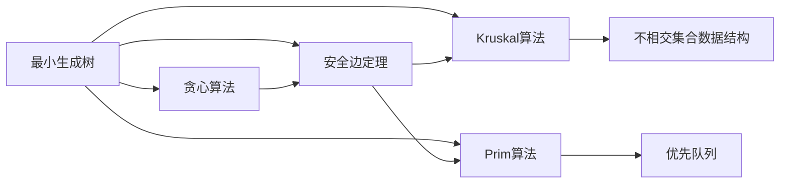

# 最小生成树

> [!abstract] 在连通无向图中找到一棵权值之和最小的生成树

## 定义

> [!def] 形式化定义
> 给定一个**连通无向图** $G = (V, E)$ 和一个权函数 $w: E \to \mathbb{R}$，$G$ 的一棵**生成树**（spanning tree）是 $G$ 的一个**连通无环**子图 $T = (V, E_T)$，其中 $E_T \subseteq E$。生成树的**权值**定义为：
>
> $$w(T) = \sum_{(u,v) \in E_T} w(u,v)$$
>
> 如果 $T$ 是 $G$ 的所有生成树中权值最小的一棵，即对所有生成树 $T'$ 都有 $w(T) \leq w(T')$，则称 $T$ 为 $G$ 的一棵**最小生成树**（Minimum Spanning Tree, MST）。

## 核心性质

| 性质 | 描述 |
|:-----|:-----|
| 边数 | 一棵生成树恰好有 $\|V\| - 1$ 条边 |
| 连通性 | 去掉生成树中任意一条边，图将不再连通 |
| 唯一性 | 当所有边权互不相同时，MST唯一；存在等权边时MST可能不唯一 |
| 贪心选择性质 | 安全边定理保证：选择轻量边（局部最优）不会排除全局最优解 |
| 最优子结构 | 若 $(u,v)$ 是安全边，则 $A \cup \{(u,v)\}$ 的最优扩展就是原问题的最优扩展 |
| MST vs 最短路径 | MST保证所有边的权值之和最小，而非任意两点间的路径最短 |

## 关系网络

## 章节扩展

### 第21章：最小生成树

最小生成树问题是图论中的经典优化问题。CLRS第21章建立了完整的理论框架：

1. **割与轻量边**：割 $(S, V-S)$ 将顶点集划分为两个非空子集，穿过割的边中权值最小的称为**轻量边**。割**尊重**边集 $A$ 意味着 $A$ 中没有边穿过该割。

2. **安全边**：若 $A \cup \{(u,v)\}$ 包含在某棵MST中，则 $(u,v)$ 是 $A$ 的**安全边**。[[算法导论/concepts/安全边定理]]（定理21.1）保证了：尊重 $A$ 的割的轻量边一定是安全边。

3. **通用MST方法**（GENERIC-MST）：不断找到安全边并加入集合 $A$，直到 $A$ 形成生成树。其正确性由循环不变式保证：$A$ 始终是某棵MST的子集。

4. **两种具体算法**：
   - [[算法导论/concepts/Kruskal算法]]：按边权排序，用并查集判断是否形成环，时间 $O(E \lg V)$
   - [[算法导论/concepts/Prim算法]]：从一个顶点扩展，用优先队列选取最小边，时间 $O(E + V \lg V)$（斐波那契堆）

5. **重要推论**：
   - **环性质**（推论21.2）：环上唯一最大权边不属于任何MST
   - **割性质**（推论21.3）：割的唯一最小权边属于某棵MST

## 补充

> [!info] 补充说明
> - MST问题只对**无向图**有定义。有向图中的对应问题是"最小生成树形图"（Minimum Spanning Arborescence），由Edmonds算法解决
> - MST的实际应用包括：网络设计（通信、电力、管道）、聚类分析（删除最大 $k-1$ 条边得到 $k$ 个聚类）、TSP的2倍近似算法、图像分割等
> - 三种经典MST算法的发现时间远早于现代计算机科学：Borůvka算法（1926）、Jarník算法（1930）、Kruskal算法（1956）、Prim算法（1957）

## 参见

- [[算法导论/concepts/安全边定理]]
- [[算法导论/concepts/Kruskal算法]]
- [[算法导论/concepts/Prim算法]]
- [[算法导论/concepts/贪心算法]]
