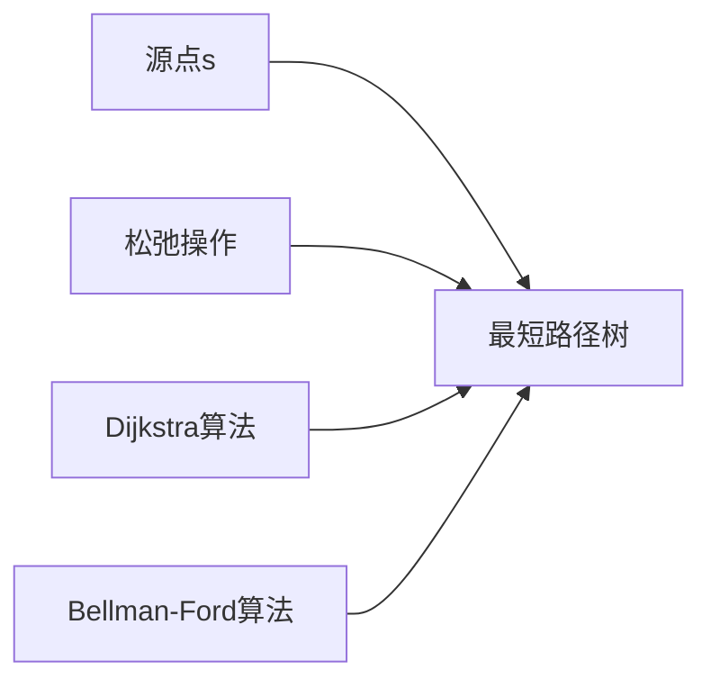

# 最短路径树

> [!abstract] 从源点到所有可达顶点的最短路径构成的前驱子图是一棵树

## 定义

> [!def] 最短路径树
给定带权有向图 G=(V,E) 和源点 s，最短路径树 G_π = (V_π, E_π) 是前驱子图中从 s 可达的顶点和边构成的树，其中 V_π = {v ∈ V : s 到 v 存在最短路径}，E_π = {(π[v], v) : v ∈ V_π - {s}}。

## 核心性质

| 性质 | 描述 |
|:-----|:-----|
| 树结构 | 前驱子图 G_π 是一棵树（引理22.5） |
| 唯一性 | 当所有边权非负时，最短路径树唯一 |
| 路径保持 | G_π 中 s 到 v 的唯一简单路径就是 G 中 s 到 v 的最短路径 |
| 子路径性质 | 最短路径的子路径也是最短路径（三角不等式推论） |

## 关系网络

## 章节扩展

### 第22章：单源最短路径

最短路径树是单源最短路径问题的核心输出结构。

**引理22.5（前驱子图是最短路径树）**：当 BELLMAN-FORD 或 DIJKSTRA 终止时，对所有 v ∈ V_π，前驱子图 G_π 是一棵根为 s 的最短路径树。

证明要点：
1. **连通性**：追踪前驱链 v → π[v] → π[π[v]] → ... 必到达 s（无负权环保证链有限）
2. **无环性**：反证——若存在环 c，求和得 w(c) = 0，但松弛条件在 w = 0 时不成立，矛盾
3. **最短路径性**：沿前驱路径逐步展开 δ(s,u_i) = δ(s,u_{i-1}) + w(u_{i-1}, u_i)，求和得 w(p) = δ(s,v)

## 补充

> [!info] 与BFS树的关系
BFS树是无权图中的最短路径树的特例。当所有边权为1时，DIJKSTRA 退化为 BFS，最短路径树退化为 BFS 树。

## 参见

- [[算法导论/concepts/松弛操作]]
- [[算法导论/concepts/Dijkstra算法]]
- [[算法导论/concepts/Bellman-Ford算法]]
