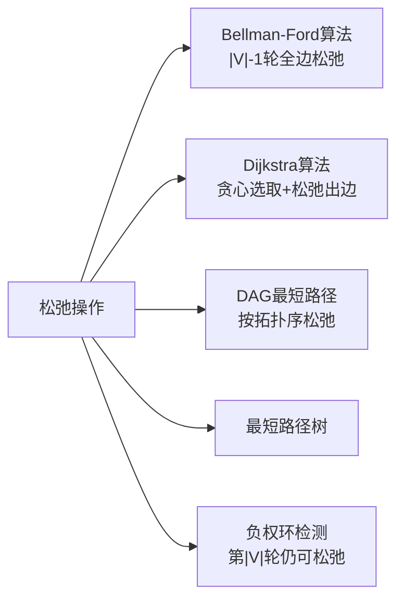

# 松弛操作

> [!abstract] 松弛操作是所有单源最短路径算法的核心基础操作：如果从源点经 $u$ 到 $v$ 的路径比当前已知路径更短，则更新 $v$ 的估计值 $d[v]$ 和前驱 $\pi[v]$。

## 定义

> [!def] 松弛操作 RELAX(u, v, w)
> $$\text{RELAX}(u, v, w): \quad \text{if } d[v] > d[u] + w(u, v) \text{ then } d[v] \leftarrow d[u] + w(u, v), \quad \pi[v] \leftarrow u$$
>
> 松弛操作测试是否可以通过顶点 $u$ 改进到达 $v$ 的最短路径估计。如果 $d[u] + w(u, v) < d[v]$，则更新 $d[v]$ 和 $\pi[v]$。

## 核心性质

| 性质 | 描述 |
|:-----|:-----|
| 三角不等式 | $\delta(s, v) \le \delta(s, u) + w(u, v)$，对所有边成立 |
| 上界性质 | 初始化后 $d[v] \ge \delta(s, v)$ 始终成立，松弛不会"越过"最优值 |
| 收敛性质 | 若 $s \leadsto u \to v$ 是最短路径且 $d[u] = \delta(s, u)$，松弛 $(u, v)$ 后 $d[v] = \delta(s, v)$ 且永久锁定 |
| 路径松弛性质 | 若最短路径 $p = \langle v_0, \ldots, v_k \rangle$ 上的边按序松弛，则 $d[v_k] = \delta(s, v_k)$ |
| 前驱子图性质 | 当所有 $d[v] = \delta(s, v)$ 时，前驱子图 $G_\pi$ 是一棵最短路径树 |

## 关系网络

## 章节扩展

### 第22章：单源最短路径

松弛操作是 Bellman-Ford、Dijkstra、DAG 最短路径三种算法的共同基础。五个关键引理构成严密的逻辑链：

1. **三角不等式（引理 22.1）：** $\delta(s, v) \le \delta(s, u) + w(u, v)$。反证法——若不成立，拼接路径 $s \leadsto u$ 和边 $(u, v)$ 得到更短路径，与 $\delta(s, v)$ 的最小性矛盾。

2. **上界性质（引理 22.2）：** $d[v] \ge \delta(s, v)$ 在任意松弛序列下保持不变。对松弛次数归纳——更新后 $d[v] = d[u] + w(u, v) \ge \delta(s, u) + w(u, v) \ge \delta(s, v)$（最后一步用三角不等式）。前提：无负权环。

3. **收敛性质（引理 22.3）：** 若 $s \leadsto u \to v$ 是最短路径且 $d[u] = \delta(s, u)$，松弛 $(u, v)$ 后 $d[v]$ 锁定为 $\delta(s, v)$。因为 $d[v] > \delta(s, v)$（上界性质）且 $d[u] + w(u, v) = \delta(s, v)$，松弛条件必然触发。

4. **路径松弛性质（引理 22.4）：** 对最短路径长度归纳——前缀是最短路径（子路径性质），由归纳假设前缀端点已收敛，再由收敛性质传递到终点。

5. **前驱子图性质（引理 22.5）：** 当所有 $d[v] = \delta(s, v)$ 时，$G_\pi$ 是以 $s$ 为根的最短路径树。证明无环性（反证，环上 $d$ 值求和矛盾）、连通性（沿 $\pi$ 链回溯必达 $s$）、最短路径性（路径权值恰好为 $\delta(s, v)$）。

### 第23章：所有结点对的最短路径

Johnson 算法中，重赋权后的边权 $w'(u, v) = w(u, v) + h(u) - h(v) \ge 0$，使得 Dijkstra 的松弛操作可以在重赋权图上正确执行。

## 补充

> [!info] 松弛操作的贪心本质
> 松弛本质上是一种贪心策略：每次尝试用经过当前边的路径改进目标顶点的估计值。上界性质保证不会"过头"，收敛性质保证最终会"到位"。

## 参见

- [[算法导论/concepts/最