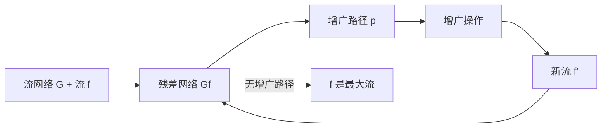

# 残差网络

> [!abstract] 残差网络记录了当前流还能在哪些边上增加或减少流量，是Ford-Fulkerson方法中寻找增广路径的基础结构。

## 定义

> [!def] 形式化定义
> 给定流网络 $G = (V, E)$，容量函数 $c$，以及一个流 $f$，**残差网络** $G_f = (V, E_f)$ 定义如下：
>
> - **残差容量**：对于每条边 $(u,v) \in E$，残差容量 $c_f(u,v) = c(u,v) - f(u,v)$，表示该边还能增加多少流量
> - **反向残差容量**：对于每条有流量的边 $(u,v)$，反向边 $(v,u)$ 的残差容量 $c_f(v,u) = f(u,v)$，表示该边可以"撤销"多少流量
> - **残差边集合**：$E_f = \{(u,v) \in V \times V : c_f(u,v) > 0\}$
>
> **增广操作**：沿增广路径 $p$ 增广流量 $f$，得到新流 $f'$：
> - 对于 $p$ 上的每条正向边 $(u,v)$：$f'(u,v) = f(u,v) + c_f(p)$
> - 对于 $p$ 上的每条反向边 $(u,v)$：$f'(u,v) = f(u,v) - c_f(p)$
> - 不在 $p$ 上的边：$f'(u,v) = f(u,v)$
>
> 增广后流的值恰好增加 $c_f(p)$。

## 核心性质

| 性质 | 描述 |
|:-----|:-----|
| 正向边 | 表示还能增加流量，容量为 $c(u,v) - f(u,v)$ |
| 反向边 | 表示可以撤销已分配的流量，容量为 $f(u,v)$ |
| 增广效果 | 沿增广路径增广后，流值恰好增加 $c_f(p)$ |
| 合法性保持 | 增广后的 $f'$ 仍满足容量约束和流守恒 |
| 最大流判据 | $G_f$ 中不存在增广路径当且仅当 $f$ 是最大流 |

## 关系网络

## 章节扩展

### 第24章：最大流

残差网络在24.2节中定义，是Ford-Fulkerson方法的核心数据结构。

残差网络的关键在于**反向边**的存在——它允许算法"纠正"之前不够优的流量分配。直观地说，残差网络就像一张"还能怎么调整流量"的地图。正向边表示还能增加流量，反向边表示可以减少（撤销）之前分配的流量。

当残差网络中不再存在从源 $s$ 到汇 $t$ 的路径时，由引理24.2可知当前流即为最大流。此时，令 $S$ 为 $G_f$ 中从 $s$ 可达的所有顶点集合，$T = V - S$，则割 $(S, T)$ 满足 $|f| = c(S, T)$，这正是最大流最小割定理的构造性证明。

## 补充

> [!info] 补充说明
> 残差网络的概念不仅用于最大流算法，也是最小费用流（Minimum Cost Flow）等网络流变体问题的基础。在最小费用流中，残差网络上的反向边费用为正向边费用的相反数，这使得算法可以在增广过程中自然地"撤销"高代价的流量分配。

## 参见

- [[算法导论/concepts/流网络]] — 流网络的定义与基本性质
- [[算法导论/concepts/最大流]] — Ford-Fulkerson方法与Edmonds-Karp算法
- [[算法导论/concepts/增广路径]] — 增广路径的定义与性质
