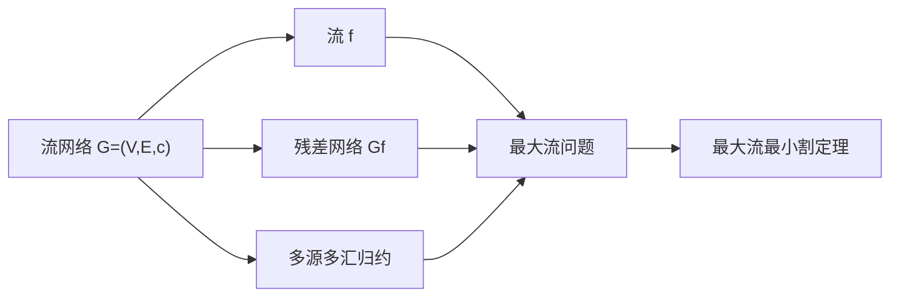

# 流网络

> [!abstract] 流网络是带有容量约束的有向图，用于建模从源到汇的流量传输问题，是网络流理论的基石。

## 定义

> [!def] 形式化定义
> 一个**流网络**是一个四元组 $G = (V, E, s, t, c)$，其中：
> - $V$ 是**顶点集**
> - $E$ 是**有向边集**，满足反对称性：若 $(u, v) \in E$，则 $(v, u) \notin E$
> - $s \in V$ 是**源**（source），$t \in V$ 是**汇**（sink），且 $s \neq t$
> - $c: E \to \mathbb{R}_{\geq 0}$ 是**容量函数**，为每条边赋予非负实数容量
>
> 假设对每个顶点 $v \in V$，都存在一条路径 $s \leadsto v \leadsto t$（即每个顶点都在从源到汇的某条路径上）。
>
> **流**（Flow）是边集上的函数 $f: V \times V \to \mathbb{R}$，满足：
> 1. **容量约束**：对所有 $(u, v) \in E$，$0 \leq f(u, v) \leq c(u, v)$；若 $(u, v) \notin E$，则 $f(u, v) = 0$
> 2. **流守恒**：对所有 $u \in V - \{s, t\}$，$\sum_{v \in V} f(v, u) = \sum_{v \in V} f(u, v)$
>
> **流值**定义为 $|f| = \sum_{v \in V} f(s, v) - \sum_{v \in V} f(v, s)$，即从源流出的净流量。

## 核心性质

| 性质 | 描述 |
|:-----|:-----|
| 容量约束 | 每条边上的流量不超过其容量：$0 \leq f(u,v) \leq c(u,v)$ |
| 流守恒 | 除源和汇外，每个顶点的流入量等于流出量 |
| 流值守恒 | 从源流出的净流量等于流入汇的净流量：$\|f\| = \sum f(v,t) - \sum f(t,v)$ |
| 反对称性 | 流网络中不包含反平行边（同时存在 $(u,v)$ 和 $(v,u)$） |
| 整数流性质 | 当所有容量为整数时，Ford-Fulkerson方法产生整数流 |

## 关系网络

## 章节扩展

### 第24章：最大流

流网络是第24章的核心数据结构。本节（24.1）建立了流网络的完整形式化定义，包括容量约束和流守恒两个基本性质。流值 $|f|$ 定义了从源流出的净流量，也是最大流问题的优化目标。

**反平行边处理**：若网络中同时存在 $(u,v)$ 和 $(v,u)$，可通过添加中间顶点 $w$，将 $(u,v)$ 替换为 $(u,w)$ 和 $(w,v)$ 来消除反平行边，且保持最大流值不变。

**多源多汇归约**：任何多源多汇网络都可以通过添加超级源 $s'$（连接到所有原源，容量 $\infty$）和超级汇 $t'$（所有原汇连接到它，容量 $\infty$）归约为单源单汇网络。引理24.1证明了这个归约保持最大流值不变。

## 补充

> [!info] 补充说明
> 流网络的理论起源于1955年Harris和Ross对苏联铁路网络的研究。他们将铁路网络建模为44个顶点、105条边的有向图，研究最大运输量和最小切断代价，发现了最大流与最小割之间的深刻联系。Ford和Fulkerson于1956年正式提出Ford-Fulkerson方法，奠定了网络流理论的基础。
>
> 流网络在交通优化、电力分配、计算机网络带宽分配、供应链物流、图像分割等领域有广泛应用。

## 参见

- [[算法导论/concepts/最大流]] — 最大流问题与Ford-Fulkerson方法
- [[算法导论/concepts/残差网络]] — 残差网络与增广路径
- [[算法导论/concepts/广度优先搜索]] — Edmonds-Karp算法使用BFS选择最短增广路径
