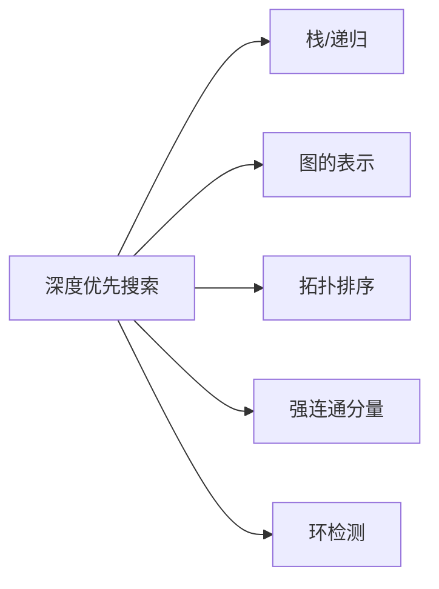

# 深度优先搜索

> [!abstract] DFS 采用纵深优先策略，使用递归（或显式栈）探索图，通过发现时间 $d$ 和完成时间 $f$ 记录探索过程，产生括号结构、边分类和白色路径定理等核心性质，时间复杂度 $\Theta(V + E)$。

## 定义

> [!def] 深度优先搜索（DFS）
> DFS 从图中未访问的顶点出发，沿着一条路径尽可能深入探索，直到无法继续时回溯。算法为每个顶点 $u$ 记录**发现时间** $u.d$ 和**完成时间** $u.f$，以及颜色（WHITE/GRAY/BLACK）和前驱 $\pi$。

> [!def] DFS 边分类（有向图）
> 在 DFS 过程中，每条边 $(u, v)$ 根据探索时 $v$ 的颜色被分为四类：
> - **树边**（Tree Edge）：$v$ 为 WHITE，$v$ 第一次被发现
> - **后向边**（Back Edge）：$v$ 为 GRAY，$v$ 是 $u$ 的祖先
> - **前向边**（Forward Edge）：$v$ 为 BLACK 且 $u.d < v.d$，$v$ 是 $u$ 的后代
> - **横边**（Cross Edge）：$v$ 为 BLACK 且 $u.d > v.d$，$u$ 和 $v$ 无祖先-后代关系

## 核心性质

| 性质 | 描述 |
|:-----|:-----|
| 括号定理 | 任意两顶点的时间戳区间要么完全不相交，要么一个包含另一个 |
| 白色路径定理 | $v$ 是 $u$ 的后代，当且仅当在 $u.d$ 时刻存在从 $u$ 到 $v$ 的全白色路径 |
| 无向图边分类 | 只有树边和后向边两类，不存在前向边和横边 |
| 后向边与环 | 有向图中后向边等价于存在有向环 |
| 时间复杂度 | 邻接表 $\Theta(V + E)$，邻接矩阵 $\Theta(V^2)$ |

## 关系网络

## 章节扩展

### 第20章：基本图算法

**算法流程：** 全局初始化所有顶点为 WHITE，$\text{time}=0$。对每个 WHITE 顶点调用 DFS-VISIT：记录发现时间 $u.d$，标记 GRAY，递归探索所有 WHITE 邻居，完成后标记 BLACK，记录完成时间 $u.f$。

**定理 22.7（括号定理）：** 对任意两顶点 $u$、$v$，时间戳区间 $[u.d, u.f]$ 与 $[v.d, v.f]$ 要么不相交，要么一个完全包含另一个。包含关系对应祖先-后代关系。证明通过对 DFS-VISIT 调用次数归纳——$u$ 的后代在 $u.d$ 之后被发现、$u.f$ 之前完成，因此区间嵌套在 $[u.d, u.f]$ 中。

**定理 22.9（白色路径定理）：** $v$ 是 $u$ 的后代，当且仅当在 $u.d$ 时刻存在从 $u$ 到 $v$ 的全白色路径。必要性由 DFS 树路径在 $u.d$ 时刻全为 WHITE 得出；充分性对路径长度归纳——$u$ 的 WHITE 邻居 $w_1$ 必在 $u$ 的 DFS-VISIT 完成前被发现，由归纳假设 $v$ 是 $w_1$ 的后代。

**定理 22.10（无向图边分类）：** 无向图 DFS 中每条边要么是树边，要么是后向边。关键观察：当从 $u$ 检查邻居 $v$ 时，$v$ 不可能为 BLACK 且 $u.d > v.d$（否则 $v$ 在 $u$ 之前被发现时，$u$ 为 WHITE，$(v, u)$ 已是树边，$v$ 是 GRAY）。

## 补充

> [!info] DFS 的历史
> DFS 的形式化描述归功于 Robert Tarjan（1972），其论文 "Depth-first search and linear graph algorithms" 首次系统阐述了 DFS 的理论框架，包括时间戳、边分类和 DFS 树。Tarjan 因此获得 1986 年图灵奖。

## 参见

- [[算法导论/concepts/图的表示]]
- [[算法导论/concepts/栈]]
- [[算法导论/concepts/广度优先搜索]]
- [[算法导论/concepts/拓扑排序]]
- [[算法导论/concepts/强连通分量]]
