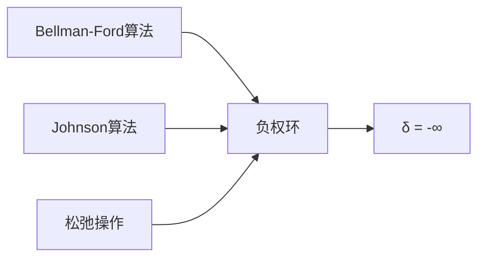

# 负权环

> [!abstract] 权重之和为负的有向环，使经过它的路径可以无限缩短，导致最短路径无定义

## 定义

> [!def] 负权环
给定带权有向图 G=(V,E,w)，负权环是图中一个有向环 c，满足 $\sum_{(u,v) \in c} w(u,v) < 0$。

## 核心性质

| 性质 | 描述 |
|:-----|:-----|
| 路径无限缩短 | 若 s 到 v 的路径经过负权环，则 δ(s,v) = -∞ |
| 无最短路径 | 存在从 s 可达的负权环时，某些顶点无有限最短路径 |
| 检测条件 | BELLMAN-FORD 第 |V| 轮仍有边可松弛 ⇒ 存在负权环 |
| 消除方法 | Johnson 算法通过重赋权 h(v) 将所有边权变为非负 |

## 关系网络

## 章节扩展

### 第22章：单源最短路径

**对最短路径的影响**：若从源点 s 可达一个负权环，则可以无限次绕行该环使路径权值趋向 -∞，此时最短路径不存在（或定义为 -∞）。

**BELLMAN-FORD 检测**：算法执行 |V|-1 轮松弛后，若第 |V| 轮仍有边 (u,v) 满足 d[v] > d[u] + w(u,v)，则存在从 s 可达的负权环。时间复杂度 O(VE)。

### 第23章：所有结点对的最短路径

**Johnson 重赋权**：为消除负权边对 DIJKSTRA 的限制，Johnson 算法引入新顶点 s'，计算 h(v) = δ(s', v)（使用 BELLMAN-FORD），然后定义新边权 ŵ(u,v) = w(u,v) + h(u) - h(v)。

**关键性质**：
- 若原图无负权环，则 ŵ(u,v) ≥ 0（引理23.1）
- 重赋权不改变最短路径（引理23.2）：p 是 w 下 s 到 t 的最短路径 ⟺ p 是 ŵ 下 s 到 t 的最短路径
- 若 BELLMAN-FORD 检测到负权环，Johnson 算法直接报告并终止

## 补充

> [!info] 实际意义
负权环在现实中有重要应用：金融套利（汇率图中的负权环对应套利机会）、通信网络中的路由环路检测。

## 参见

- [[算法导论/concepts/Bellman-Ford算法]]
- [[算法导论/concepts/Johnson算法]]
- [[算法导论/concepts/松弛操作]]
