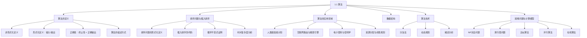
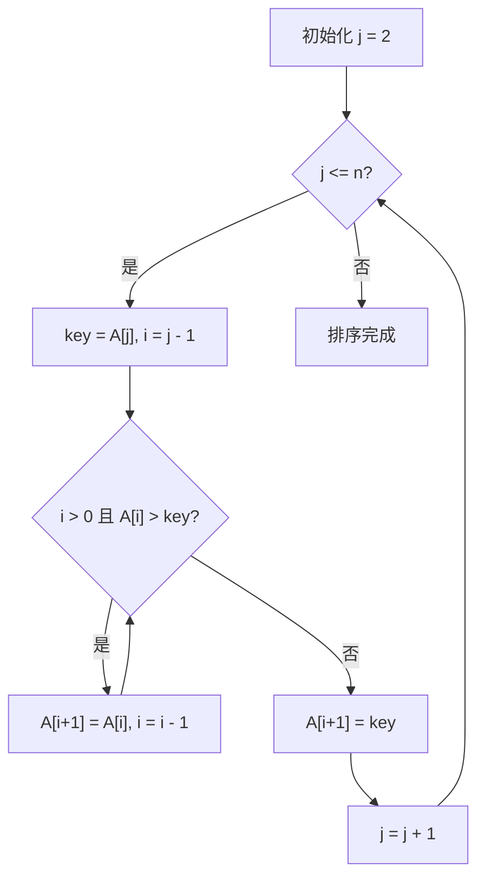

**相关笔记：** [[1.2 算法作为一种技术]]

> [!abstract] 概览
> 本节是《算法导论》的开篇，系统介绍了==算法（algorithm）==的非形式化与形式化定义，以==插入排序（insertion sort）==为例展示了算法的伪代码描述与==循环不变式（loop invariant）==的正确性证明方法，并概述了算法在基因组计划、互联网路由、电子商务等领域的广泛应用，最后讨论了==NP完全问题==与==在线算法==等前沿方向。
>
> - **算法**是一个良定义的计算过程，接受输入并产生输出，是解决特定计算问题的工具
> - **排序问题**是算法设计的经典范例：将输入序列 $\langle a_1, a_2, \ldots, a_n \rangle$ 变换为满足 $a'_1 \leq a'_2 \leq \cdots \leq a'_n$ 的排列
> - **正确算法**必须对所有输入实例都能在有限时间内终止并给出正确答案
> - **循环不变式**是证明循环型算法正确性的核心方法，需满足初始化、保持、终止三个性质
> - 算法问题通常具有两大特征：候选解众多但正确解稀少、具有实际应用价值
> - NP完全问题是尚未找到高效算法的困难问题集合，具有"一个有解则全部有解"的奇妙性质

---

知识结构总览



---

核心思想

> [!tip] 核心思想
> 本节的核心思想是==算法作为解决问题的精确工具==：算法不仅仅是一段代码，而是一种将计算问题从"模糊需求"转化为"精确输入-输出关系"的形式化方法。通过伪代码描述算法逻辑、通过循环不变式证明正确性、通过复杂度分析评估效率，这三者构成了算法设计与分析的完整闭环。算法的价值不仅体现在能解决问题，更体现在能**高效地**解决问题——这一主题将在 1.2 节深入展开。

### 1. 算法的定义

> [!def] 算法（Algorithm）
> ==算法==是一个==良定义的计算过程==（well-defined computational procedure），它接受一个值或一组值作为==输入==（input），并在有限时间内产生一个值或一组值作为==输出==（output）。算法本质上是将输入转化为输出的一系列计算步骤的序列。
>
> 也可以将算法视为解决一个==良定义的计算问题==（well-specified computational problem）的工具。问题的陈述以一般性术语规定了输入/输出关系，而算法则描述了一种具体的计算过程来实现这种关系。

> [!def] 算法的正确性
> 如果对于作为输入给出的每一个问题实例，一个算法都能==终止==（在有限时间内完成计算）并==输出该问题实例的正确解==，则称该算法是==正确的==（correct）。正确的算法解决了给定的计算问题。
>
> - 一个==不正确的算法==（incorrect algorithm）可能在某些输入上根本不终止，或者终止但给出错误答案
> - 出乎意料的是，如果能控制错误率，不正确的算法有时也是有用的（如第31章的大素数查找算法）
> - 通常情况下，我们只关注正确的算法

> [!example] 排序问题的形式化定义
> **问题：** 将一个数列按单调非递减顺序排列。
>
> **输入：** 由 $n$ 个数组成的序列 $\langle a_1, a_2, \ldots, a_n \rangle$。
>
> **输出：** 输入序列的一个排列（重排）$\langle a'_1, a'_2, \ldots, a'_n \rangle$，使得 $a'_1 \leq a'_2 \leq \cdots \leq a'_n$。
>
> **实例：** 给定输入序列 $\langle 31, 41, 59, 26, 41, 58 \rangle$，正确的排序算法应返回输出序列 $\langle 26, 31, 41, 41, 58, 59 \rangle$。

> [!tip] 问题实例（Problem Instance）
> 一个问题的==实例==（instance）由计算该问题解所需的输入（满足问题陈述中施加的任何约束）组成。例如，$\langle 31, 41, 59, 26, 41, 58 \rangle$ 就是排序问题的一个实例。

### 2. 插入排序（INSERTION-SORT）

> [!def] 插入排序（Insertion Sort）
> ==插入排序==是一种简单直观的排序算法，其工作原理类似于打牌时整理手中的牌：从第二张牌开始，每次取出一张牌，将其与前面已排好序的牌从右向左逐一比较，插入到正确的位置。

**插入排序的伪代码：**

> [!tip] 算法执行流程
> 1. 从第 **2** 个元素开始，依次遍历数组
> 2. 将当前元素保存为 **key**
> 3. 将所有大于 **key** 的已排序元素依次**右移**一位
> 4. 将 **key** 插入到右移后空出的正确位置



```
INSERTION-SORT(A, n)
1  for j = 2 to A.length
2      key = A[j]
3      // 将 A[j] 插入到已排序的序列 A[1..j-1] 中
4      i = j - 1
5      while i > 0 and A[i] > key
6          A[i + 1] = A[i]
7          i = i - 1
8      A[i + 1] = key
```

> [!example] 插入排序的执行过程
> 对输入数组 $A = \langle 5, 2, 4, 6, 1, 3 \rangle$ 执行插入排序：
>
> | 轮次 $j$ | key | 操作 | 数组状态 |
> |:--------:|:---:|------|----------|
> | 初始 | — | — | $\langle \mathbf{5}, 2, 4, 6, 1, 3 \rangle$ |
> | $j=2$ | 2 | 5 右移，2 插入位置 1 | $\langle \mathbf{2, 5}, 4, 6, 1, 3 \rangle$ |
> | $j=3$ | 4 | 5 右移，4 插入位置 2 | $\langle \mathbf{2, 4, 5}, 6, 1, 3 \rangle$ |
> | $j=4$ | 6 | 无需移动，6 保持位置 4 | $\langle \mathbf{2, 4, 5, 6}, 1, 3 \rangle$ |
> | $j=5$ | 1 | 6,5,4,2 依次右移，1 插入位置 1 | $\langle \mathbf{1, 2, 4, 5, 6}, 3 \rangle$ |
> | $j=6$ | 3 | 6,5,4 依次右移，3 插入位置 3 | $\langle \mathbf{1, 2, 3, 4, 5, 6} \rangle$ |
>
> **粗体**部分表示已排序的子数组 $A[1..j-1]$。

### 3. 循环不变式（Loop Invariant）

> [!def] 循环不变式（Loop Invariant）
> ==循环不变式==是证明循环型算法正确性的一种方法。它是一个在循环每次迭代开始前都保持为真的断言（predicate）。证明循环不变式需要验证三个性质：
>
> 1. **初始化（Initialization）：** 循环第一次迭代开始前，不变式为真
> 2. **保持（Maintenance）：** 如果循环某次迭代开始前不变式为真，则下次迭代开始前它仍然为真
> 3. **终止（Termination）：** 循环终止时，不变式给出一个有用的性质，有助于证明算法的正确性

> [!example] 插入排序的循环不变式证明
> **循环不变式：** 在第 $2 \sim 8$ 行的 `for` 循环每次迭代开始时，子数组 $A[1..j-1]$ 由原来在 $A[1..j-1]$ 中的元素组成，但已按==排好序==的顺序排列。
>
> **初始化：** $j = 2$ 时，子数组 $A[1..1]$ 只包含一个元素 $A[1]$，显然是已排序的。
>
> **保持：** 假设 $j$ 次迭代开始时 $A[1..j-1]$ 已排序。第 $2 \sim 8$ 行的循环将 $A[j]$（存入 `key`）向左移动，直到找到正确位置 $A[i+1]$。此时 $A[1..j]$ 已排序。下次迭代 $j$ 变为 $j+1$，不变式保持。
>
> **终止：** 循环终止时 $j = n+1$，代入不变式得 $A[1..n]$ 已排序。而 $A[1..n]$ 恰好是整个数组，因此算法正确。

> [!tip] 循环不变式与数学归纳法的类比
> 循环不变式的证明结构与==数学归纳法==（mathematical induction）高度相似：
> - **初始化** 对应归纳法的**基础步**（base case）
> - **保持** 对应归纳法的**归纳步**（inductive step）
> - **终止** 则利用不变式在循环结束时的结论来证明算法的正确性
>
> 这一联系说明：算法正确性证明与离散数学中的逻辑推理方法一脉相承。

### 4. 算法的广泛应用

> [!info] 算法在各领域的应用
> 算法在现代社会中无处不在，以下是教材中列举的典型应用：
>
> | 应用领域 | 具体问题 | 相关算法章节 |
> |---------|---------|-------------|
> | 人类基因组计划 | DNA 序列比对与存储 | 第14章（动态规划） |
> | 互联网 | 路由选择、搜索引擎 | 第22章（最短路径）、第11/32章 |
> | 电子商务 | 公钥密码学、数字签名 | 第31章（数论算法） |
> | 资源分配 | 线性规划 | 第29章 |
> | 最短路径 | 导航系统、物流优化 | 第22章 |
> | 拓扑排序 | 零件依赖关系 | 第20章 |
> | 医学诊断 | 肿瘤图像聚类 | 第33章（聚类算法） |
> | 数据压缩 | Huffman 编码 | 第15章 |
> | 信号处理 | 快速傅里叶变换 | 第30章 |

---

补充理解与拓展

> [!info] 算法的起源：从 al-Khwarizmi 到现代计算机科学
> "算法"（algorithm）一词来源于 9 世纪波斯数学家 **al-Khwarizmi** 的拉丁化名字。他在著作《印度数字算术》中系统描述了求解算术方程的步骤化方法，这种"按步骤解决问题"的思想正是现代算法概念的雏形。1936 年，Alan Turing 提出了图灵机模型，首次给出了"可计算性"的严格数学定义，为算法理论奠定了理论基础。
>
> > 来源：Donald E. Knuth, *The Art of Computer Programming, Vol. 1: Fundamental Algorithms*, Addison-Wesley, 1968; Donald E. Knuth, "Algorithms in Modern Mathematics and Computer Science," *Lecture Notes in Computer Science*, vol. 122, 1981.

> [!info] NP完全问题的深远影响
> 1971 年，Stephen Cook 和 Richard Karp 独立证明了 NP 完全性的核心定理，揭示了计算复杂性理论中最令人惊叹的现象之一：数千个看似毫无关联的困难问题，在计算复杂度上是"等价"的——只要其中任何一个问题找到了高效算法，所有问题都将迎刃而解。这一发现深刻影响了计算机科学的发展方向，也催生了近似算法、参数化算法、随机化算法等丰富的替代方案。
>
> > 来源：S. A. Cook, "The Complexity of Theorem-Proving Procedures," *Proceedings of the 3rd Annual ACM Symposium on Theory of Computing*, 1971; R. M. Karp, "Reducibility Among Combinatorial Problems," *Complexity of Computer Computations*, 1972.

---

易混淆点与辨析

> [!warning] "算法"与"程序"的混淆
> 初学者常将"算法"与"程序"混为一谈，认为写了一段代码就等于设计了一个算法。
>
> | | 算法（Algorithm） | 程序（Program） |
> |---|---|---|
> | 本质 | 解决问题的计算步骤的抽象描述 | 算法在特定编程语言中的具体实现 |
> | 语言 | 可用自然语言、伪代码、硬件设计等 | 必须用特定编程语言编写 |
> | 要求 | 必须对**所有**合法输入都能终止并给出正确答案 | 可以不满足终止性（如操作系统是永不停机的程序） |
> | 关注点 | 正确性、效率（时间/空间复杂度） | 可读性、可维护性、工程实践 |
>
> - ❌ "我用 Python 写了一个排序函数，这就是一个排序算法"
> - ✅ "我用 Python 实现了插入排序算法，并通过循环不变式证明了它的正确性"

> [!warning] "正确性"与"效率"的混淆
> 初学者常认为只要程序能跑出正确结果，就足够了，忽视了效率的重要性。
>
> - ❌ "我的程序能正确排序 100 个数，所以它是一个好的排序算法"
> - ✅ "我的程序能正确排序，但时间复杂度为 $O(n^3)$，当 $n = 10^6$ 时需要约 $10^{18}$ 次操作，实际不可用。我需要寻找更高效的算法"
>
> 一个算法即使完全正确，如果效率太低，在面对大规模数据时也是不可用的。这正是 1.2 节要讨论的核心主题：==效率至关重要==。

---

习题精选

| 题号 | 核心考点 | 难度 |
|:----:|---------|:----:|
| 1.1-1 | 排序与最短路径的实际应用 | ⭐ |
| 1.1-2 | 效率的多种度量维度 | ⭐ |
| 1.1-3 | 数据结构的优劣分析 | ⭐ |
| 1.1-4 | 最短路径 vs 旅行商问题的比较 | ⭐⭐ |
| 1.1-5 | 精确解 vs 近似解的适用场景 | ⭐⭐ |

> [!faq]- 1.1-1 给出一个需要排序的现实世界例子，以及一个需要求最短距离的例子。
> **排序：** 学生成绩管理系统需要按分数从高到低排列学生成绩，以便确定奖学金获得者。
>
> **最短距离：** 快递公司需要为配送车辆规划从仓库到多个配送点的最短路径，以降低燃油和人力成本。

> [!faq]- 1.1-2 除了速度之外，在现实环境中还需要考虑哪些效率度量？
> - **内存空间**（space）：算法运行所需的存储空间
> - **能耗**（energy consumption）：移动设备上尤其重要
> - **开发时间**（development time）：实现算法所需的人力成本
> - **可维护性**（maintainability）：代码是否易于修改和扩展
> - **正确性保证**（correctness guarantee）：算法是否经过了形式化验证
> - **并行性**（parallelism）：算法是否能有效利用多核/分布式计算资源

> [!faq]- 1.1-3 选择一个你见过的数据结构，讨论它的优势和局限性。
> **数组（Array）：**
> - **优势：** 随机访问时间为 $O(1)$，缓存友好（连续内存），实现简单
> - **局限：** 大小固定（静态数组），插入和删除操作需要移动元素（最坏 $O(n)$），动态扩容有开销

> [!faq]- 1.1-4 最短路径问题和旅行商问题有何相似之处？有何不同之处？
> **相似之处：** 两者都在图上寻找路径，都涉及距离/权重的优化。
>
> **不同之处：**
> - 最短路径问题只要求找到两个顶点之间的最短路径，存在高效算法（Dijkstra、BFS 等）
> - 旅行商问题要求访问**所有**顶点恰好一次并回到起点，是 NP 完全问题，不存在已知的高效算法
> - 旅行商问题可以视为最短路径问题的"升级版"——增加了"必须访问所有顶点"的约束

> [!faq]- 1.1-5 提出一个只需要最优解的现实世界问题，再提出一个近似最优解就足够的问题。
> **需要最优解：** 航空公司的机组排班问题——必须满足所有法律法规约束（如飞行时长限制、休息时间要求），任何违反约束的排班方案都是不可接受的。
>
> **近似解足够：** 快递公司的配送路线优化——找到一条"足够短"的路线即可，不需要绝对的数学最优解，因为交通状况、天气等实时因素会使理论最优解在实际中未必最优。

---

视频学习指南

| 资源 | 链接 | 对应内容 | 备注 |
|------|------|---------|------|
| MIT 6.006 Introduction to Algorithms (Lecture 1) | https://www.youtube.com/watch?v=HtSuA80QTyo | 算法概述、插入排序、归并排序预览 | Erik Demaine 教授，经典入门 |
| Stanford CS161 (Design and Analysis of Algorithms) | https://www.youtube.com/playlist?list=PLXFMmlk03Dt7Q0xr1PIAriY5623cKiH7V | 算法导论完整课程 | Mary Wootters 教授 |
| 河南大学《算法导论》中文字幕版 | https://www.bilibili.com/video/BV1H4411B7FY | 1.1 算法、插入排序 | 中文授课，适合入门 |

---

教材原文

> [!quote] 教材原文摘录
> "Informally, an algorithm is any well-defined computational procedure that takes some value, or set of values, as input and produces some value, or set of values, as output in a finite amount of time. An algorithm is thus a sequence of computational steps that transform the input into the output."
>
> "An algorithm for a computational problem is correct if, for every problem instance provided as input, it halts—finishes its computing in finite time—and outputs the correct solution to the problem instance."
>
> "You can also view an algorithm as a tool for solving a well-specified computational problem. The statement of the problem specifies in general terms the desired input/output relationship for problem instances, typically of arbitrarily large size."

---

## 参见 Wiki

- [[算法导论/concepts/算法]]
- [[算法导论/concepts/插入排序]]
- [[算法导论/concepts/循环不变式]]
- [[算法导论/concepts/排序问题]]
- [[算法导论/concepts/伪代码]]
- [[算法导论/concepts/NP完全问题]]
- [[算法导论/concepts/数据结构]]
- [[算法导论/concepts/分治法]]
- [[算法导论/concepts/动态规划]]
- [[算法导论/concepts/在线算法]]

#学习/算法导论/算法基础/算法
