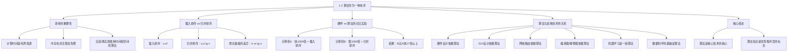

**相关笔记：** [[1.1 算法]]

> [!abstract] 概览
> 本节论证了一个核心观点：==算法本身就是一种技术==，其重要性不亚于硬件。通过==插入排序==与==归并排序==的对比实验，展示了==算法效率的差异==可以远远超过硬件性能的差异——一台慢 1000 倍的计算机，仅因为使用了更优的算法，就能比快 1000 倍的计算机快 17 倍以上。本节还讨论了算法与==机器学习==、==数据科学==等现代技术的关系。
>
> - 计算时间是==有界资源==，时间比金钱更宝贵——花掉的钱可以赚回，但流逝的时间无法追回
> - 插入排序时间复杂度为 $O(n^2)$，归并排序为 $O(n \lg n)$，当 $n$ 足够大时后者优势巨大
> - 一台慢 1000 倍的计算机运行归并排序，排序 1000 万个数比快计算机运行插入排序快 **17 倍以上**
> - 排序 1 亿个数时，插入排序需要超过 23 天，而归并排序不到 4 小时
> - 算法是大多数计算机技术的==核心基础==：硬件设计、GUI、网络路由、编译器都依赖算法
> - 机器学习本身就是一组算法，且对于人类理解透彻的问题，精心设计的算法通常优于机器学习方法

---

知识结构总览

---

核心思想

> [!tip] 核心思想
> 本节的核心思想是==算法效率可以压倒硬件优势==：即使面对巨大的硬件性能差距（1000 倍），一个具有更好渐近复杂度的算法仍然能够取得压倒性的胜利。这意味着算法不应被视为软件工程的附属品，而应被视为与处理器速度、内存容量同等重要的**核心技术**。随着问题规模的不断增大，算法效率的优势只会越来越显著。

### 1. 为什么效率重要

> [!def] 计算资源的有界性
> 计算机虽然速度很快，但并非无限快。==计算时间==是有界资源，因此非常宝贵。虽然俗话说"时间就是金钱"，但时间比金钱更宝贵：钱花掉了可以赚回来，但时间一旦流逝就永远无法追回。内存虽然便宜，但既非无限也非免费。因此，应该选择能==高效利用时间和空间==的算法。

> [!tip] 假设性思考实验
> 如果计算机无限快且内存免费，你还有理由研究算法吗？
>
> 答案是**肯定的**——至少你需要确保你的解法能够**终止**并给出**正确答案**。但在这种假设下，你通常会使用最容易实现的方法，因为效率不再是问题。
>
> 然而现实中，计算机并非无限快，内存也并非免费，所以我们必须认真对待算法的效率问题。

### 2. 插入排序 vs 归并排序：效率的巨大差异

> [!def] 两种排序算法的时间复杂度
> 第 2 章介绍了两种排序算法：
>
> - **插入排序（Insertion Sort）：** 排序 $n$ 个元素所需时间约为 $c_1 n^2$，其中 $c_1$ 是不依赖于 $n$ 的常数。即时间与 $n^2$ 成正比。
> - **归并排序（Merge Sort）：** 排序 $n$ 个元素所需时间约为 $c_2 n \lg n$，其中 $\lg n$ 表示 $\log_2 n$，$c_2$ 是另一个不依赖于 $n$ 的常数。
>
> 插入排序的常数因子通常更小（$c_1 < c_2$），但常数因子的影响远远小于对输入规模 $n$ 的依赖关系。

> [!example] lg n 与 n 的增长对比
> 将插入排序的运行时间写为 $c_1 n \cdot n$，归并排序写为 $c_2 n \cdot \lg n$，可以看到关键差异：
>
> | $n$ | $\lg n$ | $n / \lg n$（插入排序的劣势倍数） |
> |----:|--------:|----------------------------------:|
> | $10^3$ | $\approx 10$ | $\approx 100$ |
> | $10^6$ | $\approx 20$ | $\approx 50{,}000$ |
> | $10^9$ | $\approx 30$ | $\approx 33{,}333{,}333$ |
>
> 无论 $c_1$ 比 $c_2$ 小多少，总存在一个==交叉点==（crossover point），超过该点后归并排序总是更快。

### 3. 硬件 vs 算法：震撼的对比实验

> [!def] 对比实验设定
> 教材设计了一个极端的对比来展示算法的力量：
>
> | | 计算机 A（快） | 计算机 B（慢） |
> |---|---|---|
> | **指令执行速度** | $10 \times 10^9$ 条/秒（100 亿条/秒） | $10 \times 10^6$ 条/秒（1000 万条/秒） |
> | **速度比** | \multicolumn{2}{c|}{A 是 B 的 **1000 倍**} |
> | **排序算法** | 插入排序 | 归并排序 |
> | **程序员水平** | 世界顶级程序员，机器语言实现 | 普通程序员，高级语言 + 低效编译器 |
> | **指令数** | $2n^2$ | $50n \lg n$ |
> | **排序规模** | \multicolumn{2}{c|}{1000 万个数字（$\approx 80$ MB）} |

> [!example] 对比实验的计算
> **计算机 A（插入排序）排序 1000 万个数：**
> $$T_A = \frac{2n^2}{10^{10}} = \frac{2 \times (10^7)^2}{10^{10}} = \frac{2 \times 10^{14}}{10^{10}} = 20{,}000 \text{ 秒} \approx 5.56 \text{ 小时}$$
>
> **计算机 B（归并排序）排序 1000 万个数：**
> $$T_B = \frac{50n \lg n}{10^7} = \frac{50 \times 10^7 \times \lg(10^7)}{10^7} = 50 \times 23.25 \approx 1163 \text{ 秒} \approx 19.4 \text{ 分钟}$$
>
> $$\frac{T_A}{T_B} = \frac{20{,}000}{1163} \approx 17.2$$
>
> **结论：** 尽管计算机 A 比 B 快 1000 倍，且由顶级程序员用机器语言实现，但由于使用了低效的算法，计算机 B 仍然比 A 快了 **17 倍以上**！

> [!tip] 规模更大时优势更显著
> 当排序 1 亿个数时：
> - 插入排序需要超过 **23 天**
> - 归并排序不到 **4 小时**
>
> 1 亿看似很大，但互联网每半小时就有超过 1 亿次搜索，每分钟有超过 1 亿封邮件发送，最小的矮星系也包含约 1 亿颗恒星。
>
> **一般规律：** 随着问题规模增大，算法效率的相对优势越来越显著。

### 4. 算法与其他技术的关系

> [!def] 算法是核心技术的核心
> 即使在拥有先进计算机架构、图形用户界面、面向对象系统、Web 技术、快速网络、机器学习和移动设备的时代，算法的重要性丝毫不减：
>
> - **应用层需要算法：** 例如导航服务需要最短路径算法、地图渲染算法、地址插值算法
> - **底层技术依赖算法：** 硬件设计、GUI 设计、网络路由、编译器/解释器/汇编器——所有这些底层技术都大量使用算法
> - **算法无处不在：** 即使应用层不直接涉及算法，其依赖的每一层技术背后都有算法的支撑

> [!def] 机器学习与算法的关系
> ==机器学习==（machine learning）可以被视为一种通过从数据中推断模式来自动学习解决方案的方法，而非显式设计算法。但：
>
> - 机器学习本身就是一组算法的集合，只是换了一个名字
> - 目前机器学习的成功主要适用于人类尚未真正理解正确算法的问题（如计算机视觉、自动语言翻译）
> - 对于人类理解透彻的算法问题（如本书中的大多数问题），精心设计的专用算法通常比机器学习方法更成功

> [!def] 数据科学与算法
> ==数据科学==（data science）是一门跨学科领域，目标是从结构化和非结构化数据中提取知识和洞见。它使用统计学、计算机科学和优化方法，而算法的设计与分析是数据科学的==基础==。数据科学的核心技术（与机器学习高度重叠）包括本书中的许多算法。

---

补充理解与拓展

> [!info] 摩尔定律与算法进步的对比
> 摩尔定律（Moore's Law）指出，集成电路上晶体管数量大约每两年翻一番，这意味着硬件性能随时间指数增长。然而，算法的进步往往比硬件的进步更加惊人。例如，线性规划问题的求解算法从 1947 年的单纯形法到 1984 年的内点法，在某些问题实例上实现了从 $O(2^n)$ 到 $O(n^{3.5})$ 的飞跃——这种改进相当于硬件性能提升了数十个数量级，远超摩尔定律数十年的累积效果。
>
> > 来源：N. Karmarkar, "A New Polynomial-Time Algorithm for Linear Programming," *Combinatorica*, vol. 4, no. 4, 1984; V. Klee and G. J. Minty, "How Good is the Simplex Algorithm?," *Inequalities III*, Academic Press, 1972.

> [!info] 算法效率对环境的影响
> 在云计算和大规模数据中心时代，算法效率不仅影响计算时间，还直接影响能源消耗和碳排放。一个低效的算法意味着更多的计算资源、更多的电力消耗和更大的碳足迹。Google 曾报告称，通过改进数据中心的算法，每年节省了数十亿度电力。因此，选择高效算法不仅是技术选择，也是环保责任。
>
> > 来源：U. Hoelzle and L. A. Barroso, *The Datacenter as a Computer: Designing Warehouse-Scale Machines*, 3rd edition, Morgan & Claypool, 2018.

---

易混淆点与辨析

> [!warning] "常数因子"与"增长量级"的混淆
> 初学者容易过度关注常数因子，而忽视增长量级（渐近复杂度）的决定性作用。
>
> - ❌ "插入排序的常数因子更小，所以对小规模数据它总是更快，我应该优先使用它"
> - ✅ "插入排序对小规模数据确实更快（常数因子小），但当 $n$ 超过交叉点后，归并排序的 $O(n \lg n)$ 增长量级会带来压倒性优势。实际中可以结合两者：对小子数组用插入排序，对大数组用归并排序"
>
> | 对比维度 | 常数因子 | 增长量级 |
> |---------|---------|---------|
> | 影响 | 影响小规模时的实际运行时间 | 决定大规模时的增长趋势 |
> | 重要性 | 次要（被增长量级主导） | **主要**（决定算法的根本效率） |
> | 优化手段 | 代码优化、编译器优化 | 算法设计、选择更好的算法 |

> [!warning] "机器学习可以替代算法"的误解
> 随着深度学习的兴起，一种常见的误解是"有了机器学习就不需要学习传统算法了"。
>
> - ❌ "机器学习如此强大，传统算法已经过时了"
> - ✅ "机器学习本身就是一组算法。对于人类理解透彻的问题（如排序、最短路径），精心设计的算法比机器学习方法更高效、更可靠。机器学习和传统算法是互补关系，不是替代关系"
>
> | | 传统算法 | 机器学习 |
> |---|---|---|
> | 适用场景 | 问题定义清晰、有精确解 | 问题复杂、难以显式建模 |
> | 优势 | 可证明正确性和复杂度 | 能处理模糊、高维问题 |
> | 可靠性 | 确定性输出，可预测 | 概率性输出，需要验证 |
> | 基础 | 数学证明、离散结构 | 统计学、优化理论 |
> | 关系 | 机器学习的底层依赖 | 本身就是算法的集合 |

---

习题精选

| 题号 | 核心考点 | 难度 |
|:----:|---------|:----:|
| 1.2-1 | 应用层算法需求的实例分析 | ⭐ |
| 1.2-2 | 插入排序 vs 归并排序的交叉点计算 | ⭐⭐ |
| 1.2-3 | $O(n^2)$ vs $O(2^n)$ 的交叉点计算 | ⭐⭐ |
| 1-1 | 不同时间函数的问题规模对比 | ⭐⭐⭐ |
| 思考题 | 硬件升级 vs 算法改进的收益比较 | ⭐⭐ |

> [!faq]- 1.2-1 给出一个在应用层需要算法内容的应用实例，并讨论其中涉及的算法的功能。
> **导航应用（如 Google Maps）：**
> - **最短路径算法**（如 Dijkstra 算法）：计算从起点到终点的最优路线
> - **地图渲染算法**：将地理数据转化为可视化的地图图像
> - **地址插值/地理编码算法**：将街道地址转换为地理坐标
> - **实时交通算法**：根据当前路况动态调整推荐路线
> - **POI 搜索算法**：在地图上快速查找附近的兴趣点（餐厅、加油站等）

> [!faq]- 1.2-2 假设在某台计算机上，对规模为 $n$ 的输入，插入排序运行 $8n^2$ 步，归并排序运行 $64n \lg n$ 步。对于哪些 $n$ 值，插入排序快于归并排序？
> 需要解不等式：
> $$8n^2 < 64n \lg n$$
> $$n < 8 \lg n$$
>
> 逐一验证：
> - $n = 2$：$2 < 8 \times 1 = 8$ ✓
> - $n = 16$：$16 < 8 \times 4 = 32$ ✓
> - $n = 32$：$32 < 8 \times 5 = 40$ ✓
> - $n = 43$：$43 < 8 \times 5.43 \approx 43.4$ ✓
> - $n = 44$：$44 < 8 \times 5.46 \approx 43.7$ ✗
>
> 因此，当 $2 \leq n \leq 43$ 时，插入排序快于归并排序。

> [!faq]- 1.2-3 $n$ 的最小值是多少，使得运行时间为 $100n^2$ 的算法比运行时间为 $2^n$ 的算法在同一台机器上更快？
> 需要解不等式：
> $$100n^2 < 2^n$$
>
> 逐一验证：
> - $n = 10$：$100 \times 100 = 10000$ vs $2^{10} = 1024$ → $10000 > 1024$ ✗
> - $n = 14$：$100 \times 196 = 19600$ vs $2^{14} = 16384$ → $19600 > 16384$ ✗
> - $n = 15$：$100 \times 225 = 22500$ vs $2^{15} = 32768$ → $22500 < 32768$ ✓
>
> 因此，$n$ 的最小值为 **15**。

> [!faq]- 1-1（简化版）对于函数 $f(n) = n^2$，在 1 秒内（$10^6$ 微秒）能解决的最大问题规模是多少？
> $$n^2 \leq 10^6$$
> $$n \leq \sqrt{10^6} = 1000$$
>
> 在 1 秒内，$O(n^2)$ 算法最多能处理 $n = 1000$ 的输入规模。

> [!faq]- 思考题：如果将计算机 A 的处理器升级为原来的 10 倍速度，排序 1000 万个数需要多长时间？与使用归并排序的计算机 B 相比如何？
> 升级后计算机 A 的速度为 $10^{11}$ 条/秒：
> $$T'_A = \frac{2 \times (10^7)^2}{10^{11}} = \frac{2 \times 10^{14}}{10^{11}} = 2000 \text{ 秒} \approx 33.3 \text{ 分钟}$$
>
> 计算机 B 仍为 $\approx 1163$ 秒 $\approx 19.4$ 分钟。
>
> 即使硬件升级了 10 倍（从 100 亿条/秒到 1000 亿条/秒），计算机 A 仍然比计算机 B 慢近 2 倍。这进一步说明：**算法选择的影响远大于硬件升级。**

---

视频学习指南

| 资源 | 链接 | 对应内容 | 备注 |
|------|------|---------|------|
| MIT 6.006 Lecture 1 | https://www.youtube.com/watch?v=HtSuA80QTyo | 插入排序 vs 归并排序、效率对比 | Erik Demaine 教授 |
| Harvard CS50 - Algorithms | https://www.youtube.com/watch?v=rXwYSE3n1Jk | 算法效率概述 | David Malan 教授，生动易懂 |
| 算法可视化 - Sorting | https://www.youtube.com/watch?v=kPRA0W1kECg | 多种排序算法的可视化对比 | 直观感受算法效率差异 |

---

教材原文

> [!quote] 教材原文摘录
> "Computing time is therefore a bounded resource, which makes it precious. Although the saying goes, 'Time is money,' time is even more valuable than money: you can get back money after you spend it, but once time is spent, you can never get it back."
>
> "Different algorithms devised to solve the same problem often differ dramatically in their efficiency. These differences can be much more significant than differences due to hardware and software."
>
> "By using an algorithm whose running time grows more slowly, even with a poor compiler, computer B runs more than 17 times faster than computer A!"
>
> "Total system performance depends on choosing efficient algorithms as much as on choosing fast hardware."
>
> "Having a solid base of algorithmic knowledge and technique is one characteristic that defines the truly skilled programmer."

---

## 参见 Wiki

- [[算法导论/concepts/算法效率]]
- [[算法导论/concepts/插入排序]]
- [[算法导论/concepts/归并排序]]
- [[算法导论/concepts/时间复杂度]]
- [[算法导论/concepts/渐近分析]]
- [[算法导论/concepts/增长量级]]
- [[算法导论/concepts/机器学习与算法]]
- [[算法导论/concepts/数据科学]]
- [[算法导论/concepts/算法与硬件]]

#学习/算法导论/算法基础/算法
