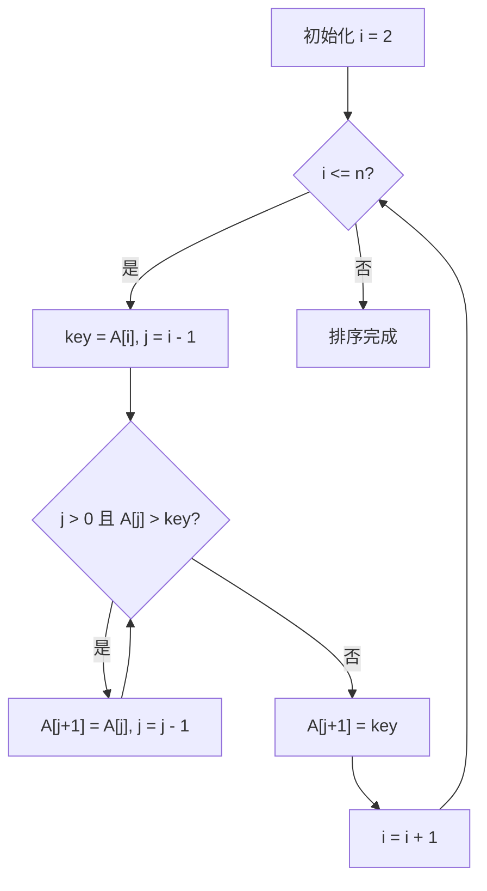

**相关笔记：** [[1.1 算法]] | [[2.2 算法分析]]

> [!abstract] 概览
> 本节详细介绍了==插入排序（insertion sort）==算法，以整理扑克牌为类比引入算法思想，给出了完整的伪代码描述，并通过==循环不变式（loop invariant）==方法严格证明了算法的正确性。此外，本节还系统阐述了书中使用的==伪代码约定==（pseudocode conventions），包括缩进块结构、循环计数器保留值、数组下标、短路求值等关键规则。
>
> - ==插入排序==的工作方式类似于整理手中的扑克牌：每次取出一张牌，与已排好序的牌从右向左比较，插入到正确位置
> - 排序问题的输入是 $n$ 个数的序列，输出是满足非递减顺序的排列
> - 被排序的数称为==关键字（key）==，与之关联的其他数据称为==卫星数据（satellite data）==
> - ==循环不变式==是证明循环算法正确性的核心方法，需验证==初始化==、==保持==、==终止==三个性质
> - 循环不变式证明与==数学归纳法==结构高度相似：初始化对应基础步，保持对应归纳步
> - 伪代码使用==1 起始下标==（1-origin indexing），循环计数器退出后保留值，布尔运算支持==短路求值==

---

知识结构总览

```mermaid
graph TB
    A["2.1 插入排序"] --> B["排序问题定义"]
    A --> C["插入排序算法"]
    A --> D["循环不变式与正确性证明"]
    A --> E["伪代码约定"]

    B --> B1["输入：n 个数的序列"]
    B --> B2["输出：非递减排列"]
    B --> B3["关键字与卫星数据"]

    C --> C1["扑克牌类比"]
    C --> C2["INSERTION-SORT 伪代码"]
    C --> C3["逐步执行过程演示"]

    D --> D1["循环不变式的定义"]
    D --> D2["初始化（Initialization）"]
    D --> D3["保持（Maintenance）"]
    D --> D4["终止（Termination）"]
    D --> D5["与数学归纳法的类比"]

    E --> E1["缩进表示块结构"]
    E --> E2["循环计数器保留值"]
    E --> E3["1 起始下标"]
    E --> E4["子数组记号 A[i:j]"]
    E --> E5["对象与属性访问"]
    E --> E6["按值传参"]
    E --> E7["短路布尔运算"]
    E --> E8["NIL 与 error"]
```



---

核心思想

> [!tip] 核心思想
> 本节的核心思想是==增量方法（incremental method）==：插入排序通过维护一个已排序的子数组，每次将一个新元素"插入"到正确位置，逐步扩展已排序部分直到覆盖整个数组。这种"逐步构建"的策略简单直观，其正确性通过==循环不变式==方法得到严格保证。循环不变式是贯穿全书的核心证明技术，掌握它对于理解后续所有算法的正确性证明至关重要。

### 1. 排序问题与关键字

> [!def] 排序问题
> ==排序问题==的形式化定义如下：
>
> - **输入：** 由 $n$ 个数组成的序列 $\langle a_1, a_2, \ldots, a_n \rangle$
> - **输出：** 输入序列的一个排列 $\langle a'_1, a'_2, \ldots, a'_n \rangle$，使得 $a'_1 \leq a'_2 \leq \cdots \leq a'_n$
>
> 被排序的数称为==关键字（key）==。在实际应用中，关键字通常附带其他数据（称为==卫星数据==，satellite data），关键字和卫星数据共同构成一条==记录==（record）。排序时，记录随关键字一起移动。

> [!example] 关键字与卫星数据
> 考虑一个包含学生记录的电子表格，每条记录包含年龄、GPA、已修课程数等信息。排序时可以选择任一属性作为关键字（如按 GPA 排序），但排序操作会移动整条记录（包含所有卫星数据），而非仅移动关键字值。

### 2. 插入排序算法

> [!def] 插入排序（Insertion Sort）
> ==插入排序==是一种高效的==小规模==排序算法。其工作方式类似于整理手中的扑克牌：左手持已排好序的牌，右手从桌上牌堆中逐一取牌，将每张新牌与左手中已有的牌从右向左比较，插入到正确位置。

**INSERTION-SORT 伪代码：**

> [!tip] 算法执行流程
> 1. 从第 **2** 个元素开始，依次遍历数组
> 2. 将当前元素保存为 **key**
> 3. 将所有大于 **key** 的已排序元素依次**右移**一位
> 4. 将 **key** 插入到右移后空出的正确位置



```
INSERTION-SORT(A, n)
1  for i = 2 to n
2      key = A[i]
3      // 将 A[i] 插入到已排序子数组 A[1 : i-1] 中
4      j = i - 1
5      while j > 0 and A[j] > key
6          A[j + 1] = A[j]
7          j = j - 1
8      A[j + 1] = key
```

> [!example] 插入排序的逐步执行过程
> 对输入数组 $A = \langle 5, 2, 4, 6, 1, 3 \rangle$，$n = 6$，执行插入排序的详细过程如下：
>
> | 轮次 $i$ | key | while 循环比较次数 $t_i$ | 操作详情 | 数组状态 |
> |:--------:|:---:|:------------------------:|----------|----------|
> | 初始 | — | — | — | $\langle 5, 2, 4, 6, 1, 3 \rangle$ |
> | $i=2$ | 2 | $t_2 = 2$ | $A[1]=5 > 2$，右移 5；$j=0$ 退出 | $\langle \mathbf{2, 5}, 4, 6, 1, 3 \rangle$ |
> | $i=3$ | 4 | $t_3 = 2$ | $A[2]=5 > 4$，右移 5；$A[1]=2 \leq 4$，退出 | $\langle \mathbf{2, 4, 5}, 6, 1, 3 \rangle$ |
> | $i=4$ | 6 | $t_4 = 1$ | $A[3]=5 \leq 6$，立即退出 | $\langle \mathbf{2, 4, 5, 6}, 1, 3 \rangle$ |
> | $i=5$ | 1 | $t_5 = 5$ | 依次右移 6,5,4,2；$j=0$ 退出 | $\langle \mathbf{1, 2, 4, 5, 6}, 3 \rangle$ |
> | $i=6$ | 3 | $t_6 = 4$ | 依次右移 6,5,4；$A[1]=1 \leq 3$，退出 | $\langle \mathbf{1, 2, 3, 4, 5, 6} \rangle$ |
>
> **粗体**部分表示已排序的子数组 $A[1 : i-1]$。注意 $t_i$ 包含最后一次使条件为假的测试。

### 3. 循环不变式与正确性证明

> [!def] 循环不变式（Loop Invariant）
> ==循环不变式==是在循环每次迭代开始时都保持为真的断言。使用循环不变式证明算法正确性需要验证三个性质：
>
> 1. **初始化（Initialization）：** 循环第一次迭代开始前，不变式为真
> 2. **保持（Maintenance）：** 如果某次迭代开始前不变式为真，则下次迭代开始前仍为真
> 3. **终止（Termination）：** 循环终止时，利用不变式和终止条件可推导出有用的性质，证明算法正确

> [!example] 插入排序的循环不变式证明
> **【循环不变量（初始化+保持+终止）】**
>
> **循环不变式：** 在第 1--8 行 `for` 循环的每次迭代开始时，子数组 $A[1 : i-1]$ 由原来在 $A[1 : i-1]$ 中的元素组成，但已按==排好序==的顺序排列。
>
> **初始化：** 第一次迭代开始前 $i = 2$，子数组 $A[1 : 1]$ 只包含单个元素 $A[1]$。单个元素的子数组显然是已排序的，且它就是原来位置 1 的元素。因此不变式在循环第一次迭代前成立。
>
> **保持：** 假设第 $i$ 次迭代开始时不变式成立，即 $A[1 : i-1]$ 已排序。循环体（第 2--8 行）将 `key`（即 $A[i]$ 的值）与 $A[i-1], A[i-2], \ldots$ 逐一比较，将比 `key` 大的元素依次右移一位（第 6--7 行），直到找到 `key` 的正确位置并插入（第 8 行）。此时 $A[1 : i]$ 已排序，且由原来在 $A[1 : i]$ 中的元素组成。`for` 循环使 $i$ 增加 1，下次迭代开始时不变式变为"$A[1 : i]$ 已排序"（其中 $i$ 已更新），保持成立。
>
> **终止：** `for` 循环终止时 $i = n + 1$（循环计数器退出后保留使其超出上界的值）。将 $n+1$ 代入不变式：子数组 $A[1 : n]$ 由原来在 $A[1 : n]$ 中的元素组成，但已排好序。而 $A[1 : n]$ 就是整个数组，因此算法正确地将输入数组排好了序。$\blacksquare$

> [!tip] 循环不变式与数学归纳法的类比
> 循环不变式的证明结构与==数学归纳法==（mathematical induction）高度相似：
> - **初始化** 对应归纳法的==基础步==（base case）
> - **保持** 对应归纳法的==归纳步==（inductive step）
> - **终止** 则利用不变式在循环结束时的结论来证明算法的正确性
>
> 关键区别在于：数学归纳法的归纳步可以无限进行，而循环不变式的"归纳"在循环终止时停止，利用终止条件得出最终结论。

### 4. 伪代码约定

> [!def] 书中伪代码的主要约定
> 本书使用类似 C/C++/Java/Python/JavaScript 的伪代码来描述算法，主要约定包括：
>
> 1. **缩进表示块结构**：不使用 `begin/end` 或花括号，用缩进界定循环体和条件体
> 2. **循环计数器保留值**：`for` 循环退出后，计数器等于第一个超出上界的值（如 `for i = 2 to n` 退出后 $i = n+1$）
> 3. **`to` 与 `downto`**：`to` 表示递增，`downto` 表示递减；步长变化用 `by` 指定
> 4. **`//` 注释**：行注释，不占用执行时间
> 5. **变量局部性**：变量（如 $i, j, \text{key}$）对所在过程是局部的
> 6. **数组下标**：多数使用==1 起始下标==（1-origin indexing），用 $A[i : j]$ 表示子数组
> 7. **对象与属性**：用点号访问属性（如 `x.f`），支持级联（如 `x.f.g`）
> 8. **按值传参**：标量按值传递；数组和对象传递指针，修改属性对外可见
> 9. **短路求值**：`and` 和 `or` 为短路运算符，如 `x and y` 中若 $x$ 为 FALSE 则不计算 $y$
> 10. **NIL 与 error**：`NIL` 表示空指针；`error` 表示过程因调用条件错误而立即终止

---

补充理解与拓展

> [!info] 插入排序的实际应用场景
> 虽然插入排序在最坏情况下时间复杂度为 $\Theta(n^2)$，不适合大规模数据排序，但它在以下场景中表现出色：
> - **小规模数据**：当 $n$ 较小（如 $n < 50$）时，插入排序的常数因子小，实际运行速度快于归并排序等 $O(n \log n)$ 算法
> - **近乎有序的数据**：当输入数组几乎已排序时，插入排序接近 $\Theta(n)$ 的最佳性能
> - **在线排序**：插入排序可以逐个接收元素并维护有序性，适合数据流式到达的场景
> - **混合排序策略**：许多高效排序算法（如 Tim Sort、Introsort）在小规模子数组上会切换到插入排序
>
> > 来源：T. H. Cormen et al., *Introduction to Algorithms*, 4th ed., MIT Press, 2022, Section 2.1; V. Estivill-Castro and D. Wood, "A survey of adaptive sorting algorithms," *ACM Computing Surveys*, vol. 24, no. 4, 1992.

> [!info] 循环不变式的历史与理论背景
> 循环不变式的概念最早由 Robert W. Floyd 在 1967 年的论文 "Assigning Meanings to Programs" 中系统提出，后由 C. A. R. Hoare 在公理语义学中进一步发展。它与 Dijkstra 的最弱前置条件演算（weakest precondition calculus）共同构成了程序正确性证明的理论基础。在算法分析领域，循环不变式是从"程序能跑就行"到"程序为什么正确"这一认知飞跃的关键工具。
>
> > 来源：R. W. Floyd, "Assigning Meanings to Programs," *Mathematical Aspects of Computer Science*, vol. 19, American Mathematical Society, 1967; C. A. R. Hoare, "An Axiomatic Basis for Computer Programming," *Communications of the ACM*, vol. 12, no. 10, 1969.

---

易混淆点与辨析

> [!warning] 循环不变式"在迭代开始时"还是"在迭代结束时"成立？
> 初学者常混淆循环不变式应该在循环迭代的哪个时刻成立。
>
> - ❌ "循环不变式在每次迭代**结束时**为真"
> - ✅ "循环不变式在每次迭代**开始时**为真（包括第一次迭代之前）"
>
> 这一区别至关重要。如果定义不变式在迭代结束时为真，则初始化需要证明的是"第 0 次迭代结束即第 1 次迭代开始前"不变式成立，这虽然也可行，但不如"迭代开始时"直观。本书统一采用"迭代开始时"的约定。关键在于：**无论选择哪种约定，必须在整个证明中保持一致**。

> [!warning] 循环不变式与循环条件（loop condition）的混淆
> 初学者常将循环不变式与循环的测试条件混为一谈。
>
> - ❌ "循环不变式就是 while 循环的条件表达式"
> - ✅ "循环不变式是一个关于程序状态的断言，描述了已排序子数组的性质；循环条件只是控制循环何时终止的布尔表达式"
>
> 以插入排序为例：
> - **循环条件**（第 5 行）：`j > 0 and A[j] > key`——控制内层 while 循环何时停止
> - **循环不变式**（外层 for 循环）："$A[1 : i-1]$ 已排序且由原元素组成"——描述了算法在每一步所维护的核心性质
>
> 循环不变式是证明工具，循环条件是控制机制，两者服务于不同目的。

---

习题精选

| 题号 | 核心考点 | 难度 |
|:----:|---------|:----:|
| 2.1-1 | 插入排序的逐步执行过程 | ⭐ |
| 2.1-2 | SUM-ARRAY 的循环不变式设计与证明 | ⭐⭐ |
| 2.1-3 | 修改插入排序为降序排列 | ⭐ |
| 2.1-4 | 线性搜索的伪代码与循环不变式证明 | ⭐⭐ |
| 2.1-5 | 二进制整数加法的伪代码设计 | ⭐⭐ |

> [!faq]- 2.1-1 参照图 2.2 的方式，说明 INSERTION-SORT 在输入数组 $\langle 31, 41, 59, 26, 41, 58 \rangle$ 上的执行过程。
> | 轮次 $i$ | key | 操作详情 | 数组状态 |
> |:--------:|:---:|----------|----------|
> | 初始 | — | — | $\langle 31, 41, 59, 26, 41, 58 \rangle$ |
> | $i=2$ | 41 | $A[1]=31 \leq 41$，无需移动 | $\langle \mathbf{31, 41}, 59, 26, 41, 58 \rangle$ |
> | $i=3$ | 59 | $A[2]=41 \leq 59$，无需移动 | $\langle \mathbf{31, 41, 59}, 26, 41, 58 \rangle$ |
> | $i=4$ | 26 | 依次右移 59,41,31；$j=0$ 退出 | $\langle \mathbf{26, 31, 41, 59}, 41, 58 \rangle$ |
> | $i=5$ | 41 | 右移 59；$A[3]=41 \leq 41$，退出 | $\langle \mathbf{26, 31, 41, 41, 59}, 58 \rangle$ |
> | $i=6$ | 58 | 右移 59；$A[4]=41 \leq 58$，退出 | $\langle \mathbf{26, 31, 41, 41, 58, 59} \rangle$ |

> [!faq]- 2.1-2 考虑过程 SUM-ARRAY，它计算数组 $A[1:n]$ 中 $n$ 个数的和。给出该过程的循环不变式，并利用初始化、保持和终止性质证明 SUM-ARRAY 返回 $A[1:n]$ 中数的和。
> **【循环不变量（初始化+保持+终止）】**
>
> **循环不变式：** 在第 2--3 行 `for` 循环的每次迭代开始时，`sum` 等于 $A[1] + A[2] + \cdots + A[i-1]$。
>
> **初始化：** 第一次迭代开始前 $i = 1$，`sum = 0`，而 $A[1] + \cdots + A[0]$ 为空和等于 0。不变式成立。
>
> **保持：** 假设迭代开始时 `sum = A[1] + \cdots + A[i-1]`。第 3 行执行 `sum = sum + A[i]`，使 `sum = A[1] + \cdots + A[i]`。下次迭代 $i$ 变为 $i+1$，不变式变为 `sum = A[1] + \cdots + A[i]`，成立。
>
> **终止：** 循环终止时 $i = n + 1$，代入不变式得 `sum = A[1] + \cdots + A[n]`。第 4 行返回 `sum`，即数组所有元素之和。$\blacksquare$

> [!faq]- 2.1-3 重写 INSERTION-SORT 过程，使之按单调递减顺序排序。
> 只需将第 5 行的比较条件从 `A[j] > key` 改为 `A[j] < key`：
> ```
> INSERTION-SORT-DECREASING(A, n)
> 1  for i = 2 to n
> 2      key = A[i]
> 3      // 将 A[i] 插入到已排序子数组 A[1 : i-1] 中（递减序）
> 4      j = i - 1
> 5      while j > 0 and A[j] < key
> 6          A[j + 1] = A[j]
> 7          j = j - 1
> 8      A[j + 1] = key
> ```
> 循环不变式相应修改为："$A[1 : i-1]$ 由原元素组成，且按单调**递减**顺序排列"。证明结构与原版完全相同。

> [!faq]- 2.1-4 考虑搜索问题：输入为存储在数组 $A[1:n]$ 中的 $n$ 个数和一个值 $v$，输出为使 $v = A[i]$ 的下标 $i$，若 $v$ 不出现在 $A$ 中则输出 NIL。写出线性搜索的伪代码，并用循环不变式证明其正确性。
> **伪代码：**
> ```
> LINEAR-SEARCH(A, n, v)
> 1  for i = 1 to n
> 2      if A[i] == v
> 3          return i
> 4  return NIL
> ```
>
> **【循环不变量（初始化+保持+终止）】**
>
> **循环不变式：** 在第 1--3 行 `for` 循环的每次迭代开始时，$v$ 不在子数组 $A[1 : i-1]$ 中。
>
> **初始化：** $i = 1$ 时，$A[1 : 0]$ 为空数组，$v$ 不在空数组中。成立。
>
> **保持：** 若 $A[i] = v$，过程返回 $i$，循环不继续。若 $A[i] \neq v$，则 $v$ 不在 $A[1 : i]$ 中。下次迭代 $i$ 变为 $i+1$，不变式变为"$v$ 不在 $A[1 : i]$ 中"，成立。
>
> **终止：** 若循环在找到 $v$ 时通过 `return` 退出，返回正确下标。若循环正常终止（$i = n+1$），则 $v$ 不在 $A[1 : n]$ 中，返回 NIL 是正确的。$\blacksquare$

> [!faq]- 2.1-5 考虑将两个 $n$ 位二进制整数相加的问题，整数分别存储在数组 $A[0:n-1]$ 和 $B[0:n-1]$ 中，结果存储在数组 $C[0:n]$ 中。写出过程 ADD-BINARY-INTEGERS。
> ```
> ADD-BINARY-INTEGERS(A, B, n)
> 1  C = new array[0 : n]
> 2  carry = 0
> 3  for i = 0 to n - 1
> 4      C[i] = (A[i] + B[i] + carry) mod 2
> 5      carry = (A[i] + B[i] + carry) / 2  // 整数除法
> 6  C[n] = carry
> 7  return C
> ```
> **【循环不变量（初始化+保持+终止）】**
>
> **循环不变式：** 在第 3--5 行 `for` 循环的每次迭代开始时，`carry` 等于第 $i-1$ 位的进位值（即 $A[i-1] + B[i-1] + \text{前一位进位}$ 产生的进位），且 $C[0 : i-1]$ 已正确存储了和的低 $i$ 位。

---

视频学习指南

| 资源 | 链接 | 对应内容 | 备注 |
|------|------|---------|------|
| MIT 6.006 Lecture 1 | https://www.youtube.com/watch?v=HtSuA80QTyo | 插入排序、循环不变式 | Erik Demaine 教授 |
| 河南大学《算法导论》中文字幕版 | https://www.bilibili.com/video/BV1H4411B7FY | 2.1 插入排序、伪代码 | 中文授课 |
| Abdul Bari - Insertion Sort | https://www.youtube.com/watch?v=OGzPmgsI-pQ | 插入排序动画演示 | 直观的逐步动画 |

---

教材原文

> [!quote] 教材原文摘录
> "Insertion sort works the way you might sort a hand of playing cards. Start with an empty left hand and the cards in a pile on the table. Pick up the first card in the pile and hold it with your left hand. Then, with your right hand, remove one card at a time from the pile, and insert it into the correct position in your left hand."
>
> "At the start of each iteration of the for loop of lines 1-8, the subarray A[1 : i-1] consists of the elements originally in A[1 : i-1], but in sorted order."
>
> "Loop invariants help us understand why an algorithm is correct. When you're using a loop invariant, you need to show three things: Initialization, Maintenance, and Termination."
>
> "A loop-invariant proof is a form of mathematical induction, where to prove that a property holds, you prove a base case and an inductive step."

---

## 参见 Wiki

- [[算法导论/concepts/插入排序]]
- [[算法导论/concepts/循环不变式]]
- [[算法导论/concepts/伪代码]]
- [[算法导论/concepts/排序问题]]
- [[算法导论/concepts/排序问题|关键字]]
- [[算法导论/concepts/排序问题|卫星数据]]

#学习/算法导论/入门/插入排序
