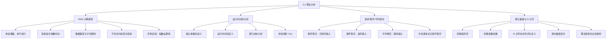

**相关笔记：** [[2.1 插入排序]] | [[2.3 分治法]]

> [!abstract] 概览
> 本节系统介绍了==算法分析==的基本框架：以==随机访问机（RAM）==模型为计算基础，通过逐行分析伪代码的执行次数来推导算法的==运行时间==（running time）。以插入排序为例，分别推导了==最好情况== $\Theta(n)$、==最坏情况== $\Theta(n^2)$ 和==平均情况== $\Theta(n^2)$ 的运行时间，并引入了==增长量级==（order of growth）和==$\Theta$ 记号==（Theta notation）来简化复杂度表达，为后续第 3 章的渐近记号严格定义奠定基础。
>
> - ==算法分析==的核心目标是预测算法所需的资源（主要是计算时间）
> - ==RAM 模型==假设每条指令和数据访问耗时相同（常数时间），指令串行执行
> - ==运行时间==是输入规模的函数 $T(n)$，通常关注==最坏情况==（worst case）
> - 插入排序最好情况 $\Theta(n)$（已排序），最坏情况 $\Theta(n^2)$（逆序）
> - ==增长量级==忽略低阶项和常数系数，只保留最高阶项（如 $an^2 + bn + c$ 简化为 $n^2$）
> - ==$\Theta$ 记号==（Theta notation）用于描述增长量级，$\Theta(n^2)$ 表示"当 $n$ 较大时大致正比于 $n^2$"

---

知识结构总览



---

核心思想

> [!tip] 核心思想
> 本节的核心思想是==抽象与简化==：算法分析的目标不是得到精确到微秒的运行时间，而是理解运行时间如何随==输入规模==的增长而增长。通过 RAM 模型将硬件差异抽象为常数因子，通过增长量级忽略低阶项和常数系数，我们得到一个简洁而强大的工具——$\Theta$ 记号——使得不同算法的效率可以在输入规模趋于无穷大的意义下进行有意义的比较。

### 1. RAM 计算模型

> [!def] 随机访问机模型（RAM Model）
> ==随机访问机==（Random-Access Machine，RAM）模型是本书用于分析算法的通用计算模型，其核心假设如下：
>
> 1. **单处理器、串行执行**：指令一条接一条地执行，没有并发操作
> 2. **每条指令耗时相同**：算术运算、数据移动、控制指令都花费==常数时间==
> 3. **每次数据访问耗时相同**：读取或存储任何变量的值（包括数组索引）都花费常数时间
> 4. **数据类型**：整数、浮点数、字符；布尔值用整数 0（FALSE）和非 0（TRUE）表示
> 5. **字长限制**：每个数据字有位数限制，通常假设整数为 $c \lg n$ 位（$c \geq 1$ 为常数），确保能表示下标 $n$ 但不会任意增长
>
> RAM 模型包含真实计算机中常见的指令：算术（加减乘除、取余、上下取整）、数据移动（加载、存储、复制）和控制（条件/无条件跳转、子程序调用与返回）。

> [!warning] RAM 模型的合理使用
> 使用 RAM 模型时必须注意不要滥用。例如，如果 RAM 有一条"排序"指令，那排序就只需一步——但这不现实，因为真实计算机没有这样的指令。我们的指导原则是：==RAM 模型中的指令应当反映真实计算机的设计==。
>
> **灰色区域示例：** 指数运算 $2^n$ 是否是常数时间操作？一般不是（需要 $O(\log n)$ 时间），但当 $n$ 是 2 的幂时，可以通过"左移 $n$ 位"在常数时间内完成（只要结果能放入一个计算机字中）。

> [!info] RAM 模型的局限性
> RAM 模型==不包含内存层次结构==（缓存、虚拟内存等），而真实计算机中内存层次对性能的影响有时是显著的。第 11.5 节和部分习题会讨论内存层次效应，但本书大部分分析不考虑这些因素。包含内存层次的计算模型比 RAM 模型复杂得多，且 RAM 模型的分析结果通常是实际机器性能的==优秀预测器==。

### 2. 运行时间的分析

> [!def] 输入规模（Input Size）
> ==输入规模==的最佳度量方式取决于具体问题：
> - **排序问题**：输入中元素的数量 $n$
> - **整数乘法**：输入的二进制表示总位数
> - **图问题**：顶点数和边数
>
> 本书在研究每个问题时会明确指出所使用的输入规模度量。

> [!def] 运行时间（Running Time）
> ==运行时间==是指在特定输入上执行的==指令条数和数据访问次数==。在 RAM 模型下，假设第 $k$ 行伪代码每次执行花费 $c_k$ 时间（$c_k$ 为常数），则算法的运行时间 $T(n)$ 为所有语句的"成本 $\times$ 次数"之和。

> [!example] 插入排序的逐行成本分析
> 对 INSERTION-SORT 进行逐行分析，设 $t_i$ 为第 5 行 while 循环测试对每个 $i$ 值的执行次数：
>
> | 行号 | 伪代码 | 成本 | 执行次数 |
> |:----:|--------|:----:|:--------:|
> | 1 | `for i = 2 to n` | $c_1$ | $n$ |
> | 2 | `key = A[i]` | $c_2$ | $n - 1$ |
> | 3 | `// 注释` | $0$ | $n - 1$ |
> | 4 | `j = i - 1` | $c_4$ | $n - 1$ |
> | 5 | `while j > 0 and A[j] > key` | $c_5$ | $\sum_{i=2}^{n} t_i$ |
> | 6 | `A[j + 1] = A[j]` | $c_6$ | $\sum_{i=2}^{n}(t_i - 1)$ |
> | 7 | `j = j - 1` | $c_7$ | $\sum_{i=2}^{n}(t_i - 1)$ |
> | 8 | `A[j + 1] = key` | $c_8$ | $n - 1$ |
>
> 运行时间为：
> $$T(n) = c_1 n + c_2(n-1) + c_4(n-1) + c_5 \sum_{i=2}^{n} t_i + c_6 \sum_{i=2}^{n}(t_i - 1) + c_7 \sum_{i=2}^{n}(t_i - 1) + c_8(n-1)$$

### 3. 最好情况、最坏情况与平均情况

> [!def] 最好情况（Best Case）
> ==最好情况==是对于给定规模的所有输入中，算法运行时间最短的情况。对于插入排序，最好情况发生在==数组已经有序==时：每次第 5 行测试立即为 FALSE，$t_i = 1$（$i = 2, 3, \ldots, n$）。
>
> $$T_{\text{best}}(n) = c_1 n + (c_2 + c_4 + c_5 + c_8)(n-1) = an + b$$
>
> 其中 $a = c_1 + c_2 + c_4 + c_5 + c_8$，$b = -(c_2 + c_4 + c_5 + c_8)$。最好情况运行时间是 $n$ 的==线性函数==。

> [!def] 最坏情况（Worst Case）
> ==最坏情况==是对于给定规模的所有输入中，算法运行时间最长的情况。对于插入排序，最坏情况发生在==数组逆序排列==时：每次需要将 $A[i]$ 与已排序子数组的所有元素比较，$t_i = i$（$i = 2, 3, \ldots, n$）。
>
> 利用 $\sum_{i=2}^{n} i = \frac{n(n+1)}{2} - 1$ 和 $\sum_{i=2}^{n}(i-1) = \frac{n(n-1)}{2}$：
>
> $$T_{\text{worst}}(n) = c_1 n + (c_2 + c_4 + c_8)(n-1) + c_5\left(\frac{n(n+1)}{2} - 1\right) + (c_6 + c_7)\frac{n(n-1)}{2}$$
>
> $$= an^2 + bn + c$$
>
> 其中 $a = \frac{c_5}{2} + \frac{c_6}{2} + \frac{c_7}{2}$，$b = c_1 + c_2 + c_4 + \frac{c_5}{2} - \frac{c_6}{2} - \frac{c_7}{2} + c_8$，$c = -(c_2 + c_4 + c_5 + c_8)$。最坏情况运行时间是 $n$ 的==二次函数==。

> [!def] 平均情况（Average Case）
> ==平均情况==是在某种输入分布假设下，算法运行时间的期望值。对于插入排序，假设输入为 $n$ 个随机数，则 $A[i]$ 平均需要与 $A[1 : i-1]$ 中约一半的元素比较，即 $t_i \approx i/2$。
>
> 平均情况运行时间同样是 $n$ 的==二次函数==，与最坏情况具有相同的增长量级 $\Theta(n^2)$。

> [!tip] 为何通常关注最坏情况？
> 本书通常（但不总是）关注==最坏情况运行时间==，原因有三：
> 1. **保证上界**：最坏情况给出运行时间的上界，保证算法在任何输入下都不会超过这个时间。这对==实时计算==尤为重要（操作必须在截止时间前完成）
> 2. **最坏情况经常发生**：例如数据库搜索中，"未找到"的搜索（最坏情况）可能频繁发生
> 3. **平均情况通常与最坏情况差不多**：如插入排序的平均情况和最坏情况都是 $\Theta(n^2)$
>
> 平均情况分析的局限性在于：可能不清楚"平均输入"的定义。实践中常假设所有等规模输入等概率出现，但这一假设未必成立。==随机化算法==（randomized algorithm）可以通过内部随机选择来使概率分析成立，得到期望运行时间（第 5 章及后续章节）。

### 4. 增长量级与 $\Theta$ 记号

> [!def] 增长量级（Order of Growth）
> ==增长量级==是运行时间公式中真正重要的部分。我们做两个简化：
> 1. **只保留最高阶项**：忽略低阶项（因为当 $n$ 很大时，低阶项相对不重要）
> 2. **忽略常数系数**：因为常数因子对计算效率的影响不如增长速率重要
>
> 例如，$an^2 + bn + c$ 的增长量级为 $n^2$。

> [!example] 增长量级的直观理解
> 考虑一个算法的运行时间为 $n^2/100 + 100n + 17$ 微秒。虽然 $n^2$ 项的系数 $1/100$ 和 $n$ 项的系数 $100$ 相差四个数量级，但一旦 $n$ 超过 $10{,}000$，$n^2/100$ 项就主导了 $100n$ 项。而 $10{,}000$ 相比许多现实世界问题的输入规模来说并不大。

> [!def] $\Theta$ 记号（Theta Notation，非形式化）
> ==$\Theta$ 记号==用于突出运行时间的增长量级。我们写插入排序的最坏情况运行时间为 $\Theta(n^2)$（读作"theta of n-squared"），最好情况为 $\Theta(n)$。
>
> 非形式化地理解：$\Theta(n^2)$ 意味着"当 $n$ 较大时，大致正比于 $n^2$"。
>
> $\Theta$ 记号的严格定义将在==第 3 章==中给出。

> [!tip] 算法效率的比较准则
> 我们通常认为==最坏情况运行时间增长量级更低==的算法更高效。虽然由于常数因子和低阶项的影响，增长量级较高的算法在小输入上可能更快，但对于足够大的输入（存在某个阈值 $n_0$），$\Theta(n^2)$ 的算法在最坏情况下总是优于 $\Theta(n^3)$ 的算法。
>
> **增长量级层次**（从低到高）：
> $$\Theta(1) < \Theta(\lg n) < \Theta(n) < \Theta(n \lg n) < \Theta(n^2) < \Theta(n^3) < \Theta(2^n) < \Theta(n!)$$
>
> 其中 $\lg n = \log_2 n$。归并排序（[[2.3 分治法]]）的最坏情况运行时间为 $\Theta(n \lg n)$，远优于插入排序的 $\Theta(n^2)$。

---

补充理解与拓展

> [!info] RAM 模型的历史与变体
> RAM 模型由 Shepherdson 和 Sturgis 于 1963 年首次形式化提出，是计算复杂性理论中最基础的计算模型之一。除了本书使用的统一成本 RAM（uniform-cost RAM，每条指令常数时间）外，还有对数成本 RAM（logarithmic-cost RAM，指令成本与操作数位数成正比）。对数成本模型更接近真实硬件，但分析起来更复杂。统一成本模型在算法分析中被广泛采用，因为对于大多数算法设计问题，两种模型给出相同的渐近结果。
>
> > 来源：J. C. Shepherdson and H. E. Sturgis, "Computability of Recursive Functions," *Journal of the ACM*, vol. 10, no. 2, 1963; A. V. Aho, J. E. Hopcroft, and J. D. Ullman, *The Design and Analysis of Computer Algorithms*, Addison-Wesley, 1974.

> [!info] 从精确公式到渐近分析：为什么忽略常数因子？
> 忽略常数因子的合理性来自三个层面：
> 1. **技术无关性**：常数因子高度依赖具体硬件、编译器优化、编程语言等因素。忽略它们使分析结果具有普适性
> 2. **大输入主导**：对于大规模输入（$n \to \infty$），增长量级是决定性因素，常数因子的差异被高阶项的增长所淹没
> 3. **简洁性**：$\Theta(n^2)$ 比 $3.47n^2 + 2.1n - 5$ 更简洁、更易比较、更具洞察力
>
> 但需注意，在实际工程中，当 $n$ 不够大或算法具有相同增长量级时，常数因子和低阶项就变得重要了。渐近分析是算法设计的"第一道筛选"，通过筛选后还需结合实际测试做精细评估。
>
> > 来源：T. H. Cormen et al., *Introduction to Algorithms*, 4th ed., MIT Press, 2022, Section 2.2; U. Manber, *Introduction to Algorithms: A Creative Approach*, Addison-Wesley, 1989.

---

易混淆点与辨析

> [!warning] "最坏情况"与"平均情况"的混淆
> 初学者常认为"平均情况"就是"最坏情况的一半"或"中间值"。
>
> - ❌ "平均情况运行时间是最坏情况和最好情况的平均值"
> - ✅ "平均情况是在特定概率分布下所有可能输入的运行时间的==期望值==，需要通过概率分析推导"
>
> 以插入排序为例：
> - 最好情况 $T_{\text{best}}(n) = an + b$（线性）
> - 最坏情况 $T_{\text{worst}}(n) = an^2 + bn + c$（二次）
> - 平均情况 $T_{\text{avg}}(n) \approx an^2/2 + \cdots$（也是二次，系数约为最坏情况的一半）
>
> 平均情况与最好情况的"平均"无关，它的增长量级与最坏情况相同（都是 $\Theta(n^2)$），只是常数因子更小。

> [!warning] $\Theta$ 记号与精确运行时间的混淆
> 初学者常将 $\Theta(n^2)$ 理解为"运行时间恰好等于 $n^2$"。
>
> - ❌ "$\Theta(n^2)$ 意味着运行时间就是 $n^2$"
> - ✅ "$\Theta(n^2)$ 意味着运行时间以 $n^2$ 的速率增长，隐藏了常数因子和低阶项"
>
> 具体来说，$T(n) = \Theta(n^2)$ 意味着存在正常数 $c_1, c_2, n_0$，使得对所有 $n \geq n_0$，有 $c_1 n^2 \leq T(n) \leq c_2 n^2$（严格定义见第 3 章）。例如，$3n^2 + 7n + 2$、$0.01n^2 + 1000n$、$\frac{1}{2}n^2 - 3n + 100$ 都是 $\Theta(n^2)$。

---

习题精选

| 题号 | 核心考点 | 难度 |
|:----:|---------|:----:|
| 2.2-1 | 用 $\Theta$ 记号表示多项式函数 | ⭐ |
| 2.2-2 | 选择排序的伪代码、循环不变式与复杂度分析 | ⭐⭐ |
| 2.2-3 | 线性搜索的平均情况与最坏情况分析 | ⭐⭐ |
| 2.2-4 | 如何使任何排序算法具有好的最好情况运行时间 | ⭐⭐ |

> [!faq]- 2.2-1 用 $\Theta$ 记号表示函数 $n^3/1000 + 100n^2 - 100n + 3$。
> 该函数的最高阶项为 $n^3/1000$。
>
> 忽略低阶项 $100n^2 - 100n + 3$ 和常数系数 $1/1000$，增长量级为 $n^3$。
>
> 因此，$n^3/1000 + 100n^2 - 100n + 3 = \Theta(n^3)$。

> [!faq]- 2.2-2 考虑选择排序（selection sort）：每次从未排序部分找到最小元素，与未排序部分的第一个元素交换。写出伪代码，给出循环不变式，分析最坏情况运行时间。
> **伪代码：**
> ```
> SELECTION-SORT(A, n)
> 1  for i = 1 to n - 1
> 2      min_idx = i
> 3      for j = i + 1 to n
> 4          if A[j] < A[min_idx]
> 5              min_idx = j
> 6      exchange A[i] with A[min_idx]
> ```
>
> **循环不变式：** 在第 1--6 行外层 `for` 循环的每次迭代开始时，子数组 $A[1 : i-1]$ 包含原数组 $A[1 : n]$ 中最小的 $i-1$ 个元素，且已按排好序的顺序排列。
>
> **为何只需前 $n-1$ 个元素？** 当 $i = n$ 时，$A[1 : n-1]$ 已包含最小的 $n-1$ 个元素，则 $A[n]$ 必然是最大的元素，无需再交换。
>
> **最坏情况运行时间：** 内层循环（第 3--5 行）对每个 $i$ 执行 $n - i$ 次，总比较次数为 $\sum_{i=1}^{n-1}(n-i) = \frac{n(n-1)}{2}$。因此最坏情况运行时间为 $\Theta(n^2)$。
>
> **最好情况：** 无论输入如何排列，选择排序都必须执行所有比较，因此最好情况运行时间也是 $\Theta(n^2)$。

> [!faq]- 2.2-3 再次考虑线性搜索（习题 2.1-4）。假设被搜索的元素等概率地出现在数组中的任何位置，平均需要检查多少个元素？最坏情况呢？用 $\Theta$ 记号给出平均情况和最坏情况的运行时间。
> **平均情况：** 被搜索元素 $v$ 等概率地在位置 $1, 2, \ldots, n$ 中的任何一个，或者不在数组中（共 $n+1$ 种等概率情况）。
> - 若 $v$ 在位置 $i$（$1 \leq i \leq n$），检查 $i$ 个元素
> - 若 $v$ 不在数组中，检查 $n$ 个元素
>
> 平均检查次数 = $\frac{1}{n+1}\left(\sum_{i=1}^{n} i + n\right) = \frac{1}{n+1}\left(\frac{n(n+1)}{2} + n\right) = \frac{n}{2} + \frac{n}{n+1}$
>
> 因此平均情况运行时间为 $\Theta(n)$。
>
> **最坏情况：** $v$ 不在数组中（或 $v = A[n]$），需要检查全部 $n$ 个元素。最坏情况运行时间为 $\Theta(n)$。

> [!faq]- 2.2-4 如何修改任何排序算法，使其具有好的最好情况运行时间？
> 在排序算法开始前，先检查数组是否已经有序。如果已有序，直接返回。
>
> ```
> SORT-WITH-GOOD-BEST-CASE(A, n)
> 1  already_sorted = TRUE
> 2  for i = 2 to n
> 3      if A[i] < A[i - 1]
> 4          already_sorted = FALSE
> 5          break
> 6  if already_sorted
> 7      return A
> 8  // 否则调用原排序算法
> 9  ...（原排序算法的代码）
> ```
>
> 这个预处理步骤花费 $\Theta(n)$ 时间。如果输入已排序，算法在 $\Theta(n)$ 时间内返回；否则，预处理只增加了 $\Theta(n)$ 的开销，不影响原算法的渐近运行时间。

---

视频学习指南

| 资源 | 链接 | 对应内容 | 备注 |
|------|------|---------|------|
| MIT 6.006 Lecture 1 | https://www.youtube.com/watch?v=HtSuA80QTyo | 插入排序分析、归并排序预览 | Erik Demaine 教授 |
| MIT 6.006 Lecture 2 | https://www.youtube.com/watch?v=0ZJCrJLs5GY | 渐近记号、文档距离 | 含 Big O/Theta/Omega |
| 河南大学《算法导论》中文字幕版 | https://www.bilibili.com/video/BV1H4411B7FY | 2.2 算法分析 | 中文授课 |
| Abdul Bari - Time Complexity | https://www.youtube.com/watch?v=IRYgD7-3y0c | 时间复杂度基础 | 直观讲解 |

---

教材原文

> [!quote] 教材原文摘录
> "Analyzing an algorithm has come to mean predicting the resources that the algorithm requires. You might consider resources such as memory, communication bandwidth, or energy consumption. Most often, however, you'll want to measure computational time."
>
> "The RAM model assumes that each instruction takes the same amount of time as any other instruction and that each data access—using the value of a variable or storing into a variable—takes the same amount of time as any other data access."
>
> "The worst-case running time of an algorithm gives an upper bound on the running time for any input. If you know it, then you have a guarantee that the algorithm never takes any longer."
>
> "We therefore consider only the leading term of a formula, since the lower-order terms are relatively insignificant for large values of n. We also ignore the leading term's constant coefficient, since constant factors are less significant than the rate of growth in determining computational efficiency for large inputs."
>
> "We usually consider one algorithm to be more efficient than another if its worst-case running time has a lower order of growth."

---

## 参见 Wiki

- [[算法导论/concepts/RAM模型]]
- [[算法导论/concepts/运行时间]]
- [[算法导论/concepts/增长量级]]
- [[算法导论/concepts/大Theta记号|Theta记号]]
- [[算法导论/concepts/最坏情况分析]]
- [[算法导论/concepts/最好情况分析]]
- [[算法导论/concepts/平均情况分析]]
- [[算法导论/concepts/随机化算法]]

#学习/算法导论/入门/算法分析
