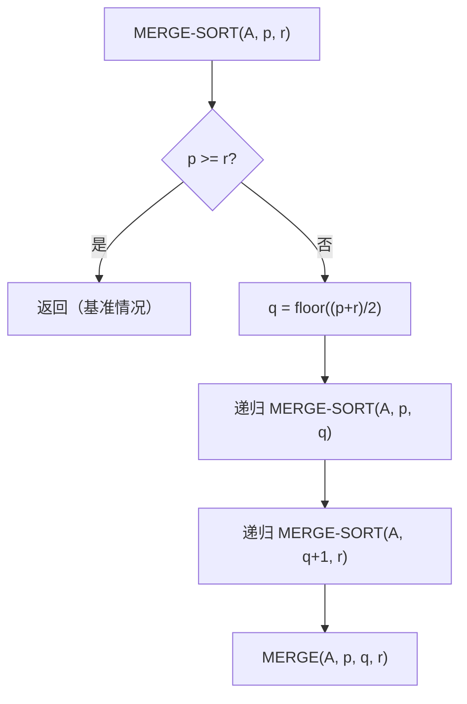

**相关笔记：** [[2.2 算法分析]]

> [!abstract] 概览
> 本节系统介绍了==分治法（divide-and-conquer）==这一核心算法设计范式，并以==归并排序（merge sort）==为完整案例，展示了分治策略"分解—解决—合并"三步骤的实际运用。内容涵盖 MERGE 过程的详细伪代码与执行过程演示、MERGE-SORT 的递归结构、==递归关系式（recurrence）==的建立与求解，以及通过==递归树（recursion tree）==方法直观理解归并排序 $\Theta(n \lg n)$ 的时间复杂度。
>
> - ==分治法==将问题分解为更小的子问题，递归求解后合并结果，是许多高效算法的基础设计范式
> - ==归并排序==遵循分治三步骤：将数组一分为二、递归排序两个子数组、合并两个有序子数组
> - ==MERGE 过程==在 $\Theta(n)$ 时间内将两个有序子数组合并为一个有序数组，是归并排序的核心操作
> - 归并排序的最坏情况运行时间由递归关系式 $T(n) = 2T(n/2) + \Theta(n)$ 描述，其解为 $T(n) = \Theta(n \lg n)$
> - 通过递归树方法可以直观理解：$\lg n + 1$ 层，每层代价为 $cn$，总代价为 $\Theta(n \lg n)$
> - 相比[[算法导论/concepts/插入排序]]的 $\Theta(n^2)$，归并排序用 $\lg n$ 因子替换了 $n$ 因子，对大规模输入优势显著

---

知识结构总览

```mermaid
graph TB
    A["2.3 分治法"] --> B["分治法范式"]
    A --> C["归并排序算法"]
    A --> D["MERGE 过程"]
    A --> E["递归关系式分析"]
    A --> F["递归树方法"]

    B --> B1["分解 Divide"]
    B --> B2["解决 Conquer"]
    B --> B3["合并 Combine"]
    B --> B4["基准情况 Base Case"]

    C --> C1["MERGE-SORT 伪代码"]
    C --> C2["递归分解过程"]
    C --> C3["合并回溯过程"]
    C --> C4["完整执行示例"]

    D --> D1["MERGE 伪代码"]
    D --> D2["临时数组 L 和 R"]
    D --> D3["主合并循环"]
    D --> D4["尾部复制"]
    D --> D5["时间复杂度 Θ(n)"]

    E --> E1["递归关系式的建立"]
    E --> E2["D(n)、C(n) 的分析"]
    E --> E3["T(n) = 2T(n/2) + Θ(n)"]
    E --> E4["主定理预告"]

    F --> F1["递归树的构造"]
    F --> F2["逐层代价分析"]
    F --> F3["总代价计算"]
    F --> F4["与插入排序的对比"]
```



---

核心思想

> [!tip] 核心思想
> 本节的核心思想是==分治策略==：许多有用的算法具有递归结构——为了解决给定问题，递归地调用自身来处理与之密切相关的更小子问题。分治法在每一步执行三个特征操作：==分解==（将问题划分为更小的子问题）、==解决==（递归地求解子问题）、==合并==（将子问题的解组合为原问题的解）。当问题规模足够小时直接求解（基准情况），无需继续递归。归并排序是分治法的经典范例，其最坏情况运行时间 $\Theta(n \lg n)$ 远优于[[算法导论/concepts/插入排序]]的 $\Theta(n^2)$。

### 1. 分治法范式

> [!def] 分治法（Divide and Conquer）
> ==分治法==是一种递归式的算法设计范式，其核心思路是将原问题分解为若干个与原问题结构相同但规模更小的子问题，递归地求解这些子问题，最后将子问题的解合并为原问题的解。
>
> 分治法在每一步执行三个操作：
> 1. **分解（Divide）：** 将问题划分为一个或多个与原问题相同形式但规模更小的子问题
> 2. **解决（Conquer）：** 递归地求解各子问题。当子问题规模足够小时，直接求解（==基准情况==）
> 3. **合并（Combine）：** 将子问题的解合并为原问题的解

> [!example] 分治法的直觉理解：整理书架
> 想象你要将书架上 1000 本乱序的书按字母顺序排列。分治法的思路是：
> - **分解：** 把书架从中间分成左右两半，每半约 500 本
> - **解决：** 分别整理左半边和右半边（各自再继续分治）
> - **合并：** 两半都整理好后，像拉链一样将两排有序的书合并为一排
>
> 当书架上只剩 1 本书时，它天然就是有序的——这就是基准情况。

### 2. 归并排序（MERGE-SORT）

> [!def] 归并排序（Merge Sort）
> ==归并排序==是分治法的经典应用，对子数组 $A[p..r]$ 进行排序。其三个步骤为：
> - **分解：** 计算中点 $q = \lfloor(p+r)/2\rfloor$，将 $A[p..r]$ 分为 $A[p..q]$ 和 $A[q+1..r]$
> - **解决：** 递归调用 MERGE-SORT 分别排序 $A[p..q]$ 和 $A[q+1..r]$
> - **合并：** 调用 MERGE 将两个已排序的子数组合并为一个有序的 $A[p..r]$
>
> ==基准情况==：当 $p \geq r$ 时，子数组至多包含一个元素，天然有序，直接返回。

**MERGE-SORT 伪代码：**

> [!tip] 算法执行流程
> 1. 若 **p >= r**，子数组至多一个元素，直接**返回**
> 2. 计算中点 **q = floor((p+r)/2)**
> 3. 递归排序**左半部分** A[p..q]
> 4. 递归排序**右半部分** A[q+1..r]
> 5. 调用 **MERGE** 合并两个有序子数组



```
MERGE-SORT(A, p, r)
1  if p ≥ r                            // 零个或一个元素？
2      return
3  q = ⌊(p + r)/2⌋                     // A[p..r] 的中点
4  MERGE-SORT(A, p, q)                 // 递归排序 A[p..q]
5  MERGE-SORT(A, q + 1, r)             // 递归排序 A[q+1..r]
6  // 将 A[p..q] 和 A[q+1..r] 合并为 A[p..r]
7  MERGE(A, p, q, r)
```

> [!example] 归并排序的完整执行过程
> 对输入数组 $A = \langle 12, 3, 7, 9, 14, 6, 11, 2 \rangle$（$n=8$）执行归并排序：
>
> **分解阶段（自顶向下）：**
>
> ```
> MERGE-SORT(A, 1, 8)
> ├── MERGE-SORT(A, 1, 4)
> │   ├── MERGE-SORT(A, 1, 2)
> │   │   ├── MERGE-SORT(A, 1, 1) → 基准情况，返回
> │   │   ├── MERGE-SORT(A, 2, 2) → 基准情况，返回
> │   │   └── MERGE(A, 1, 1, 2) → ⟨3, 12⟩
> │   ├── MERGE-SORT(A, 3, 4)
> │   │   ├── MERGE-SORT(A, 3, 3) → 基准情况，返回
> │   │   ├── MERGE-SORT(A, 4, 4) → 基准情况，返回
> │   │   └── MERGE(A, 3, 3, 4) → ⟨7, 9⟩
> │   └── MERGE(A, 1, 2, 4) → ⟨3, 7, 9, 12⟩
> └── MERGE-SORT(A, 5, 8)
>     ├── MERGE-SORT(A, 5, 6)
>     │   ├── MERGE-SORT(A, 5, 5) → 基准情况，返回
>     │   ├── MERGE-SORT(A, 6, 6) → 基准情况，返回
>     │   └── MERGE(A, 5, 5, 6) → ⟨6, 14⟩
>     ├── MERGE-SORT(A, 7, 8)
>     │   ├── MERGE-SORT(A, 7, 7) → 基准情况，返回
>     │   ├── MERGE-SORT(A, 8, 8) → 基准情况，返回
>     │   └── MERGE(A, 7, 7, 8) → ⟨2, 11⟩
>     └── MERGE(A, 5, 6, 8) → ⟨2, 6, 11, 14⟩
>
> 最终 MERGE(A, 1, 4, 8) → ⟨2, 3, 6, 7, 9, 11, 12, 14⟩
> ```

### 3. MERGE 过程

> [!def] MERGE 过程
> ==MERGE(A, p, q, r)== 是归并排序的核心子过程，将两个已排序的相邻子数组 $A[p..q]$ 和 $A[q+1..r]$ 合并为一个有序的 $A[p..r]$。其前提条件是 $p \leq q < r$，且两个子数组已经分别有序。
>
> MERGE 的工作方式类似于整理两叠面朝上的扑克牌：每次比较两叠牌顶部的最小牌，将较小者放入输出堆，直到某一叠为空，然后将另一叠剩余的牌全部放入输出堆。

**MERGE 伪代码：**

```
MERGE(A, p, q, r)
 1  nL = q - p + 1          // A[p..q] 的长度
 2  nR = r - q              // A[q+1..r] 的长度
 3  let L[0..nL-1] and R[0..nR-1] be new arrays
 4  for i = 0 to nL - 1     // 复制 A[p..q] 到 L
 5      L[i] = A[p + i]
 6  for j = 0 to nR - 1     // 复制 A[q+1..r] 到 R
 7      R[j] = A[q + j + 1]
 8  i = 0                   // i 指向 L 中剩余最小元素
 9  j = 0                   // j 指向 R 中剩余最小元素
10  k = p                   // k 指向 A 中待填充位置
11  // 只要 L 和 R 中都还有未合并的元素，
12  // 就将最小的未合并元素复制回 A[p..r]
13  while i < nL and j < nR
14      if L[i] ≤ R[j]
15          A[k] = L[i]
16          i = i + 1
17      else A[k] = R[j]
18          j = j + 1
19      k = k + 1
20  // 复制 L 的剩余元素到 A 的末尾
21  while i < nL
22      A[k] = L[i]
23      i = i + 1
24      k = k + 1
25  // 复制 R 的剩余元素到 A 的末尾
26  while j < nR
27      A[k] = R[j]
28      j = j + 1
29      k = k + 1
```

> [!example] MERGE 过程的逐步执行演示
> 调用 $\text{MERGE}(A, 9, 12, 16)$，其中 $A[9..16] = \langle 2, 4, 6, 7, 1, 2, 3, 5 \rangle$。
>
> **步骤 1：复制到临时数组**
> - $nL = 12 - 9 + 1 = 4$，$nR = 16 - 12 = 4$
> - $L = \langle 2, 4, 6, 7 \rangle$，$R = \langle 1, 2, 3, 5 \rangle$
>
> **步骤 2：主合并循环（第 12-18 行）**
>
> | 迭代 | $i$ | $j$ | $k$ | $L[i]$ | $R[j]$ | 比较 | 操作 | $A[k]$ |
> |:----:|:---:|:---:|:---:|:------:|:------:|------|------|:------:|
> | 初始 | 0 | 0 | 9 | 2 | 1 | $2 \leq 1$? 否 | $A[9]=R[0]=1$, $j{++}$ | 1 |
> | 1 | 0 | 1 | 10 | 2 | 2 | $2 \leq 2$? 是 | $A[10]=L[0]=2$, $i{++}$ | 2 |
> | 2 | 1 | 1 | 11 | 4 | 2 | $4 \leq 2$? 否 | $A[11]=R[1]=2$, $j{++}$ | 2 |
> | 3 | 1 | 2 | 12 | 4 | 3 | $4 \leq 3$? 否 | $A[12]=R[2]=3$, $j{++}$ | 3 |
> | 4 | 1 | 3 | 13 | 4 | 5 | $4 \leq 5$? 是 | $A[13]=L[1]=4$, $i{++}$ | 4 |
> | 5 | 2 | 3 | 14 | 6 | 5 | $6 \leq 5$? 否 | $A[14]=R[3]=5$, $j{++}$ | 5 |
> | 6 | 2 | 4 | 15 | 6 | — | $j = nR = 4$，循环终止 | — | — |
>
> **步骤 3：复制剩余元素**
> - $j = nR = 4$，第 24-27 行循环执行 0 次
> - $i = 2 < nL = 4$，第 20-23 行复制 $L[2]=6 \to A[15]$，$L[3]=7 \to A[16]$
>
> **最终结果：** $A[9..16] = \langle 1, 2, 2, 3, 4, 5, 6, 7 \rangle$ ✓

> [!tip] MERGE 过程的时间复杂度分析
> MERGE 在 $\Theta(n)$ 时间内完成（$n = r - p + 1$）：
> - 第 1-3 行和第 8-10 行：各为常数时间 $\Theta(1)$
> - 第 4-7 行的 for 循环：复制 $n_L + n_R = n$ 个元素，$\Theta(n)$
> - 第 12-18、20-23、24-27 行的三个 while 循环：每次迭代恰好将一个元素从 $L$ 或 $R$ 复制回 $A$，且每个元素恰好被复制一次，因此三个循环总共执行 $n$ 次迭代，每次迭代为常数时间，总计 $\Theta(n)$

### 4. 递归关系式与归并排序分析

> [!def] 递归关系式（Recurrence）
> ==递归关系式==（或递归方程）用于描述包含递归调用的算法的运行时间。它将规模为 $n$ 的问题的运行时间表示为更小规模输入上同一算法的运行时间的函数。
>
> 分治算法的递归关系式的一般形式为：
> $$T(n) = \begin{cases} \Theta(1) & \text{若 } n < n_0 \text{（基准情况）} \\ aT(n/b) + D(n) + C(n) & \text{否则（递归情况）} \end{cases}$$
>
> 其中：
> - $a$ = 子问题的数量
> - $n/b$ = 每个子问题的规模
> - $D(n)$ = 分解步骤的代价
> - $C(n)$ = 合并步骤的代价

> [!def] 归并排序的递归关系式
> 对归并排序，设 $T(n)$ 为最坏情况下排序 $n$ 个元素所需的运行时间：
>
> - **分解：** 计算中点 $q$，$D(n) = \Theta(1)$
> - **解决：** 递归求解两个规模为 $n/2$ 的子问题，代价为 $2T(n/2)$
> - **合并：** MERGE 过程在 $n$ 个元素上运行，$C(n) = \Theta(n)$
>
> 因此归并排序的递归关系式为：
> $$T(n) = 2T(n/2) + \Theta(n)$$
>
> 其中 $\Theta(n)$ 包含了分解的 $\Theta(1)$ 和合并的 $\Theta(n)$（线性函数主导常数）。

### 5. 递归树方法

> [!def] 递归树（Recursion Tree）
> ==递归树==是一种将递归关系式展开为树形结构的可视化方法，用于直观理解和求解递归关系式。树的每个节点表示一次递归调用的代价，子节点表示递归展开后的子问题代价。
>
> 为简化分析，假设 $n$ 是 2 的幂，且基准情况为 $n = 1$。此时递归关系式可写为：
> $$T(n) = \begin{cases} c_1 & \text{若 } n = 1 \\ 2T(n/2) + c_2 n & \text{若 } n > 1 \end{cases}$$
>
> 其中 $c_1 > 0$ 是规模为 1 时的代价，$c_2 > 0$ 是分解和合并步骤中每个数组元素的单位代价。

> [!example] 递归树的构造与逐层分析
> 以 $n = 8$ 为例，构造递归树：
>
> ```
>                        T(8)
>                       /    \
>                  c₂·8        c₂·8
>                 /    \      /    \
>            T(4)    T(4)  T(4)    T(4)
>           c₂·4    c₂·4  c₂·4    c₂·4
>           / \      / \    / \      / \
>         T(2) T(2) T(2) T(2) ...（共 8 个 T(2) 节点）
>        c₂·2 c₂·2 c₂·2 c₂·2 ...（每节点代价 c₂·2）
>        / \   / \   / \   / \
>      T(1) ...（共 16 个 T(1) 叶节点，每节点代价 c₁）
> ```
>
> **逐层代价分析：**
>
> | 层级（距顶部） | 节点数 | 每节点代价 | 该层总代价 |
> |:--------------:|:------:|:----------:|:----------:|
> | 0（根） | 1 | $c_2 n$ | $c_2 n$ |
> | 1 | 2 | $c_2 n/2$ | $2 \cdot c_2 n/2 = c_2 n$ |
> | 2 | 4 | $c_2 n/4$ | $4 \cdot c_2 n/4 = c_2 n$ |
> | ... | ... | ... | ... |
> | $i$ | $2^i$ | $c_2 n / 2^i$ | $2^i \cdot c_2 n / 2^i = c_2 n$ |
> | ... | ... | ... | ... |
> | $\lg n$（叶） | $n$ | $c_1$ | $c_1 n$ |
>
> **关键观察：** 叶以上的每一层代价都是 $c_2 n$——节点数翻倍但每节点代价减半，两者恰好抵消。
>
> **总层数：** $\lg n + 1$（从第 0 层到第 $\lg n$ 层）
>
> **总代价计算：**
> $$\text{总代价} = \underbrace{c_2 n \cdot \lg n}_{\text{叶以上的 }\lg n \text{ 层}} + \underbrace{c_1 n}_{\text{叶层}} = \Theta(n \lg n)$$

> [!tip] 归并排序 vs 插入排序
> 归并排序用 $\lg n$ 因子替换了[[算法导论/concepts/插入排序]]中的 $n$ 因子：
> - [[算法导论/concepts/插入排序]]：$\Theta(n^2)$
> - 归并排序：$\Theta(n \lg n)$
>
> 由于对数函数的增长速度慢于任何线性函数（即 $\lg n = o(n)$），这是一个非常有利的交换。对于足够大的输入，归并排序的 $\Theta(n \lg n)$ 最坏情况运行时间远优于插入排序的 $\Theta(n^2)$。
>
> 例如，当 $n = 10^6$ 时：
> - 插入排序：$\sim 10^{12}$ 次操作
> - 归并排序：$\sim 2 \times 10^7$ 次操作
> - 归并排序快约 **50,000 倍**

---

补充理解与拓展

> [!info] 分治法的历史与应用
> 分治法的思想可以追溯到古代数学。公元 1800 年左右，Joseph-Marie Jacquard 在提花织机中使用了分治思想来分解复杂的编织图案。在计算机科学中，分治法在 1945 年由 John von Neumann 首次在归并排序中正式提出。此后，分治法催生了众多经典算法：快速排序（Hoare, 1962）、Strassen 矩阵乘法（1969）、快速傅里叶变换 FFT（Cooley-Tukey, 1965）等。分治法也是并行计算和分布式系统的理论基础之一——子问题天然可以在不同处理器上独立求解。
>
> > 来源：T. H. Cormen et al., *Introduction to Algorithms*, 4th ed., MIT Press, 2022, Section 4.1; D. E. Knuth, *The Art of Computer Programming, Vol. 3: Sorting and Searching*, Addison-Wesley, 1973.

> [!info] 递归树方法的数学基础
> 递归树方法是求解分治递归关系式的多种技术之一。第 4 章将系统介绍三种主要方法：(1) **代入法**（substitution method）——先猜测解的形式，再用数学归纳法证明；(2) **递归树法**（recursion-tree method）——将递归展开为树，逐层求和；(3) **主定理**（master theorem）——直接给出形如 $T(n) = aT(n/b) + f(n)$ 的递归关系式的渐近解。本节使用的递归树方法虽然直观，但在形式化证明中需要结合归纳法才能严格成立。主定理则提供了最便捷的"公式化"求解途径。
>
> > 来源：T. H. Cormen et al., *Introduction to Algorithms*, 4th ed., MIT Press, 2022, Chapter 4 "Divide-and-Conquer".

---

易混淆点与辨析

> [!warning] "分治法"与"递归"的混淆
> 初学者常将分治法等同于递归，认为"递归就是分治"。
>
> | | 分治法（Divide and Conquer） | 递归（Recursion） |
> |---|---|---|
> | 本质 | 一种**算法设计策略**，强调"分解—解决—合并"三步骤 | 一种**程序实现技术**，函数调用自身 |
> | 关系 | 分治法通常**使用**递归来实现 | 递归可用于实现分治法，也可用于其他目的（如遍历） |
> | 判定标准 | 是否将问题分解为**独立子问题**后合并 | 是否存在函数的**自调用** |
>
> - ❌ "递归算法就是分治算法"
> - ✅ "分治法是一种利用递归实现的算法设计范式，其核心特征是将问题分解为独立子问题、递归求解后合并结果。并非所有递归算法都是分治算法（如递归求阶乘并不分解问题）"

> [!warning] "MERGE 的 $\Theta(n)$"与"归并排序的 $\Theta(n \lg n)$"的混淆
> 初学者常混淆 MERGE 子过程和整个归并排序的时间复杂度。
>
> - ❌ "归并排序的时间复杂度是 $\Theta(n)$，因为 MERGE 是 $\Theta(n)$ 的"
> - ✅ "MERGE 单次调用确实是 $\Theta(n)$，但归并排序需要递归地调用 MERGE 共 $\Theta(n)$ 次（分布在 $\lg n + 1$ 层上，每层合并总量为 $n$ 个元素），因此总时间为 $\Theta(n) \times \Theta(\lg n) = \Theta(n \lg n)$"
>
> 直觉理解：MERGE 只负责"合并两个有序数组"这一步操作，而归并排序需要先递归地将数组不断一分为二直到单个元素，再逐层合并回去。递归树清楚地展示了这一点——每一层合并的总代价都是 $\Theta(n)$，共有 $\Theta(\lg n)$ 层。

---

习题精选

| 题号 | 核心考点 | 难度 |
|:----:|---------|:----:|
| 2.3-1 | 归并排序的完整执行过程 | ⭐⭐ |
| 2.3-2 | MERGE-SORT 基准情况的边界条件 | ⭐⭐ |
| 2.3-3 | MERGE 过程的循环不变式证明 | ⭐⭐⭐ |
| 2.3-4 | 递归关系式的数学归纳法证明 | ⭐⭐⭐ |
| 2.3-5 | 递归版本的插入排序 | ⭐⭐ |

> [!faq]- 2.3-1 使用图 2.4 作为模型，说明归并排序在初始包含序列 $\langle 3, 41, 52, 26, 38, 57, 9, 49 \rangle$ 的数组上的操作过程。
> **分解阶段：**
>
> ```
> MERGE-SORT(A, 1, 8)
> ├── MERGE-SORT(A, 1, 4)
> │   ├── MERGE-SORT(A, 1, 2)
> │   │   ├── MERGE-SORT(A, 1, 1) → ⟨3⟩
> │   │   ├── MERGE-SORT(A, 2, 2) → ⟨41⟩
> │   │   └── MERGE(A, 1, 1, 2) → ⟨3, 41⟩
> │   ├── MERGE-SORT(A, 3, 4)
> │   │   ├── MERGE-SORT(A, 3, 3) → ⟨52⟩
> │   │   ├── MERGE-SORT(A, 4, 4) → ⟨26⟩
> │   │   └── MERGE(A, 3, 3, 4) → ⟨26, 52⟩
> │   └── MERGE(A, 1, 2, 4) → ⟨3, 26, 41, 52⟩
> └── MERGE-SORT(A, 5, 8)
>     ├── MERGE-SORT(A, 5, 6)
>     │   ├── MERGE-SORT(A, 5, 5) → ⟨38⟩
>     │   ├── MERGE-SORT(A, 6, 6) → ⟨57⟩
>     │   └── MERGE(A, 5, 5, 6) → ⟨38, 57⟩
>     ├── MERGE-SORT(A, 7, 8)
>     │   ├── MERGE-SORT(A, 7, 7) → ⟨9⟩
>     │   ├── MERGE-SORT(A, 8, 8) → ⟨49⟩
>     │   └── MERGE(A, 7, 7, 8) → ⟨9, 49⟩
>     └── MERGE(A, 5, 6, 8) → ⟨9, 38, 49, 57⟩
>
> 最终 MERGE(A, 1, 4, 8) → ⟨3, 9, 26, 38, 41, 49, 52, 57⟩
> ```

> [!faq]- 2.3-2 MERGE-SORT 过程第 1 行的测试是 "if $p \geq r$" 而不是 "if $p \neq r$"。如果 MERGE-SORT 以 $p > r$ 被调用，则子数组 $A[p..r]$ 为空。论证只要 MERGE-SORT$(A, 1, n)$ 的初始调用满足 $n \geq 1$，测试 "if $p \neq r$" 就足以保证不会有递归调用出现 $p > r$ 的情况。
> **证明：** 我们需要证明：如果初始调用满足 $n \geq 1$（即 $1 \leq r$），则使用 "if $p \neq r$" 不会导致任何递归调用出现 $p > r$。
>
> **【数学归纳法（基础+递推）】** 使用数学归纳法，对子数组长度 $r - p + 1$ 进行归纳：
>
> **【基础情况（k=1）】** 当 $r - p + 1 = 1$ 时，$p = r$，条件 $p \neq r$ 为假，直接返回，不会产生递归调用。
>
> **【归纳步骤（假设+推导）】** 假设对所有长度 $\leq k$（$k \geq 1$）的子数组，使用 "if $p \neq r$" 不会产生 $p > r$ 的递归调用。考虑长度为 $k + 1$ 的子数组 $A[p..r]$，其中 $r - p + 1 = k + 1$，因此 $p < r$，条件 $p \neq r$ 为真。计算 $q = \lfloor(p+r)/2\rfloor$：
> - 左子数组 $A[p..q]$：长度为 $q - p + 1$。由于 $q \geq p$（因为 $p < r$），长度 $\geq 1$。又因为 $q < r$（中点严格小于右端点），长度 $\leq k$。由归纳假设，不会产生 $p > r$ 的调用。
> - 右子数组 $A[q+1..r]$：长度为 $r - q$。由于 $q < r$，长度 $\geq 1$。又因为 $q \geq p$，$r - q \leq r - p = k$，长度 $\leq k$。由归纳假设，不会产生 $p > r$ 的调用。
>
> 因此，"if $p \neq r$" 在初始调用满足 $n \geq 1$ 时是充分的。教材使用 "if $p \geq r$" 是一种更保守的防御性编程做法，可以处理空子数组的边界情况。

> [!faq]- 2.3-3 陈述 MERGE 过程第 12-18 行 while 循环的循环不变式。说明如何使用它，结合第 20-23 行和第 24-27 行的 while 循环，证明 MERGE 过程的正确性。
> **循环不变式：** 在第 12-18 行 while 循环每次迭代开始时：
> - 子数组 $A[p..k-1]$ 包含 $L[p..q]$ 和 $R[q+1..r]$ 中最小的 $k - p$ 个元素，且已排好序
> - $L[i..n_L-1]$ 和 $R[j..n_R-1]$ 中剩余的元素尚未被复制回 $A$
>
> **【循环不变量（初始化+保持+终止）】**
>
> **初始化：** 循环开始前 $k = p$，$i = 0$，$j = 0$。$A[p..p-1]$ 为空子数组，包含 $0 = k - p$ 个最小元素，不变式成立。
>
> **保持：** 每次迭代比较 $L[i]$ 和 $R[j]$，将较小者放入 $A[k]$，并递增相应索引和 $k$。因此 $A[p..k]$ 现在包含最小的 $k - p + 1$ 个已排序元素。不变式在下次迭代开始时保持。
>
> **终止：** 循环终止时 $i = n_L$ 或 $j = n_R$，即 $L$ 或 $R$ 中有一个已全部复制。$A[p..k-1]$ 包含已复制的所有元素，且已排序。剩余的元素全部在另一个数组中，且都大于已复制的元素。
>
> **【尾部循环的正确性（剩余元素追加）】** 第 20-23 行和第 24-27 行的 while 循环将剩余数组中的元素按序追加到 $A$ 的末尾。由于剩余元素本身已有序且都大于已复制的元素，最终 $A[p..r]$ 是完全有序的。MERGE 过程正确。

> [!faq]- 2.3-4 使用数学归纳法证明当 $n \geq 2$ 是 2 的幂时，递归关系式 $T(n) = \begin{cases} 2 & \text{若 } n = 2 \\ 2T(n/2) + n & \text{若 } n = 2^k, k > 1 \end{cases}$ 的解为 $T(n) = n \lg n$。
> **证明（对 $k$ 进行归纳，其中 $n = 2^k$）：**
>
> **【数学归纳法（基础+递推）】**
>
> **【基础情况（k=1, n=2）】** $k = 1$，$n = 2$。$T(2) = 2$（由基准情况），$n \lg n = 2 \cdot \lg 2 = 2 \cdot 1 = 2$。$T(2) = 2 \lg 2$，成立。
>
> **【归纳假设（对所有 i<=k）】** 假设对所有 $n = 2^i$（$1 \leq i \leq k$），$T(n) = n \lg n$ 成立。
>
> **【归纳步骤（代入递归式）】** $n = 2^{k+1}$，则 $n/2 = 2^k$。
> $$T(2^{k+1}) = 2T(2^{k+1}/2) + 2^{k+1} = 2T(2^k) + 2^{k+1}$$
> 由归纳假设，$T(2^k) = 2^k \cdot \lg(2^k) = 2^k \cdot k$：
> $$T(2^{k+1}) = 2 \cdot 2^k \cdot k + 2^{k+1} = 2^{k+1} \cdot k + 2^{k+1} = 2^{k+1}(k + 1) = 2^{k+1} \cdot \lg(2^{k+1})$$
> 因此 $T(n) = n \lg n$ 对 $n = 2^{k+1}$ 也成立。由数学归纳法，命题得证。

> [!faq]- 2.3-5 也可以将插入排序视为递归算法：为了排序 $A[1..n]$，先递归排序 $A[1..n-1]$，然后将 $A[n]$ 插入到已排序的 $A[1..n-1]$ 中。写出这个递归版本插入排序的伪代码，并给出其最坏情况运行时间的递归关系式。
> **伪代码：**
> ```
> RECURSIVE-INSERTION-SORT(A, n)
> 1  if n ≤ 1
> 2      return
> 3  RECURSIVE-INSERTION-SORT(A, n - 1)
> 4  key = A[n]
> 5  i = n - 1
> 6  while i > 0 and A[i] > key
> 7      A[i + 1] = A[i]
> 8      i = i - 1
> 9  A[i + 1] = key
> ```
>
> **最坏情况递归关系式：**
> - 基准情况：$T(1) = \Theta(1)$
> - 递归情况：排序 $A[1..n-1]$ 需要 $T(n-1)$ 时间，将 $A[n]$ 插入到已排序数组的最坏情况需要 $\Theta(n)$ 时间（所有元素都大于 key，需要逐一右移）
> - 因此：$T(n) = T(n-1) + \Theta(n)$
>
> 展开可得 $T(n) = \Theta(1) + \Theta(2) + \cdots + \Theta(n) = \Theta(n^2)$，与迭代版本一致。

---

视频学习指南

| 资源 | 链接 | 对应内容 | 备注 |
|------|------|---------|------|
| MIT 6.006 Lecture 3: Divide and Conquer | https://www.youtube.com/watch?v=4mzE4Wz4BmQ | 分治法、归并排序、递归关系式 | Erik Demaine 教授 |
| MIT 6.006 Lecture 2: Sorting | https://www.youtube.com/watch?v=FEWfLb5ZQgk | 插入排序与归并排序对比 | Erik Demaine 教授 |
| 河南大学《算法导论》中文字幕版 | https://www.bilibili.com/video/BV1H4411B7FY | 2.3 分治法、归并排序 | 中文授课，适合入门 |
| Abdul Bari - Merge Sort | https://www.youtube.com/watch?v=mB5Hb4kZKmk | 归并排序动画演示 | 直观的逐步动画 |

---

教材原文

> [!quote] 教材原文摘录
> "Many useful algorithms are recursive in structure: to solve a given problem, they recurse (call themselves) one or more times to handle closely related subproblems. These algorithms typically follow the divide-and-conquer method: they break the problem into several subproblems that are similar to the original problem but smaller in size, solve the subproblems recursively, and then combine these solutions to create a solution to the original problem."
>
> "The merge sort algorithm closely follows the divide-and-conquer method. In each step, it sorts a subarray A[p : r], starting with the entire array A[1 : n] and recursing down to smaller and smaller subarrays."
>
> "When an algorithm contains a recursive call, you can often describe its running time by a recurrence equation or recurrence, which describes the overall running time on a problem of size n in terms of the running time of the same algorithm on smaller inputs."
>
> "Compared with insertion sort, whose worst-case running time is $\Theta(n^2)$, merge sort trades away a factor of $n$ for a factor of $\lg n$. Because the logarithm function grows more slowly than any linear function, that's a good trade."

---

## 参见 Wiki

- [[算法导论/concepts/分治法]]
- [[算法导论/concepts/归并排序]]
- [[算法导论/concepts/递归关系式]]
- [[算法导论/concepts/递归树]]
- [[算法导论/concepts/插入排序]]
- [[算法导论/concepts/循环不变式]]
- [[算法导论/concepts/主定理]]

#学习/算法导论/算法设计/分治法
