**相关笔记：** [[2.2 算法分析]] | [[4.5 主定理]] | [[3.2 渐近记号的形式化定义]]

> [!abstract] 概览
> 本节从直觉层面介绍了三种核心的==渐近记号（asymptotic notation）==：==O 记号==（渐近上界）、==Ω 记号==（渐近下界）和==Θ 记号==（渐近紧界）。这些记号用于刻画算法运行时间的增长率，忽略低阶项和常数系数，专注于算法在输入规模趋于无穷时的本质行为。通过[[算法导论/concepts/插入排序]]的完整案例分析，展示了如何利用 O 记号推导上界、利用 Ω 记号推导下界，以及通过同时建立上界和下界来获得 Θ 紧界。
>
> - ==O 记号==刻画函数的渐近上界，表示函数增长"不超过"某个速率，如 $7n^3 + 100n^2 - 20n + 6 = O(n^3)$
> - ==Ω 记号==刻画函数的渐近下界，表示函数增长"至少有"某个速率，如 $7n^3 + 100n^2 - 20n + 6 = \Omega(n^3)$
> - ==Θ 记号==刻画函数的渐近紧界，表示函数增长"恰好是"某个速率（在常数因子范围内），如 $7n^3 + 100n^2 - 20n + 6 = \Theta(n^3)$
> - Θ 记号等价于同时满足 O 记号和 Ω 记号：$f(n) = \Theta(g(n))$ 当且仅当 $f(n) = O(g(n))$ 且 $f(n) = \Omega(g(n))$
> - [[算法导论/concepts/插入排序]]的最坏情况运行时间为 $\Theta(n^2)$：通过嵌套循环结构推导 $O(n^2)$ 上界，通过构造特定输入推导 $\Omega(n^2)$ 下界

---

知识结构总览

```mermaid
graph TB
    A["3.1 O记号、Ω记号与Θ记号"] --> B["渐近分析动机"]
    A --> C["O 记号（上界）"]
    A --> D["Ω 记号（下界）"]
    A --> E["Θ 记号（紧界）"]
    A --> F["案例分析：插入排序"]
    A --> G["三种记号的关系"]

    B --> B1["忽略低阶项"]
    B --> B2["忽略常数系数"]
    B --> B3["关注增长率"]
    B --> B4["机器无关性"]

    C --> C1["定义：增长不超过某速率"]
    C --> C2["直觉：≤（小于等于）"]
    C --> C3["示例：7n³+100n² = O(n³)"]
    C --> C4["非紧性：O(n³)也是O(n⁴)"]

    D --> D1["定义：增长至少有某速率"]
    D --> D2["直觉：≥（大于等于）"]
    D --> D3["示例：7n³+100n² = Ω(n³)"]
    D --> D4["非紧性：Ω(n³)也是Ω(n²)"]

    E --> E1["定义：增长恰好是某速率"]
    E --> E2["直觉：=（等于，在常数因子内）"]
    E --> E3["O 与 Ω 的交集"]
    E --> E4["示例：7n³+100n² = Θ(n³)"]

    F --> F1["O(n²) 上界推导"]
    F --> F2["Ω(n²) 下界推导"]
    F --> F3["Θ(n²) 紧界结论"]
    F --> F4["最坏情况 vs 最佳情况"]

    G --> G1["传递性"]
    G --> G2["自反性"]
    G --> G3["对称性（仅 Θ）"]
```



---

核心思想

> [!tip] 核心思想
> 本节的核心思想是==渐近分析（asymptotic analysis）==：在分析算法效率时，我们不关心具体的常数系数和低阶项，而是关注==运行时间随输入规模增长的趋势==。这种抽象使我们能够：(1) 摆脱对特定硬件和编程语言的依赖，实现机器无关的分析；(2) 将注意力集中在算法本身的效率特征上；(3) 用简洁的数学符号（O、Ω、Θ）精确刻画算法在不同情况下的性能表现。三种记号分别对应"不超过"、"至少有"和"恰好是"三种描述方式，其中 Θ 记号提供了最精确的渐近刻画。

### 1. 渐近分析的动机

> [!def] 为什么使用渐近分析
> 在[[2.2 算法分析]]中分析[[算法导论/concepts/插入排序]]时，我们得到了一个复杂的运行时间表达式：
> $$T(n) = (c_1 + c_2 + c_4 + c_5/2 - c_6/2 - c_7/2 + c_8)n + (c_2 + c_4 + c_5 + c_8)$$
>
> 但最终我们丢弃了低阶项和常数系数，只保留了 $n^2$ 并记为 $\Theta(n^2)$。这样做的原因是：
> 1. **低阶项在大 n 时可忽略：** 当 $n$ 足够大时，$n^2$ 项完全主导 $n$ 项和常数项
> 2. **常数系数依赖具体实现：** 不同的编程语言、编译器优化、硬件平台会导致常数系数差异，但这些差异不影响算法的效率本质
> 3. **关注增长率才是本质：** 算法的效率特征由其运行时间的增长率决定，而非具体的时钟周期数

### 2. O 记号——渐近上界

> [!def] O 记号（O-notation）
> ==O 记号==刻画函数的==渐近上界==（asymptotic upper bound），表示一个函数的增长速度**不超过**某个速率。直觉上，O 记号对应数学中的"$\leq$"关系。
>
> **核心含义：** $f(n) = O(g(n))$ 意味着函数 $f(n)$ 的增长率不会超过 $g(n)$ 的增长率（在常数因子范围内）。
>
> **关键特性——非紧性：** O 记号给出的是上界，但不一定是最紧的上界。例如：
> - $7n^3 + 100n^2 - 20n + 6 = O(n^3)$ ✓（最紧上界）
> - $7n^3 + 100n^2 - 20n + 6 = O(n^4)$ ✓（也是正确的上界，但不够紧）
> - $7n^3 + 100n^2 - 20n + 6 = O(n^5)$ ✓（仍然是正确的上界）
> - 一般地，$7n^3 + 100n^2 - 20n + 6 = O(n^c)$ 对任意 $c \geq 3$ 成立

> [!example] O 记号的直觉理解：限速标志
> 想象一条公路，限速标志写着"最高 120 km/h"。如果你以 80 km/h 的速度行驶，那么你确实"不超过 120 km/h"——这个描述完全正确，只是不够精确。类似地，$O(n^3)$ 说的是"增长速度不超过 $n^3$"，但实际增长可能更慢（比如 $O(n^2)$ 甚至 $O(n)$）。
>
> 在算法分析中，O 记号告诉我们"这个算法在最坏情况下不会比这更慢"，就像限速标志告诉我们"你不会比这更快"。

### 3. Ω 记号——渐近下界

> [!def] Ω 记号（Ω-notation）
> ==Ω 记号==刻画函数的==渐近下界==（asymptotic lower bound），表示一个函数的增长速度**至少有**某个速率。直觉上，Ω 记号对应数学中的"$\geq$"关系。
>
> **核心含义：** $f(n) = \Omega(g(n))$ 意味着函数 $f(n)$ 的增长率不会低于 $g(n)$ 的增长率（在常数因子范围内）。
>
> **关键特性——非紧性：** 与 O 记号类似，Ω 记号给出的是下界，但不一定是最紧的下界。例如：
> - $7n^3 + 100n^2 - 20n + 6 = \Omega(n^3)$ ✓（最紧下界）
> - $7n^3 + 100n^2 - 20n + 6 = \Omega(n^2)$ ✓（也是正确的下界，但不够紧）
> - $7n^3 + 100n^2 - 20n + 6 = \Omega(n)$ ✓（仍然是正确的下界）
> - 一般地，$7n^3 + 100n^2 - 20n + 6 = \Omega(n^c)$ 对任意 $c \leq 3$ 成立

> [!example] Ω 记号的直觉理解：最低工资
> 想象法律规定最低时薪为 15 元。如果你实际时薪是 50 元，那么你确实"至少有 15 元"——这个描述完全正确，但远低于你的实际收入。类似地，$\Omega(n^3)$ 说的是"增长速度至少有 $n^3$ 这么快"，但实际增长可能更快（比如 $\Omega(n^4)$）。
>
> 在算法分析中，Ω 记号告诉我们"这个算法在某些情况下至少需要这么长时间"，就像最低工资告诉我们"你的收入不会低于这个数"。

### 4. Θ 记号——渐近紧界

> [!def] Θ 记号（Θ-notation）
> ==Θ 记号==刻画函数的==渐近紧界==（asymptotic tight bound），表示一个函数的增长速度**恰好是**某个速率（在常数因子范围内）。直觉上，Θ 记号对应数学中的"$=$"关系。
>
> **核心含义：** $f(n) = \Theta(g(n))$ 意味着存在正常数 $c_1$ 和 $c_2$，使得 $c_1 g(n) \leq f(n) \leq c_2 g(n)$ 对足够大的 $n$ 成立。
>
> **判定准则：** 如果能证明 $f(n) = O(g(n))$ 且 $f(n) = \Omega(g(n))$，则 $f(n) = \Theta(g(n))$。
>
> **示例：** $7n^3 + 100n^2 - 20n + 6 = \Theta(n^3)$，因为：
> - 它是 $O(n^3)$（增长不超过 $n^3$）
> - 它是 $\Omega(n^3)$（增长至少有 $n^3$）
> - 两者同时成立，因此是 $\Theta(n^3)$

> [!example] Θ 记号的直觉理解：身高范围
> 想象你身高 175 cm。如果有人说"你的身高在 170~180 cm 之间"，这个描述既给出了上界（不超过 180 cm），又给出了下界（至少有 170 cm），因此是一个精确的估计。类似地，$\Theta(n^3)$ 说的是"增长速度恰好在一个常数因子范围内等于 $n^3$"——既不会比 $n^3$ 快太多，也不会比 $n^3$ 慢太多。
>
> Θ 记号是算法分析中最理想的描述方式，因为它给出了最精确的渐近刻画。

### 5. 案例分析：插入排序的渐近分析

> [!def] 插入排序的 Θ(n²) 分析
> 以[[算法导论/concepts/插入排序]]为例，展示如何利用三种渐近记号完整刻画算法的运行时间。
>
> **O(n²) 上界推导：**
> INSERTION-SORT 具有嵌套循环结构。外层 for 循环执行 $n-1$ 次，内层 while 循环最多执行 $i-1$ 次（$i \leq n$）。内层循环每次迭代为常数时间。因此内层循环总迭代次数最多为 $(n-1)(n-1) < n^2$，总时间为 $O(n^2)$。
>
> **Ω(n²) 下界推导：**
> 构造一个特定的"坏"输入：将 $n/3$ 个最大值放在数组的前 $n/3$ 个位置。排序后，这些值必须移动到最后 $n/3$ 个位置，每个值必须穿过中间 $n/3$ 个位置，至少执行 $(n/3)(n/3) = n^2/9$ 次移动操作。因此最坏情况运行时间为 $\Omega(n^2)$。
>
> **Θ(n²) 紧界结论：**
> 由于 INSERTION-SORT 在所有情况下运行时间为 $O(n^2)$，且存在输入使其运行时间为 $\Omega(n^2)$，因此其最坏情况运行时间为 $\Theta(n^2)$。
>
> **注意：** 这并不意味着所有情况下都是 $\Theta(n^2)$。[[算法导论/concepts/插入排序]]的最佳情况运行时间为 $\Theta(n)$（数组已经有序时）。

> [!example] 插入排序下界推导的直觉理解
> 想象一个电影院，座位排成一排。现在有 $n/3$ 个观众坐在最前面的 $n/3$ 个座位上，但他们实际应该坐在最后面的 $n/3$ 个座位上。为了让这些观众就座，每个人必须一个座位一个座位地往后挪，穿过中间所有的空位。
>
> - 每个观众至少要穿过 $n/3$ 个座位
> - 至少有 $n/3$ 个观众需要移动
> - 总移动次数至少为 $(n/3) \times (n/3) = n^2/9$
>
> 这就是为什么插入排序的最坏情况是 $\Omega(n^2)$——某些输入"迫使"算法执行大量工作。

### 6. 三种记号的性质总结

> [!def] 渐近记号的基本性质
> 三种渐近记号具有以下重要的数学性质：
>
> **传递性（Transitivity）：**
> - 若 $f(n) = O(g(n))$ 且 $g(n) = O(h(n))$，则 $f(n) = O(h(n))$
> - 若 $f(n) = \Omega(g(n))$ 且 $g(n) = \Omega(h(n))$，则 $f(n) = \Omega(h(n))$
> - 若 $f(n) = \Theta(g(n))$ 且 $g(n) = \Theta(h(n))$，则 $f(n) = \Theta(h(n))$
>
> **自反性（Reflexivity）：**
> - $f(n) = O(f(n))$（任何函数都是自身的上界）
> - $f(n) = \Omega(f(n))$（任何函数都是自身的下界）
> - $f(n) = \Theta(f(n))$（任何函数都是自身的紧界）
>
> **对称性（Symmetry）：**
> - $f(n) = \Theta(g(n))$ 当且仅当 $g(n) = \Theta(f(n))$（仅 Θ 记号具有对称性）
> - O 记号和 Ω 记号**不**具有对称性：$f(n) = O(g(n))$ 不意味着 $g(n) = O(f(n))$

---

补充理解与拓展

> [!info] 渐近记号的历史渊源
> 渐近记号起源于数学分析领域。大 O 记号由德国数学家 Paul Bachmann 在 1894 年首次引入，用于描述函数的增长速度。此后，Landau 符号体系（大 O、小 o、大 Ω、小 ω）被 Edmund Landau 在数论研究中系统化发展。Donald Knuth 在 1976 年的论文 "Big Omicron and Big Omega and Big Theta" 中对这些记号进行了标准化，使其成为计算机科学中描述算法复杂度的通用语言。Θ 记号正是 Knuth 提出的，用于填补 O 记号和 Ω 记号之间的"紧界"空白。
>
> > 来源：D. E. Knuth, "Big Omicron and Big Omega and Big Theta", *ACM SIGACT News*, 8(2):18-24, 1976; T. H. Cormen et al., *Introduction to Algorithms*, 4th ed., MIT Press, 2022, Section 3.1.

> [!info] 渐近分析的实际意义与局限
> 渐近分析在实际工程中有重要意义，但也存在局限。其优势在于：(1) 提供了跨平台、跨语言的算法效率比较标准；(2) 揭示了算法在处理大规模数据时的本质行为；(3) 简化了复杂的运行时间表达式。然而其局限在于：(1) 当输入规模较小时，常数因子可能比渐近阶更重要——例如 $10000n$ 的算法在小 n 时可能比 $n^2 \lg n$ 的算法更慢；(2) 渐近分析通常关注最坏情况，而实际应用中平均情况可能更有意义；(3) 缓存、分支预测等硬件特性可能使实际性能偏离渐近预测。因此，渐近分析应与实际基准测试相结合使用。
>
> > 来源：T. H. Cormen et al., *Introduction to Algorithms*, 4th ed., MIT Press, 2022, Section 3.1; S. Dasgupta, C. Papadimitriou, U. Vazirani, *Algorithms*, McGraw-Hill, 2008.

---

易混淆点与辨析

> [!warning] "O 记号"与"Θ 记号"的混淆
> 初学者常将 O 记号和 Θ 记号混为一谈，认为说"算法是 $O(n^2)$"就等于说"算法是 $\Theta(n^2)$"。
>
> | | O 记号 | Θ 记号 |
> |---|---|---|
> | 含义 | 增长**不超过**某速率（上界） | 增长**恰好是**某速率（紧界） |
> | 精确度 | 可以很松（$O(n^3)$ 也是 $O(n^{100})$） | 必须精确（$\Theta(n^3)$ 就是 $\Theta(n^3)$） |
> | 数学关系 | $f(n) = O(g(n))$ 是"$\leq$" | $f(n) = \Theta(g(n))$ 是"$=$" |
> | 信息量 | 只提供上限信息 | 同时提供上限和下限信息 |
>
> - ❌ "插入排序是 $O(n^2)$，所以它的运行时间就是 $n^2$"
> - ✅ "$O(n^2)$ 只说明插入排序的运行时间不会超过 $cn^2$，但可能更小。插入排序的最佳情况是 $\Theta(n)$，最坏情况才是 $\Theta(n^2)$。只有 Θ 记号才能精确刻画特定情况下的运行时间"

> [!warning] "最坏情况 Ω"与"所有情况 Ω"的混淆
> 初学者常误解 Ω 记号在最坏情况分析中的含义，认为"最坏情况是 $\Omega(n^2)$"意味着"所有情况都至少需要 $n^2$ 时间"。
>
> - ❌ "插入排序的最坏情况是 $\Omega(n^2)$，所以无论输入什么数据，都至少需要 $cn^2$ 时间"
> - ✅ "最坏情况 $\Omega(n^2)$ 的含义是：对于每个足够大的 $n$，**存在至少一个**规模为 $n$ 的输入，使得算法需要至少 $cn^2$ 时间。它并不要求所有输入都这么慢。事实上，插入排序在最佳情况下只需要 $\Theta(n)$ 时间"
>
> 直觉理解：$\Omega$ 在最坏情况分析中说的是"最坏情况有多坏"（下界），而不是"所有情况都有这么坏"。

---

习题精选

| 题号 | 核心考点 | 难度 |
|:----:|---------|:----:|
| 3.1-1 | Ω 下界推导的推广（非 3 的倍数） | ⭐⭐ |
| 3.1-2 | 选择排序的渐近分析 | ⭐⭐ |
| 3.1-3 | 一般化下界推导（参数 α） | ⭐⭐⭐ |
| 思考题 1 | 算法 A 的运行时间对比 | ⭐⭐ |
| 思考题 2 | 函数渐近阶的判定 | ⭐⭐⭐ |

> [!faq]- 3.1-1 修改插入排序的下界论证，以处理输入规模不一定是 3 的倍数的情况。
> **思路提示：** 当 $n$ 不是 3 的倍数时，可以使用 $\lfloor n/3 \rfloor$ 和 $\lceil n/3 \rceil$ 来代替 $n/3$。
>
> **完整解答：**
>
> 设 $n$ 为任意正整数。令 $k = \lfloor n/3 \rfloor$，则 $k \geq (n-2)/3$。
>
> 构造输入：将 $k$ 个最大值放在数组的前 $k$ 个位置 $A[1..k]$。排序后，这些值必须移动到数组的最后 $k$ 个位置 $A[n-k+1..n]$。
>
> 每个这样的值必须穿过中间至少 $n - 2k$ 个位置。由于 $k = \lfloor n/3 \rfloor$：
> - $n - 2k \geq n - 2(n/3) = n/3$
> - $k \geq n/3 - 2/3$
>
> 因此总移动次数至少为 $k \cdot (n - 2k) \geq (n/3 - 2/3)(n/3) = n^2/9 - 2n/9$。
>
> 对于足够大的 $n$，$n^2/9 - 2n/9 \geq n^2/18$（当 $n \geq 4$ 时成立），因此运行时间仍为 $\Omega(n^2)$。

> [!faq]- 3.1-2 使用与插入排序类似的推理方法，分析练习 2.2-2 中选择排序算法的运行时间。
> **思路提示：** 选择排序的外层循环执行 $n-1$ 次，每次在内层循环中扫描未排序部分寻找最小值。
>
> **完整解答：**
>
> 选择排序的伪代码结构为：
> ```
> SELECTION-SORT(A, n)
> 1  for i = 1 to n - 1
> 2      min_idx = i
> 3      for j = i + 1 to n
> 4          if A[j] < A[min_idx]
> 5              min_idx = j
> 6      swap A[i] and A[min_idx]
> ```
>
> **O(n²) 上界：** 外层循环执行 $n-1$ 次。第 $i$ 次外层迭代中，内层循环执行 $n - i$ 次。总迭代次数为 $\sum_{i=1}^{n-1}(n-i) = \sum_{j=1}^{n-1}j = n(n-1)/2 = O(n^2)$。每次迭代为常数时间，因此总时间为 $O(n^2)$。
>
> **Ω(n²) 下界：** 无论输入如何，外层循环总是执行 $n-1$ 次，内层循环的迭代次数由 $i$ 决定而非输入值。因此总迭代次数总是 $n(n-1)/2$，运行时间总是 $\Omega(n^2)$。
>
> **Θ(n²) 紧界：** 由于上界和下界都是 $n^2$，选择排序在所有情况下的运行时间都是 $\Theta(n^2)$。这与[[算法导论/concepts/插入排序]]不同——插入排序的最佳情况是 $\Theta(n)$，而选择排序无论输入如何都是 $\Theta(n^2)$。

> [!faq]- 3.1-3 假设 $\alpha$ 是 $0 < \alpha < 1$ 范围内的分数。说明如何将插入排序的下界论证推广到考虑 $\alpha n$ 个最大值从最初的 $\alpha n$ 个位置开始的情况。需要对 $\alpha$ 施加什么额外限制？$\alpha$ 取什么值能使 $\alpha n$ 个最大值必须通过中间 $(1-2\alpha)n$ 个数组位置的次数最大化？
>
> **思路提示：** 将 $n/3$ 替换为 $\alpha n$，中间区域的大小变为 $(1-2\alpha)n$。需要保证中间区域非空。
>
> **完整解答：**
>
> **推广论证：** 将 $\alpha n$ 个最大值放在前 $\alpha n$ 个位置。排序后它们必须移到最后 $\alpha n$ 个位置，每个值必须穿过中间 $(1-2\alpha)n$ 个位置。
>
> 总移动次数至少为 $(\alpha n) \cdot ((1-2\alpha)n) = \alpha(1-2\alpha)n^2$。
>
> **额外限制：** 中间区域必须非空，即 $1 - 2\alpha > 0$，因此 $\alpha < 1/2$。
>
> **最大化：** 令 $f(\alpha) = \alpha(1-2\alpha) = \alpha - 2\alpha^2$。对 $\alpha$ 求导：$f'(\alpha) = 1 - 4\alpha = 0$，得 $\alpha = 1/4$。
>
> 验证：$f(1/4) = (1/4)(1 - 1/2) = 1/8$。因此 $\alpha = 1/4$ 时下界最强，为 $\Omega(n^2/8)$。
>
> 注意：当 $\alpha = 1/3$（原题取值）时，$f(1/3) = (1/3)(1/3) = 1/9 < 1/8$，因此 $\alpha = 1/4$ 确实给出了更强的下界。

> [!faq]- 思考题 1 假设算法 A 的最坏情况运行时间为 $\Theta(n^2)$，算法 B 的最坏情况运行时间为 $\Theta(n \lg n)$。这是否意味着算法 B 在所有情况下都比算法 A 更快？请解释。
> **完整解答：**
>
> 不一定。最坏情况运行时间只描述了算法在最不利输入下的表现，并不代表所有情况。
>
> - 算法 A 的最坏情况是 $\Theta(n^2)$，但最佳情况可能很快（如[[算法导论/concepts/插入排序]]的最佳情况是 $\Theta(n)$）
> - 算法 B 的最坏情况是 $\Theta(n \lg n)$，但可能有很大的常数因子或很高的初始化开销
>
> 对于小规模输入，算法 A 可能因为常数因子小而更快。对于大规模输入的最坏情况，算法 B 确实更快。此外，如果实际应用中"最坏情况输入"极少出现，算法 A 的平均性能可能优于算法 B。
>
> 结论：渐近分析提供了重要的效率信息，但选择算法时还需考虑实际输入分布、常数因子、实现复杂度等因素。

> [!faq]- 思考题 2 判断以下等式是否正确，并说明理由：(a) $2^{n+1} = O(2^n)$；(b) $2^{2n} = O(2^n)$。
> **完整解答：**
>
> **(a) $2^{n+1} = O(2^n)$：正确。**
> $2^{n+1} = 2 \cdot 2^n$。取 $c = 2$，$n_0 = 1$，则对所有 $n \geq n_0$，$2^{n+1} = 2 \cdot 2^n \leq c \cdot 2^n$。因此 $2^{n+1} = O(2^n)$。实际上 $2^{n+1} = \Theta(2^n)$。
>
> **(b) $2^{2n} = O(2^n)$：不正确。**
> $2^{2n} = (2^n)^2 = 4^n$。假设存在常数 $c > 0$ 和 $n_0$ 使得 $4^n \leq c \cdot 2^n$ 对所有 $n \geq n_0$ 成立，则 $2^n \leq c$，即 $n \leq \log_2 c$。但当 $n > \log_2 c$ 时不等式不成立，矛盾。因此 $2^{2n} \neq O(2^n)$。实际上 $2^{2n} = O(4^n)$ 且 $2^{2n} = \Theta(4^n)$。

---

视频学习指南

| 资源 | 链接 | 对应内容 | 备注 |
|------|------|---------|------|
| MIT 6.006 Lecture 1: Introduction | https://www.youtube.com/watch?v=JPyuH4qXLZ0 | 渐近记号概述、O/Ω/Θ 直觉 | Erik Demaine 教授 |
| Abdul Bari - Big O Notation | https://www.youtube.com/watch?v=__vX2sjlHew | O 记号直觉理解与常见示例 | 直观易懂，适合入门 |
| Harvard CS50 - Asymptotic Notation | https://www.youtube.com/watch?v=iwQfC0OMjWc | O/Ω/Θ 记号的区别与联系 | David Malan 教授 |
| 河南大学《算法导论》中文字幕版 | https://www.bilibili.com/video/BV1H4411B7FY | 3.1 渐近记号 | 中文授课，适合入门 |

---

教材原文

> [!quote] 教材原文摘录
> "We use this style to characterize running times of algorithms: discard the lower-order terms and the coefficient of the leading term, and use a notation that focuses on the rate of growth of the running time."
>
> "O-notation characterizes an upper bound on the asymptotic behavior of a function. In other words, it says that a function grows no faster than a certain rate, based on the highest-order term."
>
> "Ω-notation characterizes a lower bound on the asymptotic behavior of a function. In other words, it says that a function grows at least as fast as a certain rate."
>
> "Θ-notation characterizes a tight bound on the asymptotic behavior of a function. It says that a function grows precisely at a certain rate. Put another way, Θ-notation characterizes the rate of growth of the function to within a constant factor from above and to within a constant factor from below."
>
> "If you can show that a function is both O(f(n)) and Ω(f(n)) for some function f(n), then you have shown that the function is Θ(f(n))."

---

## 参见 Wiki

- [[算法导论/concepts/渐近记号]]
- [[算法导论/concepts/大O记号]]
- [[算法导论/concepts/大Omega记号]]
- [[算法导论/concepts/大Theta记号]]
- [[算法导论/concepts/插入排序]]
- [[算法导论/concepts/时间复杂度]]

#学习/算法导论/渐近分析/渐近记号
