**相关笔记：** [[3.1 O记号、Ω记号与Θ记号]] | [[3.3 标准记号与常见函数]]

> [!abstract] 概览
> 本节对[[3.1 O记号、Ω记号与Θ记号]]中引入的五种渐近记号给出了==严格的形式化定义==，并系统阐述了它们的数学性质与相互关系。五种记号分别刻画了函数增长率的不同侧面：==大 O 记号==给出渐近上界、==大 Ω 记号==给出渐近下界、==大 Θ 记号==给出渐近紧确界、==小 o 记号==给出非紧确的严格上界、==小 ω 记号==给出非紧确的严格下界。本节还讨论了渐近记号在等式和不等式中的使用惯例、常见的"合理滥用"以及函数之间的渐近比较性质（传递性、自反性、对称性、转置对称性），并指出渐近记号与实数比较运算的类比关系及其局限性（==三歧性不成立==）。
>
> - ==O(g(n))== 形式化定义为集合 $\{f(n) : \exists\, c>0,\, n_0>0,\, \forall n \ge n_0,\, 0 \le f(n) \le cg(n)\}$，描述渐近上界
> - ==Ω(g(n))== 形式化定义为集合 $\{f(n) : \exists\, c>0,\, n_0>0,\, \forall n \ge n_0,\, 0 \le cg(n) \le f(n)\}$，描述渐近下界
> - ==Θ(g(n))== 形式化定义为集合 $\{f(n) : \exists\, c_1,c_2>0,\, n_0>0,\, \forall n \ge n_0,\, 0 \le c_1 g(n) \le f(n) \le c_2 g(n)\}$，描述渐近紧确界
> - ==o(g(n))== 要求对**任意** $c>0$ 都存在 $n_0$ 使得 $0 \le f(n) < cg(n)$，是**非紧确**的严格上界
> - ==ω(g(n))== 要求对**任意** $c>0$ 都存在 $n_0$ 使得 $0 \le cg(n) < f(n)$，是**非紧确**的严格下界
> - 定理 3.1：$f(n) = \Theta(g(n))$ 当且仅当 $f(n) = O(g(n))$ 且 $f(n) = \Omega(g(n))$
> - 渐近记号具有传递性、自反性、对称性和转置对称性，可类比实数的 $\le, \ge, =, <, >$ 运算
> - 渐近记号不满足三歧性：并非所有函数对都能进行渐近比较

---

知识结构总览

```mermaid
graph TB
    A["3.2 渐近记号的形式化定义"] --> B["五种渐近记号的形式化定义"]
    A --> C["渐近记号与运行时间"]
    A --> D["等式与不等式中的使用"]
    A --> E["合理滥用"]
    A --> F["函数比较性质"]

    B --> B1["O-notation 渐近上界"]
    B --> B2["Ω-notation 渐近下界"]
    B --> B3["Θ-notation 渐近紧确界"]
    B --> B4["o-notation 严格上界"]
    B --> B5["ω-notation 严格下界"]

    B1 --> B1a["定义：∃c>0, n₀>0"]
    B1 --> B1b["示例：4n²+100n+500=O(n²)"]
    B1 --> B1c["反例：n³-100n²≠O(n²)"]

    B2 --> B2a["定义：∃c>0, n₀>0"]
    B2 --> B2b["示例：4n²+100n+500=Ω(n²)"]
    B2 --> B2c["极端示例：n²/100-100n-500=Ω(n²)"]

    B3 --> B3a["定义：∃c₁,c₂>0, n₀>0"]
    B3 --> B3b["定理3.1：Θ ⟺ O ∧ Ω"]

    B4 --> B4a["定义：∀c>0, ∃n₀>0"]
    B4 --> B4b["极限刻画：lim→0"]
    B4 --> B4c["示例：2n=o(n²), 2n²≠o(n²)"]

    B5 --> B5a["定义：∀c>0, ∃n₀>0"]
    B5 --> B5b["极限刻画：lim→∞"]
    B5 --> B5c["示例：n²/2=ω(n), n²/2≠ω(n²)"]

    C --> C1["Θ是最精确的首选"]
    C --> C2["O用于上界声明"]
    C --> C3["Ω用于下界声明"]
    C --> C4["避免混淆O与Θ"]

    D --> D1["右侧独立出现=集合成员"]
    D --> D2["公式内部=匿名函数"]
    D --> D3["左侧出现=粗粒度约束"]

    E --> E1["等号滥用为∈"]
    E --> E2["变量从上下文推断"]
    E --> E3["O(1)的歧义"]
    E --> E4["小规模n的约定"]

    F --> F1["传递性"]
    F --> F2["自反性"]
    F --> F3["对称性"]
    F --> F4["转置对称性"]
    F --> F5["与实数运算的类比"]
    F --> F6["三歧性不成立"]
```

---

核心思想

> [!tip] 核心思想
> 本节的核心思想是：==渐近记号本质上是函数集合==，我们用等号"="来代替集合成员符号"$\in$"，这种"滥用"在数学上是合理的，因为它赋予了渐近记号在等式和不等式中的强大表达能力。五种渐近记号从不同角度刻画函数的增长速率——大 O 给出上界（如同"$\le$"），大 Ω 给出下界（如同"$\ge$"），大 Θ 给出紧确界（如同"$=$"），小 o 给出严格上界（如同"$<$"），小 ω 给出严格下界（如同"$>$"）。理解每种记号的形式化定义，是正确进行算法分析的基础。

### 1. O 记号——渐近上界

> [!def] O 记号的形式化定义
> 对于给定函数 $g(n)$，$O(g(n))$（读作"big-oh of $g$ of $n$"）定义为如下函数集合：
> $$O(g(n)) = \{f(n) : \exists\, c > 0,\, \exists\, n_0 > 0,\, \text{使得对所有 } n \ge n_0,\, 0 \le f(n) \le cg(n)\}$$
>
> **直觉理解：** 对于所有足够大的 $n$（即 $n \ge n_0$），函数 $f(n)$ 的值始终位于 $cg(n)$ 之上或 $cg(n)$ 之上。$f(n)$ 被 $g(n)$ 乘以一个常数因子后从上方"盖住"。
>
> **关键要点：**
> - 定义要求 $O(g(n))$ 中的每个函数 $f(n)$ 都是==渐近非负的==（asymptotically nonnegative），即对于所有足够大的 $n$，$f(n) \ge 0$
> - 因此 $g(n)$ 本身也必须是渐近非负的，否则 $O(g(n))$ 为空集
> - 虽然定义使用集合，但我们写 $f(n) = O(g(n))$ 而非 $f(n) \in O(g(n))$

> [!example] 示例：证明 $4n^2 + 100n + 500 = O(n^2)$
> **目标：** 找到正常数 $c$ 和 $n_0$，使得对所有 $n \ge n_0$，有 $4n^2 + 100n + 500 \le cn^2$。
>
> **推导过程：**
> 1. 两边同除以 $n^2$（$n > 0$），得 $4 + 100/n + 500/n^2 \le c$
> 2. 当 $n$ 增大时，$100/n$ 和 $500/n^2$ 趋近于 0
> 3. 因此 $4 + 100/n + 500/n^2$ 的上确界趋近于 4
> 4. 多组 $(c, n_0)$ 可行：
>    - 取 $n_0 = 1$，则 $c = 604$ 可行（因为 $4 + 100 + 500 = 604$）
>    - 取 $n_0 = 10$，则 $c = 19$ 可行（因为 $4 + 10 + 5 = 19$）
>    - 取 $n_0 = 100$，则 $c = 5.05$ 可行（因为 $4 + 1 + 0.05 = 5.05$）
>
> **结论：** $n_0$ 越大，所需的 $c$ 越接近最高次项系数 4。这说明==低阶项在渐近意义下可以忽略==。

> [!example] 反例：证明 $n^3 - 100n^2 \ne O(n^2)$
> **反证法：** 假设 $n^3 - 100n^2 = O(n^2)$，则存在正数 $c$ 和 $n_0$ 使得对所有 $n \ge n_0$：
> $$n^3 - 100n^2 \le cn^2$$
> 两边除以 $n^2$：$n - 100 \le c$，即 $n \le c + 100$。
>
> 但无论 $c$ 取何值，当 $n > c + 100$ 时该不等式不成立。因此假设不成立，$n^3 - 100n^2 \notin O(n^2)$。
>
> **直觉：** $n^3$ 的增长速度远快于 $n^2$，即使 $n^2$ 的系数是 $-100$ 这样的大负数，也无法将 $n^3$ 项"压下去"。

### 2. Ω 记号——渐近下界

> [!def] Ω 记号的形式化定义
> 对于给定函数 $g(n)$，$\Omega(g(n))$（读作"big-omega of $g$ of $n$"）定义为如下函数集合：
> $$\Omega(g(n)) = \{f(n) : \exists\, c > 0,\, \exists\, n_0 > 0,\, \text{使得对所有 } n \ge n_0,\, 0 \le cg(n) \le f(n)\}$$
>
> **直觉理解：** 对于所有足够大的 $n$，$f(n)$ 的值始终位于 $cg(n)$ 之上或 $cg(n)$ 之上。$g(n)$ 乘以一个常数因子后从下方"托住" $f(n)$。

> [!example] 示例：证明 $4n^2 + 100n + 500 = \Omega(n^2)$
> **目标：** 找到正数 $c$ 和 $n_0$，使得对所有 $n \ge n_0$，有 $4n^2 + 100n + 500 \ge cn^2$。
>
> 两边除以 $n^2$：$4 + 100/n + 500/n^2 \ge c$。
>
> 由于 $100/n + 500/n^2 > 0$，所以 $4 + 100/n + 500/n^2 > 4$。取 $c = 4$，$n_0$ 为任意正整数即可。
>
> **结论：** 低阶项只会让函数更大，因此==最高次项的系数就是 Ω 记号中 $c$ 的最大可能取值==。

> [!example] 极端示例：证明 $n^2/100 - 100n - 500 = \Omega(n^2)$
> 两边除以 $n^2$：$1/100 - 100/n - 500/n^2 \ge c$。
>
> 虽然低阶项的系数很大（$-100$、$-500$），但只要 $n$ 足够大，$100/n + 500/n^2$ 就会变得足够小：
> - 取 $n_0 = 10005$，则 $c = 2.49 \times 10^{-9}$（非常小但为正）
> - 取 $n_0 = 100000$，则 $c = 0.0089$
>
> **直觉：** $n_0$ 越大，$c$ 越接近最高次项系数 $1/100$。即使最高次项系数很小，只要它是正的，渐近下界就成立。

### 3. Θ 记号——渐近紧确界

> [!def] Θ 记号的形式化定义
> 对于给定函数 $g(n)$，$\Theta(g(n))$（读作"theta of $g$ of $n$"）定义为如下函数集合：
> $$\Theta(g(n)) = \{f(n) : \exists\, c_1 > 0,\, \exists\, c_2 > 0,\, \exists\, n_0 > 0,\, \text{使得对所有 } n \ge n_0,\, 0 \le c_1 g(n) \le f(n) \le c_2 g(n)\}$$
>
> **直觉理解：** $f(n)$ 被 $g(n)$ 的两个常数倍从上下两侧"夹住"，即 $f(n)$ 与 $g(n)$ 在渐近意义下只差常数因子。这是最精确的渐近描述。

> [!def] 定理 3.1
> 对于任意两个函数 $f(n)$ 和 $g(n)$，有：
> $$f(n) = \Theta(g(n)) \iff f(n) = O(g(n)) \text{ 且 } f(n) = \Omega(g(n))$$
>
> **证明思路（练习 3.2-4）：**
> - ($\Rightarrow$) 若 $f(n) = \Theta(g(n))$，由定义存在 $c_1, c_2, n_0$ 使得 $c_1 g(n) \le f(n) \le c_2 g(n)$。取 $c = c_2$ 即得 $f(n) = O(g(n))$；取 $c = c_1$ 即得 $f(n) = \Omega(g(n))$。
> - ($\Leftarrow$) 若 $f(n) = O(g(n))$ 且 $f(n) = \Omega(g(n))$，则存在 $c_2, n_1$ 使得 $f(n) \le c_2 g(n)$（$n \ge n_1$），以及 $c_1, n_2$ 使得 $c_1 g(n) \le f(n)$（$n \ge n_2$）。取 $n_0 = \max(n_1, n_2)$，则两个不等式同时成立。

### 4. o 记号——严格上界（非紧确）

> [!def] o 记号的形式化定义
> $$o(g(n)) = \{f(n) : \forall\, c > 0,\, \exists\, n_0 > 0,\, \text{使得对所有 } n \ge n_0,\, 0 \le f(n) < cg(n)\}$$
>
> **与 O 记号的关键区别：**
> - $O(g(n))$：存在**某个** $c > 0$ 使得 $f(n) \le cg(n)$（上界可能紧确）
> - $o(g(n))$：对**任意** $c > 0$ 都存在 $n_0$ 使得 $f(n) < cg(n)$（上界一定不紧确）
>
> **极限刻画（当极限存在时）：**
> $$f(n) = o(g(n)) \iff \lim_{n \to \infty} \frac{f(n)}{g(n)} = 0$$
>
> **示例：** $2n = o(n^2)$（因为 $\lim_{n \to \infty} 2n/n^2 = 0$），但 $2n^2 \ne o(n^2)$（因为 $\lim_{n \to \infty} 2n^2/n^2 = 2 \ne 0$）。

### 5. ω 记号——严格下界（非紧确）

> [!def] ω 记号的形式化定义
> $$\omega(g(n)) = \{f(n) : \forall\, c > 0,\, \exists\, n_0 > 0,\, \text{使得对所有 } n \ge n_0,\, 0 \le cg(n) < f(n)\}$$
>
> **等价定义：** $f(n) \in \omega(g(n)) \iff g(n) \in o(f(n))$
>
> **极限刻画（当极限存在时）：**
> $$f(n) = \omega(g(n)) \iff \lim_{n \to \infty} \frac{f(n)}{g(n)} = \infty$$
>
> **示例：** $n^2/2 = \omega(n)$（因为 $\lim_{n \to \infty} (n^2/2)/n = \infty$），但 $n^2/2 \ne \omega(n^2)$（因为 $\lim_{n \to \infty} (n^2/2)/n^2 = 1/2 \ne \infty$）。

### 6. 渐近记号与运行时间

> [!tip] 使用渐近记号描述运行时间的原则
> 使用渐近记号刻画算法运行时间时，应遵循以下原则：
>
> 1. **尽可能精确：** 在不夸大的前提下，使用最精确的渐近记号。==Θ 记号是最精确的首选==
> 2. **区分情况：** 必须明确指出渐近界适用于哪种情况（最坏情况、最好情况、平均情况）
> 3. **不要混淆 O 与 Θ：** 说"一个 $O(n \lg n)$ 的算法比 $O(n^2)$ 的算法更快"是错误的，因为 $O(n^2)$ 的算法实际可能是 $\Theta(n)$ 的
>
> **[[算法导论/concepts/插入排序]]的示例：**
> - 最坏情况运行时间：$O(n^2)$、$\Omega(n^2)$、$\Theta(n^2)$——其中 $\Theta(n^2)$ 最精确
> - 最好情况运行时间：$O(n)$、$\Omega(n)$、$\Theta(n)$——其中 $\Theta(n)$ 最精确
> - 不能说"插入排序的运行时间是 $\Theta(n^2)$"——这是过度声明（因为最好情况是 $\Theta(n)$）
> - 可以说"插入排序的运行时间是 $O(n^2)$"——这在所有情况下都成立
> - 不能说"插入排序的运行时间是 $\Theta(n)$"——这是过度声明（因为最坏情况是 $\Theta(n^2)$）
> - 可以说"插入排序的运行时间是 $\Omega(n)$"——这在所有情况下都成立
>
> **[[算法导论/concepts/归并排序]]的示例：**
> - 所有情况下运行时间都是 $\Theta(n \lg n)$，因此可以直接说"归并排序的运行时间是 $\Theta(n \lg n)$"而无需限定情况

### 7. 等式与不等式中的渐近记号

> [!tip] 渐近记号在公式中的三种语义
>
> **情形一：右侧独立出现（集合成员）**
> 当渐近记号单独出现在等式或不等式右侧时，等号表示集合成员关系：
> $$4n^2 + 100n + 500 = O(n^2) \quad \text{等价于} \quad 4n^2 + 100n + 500 \in O(n^2)$$
>
> **情形二：公式内部（匿名函数）**
> 当渐近记号出现在公式内部时，它代表某个我们不想命名的匿名函数：
> $$2n^2 + 3n + 1 = 2n^2 + \Theta(n)$$
> 意为：存在某个 $f(n) \in \Theta(n)$（此处 $f(n) = 3n + 1$），使得 $2n^2 + 3n + 1 = 2n^2 + f(n)$。
>
> 匿名函数的数量等于渐近记号出现的次数。例如 $\sum_{i=1}^n O(i)$ 中只有一个匿名函数（关于 $i$ 的函数），它不等价于 $O(1) + O(2) + \cdots + O(n)$。
>
> **情形三：左侧出现（粗粒度约束）**
> 当渐近记号出现在等式左侧时：
> $$2n^2 + \Theta(n) = \Theta(n^2)$$
> 含义为：无论左侧的匿名函数如何选取（只要属于 $\Theta(n)$），都存在右侧的匿名函数（属于 $\Theta(n^2)$）使等式成立。即右侧提供比左侧更粗粒度的描述。
>
> **链式等式：**
> $$2n^2 + 3n + 1 = 2n^2 + \Theta(n) = \Theta(n^2)$$
> 逐个解释：第一个等式引入匿名函数 $f(n) \in \Theta(n)$，第二个等式说明对任意 $g(n) \in \Theta(n)$（包括 $f(n)$），都存在 $h(n) \in \Theta(n^2)$ 使得 $2n^2 + g(n) = h(n)$。

### 8. 合理滥用

> [!info] 渐近记号的常见"合理滥用"
>
> **滥用一：等号代替集合成员符号**
> 我们写 $f(n) = O(g(n))$ 而非 $f(n) \in O(g(n))$。这种滥用有精确的数学解释（如上所述），且使等式链更加简洁。
>
> **滥用二：从上下文推断趋于无穷的变量**
> 写 $O(g(n))$ 时默认 $n \to \infty$，写 $O(g(m))$ 时默认 $m \to \infty$。自由变量指示哪个变量趋于无穷。
>
> **滥用三：$O(1)$ 的歧义**
> $O(1)$ 中没有变量出现，无法从表达式推断哪个变量趋于无穷。必须从上下文判断。例如 $f(n) = O(1)$ 意味着 $f(n)$ 被**常数**从上方界定。
>
> **滥用四：小规模 $n$ 的约定**
> 写 "$T(n) = O(1)$ for $n < 3$" 严格来说是无意义的（因为 $O$ 的定义只约束 $n \ge n_0$ 时的行为）。但约定含义是：存在正常数 $c$ 使得 $T(n) \le c$（对所有 $n < 3$）。类似地，$T(n) = \Theta(1)$ for $n < 3$ 意味着 $T(n)$ 在 $n < 3$ 时被正常数从上下界定。
>
> **滥用五：函数定义域的限制**
> 当算法的运行时间函数仅在部分输入规模上有定义时（如要求 $n$ 是 2 的幂），渐近记号中的约束只在函数有定义处成立。

### 9. 函数比较的性质

> [!tip] 渐近记号的代数性质
> 设 $f(n)$ 和 $g(n)$ 都是渐近正函数，则以下性质成立：
>
> **传递性（Transitivity）：**
> - $f(n) = \Theta(g(n))$ 且 $g(n) = \Theta(h(n))$ $\Rightarrow$ $f(n) = \Theta(h(n))$
> - $f(n) = O(g(n))$ 且 $g(n) = O(h(n))$ $\Rightarrow$ $f(n) = O(h(n))$
> - $f(n) = \Omega(g(n))$ 且 $g(n) = \Omega(h(n))$ $\Rightarrow$ $f(n) = \Omega(h(n))$
> - $f(n) = o(g(n))$ 且 $g(n) = o(h(n))$ $\Rightarrow$ $f(n) = o(h(n))$
> - $f(n) = \omega(g(n))$ 且 $g(n) = \omega(h(n))$ $\Rightarrow$ $f(n) = \omega(h(n))$
>
> **自反性（Reflexivity）：**
> - $f(n) = \Theta(f(n))$
> - $f(n) = O(f(n))$
> - $f(n) = \Omega(f(n))$
>
> **对称性（Symmetry）：**
> - $f(n) = \Theta(g(n)) \iff g(n) = \Theta(f(n))$
>
> **转置对称性（Transpose Symmetry）：**
> - $f(n) = O(g(n)) \iff g(n) = \Omega(f(n))$
> - $f(n) = o(g(n)) \iff g(n) = \omega(f(n))$

> [!tip] 渐近记号与实数运算的类比
> | 渐近记号 | 实数类比 | 含义 |
> |:---:|:---:|:---|
> | $f(n) = O(g(n))$ | $a \le b$ | 渐近上界 |
> | $f(n) = \Omega(g(n))$ | $a \ge b$ | 渐近下界 |
> | $f(n) = \Theta(g(n))$ | $a = b$ | 渐近紧确界 |
> | $f(n) = o(g(n))$ | $a < b$ | 渐近严格小于 |
> | $f(n) = \omega(g(n))$ | $a > b$ | 渐近严格大于 |
>
> - 若 $f(n) = o(g(n))$，则称 $f(n)$ ==渐近小于== $g(n)$
> - 若 $f(n) = \omega(g(n))$，则称 $f(n)$ ==渐近大于== $g(n)$

---

补充理解与拓展

> [!info] 拓展：为什么渐近记号不满足三歧性
> 实数的三歧性（Trichotomy）指出：对任意两个实数 $a$ 和 $b$，$a < b$、$a = b$、$a > b$ 三者恰有一个成立。然而，==并非所有函数对都能进行渐近比较==。
>
> **反例：** 考虑函数 $f(n) = n$ 和 $g(n) = n^{1 + \sin n}$。
> - 当 $\sin n = 1$ 时，$g(n) = n^2$，此时 $f(n) = o(g(n))$
> - 当 $\sin n = -1$ 时，$g(n) = n^0 = 1$，此时 $f(n) = \omega(g(n))$
> - 指数 $1 + \sin n$ 在 $[0, 2]$ 之间连续振荡，取遍所有中间值
>
> 因此，既不存在 $f(n) = O(g(n))$（因为 $g(n)$ 可以比 $f(n)$ 小得多），也不存在 $f(n) = \Omega(g(n))$（因为 $g(n)$ 可以比 $f(n)$ 大得多）。
>
> > 来源：CLRS 第4版，第3.2节 "Comparing functions" 部分

> [!info] 拓展：极限判别法——用极限判断渐近关系
> 当极限 $\lim_{n \to \infty} \frac{f(n)}{g(n)} = L$ 存在时（$L$ 可以是 $0$ 或 $\infty$），可以通过 $L$ 的值直接判断渐近关系：
>
> | 极限值 $L$ | 渐近关系 | 说明 |
> |:---:|:---:|:---|
> | $0 < L < \infty$ | $f(n) = \Theta(g(n))$ | 同阶增长 |
> | $L = 0$ | $f(n) = o(g(n))$ | $f$ 增长更慢 |
> | $L = \infty$ | $f(n) = \omega(g(n))$ | $f$ 增长更快 |
>
> **注意：** 极限不存在时（如上述 $n^{1+\sin n}$ 的例子），此方法失效，需要回到定义本身进行判断。
>
> > 来源：CLRS 第4版，第3.2节 o-notation 和 ω-notation 的极限刻画

---

易混淆点与辨析

> [!warning] 混淆一：O 记号与 Θ 记号的误用
> ❌ **错误认知：** 认为 $O(n^2)$ 就代表算法的运行时间"是" $n^2$ 级别，用 $O$ 来表示紧确界。
>
> ✅ **正确理解：** $O(n^2)$ 只说明运行时间**不超过** $n^2$ 量级（上界），实际可能是 $\Theta(n)$、$\Theta(n \lg n)$ 或 $\Theta(n^2)$。要表示紧确界必须使用 $\Theta$ 记号。
>
> **典型错误表述：** "一个 $O(n \lg n)$ 的算法比一个 $O(n^2)$ 的算法更快。"
> - 问题：那个"$O(n^2)$ 的算法"实际运行时间可能是 $\Theta(n)$，比 $\Theta(n \lg n)$ 更快
> - 修正：应该说"一个 $\Theta(n \lg n)$ 的算法比一个 $\Theta(n^2)$ 的算法更快"
>
> **实际影响：** 在论文或技术讨论中，错误使用 $O$ 代替 $\Theta$ 会导致读者对算法性能产生误判。

> [!warning] 混淆二：$o$ 与 $O$、$\omega$ 与 $\Omega$ 的区别
> ❌ **错误认知：** 认为 $o(g(n))$ 和 $O(g(n))$ 是一样的，只是写法不同。
>
> ✅ **正确理解：** 两者的关键区别在于常数的量化方式：
>
> | 记号 | 常数条件 | 紧确性 | 实数类比 |
> |:---:|:---|:---:|:---:|
> | $O(g(n))$ | $\exists\, c > 0$（存在某个常数） | 可能紧确 | $\le$ |
> | $o(g(n))$ | $\forall\, c > 0$（对所有常数） | 一定不紧确 | $<$ |
> | $\Omega(g(n))$ | $\exists\, c > 0$（存在某个常数） | 可能紧确 | $\ge$ |
> | $\omega(g(n))$ | $\forall\, c > 0$（对所有常数） | 一定不紧确 | $>$ |
>
> **具体示例：**
> - $2n^2 = O(n^2)$ ✓（紧确上界）且 $2n^2 \ne o(n^2)$ ✗
> - $2n = O(n^2)$ ✓（非紧确上界）且 $2n = o(n^2)$ ✓
> - $n^2/2 = \Omega(n^2)$ ✓（紧确下界）且 $n^2/2 \ne \omega(n^2)$ ✗
> - $n^2/2 = \Omega(n)$ ✓（非紧确下界）且 $n^2/2 = \omega(n)$ ✓
>
> **记忆口诀：** 小写字母 = 严格不等式，大写字母 = 非严格不等式。

---

习题精选

> [!faq]- 练习 3.2-1：证明 $\max\{f(n),\, g(n)\} = \Theta(f(n) + g(n))$
> **题目：** 设 $f(n)$ 和 $g(n)$ 是渐近非负函数，利用 $\Theta$ 记号的基本定义证明 $\max\{f(n),\, g(n)\} = \Theta(f(n) + g(n))$。
>
> **解题思路提示：** 分别证明上界和下界。对于上界，注意 $\max\{f(n), g(n)\} \le f(n) + g(n)$ 恒成立；对于下界，注意 $\max\{f(n), g(n)\} \ge \frac{1}{2}(f(n) + g(n))$。
>
> **完整解答：**
> 设 $h(n) = \max\{f(n), g(n)\}$，$s(n) = f(n) + g(n)$。需要证明 $h(n) = \Theta(s(n))$。
>
> **上界（$h(n) = O(s(n))$）：** 对所有 $n$，$\max\{f(n), g(n)\} \le f(n) + g(n) = s(n)$。由于 $f(n)$ 和 $g(n)$ 渐近非负，$s(n)$ 也渐近非负。取 $c = 1$，$n_0 = 1$，则对所有 $n \ge n_0$，$0 \le h(n) \le c \cdot s(n)$。故 $h(n) = O(s(n))$。
>
> **下界（$h(n) = \Omega(s(n))$）：** 对所有 $n$，$\max\{f(n), g(n)\} \ge \frac{f(n) + g(n)}{2} = \frac{s(n)}{2}$。由于 $f(n), g(n)$ 渐近非负，存在 $n_0$ 使得对所有 $n \ge n_0$，$f(n) \ge 0$ 且 $g(n) \ge 0$，从而 $s(n) \ge 0$。取 $c = 1/2$，则 $0 \le c \cdot s(n) \le h(n)$。故 $h(n) = \Omega(s(n))$。
>
> 由定理 3.1，$h(n) = \Theta(s(n))$。$\blacksquare$

> [!faq]- 练习 3.2-2：为什么"算法 A 的运行时间至少是 $O(n^2)$"是无意义的？
> **题目：** 解释为什么"算法 A 的运行时间至少是 $O(n^2)$"这句话是无意义的。
>
> **完整解答：**
> $O(n^2)$ 表示一个**上界**集合。说"至少是 $O(n^2)$"意味着"至少是一个上界"，这在逻辑上是矛盾的——上界本身就表示"不超过"，而"至少"表示"不低于"，两者方向相反。
>
> 更形式化地分析：
> - 如果说话者想表达"运行时间的下界是 $n^2$"，应说"运行时间是 $\Omega(n^2)$"
> - 如果说话者想表达"运行时间的上界是 $n^2$"，应说"运行时间是 $O(n^2)$"
> - $O(n^2)$ 包含了所有增长不超过 $n^2$ 的函数（包括 $\Theta(1)$、$\Theta(n)$、$\Theta(n \lg n)$ 等），说"至少是 $O(n^2)$"无法传达任何有用的信息
>
> **正确表述示例：**
> - "算法 A 的运行时间是 $O(n^2)$"——上界是 $n^2$
> - "算法 A 的运行时间是 $\Omega(n^2)$"——下界是 $n^2$
> - "算法 A 的运行时间是 $\Theta(n^2)$"——紧确界是 $n^2$

> [!faq]- 练习 3.2-3：判断 $2^{n+1} = O(2^n)$ 和 $2^{2n} = O(2^n)$
> **题目：** $2^{n+1} = O(2^n)$ 是否成立？$2^{2n} = O(2^n)$ 是否成立？
>
> **完整解答：**
>
> **问题一：$2^{n+1} = O(2^n)$？**
> 成立。$2^{n+1} = 2 \cdot 2^n$。取 $c = 2$，$n_0 = 1$，则对所有 $n \ge 1$，$0 \le 2^{n+1} = 2 \cdot 2^n \le c \cdot 2^n$。故 $2^{n+1} = O(2^n)$。
>
> 实际上 $2^{n+1} = \Theta(2^n)$，因为同时有 $2^{n+1} = \Omega(2^n)$（取 $c = 2$）。
>
> **问题二：$2^{2n} = O(2^n)$？**
> 不成立。$2^{2n} = (2^n)^2 = 4^n$。假设 $4^n = O(2^n)$，则存在 $c > 0$ 和 $n_0$ 使得 $4^n \le c \cdot 2^n$，即 $(4/2)^n = 2^n \le c$。但 $2^n$ 无界增长，不可能被常数 $c$ 界住。矛盾。
>
> 实际上 $2^{2n} = \omega(2^n)$（严格大于），因为 $\lim_{n \to \infty} 4^n / 2^n = \lim_{n \to \infty} 2^n = \infty$。

> [!faq]- 练习 3.2-4：证明定理 3.1
> **题目：** 证明：对任意函数 $f(n)$ 和 $g(n)$，$f(n) = \Theta(g(n))$ 当且仅当 $f(n) = O(g(n))$ 且 $f(n) = \Omega(g(n))$。
>
> **完整解答：**
>
> **($\Rightarrow$) 正方向：** 假设 $f(n) = \Theta(g(n))$。由 $\Theta$ 的定义，存在正常数 $c_1, c_2, n_0$ 使得对所有 $n \ge n_0$：
> $$0 \le c_1 g(n) \le f(n) \le c_2 g(n)$$
> - 由 $f(n) \le c_2 g(n)$，取 $c = c_2$，得 $f(n) = O(g(n))$
> - 由 $c_1 g(n) \le f(n)$，取 $c = c_1$，得 $f(n) = \Omega(g(n))$
>
> **($\Leftarrow$) 反方向：** 假设 $f(n) = O(g(n))$ 且 $f(n) = \Omega(g(n))$。由 $O$ 的定义，存在 $c_2 > 0, n_1 > 0$ 使得对所有 $n \ge n_1$，$f(n) \le c_2 g(n)$。由 $\Omega$ 的定义，存在 $c_1 > 0, n_2 > 0$ 使得对所有 $n \ge n_2$，$c_1 g(n) \le f(n)$。
>
> 取 $n_0 = \max(n_1, n_2)$，则对所有 $n \ge n_0$：
> $$0 \le c_1 g(n) \le f(n) \le c_2 g(n)$$
> 由 $\Theta$ 的定义，$f(n) = \Theta(g(n))$。$\blacksquare$

> [!faq]- 练习 3.2-5：运行时间 Θ 界与最坏/最好情况的关系
> **题目：** 证明：算法的运行时间为 $\Theta(g(n))$ 当且仅当其最坏情况运行时间为 $O(g(n))$ 且最好情况运行时间为 $\Omega(g(n))$。
>
> **解题思路提示：** 设算法对所有规模为 $n$ 的输入的运行时间为 $T(n)$，最坏情况运行时间为 $T_{\max}(n) = \max_{|I|=n} T(I)$，最好情况运行时间为 $T_{\min}(n) = \min_{|I|=n} T(I)$。利用 $T_{\min}(n) \le T(n) \le T_{\max}(n)$ 的关系进行推导。
>
> **完整解答：**
>
> **($\Rightarrow$) 正方向：** 若 $T(n) = \Theta(g(n))$，则存在 $c_1, c_2, n_0$ 使得对所有 $n \ge n_0$ 和所有规模为 $n$ 的输入 $I$，$c_1 g(n) \le T(I) \le c_2 g(n)$。
> - 由 $T(I) \le c_2 g(n)$ 对所有 $I$ 成立，取最大值：$T_{\max}(n) \le c_2 g(n)$，故 $T_{\max}(n) = O(g(n))$
> - 由 $T(I) \ge c_1 g(n)$ 对所有 $I$ 成立，取最小值：$T_{\min}(n) \ge c_1 g(n)$，故 $T_{\min}(n) = \Omega(g(n))$
>
> **($\Leftarrow$) 反方向：** 若 $T_{\max}(n) = O(g(n))$ 且 $T_{\min}(n) = \Omega(g(n))$，则存在 $c_2, n_1$ 使得 $T_{\max}(n) \le c_2 g(n)$（$n \ge n_1$），以及 $c_1, n_2$ 使得 $T_{\min}(n) \ge c_1 g(n)$（$n \ge n_2$）。
>
> 取 $n_0 = \max(n_1, n_2)$，则对所有 $n \ge n_0$ 和所有规模为 $n$ 的输入 $I$：
> $$c_1 g(n) \le T_{\min}(n) \le T(I) \le T_{\max}(n) \le c_2 g(n)$$
> 故 $T(n) = \Theta(g(n))$。$\blacksquare$

---

视频学习指南

> [!info] 推荐学习资源
>
> | 资源 | 主题 | 时长 | 说明 |
> |:---|:---|:---|:---|
> MIT 6.006 Lecture 2 | Asymptotic Notation | ~75min | Erik Demaine 讲解渐近记号的形式化定义与性质 |
> MIT 6.006 Lecture 3 | Recurrences & Substitution | ~75min | 包含渐近记号在递归式中的应用 |
> 算法导论官方课程 | Chapter 3 | 视章节而定 | CLRS 作者参与的课程录像 |
>
> **学习建议：** 建议先阅读本笔记理解形式化定义，再通过视频加深对几何直觉（图 3.2 中的函数图像）的理解。重点关注讲师如何选择 $c$ 和 $n_0$ 来证明渐近关系。

---

教材原文

> [!quote] CLRS 第4版 第3.2节 原文摘录
>
> **O 记号定义：**
> "For a given function $g(n)$, we denote by $O(g(n))$ the set of functions
> $O(g(n)) = \{f(n) : \text{there exist positive constants } c \text{ and } n_0 \text{ such that } 0 \le f(n) \le cg(n) \text{ for all } n \ge n_0\}$."
>
> **Θ 记号定义：**
> "$\Theta(g(n)) = \{f(n) : \text{there exist positive constants } c_1, c_2, \text{ and } n_0 \text{ such that } 0 \le c_1 g(n) \le f(n) \le c_2 g(n) \text{ for all } n \ge n_0\}$."
>
> **定理 3.1：**
> "For any two functions $f(n)$ and $g(n)$, we have $f(n) = \Theta(g(n))$ if and only if $f(n) = O(g(n))$ and $f(n) = \Omega(g(n))$."
>
> **关于 O 与 Θ 的混淆：**
> "People occasionally conflate O-notation with Θ-notation by mistakenly using O-notation to indicate an asymptotically tight bound. They say things like 'an $O(n \lg n)$-time algorithm runs faster than an $O(n^2)$-time algorithm.' Maybe it does, maybe it doesn't. Since O-notation denotes only an asymptotic upper bound, that so-called $O(n^2)$-time algorithm might actually run in $\Theta(n)$ time."
>
> **关于合理滥用：**
> "In mathematics, it's okay — and often desirable — to abuse a notation, as long as we don't misuse it. If we understand precisely what is meant by the abuse and don't draw incorrect conclusions, it can simplify our mathematical language, contribute to our higher-level understanding, and help us focus on what really matters."

---

**参见：** [[3.1 O记号、Ω记号与Θ记号]] | [[3.3 标准记号与常见函数]] | [[2.2 算法分析]] | [[2.3 分治法]]

#学习/算法导论/算法基础/渐近记号
