**相关笔记：** [[3.2 渐近记号的形式化定义]] | [[4.5 主定理]]

> [!abstract] 概览
> 本节系统回顾了算法分析中常用的==标准数学函数与记号==，并展示了[[3.2 渐近记号的形式化定义|渐近记号]]在这些函数上的具体应用。内容涵盖==单调性==与==取整函数==的性质、==多项式==与==指数函数==的增长率比较、==Stirling 近似公式==对阶乘的精确刻画、==Fibonacci 数==与==黄金比例== $\phi$ 的关系、==调和级数== $H_n$ 的渐近行为、==函数迭代==与==迭代对数== $\lg^* n$ 的极慢增长特性，以及==对数函数==的核心恒等式与不等式。这些数学工具是后续章节中算法复杂度分析的基础构件。
>
> - ==取整函数== $\lfloor x \rfloor$（下取整）和 $\lceil x \rceil$（上取整）均为单调递增函数，满足 $\lceil x \rceil = \lfloor x \rfloor + 1$（当 $x$ 不是整数时）
> - 对任意渐近正多项式 $p(n)$，$p(n) = \Theta(n^d)$，其中 $d$ 为多项式的次数
> - 对任意实常数 $a > 1$ 和 $b$，有 $n^b = o(a^n)$，即==指数函数严格快于多项式函数==
> - ==Stirling 近似==：$n! = \Theta(\sqrt{n}(n/e)^n)$，给出了阶乘函数的渐近紧确界
> - ==Fibonacci 数== $F_i = \frac{\phi^i - \hat{\phi}^i}{\sqrt{5}}$，其中 $\phi = \frac{1+\sqrt{5}}{2}$ 为黄金比例，增长率为 $\Theta(\phi^n)$
> - ==调和级数== $H_n = \sum_{k=1}^{n} 1/k = \ln n + O(1)$，与自然对数同阶
> - ==迭代对数== $\lg^* n$ 是增长极慢的函数，对可观测宇宙中的所有 $n$，$\lg^* n \leq 5$

---

知识结构总览

```mermaid
graph TB
    A["3.3 标准记号与常见函数"] --> B["单调性与取整"]
    A --> C["多项式与指数"]
    A --> D["对数函数"]
    A --> E["阶乘与Stirling近似"]
    A --> F["Fibonacci数与黄金比例"]
    A --> G["调和级数"]
    A --> H["函数迭代与迭代对数"]
    A --> I["模运算"]

    B --> B1["单调递增/递减"]
    B --> B2["下取整 ⌊x⌋"]
    B --> B3["上取整 ⌈x⌉"]
    B --> B4["取整恒等式"]

    C --> C1["多项式 p(n) = Θ(n^d)"]
    C --> C2["指数恒等式"]
    C --> C3["多项式 vs 指数增长"]
    C --> C4["e^x 的展开与不等式"]

    D --> D1["lg / ln / lg^k 记号"]
    D --> D2["换底公式"]
    D --> D3["对数不等式"]
    D --> D4["多项式 vs 多对数"]

    E --> E1["n! 的定义"]
    E --> E2["Stirling 近似"]
    E --> E3["阶乘的渐近界"]

    F --> F1["Fibonacci 递推定义"]
    F --> F2["黄金比例 φ"]
    F --> F3["Binet 公式"]
    F --> F4["Fibonacci 的指数增长"]

    G --> G1["H_n 的定义"]
    G --> G2["H_n = ln n + O(1)"]

    H --> H1["函数迭代 f^(i)(n)"]
    H --> H2["迭代对数 lg* n"]
    H --> H3["lg* n 的实际值"]

    I --> I1["a mod n"]
    I --> I2["同余 a ≡ b (mod n)"]
```

---

核心思想

> [!tip] 核心思想
> 本节的核心思想是：算法分析中频繁出现的各类数学函数具有明确的增长率层次关系，掌握这些函数的性质和相互关系是进行复杂度分析的基本功。从增长速度看，存在一个清晰的层次：==常数 < 对数 < 多对数 < 线性 < 线性对数 < 多项式 < 指数 < 阶乘==。[[3.2 渐近记号的形式化定义|渐近记号]]为这一层次提供了精确的数学语言。Stirling 近似将阶乘与指数函数联系起来，Fibonacci 数的 Binet 公式将递推关系与黄金比例联系起来，调和级数将离散求和与连续对数联系起来——这些桥梁公式使得我们可以用统一的渐近分析框架处理看似不同的数学对象。

### 1. 单调性与取整函数

> [!def] 单调性（Monotonicity）
> - **单调递增**：若 $m \leq n$ 蕴含 $f(m) \leq f(n)$，则 $f(n)$ 是单调递增的
> - **单调递减**：若 $m \leq n$ 蕴含 $f(m) \geq f(n)$，则 $f(n)$ 是单调递减的
> - **严格递增**：若 $m < n$ 蕴含 $f(m) < f(n)$，则 $f(n)$ 是严格递增的
> - **严格递减**：若 $m < n$ 蕴含 $f(m) > f(n)$，则 $f(n)$ 是严格递减的

> [!def] 取整函数（Floors and Ceilings）
> 对任意实数 $x$：
> - **下取整** $\lfloor x \rfloor$：不超过 $x$ 的最大整数（"地板"）
> - **上取整** $\lceil x \rceil$：不小于 $x$ 的最小整数（"天花板"）
>
> 两者均为单调递增函数。核心恒等式：
> - 对任意整数 $n$：$\lfloor n/2 \rfloor + \lceil n/2 \rceil = n$
> - 对任意实数 $x$ 和整数 $n$：$\lceil x \rceil = \lfloor x \rfloor + 1$（当 $x$ 不是整数时）
> - 对任意实数 $x \geq 0$ 和整数 $a, b > 0$：$\lceil \lceil x/a \rceil / b \rceil = \lceil x/(ab) \rceil$
> - 对任意整数 $n$ 和实数 $a$：$\lfloor a \rfloor \leq a < \lfloor a \rfloor + 1$

> [!example] 取整函数的直觉理解
> 想象你在一栋大楼里，每层楼高 3.5 米。如果你站在 10 米的高度：
> - $\lfloor 10/3.5 \rfloor = \lfloor 2.857... \rfloor = 2$：你位于第 2 层楼的地板之上
> - $\lceil 10/3.5 \rceil = \lceil 2.857... \rceil = 3$：你需要到达第 3 层才能完全覆盖这个高度
>
> 取整函数在算法中广泛出现，例如二分搜索中计算中点 $q = \lfloor(p+r)/2\rfloor$（见[[2.3 分治法]]），归并排序中划分数组时需要处理奇数长度的情况。

### 2. 多项式与指数函数

> [!def] 多项式（Polynomials）
> 给定非负整数 $d$，$n$ 的 $d$ 次多项式为：
> $$p(n) = \sum_{i=0}^{d} a_i n^i = a_d n^d + a_{d-1} n^{d-1} + \cdots + a_1 n + a_0$$
>
> 其中 $a_d \neq 0$。若 $a_d > 0$，则多项式是**渐近正的**。对渐近正多项式：
> $$p(n) = \Theta(n^d)$$
>
> 即多项式的渐近增长率由其最高次项决定。若 $f(n) = O(n^k)$（对某个常数 $k$），则称 $f(n)$ 是**多项式有界的**。

> [!def] 指数函数（Exponentials）
> 对所有实数 $a > 0$、$m$ 和 $n$：
> - $a^0 = 1$，$a^1 = a$，$a^{-1} = 1/a$
> - $(a^m)^n = a^{mn}$
> - $a^m a^n = a^{m+n}$
>
> 对 $a \geq 1$，$a^n$ 关于 $n$ 单调递增。约定 $0^0 = 1$。

> [!def] 多项式 vs 指数的增长率
> 对所有实常数 $a > 1$ 和 $b$：
> $$\lim_{n \to \infty} \frac{n^b}{a^n} = 0$$
>
> 即 $n^b = o(a^n)$，这意味着**任何底数严格大于 1 的指数函数都严格快于任何多项式函数**。
>
> 以 $e = 2.71828...$ 为底的指数函数有如下重要性质：
> - $e^x = 1 + x + x^2/2! + x^3/3! + \cdots$（对所有实数 $x$）
> - $e^x > 1 + x$（对所有 $x \neq 0$，等号仅当 $x = 0$ 时成立）
> - 当 $|x| \leq 1$ 时，$e^x \approx 1 + x$
> - 当 $x \to 0$ 时，$e^x = 1 + x + \Theta(x^2)$

> [!example] 多项式 vs 指数的直觉理解
> 想象两种增长方式：
> - **多项式增长** $n^3$：像一个人每步走得更远一点（步长随时间缓慢增加）
> - **指数增长** $2^n$：像一个人每步走两倍远（步长翻倍）
>
> 起初多项式可能领先（$10^3 = 1000 > 2^{10} = 1024$），但指数很快就会远远甩开多项式：
> - $n = 20$：$20^3 = 8000$，$2^{20} = 1,048,576$
> - $n = 50$：$50^3 = 125,000$，$2^{50} \approx 10^{15}$
>
> 这就是为什么指数时间算法（如暴力搜索）对大规模输入不可行。

### 3. 对数函数

> [!def] 对数记号与性质
> 本节使用以下记号：
> - $\lg n = \log_2 n$（以 2 为底的对数，二进制对数）
> - $\ln n = \log_e n$（以 $e$ 为底的对数，自然对数）
> - $\lg^k n = (\lg n)^k$（对数值的 $k$ 次幂，幂运算）
> - $\lg \lg n = \lg(\lg n)$（对数值的再取对数，复合运算）
>
> **约定**：无括号时，对数函数仅作用于下一个项，因此 $\lg n + 1$ 表示 $(\lg n) + 1$，而非 $\lg(n+1)$。
>
> 核心恒等式（$a, b, c > 0$ 且底数不为 1）：
> - $\log_a(bc) = \log_a b + \log_a c$
> - $\log_a(b/c) = \log_a b - \log_a c$
> - $\log_a(b^c) = c \log_a b$
> - $\log_a b = \frac{\log_c b}{\log_c a}$（**换底公式**）
> - $a^{\log_b c} = c^{\log_b a}$

> [!def] 对数不等式
> 对 $x > -1$：
> $$\frac{x}{1+x} \leq \ln(1+x) \leq x$$
>
> 等号仅当 $x = 0$ 时成立。当 $|x| < 1$ 时，$\ln(1+x)$ 的级数展开为：
> $$\ln(1+x) = x - \frac{x^2}{2} + \frac{x^3}{3} - \frac{x^4}{4} + \cdots$$
>
> **多项式 vs 多对数**：对所有实常数 $a > 0$ 和 $b$：
> $$\lim_{n \to \infty} \frac{(\lg n)^b}{n^a} = 0$$
>
> 即 $(\lg n)^b = o(n^a)$，任何正多项式函数都严格快于任何多对数函数。若 $f(n) = O(\lg^k n)$（对某个常数 $k$），则称 $f(n)$ 是**多对数有界的**。

> [!tip] 换底公式的算法意义
> 由换底公式 $\log_a n = \frac{\log_b n}{\log_b a} = \frac{1}{\log_b a} \cdot \log_b n$ 可知，不同底数的对数之间仅差一个常数因子。因此在[[3.2 渐近记号的形式化定义|O 记号]]中，对数的底数不影响渐近增长率。计算机科学家偏好以 2 为底（$\lg n$），因为许多算法和数据结构涉及将问题一分为二（如[[2.3 分治法|归并排序]]、二叉搜索树）。

### 4. 阶乘与 Stirling 近似

> [!def] 阶乘（Factorial）
> 对整数 $n \geq 0$：
> $$n! = \begin{cases} 1 & \text{若 } n = 0 \\ n \cdot (n-1)! & \text{若 } n \geq 1 \end{cases}$$
>
> 即 $n! = 1 \cdot 2 \cdot 3 \cdots n$。一个弱上界为 $n! \leq n^n$（因为 $n!$ 的 $n$ 个因子中每个都不超过 $n$）。

> [!def] Stirling 近似（Stirling's Approximation）
> $$n! = \sqrt{2\pi n}\left(\frac{n}{e}\right)^n \left(1 + \Theta\left(\frac{1}{n}\right)\right)$$
>
> 其中 $e = 2.71828...$ 是自然对数的底数。由此可得三个重要结论：
>
> - $n! = o(n^n)$（阶乘严格慢于 $n^n$）
> - $n! = \omega(2^n)$（阶乘严格快于 $2^n$）
> - $\lg(n!) = \Theta(n \lg n)$（阶乘的对数是 $\Theta(n \lg n)$ 量级）
>
> 对所有 $n \geq 1$，还有如下更紧的界：
> $$\sqrt{2\pi n}\left(\frac{n}{e}\right)^n e^{1/(12n+1)} < n! < \sqrt{2\pi n}\left(\frac{n}{e}\right)^n e^{1/(12n)}$$

> [!example] Stirling 近似的直觉理解
> Stirling 近似告诉我们，$n!$ 的增长率介于 $n^n$ 和 $2^n$ 之间，更精确地说，它非常接近于 $\sqrt{2\pi n}(n/e)^n$。
>
> 以 $n = 10$ 为例：
> - $10! = 3,628,800$
> - Stirling 近似值：$\sqrt{20\pi}(10/e)^{10} \approx 7.927 \times 459,972 \approx 3,598,696$
> - 相对误差仅约 $0.83\%$
>
> $n$ 越大，Stirling 近似的精度越高。在算法分析中，我们通常只需要 $\lg(n!) = \Theta(n \lg n)$ 这一结论，它直接用于推导基于比较的排序算法的下界。

### 5. Fibonacci 数与黄金比例

> [!def] Fibonacci 数（Fibonacci Numbers）
> 对 $i \geq 0$，递推定义：
> $$F_i = \begin{cases} 0 & \text{若 } i = 0 \\ 1 & \text{若 } i = 1 \\ F_{i-1} + F_{i-2} & \text{若 } i \geq 2 \end{cases}$$
>
> 产生序列：$0, 1, 1, 2, 3, 5, 8, 13, 21, 34, 55, \ldots$

> [!def] 黄金比例（Golden Ratio）
> ==黄金比例== $\phi$ 和其共轭 $\hat{\phi}$ 是方程 $x^2 = x + 1$ 的两个根：
> $$\phi = \frac{1 + \sqrt{5}}{2} \approx 1.61803, \quad \hat{\phi} = \frac{1 - \sqrt{5}}{2} \approx -0.61803$$
>
> **Binet 公式**（可通过数学归纳法证明）：
> $$F_i = \frac{\phi^i - \hat{\phi}^i}{\sqrt{5}}$$
>
> 由于 $|\hat{\phi}| < 1$，当 $i$ 增大时 $\hat{\phi}^i \to 0$，因此：
> $$F_i = \frac{\phi^i}{\sqrt{5}} \text{（四舍五入到最近整数）}$$
>
> 这意味着 Fibonacci 数以指数速率增长：$F_i = \Theta(\phi^i)$。

> [!example] Fibonacci 数的直觉理解
> Fibonacci 数在自然界中广泛出现：向日葵的螺旋数、贝壳的生长模式、兔子的繁殖数量等。在算法中，Fibonacci 数出现在：
> - **Fibonacci 堆**（一种优先队列数据结构）
> - **最坏情况输入构造**（如某些排序算法的最坏情况）
> - **递归算法的复杂度分析**（如朴素递归计算 $F_n$ 的时间为 $O(\phi^n)$）
>
> Binet 公式揭示了递推关系与特征方程之间的深刻联系：递推 $F_n = F_{n-1} + F_{n-2}$ 的特征方程正是 $x^2 = x + 1$，其根决定了递推解的增长率。

### 6. 调和级数

> [!def] 调和级数（Harmonic Series）
> 第 $n$ 个调和数为：
> $$H_n = \sum_{k=1}^{n} \frac{1}{k} = 1 + \frac{1}{2} + \frac{1}{3} + \cdots + \frac{1}{n}$$
>
> 调和级数的渐近行为为：
> $$H_n = \ln n + \gamma + O(1/n)$$
>
> 其中 $\gamma \approx 0.57721...$ 是 Euler-Mascheroni 常数。在[[3.2 渐近记号的形式化定义|渐近记号]]下：
> $$H_n = \Theta(\lg n) = \ln n + O(1)$$

> [!tip] 调和级数的算法意义
> 调和级数在算法分析中频繁出现。例如：
> - **快速排序**的平均情况比较次数为 $2n H_n = \Theta(n \lg n)$
> - **二项堆**中 decrease-key 操作的均摊代价为 $O(\lg n)$，与 $H_n$ 的增长有关
> - **散列表**中某些探测序列的分析涉及调和级数
>
> 虽然调和级数是发散的（$H_n \to \infty$ 当 $n \to \infty$），但其增长极其缓慢：$H_{10^6} \approx 14.39$，$H_{10^{12}} \approx 28.24$。

### 7. 函数迭代与迭代对数

> [!def] 函数迭代（Functional Iteration）
> 用 $f^{(i)}(n)$ 表示函数 $f$ 迭代应用于初始值 $n$ 共 $i$ 次：
> $$f^{(i)}(n) = \begin{cases} n & \text{若 } i = 0 \\ f\left(f^{(i-1)}(n)\right) & \text{若 } i > 0 \end{cases}$$
>
> 例如，若 $f(n) = 2n$，则 $f^{(i)}(n) = 2^i n$。

> [!def] 迭代对数（Iterated Logarithm）
> ==迭代对数== $\lg^* n$（读作 "log star of n"）定义为：
> $$\lg^* n = \min\{i \geq 0 : \lg^{(i)} n \leq 1\}$$
>
> 其中 $\lg^{(i)} n$ 表示对数函数连续应用 $i$ 次。$\lg^* n$ 的增长极其缓慢：
>
> | $n$ | $\lg^* n$ |
> |:---:|:---------:|
> | 2 | 1 |
> | 4 | 2 |
> | 16 | 3 |
> | 65,536 | 4 |
> | $2^{65536}$ | 5 |
>
> 由于可观测宇宙中的原子数约为 $10^{80}$，远小于 $2^{65536} \approx 10^{19728}$，因此在实际计算中几乎不会遇到 $\lg^* n > 5$ 的输入。

> [!tip] 迭代对数的算法意义
> 迭代对数出现在某些高级算法的复杂度分析中：
> - **Union-Find 数据结构**（带路径压缩和按秩合并）的均摊操作时间为 $O(\alpha(n))$，其中 $\alpha(n)$ 是反 Ackermann 函数，增长比 $\lg^* n$ 还要慢
> - **van Emde Boas 树**的查询时间为 $O(\lg \lg n)$
> - **近线性时间的最小生成树算法**（如 Chazelle 算法）中涉及 $\lg^* n$
>
> $\lg^* n$ 是"几乎常数"的函数——在所有实际输入规模上，它的值都不超过 5。

### 8. 模运算

> [!def] 模运算（Modular Arithmetic）
> 对任意整数 $a$ 和正整数 $n$：
> $$a \bmod n = a - n \lfloor a/n \rfloor$$
>
> 即 $a \bmod n$ 是 $a/n$ 的余数（或称剩余）。由此可得：
> - $a = (a \bmod n) + n \lfloor a/n \rfloor$（即使 $a$ 为负数也成立）
>
> 若 $(a \bmod n) = (b \bmod n)$，则记 $a \equiv b \pmod{n}$，称 $a$ 和 $b$ 在模 $n$ 下同余。等价地，$a \equiv b \pmod{n}$ 当且仅当 $n$ 整除 $b - a$。

---

补充理解与拓展

> [!info] Stirling 近似的历史与深层含义
> Stirling 近似由 James Stirling 于 1730 年在其著作 *Methodus Differentialis* 中首次发表（常数 $\sqrt{2\pi}$ 的确定归功于 Abraham de Moivre）。该公式建立了离散数学（阶乘）与连续数学（指数函数、$\pi$）之间的桥梁。在信息论中，Stirling 近似用于推导二项分布的正态近似和熵的渐近表达式。在统计力学中，它用于计算微观状态数。在算法分析中，$\lg(n!) = \Theta(n \lg n)$ 是证明"基于比较的排序算法至少需要 $\Omega(n \lg n)$ 次比较"这一下界定理的关键步骤。
>
> > 来源：T. H. Cormen et al., *Introduction to Algorithms*, 4th ed., MIT Press, 2022, Section 3.3; G. H. Hardy and E. M. Wright, *An Introduction to the Theory of Numbers*, 6th ed., Oxford University Press, 2008; C. E. Shannon, "A Mathematical Theory of Communication," *Bell System Technical Journal*, 1948.

> [!info] Fibonacci 数与算法复杂度
> Fibonacci 数在算法设计中有多重角色。在递归算法分析中，朴素递归计算 $F_n$ 的时间复杂度为 $T(n) = T(n-1) + T(n-2) + \Theta(1) = \Theta(\phi^n)$，这展示了不使用记忆化/动态规划的指数级时间代价。在数据结构中，Fibonacci 堆利用 Fibonacci 数的性质实现了 $O(1)$ 的均摊插入和 decrease-key 操作。在密码学中，Fibonacci 数列的周期性（Pisano 周期）与模运算密切相关。此外，Fibonacci 数与 Euclid 算法的效率分析也有联系：Lame 定理指出 Euclid 算法在计算 $\gcd(F_{k+1}, F_k)$ 时恰好执行 $k$ 次递归调用，这是 Euclid 算法最坏情况的输入。
>
> > 来源：T. H. Cormen et al., *Introduction to Algorithms*, 4th ed., MIT Press, 2022, Section 3.3 and Chapter 31; D. E. Knuth, *The Art of Computer Programming, Vol. 2: Seminumerical Algorithms*, Addison-Wesley, 1997.

---

易混淆点与辨析

> [!warning] $\lg^k n$（幂运算）与 $\lg^{(k)} n$（函数迭代）的混淆
> 初学者常混淆这两种记号，它们含义完全不同。
>
> | 记号 | 含义 | 示例（$n = 256$） |
> |:----:|:-----|:-----------------:|
> | $\lg^k n = (\lg n)^k$ | 先取对数，再求 $k$ 次幂 | $\lg^3 256 = 8^3 = 512$ |
> | $\lg^{(k)} n$ | 对数函数连续应用 $k$ 次 | $\lg^{(3)} 256 = \lg(\lg(\lg 256)) = \lg(\lg 8) = \lg 3 \approx 1.585$ |
>
> - ❌ "$\lg^2 n$ 表示对 $n$ 连续取两次对数"
> - ✅ "$\lg^2 n = (\lg n)^2$ 表示对数值的平方；$\lg^{(2)} n = \lg(\lg n)$ 才表示连续取两次对数。注意上标位置的区别：$\lg^k$（上标在函数名上）是幂运算，$\lg^{(k)}$（上标带括号）是函数迭代"

> [!warning] $n! = O(n^n)$ 与 $n! = \Theta(n^n)$ 的混淆
> 初学者常从 $n! \leq n^n$ 错误推断 $n! = \Theta(n^n)$。
>
> - ❌ "$n! = \Theta(n^n)$，因为 $n!$ 的每个因子都不超过 $n$"
> - ✅ "$n! = o(n^n)$（严格慢于 $n^n$）。虽然 $n! \leq n^n$ 给出上界 $O(n^n)$，但 $n! / n^n = \prod_{i=1}^{n}(i/n) = \prod_{i=1}^{n}(i/n) \to 0$ 当 $n \to \infty$。Stirling 近似给出更精确的刻画：$n! = \Theta(\sqrt{n}(n/e)^n)$，比 $n^n$ 小了一个 $(e^{-n}\sqrt{n})$ 的因子"
>
> 直觉理解：$n^n = n \cdot n \cdot n \cdots n$（$n$ 个 $n$ 相乘），而 $n! = 1 \cdot 2 \cdot 3 \cdots n$（从 $1$ 到 $n$ 相乘）。$n!$ 的因子远小于 $n^n$ 的因子，因此 $n!$ 增长得慢得多。

---

习题精选

| 题号 | 核心考点 | 难度 |
|:----:|---------|:----:|
| 3.3-1 | 单调递增函数的和、复合与积 | ⭐⭐ |
| 3.3-2 | 取整恒等式的证明 | ⭐⭐ |
| 3.3-4 | Stirling 近似的应用与 $\lg(\Theta(n))$ | ⭐⭐⭐ |
| 3.3-5 | 阶乘的多项式有界性判定 | ⭐⭐⭐ |
| 3.3-9 | $k \lg k = \Theta(n) \Rightarrow k = \Theta(n/\lg n)$ | ⭐⭐⭐ |

> [!faq]- 3.3-1 证明：若 $f(n)$ 和 $g(n)$ 是单调递增函数，则 $f(n) + g(n)$ 和 $f(g(n))$ 也是单调递增的；若 $f(n)$ 和 $g(n)$ 还是非负的，则 $f(n) \cdot g(n)$ 也是单调递增的。
> **证明：**
>
> **（1）$f(n) + g(n)$ 单调递增：**
> 设 $m \leq n$。由于 $f$ 和 $g$ 单调递增，$f(m) \leq f(n)$ 且 $g(m) \leq g(n)$。因此 $f(m) + g(m) \leq f(n) + g(n)$。$\square$
>
> **（2）$f(g(n))$ 单调递增：**
> 设 $m \leq n$。由于 $g$ 单调递增，$g(m) \leq g(n)$。又由于 $f$ 单调递增，$f(g(m)) \leq f(g(n))$。$\square$
>
> **（3）$f(n) \cdot g(n)$ 单调递增（附加非负条件）：**
> 设 $m \leq n$。由于 $f$ 和 $g$ 单调递增且非负，$0 \leq f(m) \leq f(n)$ 且 $0 \leq g(m) \leq g(n)$。因此：
> $$f(n) \cdot g(n) - f(m) \cdot g(m) = f(n) \cdot g(n) - f(n) \cdot g(m) + f(n) \cdot g(m) - f(m) \cdot g(m)$$
> $$= f(n)(g(n) - g(m)) + g(m)(f(n) - f(m)) \geq 0$$
>
> 因为 $f(n) \geq 0$，$g(n) - g(m) \geq 0$，$g(m) \geq 0$，$f(n) - f(m) \geq 0$。$\square$

> [!faq]- 3.3-2 证明：对任意整数 $n$ 和实数 $\alpha \in [0, 1]$，有 $\lfloor \alpha n \rfloor + \lceil (1-\alpha)n \rceil = n$。
> **证明：**
>
> 设 $n$ 为整数，$\alpha \in [0, 1]$。令 $x = \alpha n$，则 $1 - \alpha = (n - x)/n$，$(1-\alpha)n = n - x$。
>
> 由取整函数的性质，$\lfloor x \rfloor + \lceil n - x \rceil = n$（因为 $\lceil n - x \rceil = n + \lceil -x \rceil = n - \lfloor x \rfloor$）。
>
> 因此 $\lfloor \alpha n \rfloor + \lceil (1-\alpha)n \rceil = \lfloor x \rfloor + \lceil n - x \rceil = \lfloor x \rfloor + n - \lfloor x \rfloor = n$。$\square$
>
> **直觉验证：** 当 $\alpha = 0$ 时，$\lfloor 0 \rfloor + \lceil n \rceil = 0 + n = n$。当 $\alpha = 1$ 时，$\lfloor n \rfloor + \lceil 0 \rceil = n + 0 = n$。当 $\alpha = 1/2$ 且 $n$ 为偶数时，$\lfloor n/2 \rfloor + \lceil n/2 \rceil = n/2 + n/2 = n$。

> [!faq]- 3.3-4 证明：(a) $n! = o(n^n)$；(b) $n! = \omega(2^n)$ 且 $\lg(n!) = \Theta(n \lg n)$；(c) $\lg(\Theta(n)) = \Theta(\lg n)$。
> **证明：**
>
> **(a) $n! = o(n^n)$：**
> $$\frac{n!}{n^n} = \frac{1 \cdot 2 \cdot 3 \cdots n}{n \cdot n \cdot n \cdots n} = \prod_{i=1}^{n} \frac{i}{n}$$
>
> 当 $i \leq n/2$ 时，$i/n \leq 1/2$，因此 $\prod_{i=1}^{n}(i/n) \leq (1/2)^{n/2} = 2^{-n/2} \to 0$ 当 $n \to \infty$。故 $\lim_{n \to \infty} n!/n^n = 0$，即 $n! = o(n^n)$。$\square$
>
> **(b) $n! = \omega(2^n)$：**
> 对 $n \geq 4$，$n! = 1 \cdot 2 \cdot 3 \cdot 4 \cdots n \geq 1 \cdot 2 \cdot 2 \cdot 4 \cdots n$。更精确地，$n! \geq 2^{n-1}$（因为 $i \geq 2$ 对 $i \geq 2$），且 $n!/2^n \to \infty$。由 Stirling 近似：
> $$\frac{n!}{2^n} \sim \frac{\sqrt{2\pi n}(n/e)^n}{2^n} = \sqrt{2\pi n} \cdot \left(\frac{n}{2e}\right)^n \to \infty$$
>
> 故 $n! = \omega(2^n)$。$\square$
>
> **(b 续) $\lg(n!) = \Theta(n \lg n)$：**
> 由 Stirling 近似：
> $$\lg(n!) = \lg\left(\sqrt{2\pi n}\left(\frac{n}{e}\right)^n\right) + O(1) = \frac{1}{2}\lg(2\pi n) + n \lg(n/e) + O(1)$$
> $$= \frac{1}{2}\lg n + n \lg n - n \lg e + O(1) = n \lg n + O(n) = \Theta(n \lg n)$$
> $\square$
>
> **(c) $\lg(\Theta(n)) = \Theta(\lg n)$：**
> 设 $f(n) \in \Theta(n)$，即存在 $c_1, c_2 > 0$ 使得 $c_1 n \leq f(n) \leq c_2 n$（对足够大的 $n$）。取对数：$\lg(c_1 n) \leq \lg f(n) \leq \lg(c_2 n)$，即 $\lg n + \lg c_1 \leq \lg f(n) \leq \lg n + \lg c_2$。因此 $\lg f(n) = \lg n + O(1) = \Theta(\lg n)$。$\square$

> [!faq]- 3.3-5 函数 $\lceil \lg n \rceil !$ 是否多项式有界？$\lceil \lg \lg n \rceil !$ 是否多项式有界？
> **分析：**
>
> **（1）$\lceil \lg n \rceil !$ 不是多项式有界的。**
>
> 设 $k = \lceil \lg n \rceil$，则 $k! = \Theta(\sqrt{k}(k/e)^k)$（由 Stirling 近似）。由于 $k = \Theta(\lg n)$：
> $$k! = \Theta\left(\sqrt{\lg n}\left(\frac{\lg n}{e}\right)^{\lg n}\right) = \Theta\left((\lg n)^{\lg n}\right) = \Theta\left(n^{\lg \lg n}\right)$$
>
> 由于 $\lg \lg n$ 随 $n$ 增大而趋向无穷，$n^{\lg \lg n}$ 不是多项式有界的（不存在固定常数 $c$ 使得 $n^{\lg \lg n} = O(n^c)$）。
>
> **（2）$\lceil \lg \lg n \rceil !$ 是多项式有界的。**
>
> 设 $k = \lceil \lg \lg n \rceil$，则 $k!$ 是一个仅依赖于 $\lg \lg n$ 的值。由于 $k!$ 是一个有限的数（对每个固定的 $n$），且 $k = O(\lg \lg n)$，$k!$ 的增长远慢于任何 $n^\epsilon$（$\epsilon > 0$）。具体地，$k! = O((\lg \lg n)^{\lg \lg n}) = o(n^\epsilon)$ 对任意 $\epsilon > 0$。因此 $\lceil \lg \lg n \rceil!$ 是多项式有界的。

> [!faq]- 3.3-9 证明：若 $k \lg k = \Theta(n)$，则 $k = \Theta(n / \lg n)$。
> **证明：**
>
> 设 $k \lg k = \Theta(n)$，即存在 $c_1, c_2 > 0$ 使得 $c_1 n \leq k \lg k \leq c_2 n$（对足够大的 $n$）。
>
> **上界：** 由 $k \lg k \geq c_1 n$，得 $k \geq c_1 n / \lg k$。由于 $k \lg k = \Theta(n)$，$\lg k = \Theta(\lg n)$，因此 $k \leq c_2 n / \lg k = O(n / \lg n)$。
>
> **下界：** 由 $k \lg k \leq c_2 n$，得 $k \leq c_2 n / \lg k$。又因为 $k \geq 1$（否则 $\lg k$ 无定义），$\lg k \leq \lg(c_2 n / \lg k) = \lg n + \lg c_2 - \lg \lg k = O(\lg n)$。因此 $k \geq c_1 n / \lg k \geq c_1 n / (C \lg n) = \Omega(n / \lg n)$（对某个常数 $C$）。
>
> 综合上下界：$k = \Theta(n / \lg n)$。$\square$
>
> **更简洁的推导：** 由 $k \lg k = \Theta(n)$，取对数得 $\lg k + \lg \lg k = \lg n + O(1)$，因此 $\lg k = \lg n - \lg \lg k + O(1) = \lg n + o(\lg n)$。于是 $k = 2^{\lg k} = 2^{\lg n + o(\lg n)} = n \cdot 2^{o(\lg n)}$。由于 $k \lg k = \Theta(n)$，$k = \Theta(n / \lg k) = \Theta(n / \lg n)$。

---

视频学习指南

| 资源 | 链接 | 对应内容 | 备注 |
|------|------|---------|------|
| MIT 6.006 Lecture 4: Heaps and Heap Sort | https://www.youtube.com/watch?v=B7hVxCmfPsM | 对数函数在堆操作中的应用 | Erik Demaine 教授 |
| MIT 6.006 Recitation 2: Asymptotics | https://www.youtube.com/watch?v=Z4dR1sJrPdM | Stirling 近似、常见函数增长率 | MIT OCW |
| 3Blue1Brown - Fibonacci and the Golden Ratio | https://www.youtube.com/watch?v=VoXw-1cPJCk | Fibonacci 数与黄金比例的几何直觉 | 动画可视化 |
| Abdul Bari - Stirling's Formula | https://www.youtube.com/watch?v=kqlxmkFfGoE | Stirling 近似的推导与应用 | 直观的逐步推导 |

---

教材原文

> [!quote] 教材原文摘录
> "This section reviews some standard mathematical functions and notations and explores the relationships among them. It also illustrates the use of the asymptotic notations."
>
> "We can relate the rates of growth of polynomials and exponentials by the following fact. For all real constants $a > 1$ and $b$, we have $\lim_{n \to \infty} n^b / a^n = 0$, from which we can conclude that $n^b = o(a^n)$. Thus, any exponential function with a base strictly greater than 1 grows faster than any polynomial function."
>
> "Stirling's approximation gives us a tighter upper bound, and a lower bound as well."
>
> "The iterated logarithm is a very slowly growing function... Since the number of atoms in the observable universe is estimated to be about $10^{80}$, which is much less than $2^{65536}$, we rarely encounter an input size $n$ for which $\lg^* n > 5$."

---

## 参见 Wiki

- [[算法导论/concepts/渐近记号]]
- [[算法导论/concepts/阶乘]]
- [[算法导论/concepts/Fibonacci数]]
- [[算法导论/concepts/调和级数]]
- [[算法导论/concepts/对数函数]]

#学习/算法导论/算法基础/常见函数
