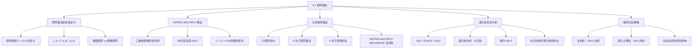

**相关笔记：** [[2.3 分治法]] | [[4.2 Strassen算法]]

> [!abstract] 概览
> 本节介绍了如何使用==分治法==进行==方阵乘法==。首先给出了标准的三重循环矩阵乘法算法 MATRIX-MULTIPLY，其时间复杂度为 $\Theta(n^3)$。随后将分治策略应用于矩阵乘法：将 $n \times n$ 矩阵划分为四个 $n/2 \times n/2$ 子矩阵，递归地执行 8 次子矩阵乘法，得到递归关系式 $T(n) = 8T(n/2) + \Theta(1)$，其解仍为 $\Theta(n^3)$。本节还讨论了矩阵分区的两种实现方式（复制法与索引计算法），并分析了为什么递归矩阵乘法的"更茂密"递归树导致了 $\Theta(n^3)$ 而非 $\Theta(n \lg n)$ 的解。
>
> - ==矩阵乘法==的标准定义要求计算 $n^2$ 个元素，每个元素是 $n$ 对输入元素的乘积之和，朴素实现需要 $\Theta(n^3)$ 时间
> - ==MATRIX-MULTIPLY== 使用三重嵌套循环直接实现矩阵乘法，运行时间为 $\Theta(n^3)$
> - 分治方法将矩阵分为四个子矩阵，产生递归关系式 $T(n) = 8T(n/2) + \Theta(1)$
> - 该递归关系式的解仍为 $\Theta(n^3)$，与朴素方法渐近相同
> - 递归树中每个内部节点有 8 个子节点（而非归并排序的 2 个），导致树"更茂密"，叶子数量巨大
> - 矩阵分区可通过==索引计算==在 $\Theta(1)$ 时间内完成，无需实际复制矩阵元素

---

知识结构总览



---

核心思想

> [!tip] 核心思想
> 本节的核心思想是将==分治策略==应用于矩阵乘法问题。虽然朴素的三重循环矩阵乘法已经给出了 $\Theta(n^3)$ 的直接实现，但通过分治的视角重新审视矩阵乘法，可以揭示更深层的结构：将 $n \times n$ 矩阵递归地分解为 $n/2 \times n/2$ 子矩阵后，需要执行 8 次子矩阵乘法。这一观察直接引出了一个关键问题——能否减少递归乘法的次数？这正是 [[4.2 Strassen算法]] 的出发点。本节的分治矩阵乘法虽然渐近复杂度不变，但它为理解 Strassen 算法的突破奠定了基础。

### 1. 矩阵乘法的标准定义

> [!def] 矩阵乘积（Matrix Product）
> 设 $A = (a_{ik})$ 和 $B = (b_{kj})$ 为两个 $n \times n$ 的方阵，则矩阵乘积 $C = A \cdot B$ 也是一个 $n \times n$ 矩阵，其中每个元素定义为：
> $$c_{ij} = \sum_{k=1}^{n} a_{ik} \cdot b_{kj} \quad (i, j = 1, 2, \ldots, n)$$
>
> 即 $C$ 的第 $i$ 行第 $j$ 列元素等于 $A$ 的第 $i$ 行与 $B$ 的第 $j$ 列的==内积==。计算 $C$ 的全部 $n^2$ 个元素，每个需要 $n$ 次乘法和 $n-1$ 次加法，因此朴素方法需要 $\Theta(n^3)$ 次标量运算。
>
> 我们通常假设矩阵是==稠密的==（dense），即大部分 $n^2$ 个元素不为 0；与之相对的是==稀疏矩阵==（sparse），其非零元素可以比 $n \times n$ 数组更紧凑地存储。

### 2. MATRIX-MULTIPLY 标准算法

> [!def] MATRIX-MULTIPLY 算法
> ==MATRIX-MULTIPLY== 是矩阵乘法的直接实现，使用三重嵌套循环。该过程计算 $C = C + A \cdot B$（将 $A \cdot B$ 累加到 $C$ 中），若只需计算 $C = A \cdot B$，则在调用前将 $C$ 初始化为零矩阵，额外花费 $\Theta(n^2)$ 时间。
>
> ```
> MATRIX-MULTIPLY(A, B, C, n)
> 1  for i = 1 to n                   // 计算每一行
> 2      for j = 1 to n               // 计算行 i 中的每个元素
> 3          for k = 1 to n
> 4              c_ij = c_ij + a_ik · b_kj  // 累加内积的每一项
> ```
>
> **时间复杂度分析：** 三重嵌套循环各执行 $n$ 次迭代，第 4 行每次执行为常数时间，因此总时间为 $\Theta(n^3)$。即使加上初始化 $C$ 的 $\Theta(n^2)$ 时间，运行时间仍为 $\Theta(n^3)$。

### 3. 分治矩阵乘法

> [!def] 分治矩阵乘法
> ==分治矩阵乘法==将 $n \times n$ 矩阵乘法问题递归地分解为更小的子问题。假设 $n$ 是 2 的幂，将每个矩阵划分为四个 $n/2 \times n/2$ 子矩阵：
> $$A = \begin{pmatrix} A_{11} & A_{12} \\ A_{21} & A_{22} \end{pmatrix}, \quad B = \begin{pmatrix} B_{11} & B_{12} \\ B_{21} & B_{22} \end{pmatrix}, \quad C = \begin{pmatrix} C_{11} & C_{12} \\ C_{21} & C_{22} \end{pmatrix}$$
>
> 矩阵乘积 $C = A \cdot B$ 可以用子矩阵表示为：
> $$\begin{pmatrix} C_{11} & C_{12} \\ C_{21} & C_{22} \end{pmatrix} = \begin{pmatrix} A_{11} & A_{12} \\ A_{21} & A_{22} \end{pmatrix} \cdot \begin{pmatrix} B_{11} & B_{12} \\ B_{21} & B_{22} \end{pmatrix}$$
>
> 展开后得到四个等式，每个等式涉及 2 次子矩阵乘法和 1 次子矩阵加法，共 **8 次乘法**和 **4 次加法**：
> - $C_{11} = A_{11} \cdot B_{11} + A_{12} \cdot B_{21}$
> - $C_{12} = A_{11} \cdot B_{12} + A_{12} \cdot B_{22}$
> - $C_{21} = A_{21} \cdot B_{11} + A_{22} \cdot B_{21}$
> - $C_{22} = A_{21} \cdot B_{12} + A_{22} \cdot B_{22}$

> [!def] MATRIX-MULTIPLY-RECURSIVE 算法
> ==MATRIX-MULTIPLY-RECURSIVE== 是分治矩阵乘法的递归实现：
>
> ```
> MATRIX-MULTIPLY-RECURSIVE(A, B, C, n)
>  1  if n == 1
>  2      // 基准情况
>  3      c_11 = c_11 + a_11 · b_11
>  4      return
>  5  // 分解
>  6  partition A, B, C into n/2 × n/2 submatrices
>  7  // 解决（8 次递归调用）
>  8  MATRIX-MULTIPLY-RECURSIVE(A_11, B_11, C_11, n/2)
>  9  MATRIX-MULTIPLY-RECURSIVE(A_11, B_12, C_12, n/2)
> 10  MATRIX-MULTIPLY-RECURSIVE(A_21, B_11, C_21, n/2)
> 11  MATRIX-MULTIPLY-RECURSIVE(A_21, B_12, C_22, n/2)
> 12  MATRIX-MULTIPLY-RECURSIVE(A_12, B_21, C_11, n/2)
> 13  MATRIX-MULTIPLY-RECURSIVE(A_12, B_22, C_12, n/2)
> 14  MATRIX-MULTIPLY-RECURSIVE(A_22, B_21, C_21, n/2)
> 15  MATRIX-MULTIPLY-RECURSIVE(A_22, B_22, C_22, n/2)
> ```
>
> 注意：第 8-11 行计算四个等式的第一项，第 12-15 行计算并累加第二项。由于使用索引计算，结果直接更新到 $C$ 中（原地更新），因此**没有合并步骤**。

### 4. 递归关系式分析

> [!def] 分治矩阵乘法的递归关系式
> 设 $T(n)$ 为使用 MATRIX-MULTIPLY-RECURSIVE 乘以两个 $n \times n$ 矩阵的最坏情况运行时间：
> - **基准情况：** $n = 1$ 时，执行一次标量乘法和一次加法，$T(1) = \Theta(1)$
> - **递归情况：** 分区耗时 $\Theta(1)$（索引计算），8 次递归调用各贡献 $T(n/2)$，无合并步骤
>
> 因此递归关系式为：
> $$T(n) = 8T(n/2) + \Theta(1)$$
>
> 由主定理（第 4.5 节）可知，其解为 $T(n) = \Theta(n^3)$，与朴素 MATRIX-MULTIPLY 的渐近运行时间相同。

> [!example] 递归树对比：为什么 $\Theta(n^3)$ 而非 $\Theta(n \lg n)$？
> 归并排序的递归关系式 $T(n) = 2T(n/2) + \Theta(n)$ 的解为 $\Theta(n \lg n)$，而分治矩阵乘法的 $T(n) = 8T(n/2) + \Theta(1)$ 的解为 $\Theta(n^3)$。关键区别在于递归树的"茂密程度"：
>
> | 特征 | 归并排序 | 分治矩阵乘法 |
> |------|---------|-------------|
> | 每个内部节点的子节点数 | 2 | 8 |
> | 递归树形态 | "苗条"的二叉树 | "茂密"的八叉树 |
> | 叶子节点数 | $n$ | $n^3$ |
> | 每层代价 | $\Theta(n)$ | $\Theta(1) \times 8^i$（第 $i$ 层） |
> | 总层数 | $\lg n + 1$ | $\lg n + 1$ |
> | 总代价 | $\Theta(n \lg n)$ | $\Theta(n^3)$ |
>
> 虽然分治矩阵乘法的内部节点代价更小（$\Theta(1)$ vs $\Theta(n)$），但 8 叉分支使得叶子数量呈 $n^3$ 增长，远超归并排序的 $n$ 个叶子。叶子层的巨大代价主导了总运行时间。

### 5. 矩阵分区策略

> [!def] 矩阵分区的两种实现方式
> 将矩阵划分为子矩阵有两种常见策略：
>
> **策略一：复制法**
> - 分配临时存储空间，将 $A$、$B$、$C$ 的元素复制到各自的子矩阵中
> - 递归求解后，将结果从子矩阵复制回 $C$ 的对应位置
> - 复制 $3n^2$ 个元素，耗时 $\Theta(n^2)$
>
> **策略二：索引计算法**
> - 通过算术运算指定子矩阵在原矩阵中的位置，不实际复制任何元素
> - 分区仅涉及对位置信息的算术运算，与矩阵大小无关，耗时 $\Theta(1)$
> - 对子矩阵元素的修改直接更新原矩阵（共享存储）
>
> 对于矩阵乘法，两种策略不影响渐近运行时间（因为乘法代价 $\Theta(n^3)$ 主导 $\Theta(n^2)$ 的复制代价）。但对于矩阵加法等代价较低的运算，复制法会增加渐近复杂度。

---

补充理解与拓展

> [!info] 矩阵乘法的计算复杂度历史
> 矩阵乘法的计算复杂度是理论计算机科学中最经典的问题之一。1969 年之前，数学界普遍认为 $\Theta(n^3)$ 是矩阵乘法的最优渐近复杂度，因为矩阵乘法的标准定义本身就涉及 $n^3$ 次标量乘法。Volker Strassen 在 1969 年发表的突破性论文打破了这一认知，证明只需 7 次而非 8 次递归子矩阵乘法即可完成乘积计算，将复杂度降至 $\Theta(n^{\lg 7}) \approx \Theta(n^{2.81})$。此后，矩阵乘法的指数不断被降低：Coppersmith-Winograd 算法（1990）达到 $O(n^{2.376})$，Virginia Vassilevska Williams（2012）改进至 $O(n^{2.373})$，最新的 Duan-Wu-Zhou 算法（2023）进一步降至 $O(n^{2.371552})$。目前尚不确定矩阵乘法的理论下界是多少——是否存在 $O(n^{2+\epsilon})$ 的算法仍是开放问题。
>
> > 来源：T. H. Cormen et al., *Introduction to Algorithms*, 4th ed., MIT Press, 2022, Section 4.1; V. Strassen, "Gaussian elimination is not optimal", *Numerische Mathematik*, 1969.

> [!info] 稠密矩阵与稀疏矩阵的乘法策略
> 本节讨论的算法假设矩阵是稠密的（dense），即大部分元素非零。对于稀疏矩阵（sparse matrix），其中大部分元素为 0，使用 $n \times n$ 的二维数组存储会浪费大量空间。稀疏矩阵通常采用更紧凑的表示方法，如 COO（坐标格式）、CSR（压缩稀疏行格式）或 CSC（压缩稀疏列格式）。稀疏矩阵乘法可以利用零元素跳过不必要的乘法运算，在某些情况下将复杂度降至接近 $O(nnz \cdot \text{avg\_cols})$，其中 $nnz$ 是非零元素的数量。在实际应用中（如推荐系统、图论中的邻接矩阵乘法），稀疏矩阵乘法算法的选择对性能有决定性影响。
>
> > 来源：T. H. Cormen et al., *Introduction to Algorithms*, 4th ed., MIT Press, 2022, Section 4.1; R. A. Horn, C. R. Johnson, *Matrix Analysis*, 2nd ed., Cambridge University Press, 2013.

---

易混淆点与辨析

> [!warning] "分治矩阵乘法更快"的误解
> 初学者常认为将分治法应用于矩阵乘法后，运行时间会像归并排序一样从 $\Theta(n^3)$ 降至 $\Theta(n \lg n)$。
>
> - ❌ "分治法总是能降低算法的时间复杂度，矩阵乘法用分治后应该比朴素方法更快"
> - ✅ "分治法能否降低复杂度取决于递归关系式的结构。矩阵乘法的分治产生 $T(n) = 8T(n/2) + \Theta(1)$，8 叉递归树的叶子数量为 $n^3$，远超归并排序的 $n$ 个叶子，因此解仍为 $\Theta(n^3)$。分治矩阵乘法的价值不在于降低复杂度本身，而在于揭示了一种可能减少乘法次数的结构——这正是 [[4.2 Strassen算法]] 的突破口"
>
> 直觉理解：分治法将一个大问题分解为多个小问题，但如果子问题的数量太多（8 个），即使每个子问题减半，总工作量仍然很大。关键在于子问题数量 $a$ 与规模缩减因子 $b$ 的关系——当 $a = b^d$ 时（此处 $8 = 2^3$），复杂度为 $\Theta(n^d) = \Theta(n^3)$。

> [!warning] "复制法不影响性能"的误解
> 初学者可能认为矩阵分区的实现方式（复制法 vs 索引计算法）对任何分治矩阵算法都没有影响。
>
> - ❌ "矩阵分区用复制法还是索引计算法都一样，反正都是 $\Theta(n^2)$"
> - ✅ "对于矩阵乘法，复制法的 $\Theta(n^2)$ 被 $\Theta(n^3)$ 的乘法代价主导，确实不影响渐近复杂度。但对于矩阵加法等低代价运算，复制法会使递归关系式从 $T(n) = 4T(n/2) + \Theta(1) = \Theta(n^2)$ 变为 $T(n) = 4T(n/2) + \Theta(n^2) = \Theta(n^2 \lg n)$，反而增加了复杂度。因此索引计算法是更优的通用策略"
>
> 关键原则：当分解/合并步骤的代价与递归乘法的代价处于同一量级或更大时，分区策略的选择会显著影响渐近复杂度。

---

习题精选

| 题号 | 核心考点 | 难度 |
|:----:|---------|:----:|
| 4.1-1 | 放宽 $n$ 为 2 的幂的限制 | ⭐⭐ |
| 4.1-2 | 非方阵的矩阵乘法复杂度 | ⭐⭐⭐ |
| 4.1-3 | 复制法对递归关系式的影响 | ⭐⭐ |
| 4.1-4 | 分治矩阵加法的递归分析 | ⭐⭐ |
| 思考题 | 为什么 8 次乘法不能减少？ | ⭐⭐⭐ |

> [!faq]- 4.1-1 推广 MATRIX-MULTIPLY-RECURSIVE，使其能对 $n$ 不一定是 2 的幂的 $n \times n$ 矩阵进行乘法运算。给出描述其运行时间的递归关系式，论证其在最坏情况下的运行时间为 $\Theta(n^3)$。
> **思路提示：** 当 $n$ 不是 2 的幂时，可以将矩阵填充（padding）到最近的 2 的幂大小，或者在分区时使用 $\lfloor n/2 \rfloor$ 和 $\lceil n/2 \rceil$ 两种子矩阵大小。
>
> **解答：**
>
> **方法一（填充法）：** 设 $N = 2^{\lceil \lg n \rceil}$ 为不小于 $n$ 的最小 2 的幂。将 $A$、$B$ 填充为 $N \times N$ 矩阵（新增元素补 0），然后对 $N \times N$ 矩阵执行递归乘法。运行时间为 $T(N) = 8T(N/2) + \Theta(1) = \Theta(N^3)$。由于 $N < 2n$，$N^3 < 8n^3$，因此 $T(n) = \Theta(n^3)$。
>
> **方法二（不等分法）：** 分区时使用 $\lfloor n/2 \rfloor \times \lfloor n/2 \rfloor$ 和 $\lceil n/2 \rceil \times \lceil n/2 \rceil$ 两种子矩阵。递归关系式变为 $T(n) \leq 8T(\lceil n/2 \rceil) + \Theta(1)$。由主定理的推广形式，解仍为 $\Theta(n^3)$。

> [!faq]- 4.1-2 使用 MATRIX-MULTIPLY-RECURSIVE 作为子程序，将一个 $kn \times n$ 矩阵乘以一个 $n \times kn$ 矩阵（$k \geq 1$）有多快？将一个 $n \times kn$ 矩阵乘以一个 $kn \times n$ 矩阵又有多快？哪个渐近更快，快多少？
> **思路提示：** 考虑将非方阵乘法分解为多次方阵乘法，或直接分析分治递归在非方阵上的行为。
>
> **解答：**
>
> **情况一：** $kn \times n$ 乘以 $n \times kn$，结果为 $kn \times kn$ 矩阵。
> - 将结果矩阵视为 $k \times k$ 块矩阵，每块为 $n \times n$，共需 $k^2$ 次方阵乘法
> - 每次方阵乘法耗时 $\Theta(n^3)$，总计 $\Theta(k^2 n^3)$
>
> **情况二：** $n \times kn$ 乘以 $kn \times n$，结果为 $n \times n$ 矩阵。
> - 结果矩阵的每个元素是 $kn$ 个乘积的和，直接计算需要 $\Theta(kn^3)$
> - 使用分治方法：将 $n \times kn$ 矩阵按列分为 $k$ 个 $n \times n$ 子矩阵，将 $kn \times n$ 矩阵按行分为 $k$ 个 $n \times n$ 子矩阵，共需 $k$ 次方阵乘法，总计 $\Theta(kn^3)$
>
> **对比：** 情况二 $\Theta(kn^3)$ 比情况一 $\Theta(k^2 n^3)$ 渐近更快，快 $k$ 倍。直观理解：情况一产生更大的输出矩阵（$kn \times kn$ vs $n \times n$），需要计算更多元素。

> [!faq]- 4.1-3 假设在 MATRIX-MULTIPLY-RECURSIVE 中不使用索引计算来分区矩阵，而是将 $A$、$B$、$C$ 的元素复制到独立的 $n/2 \times n/2$ 子矩阵中。递归调用后，再将结果复制回 $C$。递归关系式 (4.9) 如何变化？其解是什么？
> **解答：**
>
> 原递归关系式为 $T(n) = 8T(n/2) + \Theta(1)$（索引计算法）。
>
> 使用复制法后：
> - 分解步骤：复制 $A$、$B$ 的各 4 个子矩阵 + 初始化 $C$ 的 4 个子矩阵，共复制约 $2n^2$ 个元素，耗时 $\Theta(n^2)$
> - 合并步骤：将 $C$ 的 4 个子矩阵复制回 $C$，复制 $n^2$ 个元素，耗时 $\Theta(n^2)$
> - 递归调用：仍为 8 次 $T(n/2)$
>
> 新的递归关系式为：
> $$T(n) = 8T(n/2) + \Theta(n^2)$$
>
> 由主定理：$a = 8$，$b = 2$，$f(n) = \Theta(n^2)$。比较 $n^{\log_2 8} = n^3$ 与 $f(n) = n^2$：
> - $n^3$ 多项式大于 $n^2$（相差 $n$ 的因子），属于主定理情形 1
> - 因此 $T(n) = \Theta(n^3)$
>
> 解仍为 $\Theta(n^3)$，因为 $\Theta(n^2)$ 的分区代价被 $\Theta(n^3)$ 的乘法代价主导。

> [!faq]- 4.1-4 编写分治算法 MATRIX-ADD-RECURSIVE 的伪代码，将两个 $n \times n$ 矩阵 $A$ 和 $B$ 相加。假设分区使用 $\Theta(1)$ 的索引计算。写出最坏情况运行时间的递归关系式并求解。如果使用 $\Theta(n^2)$ 的复制法来实现分区会怎样？
> **解答：**
>
> **伪代码：**
> ```
> MATRIX-ADD-RECURSIVE(A, B, C, n)
> 1  if n == 1
> 2      c_11 = a_11 + b_11
> 3      return
> 4  partition A, B, C into n/2 × n/2 submatrices
> 5  MATRIX-ADD-RECURSIVE(A_11, B_11, C_11, n/2)
> 6  MATRIX-ADD-RECURSIVE(A_12, B_12, C_12, n/2)
> 7  MATRIX-ADD-RECURSIVE(A_21, B_21, C_21, n/2)
> 8  MATRIX-ADD-RECURSIVE(A_22, B_22, C_22, n/2)
> ```
>
> **使用索引计算法（$\Theta(1)$ 分区）：**
> $$T(n) = 4T(n/2) + \Theta(1)$$
> 由主定理：$a = 4$，$b = 2$，$f(n) = \Theta(1)$。$n^{\log_2 4} = n^2$ 多项式大于 $\Theta(1)$，属于情形 1，因此 $T(n) = \Theta(n^2)$。这与直接遍历所有 $n^2$ 个元素相加的复杂度相同。
>
> **使用复制法（$\Theta(n^2)$ 分区）：**
> $$T(n) = 4T(n/2) + \Theta(n^2)$$
> 由主定理：$a = 4$，$b = 2$，$f(n) = \Theta(n^2) = \Theta(n^{\log_2 4})$，属于情形 2，因此 $T(n) = \Theta(n^2 \lg n)$。
>
> **结论：** 复制法使矩阵加法的复杂度从 $\Theta(n^2)$ 增加到 $\Theta(n^2 \lg n)$，渐近变慢了 $\lg n$ 倍！这说明对于低代价运算，分区策略的选择至关重要。

> [!faq]- 思考题：为什么矩阵乘法的分治分解需要恰好 8 次子矩阵乘法？能否自然地减少这个次数？
> **解答：**
>
> 从 $C_{11} = A_{11} \cdot B_{11} + A_{12} \cdot B_{21}$ 等四个等式可以看出，每个 $C_{ij}$ 的计算需要 2 次乘法，共 8 次。这些乘法中的操作数（子矩阵）各不相同——例如 $A_{11} \cdot B_{11}$ 出现在 $C_{11}$ 中，而 $A_{11} \cdot B_{12}$ 出现在 $C_{12}$ 中，它们无法简单地合并为一次乘法。
>
> 然而，Strassen 的天才之处在于：通过**预先计算子矩阵的线性组合**，可以在不同的 $C_{ij}$ 之间"共享"乘法结果。具体来说，Strassen 构造了 10 个中间矩阵 $S_1, \ldots, S_{10}$（子矩阵的和与差），然后用这些中间矩阵执行 7 次乘法得到 $P_1, \ldots, P_7$，最后通过 $P_i$ 的加减组合恢复出 $C_{11}, C_{12}, C_{21}, C_{22}$。关键洞察是：虽然增加了 $\Theta(n^2)$ 的加减法，但减少了一次 $\Theta(n^3)$ 的乘法，这在渐近意义上是值得的。详见 [[4.2 Strassen算法]]。

---

视频学习指南

| 资源 | 链接 | 对应内容 | 备注 |
|------|------|---------|------|
| MIT 6.006 Lecture 9: Matrix Multiplication | https://www.youtube.com/watch?v=O4V6IlxiWp8 | 矩阵乘法、分治方法、Strassen 算法 | Erik Demaine 教授 |
| Abdul Bari - Strassen's Matrix Multiplication | https://www.youtube.com/watch?v=e8j7dzY2S6I | Strassen 算法动画演示 | 直观的逐步讲解 |
| 河南大学《算法导论》中文字幕版 | https://www.bilibili.com/video/BV1H4411B7FY | 4.1 矩阵乘法、分治策略 | 中文授课，适合入门 |
| 3Blue1Brown - Essence of Linear Algebra | https://www.youtube.com/playlist?list=PLZHQObOWTQDPD3MizzM2xVFitgF8hE_ab | 线性代数基础（矩阵乘法的几何直觉） | 可视化极佳 |

---

教材原文

> [!quote] 教材原文摘录
> "We can use the divide-and-conquer method to multiply square matrices. If you've seen matrices before, then you probably know how to multiply them."
>
> "Computing the matrix C requires computing $n^2$ matrix entries, each of which is the sum of n pairwise products of input elements from A and B."
>
> "Because each of the triply nested for loops runs for exactly n iterations, and each execution of line 4 takes constant time, the MATRIX-MULTIPLY procedure operates in $\Theta(n^3)$ time."
>
> "Why is the $\Theta(n^3)$ solution to this recurrence so much larger than the $\Theta(n \lg n)$ solution to the merge-sort recurrence? The factor of 2 in the merge-sort recurrence determines how many children each tree node has, which in turn determines how many terms contribute to the sum at each level of the tree. In comparison, for the recurrence for MATRIX-MULTIPLY-RECURSIVE, each internal node in the recursion tree has eight children, not two, leading to a 'bushier' recursion tree with many more leaves."

---

## 参见 Wiki

- [[算法导论/concepts/矩阵乘法]]
- [[算法导论/concepts/分治法]]
- [[算法导论/concepts/递归关系式]]
- [[算法导论/concepts/递归树]]
- [[算法导论/concepts/主定理]]
- [[算法导论/concepts/Strassen算法]]

#学习/算法导论/分治策略/矩阵乘法
