**相关笔记：** [[4.1 矩阵乘法]] | [[4.3 代入法]]

> [!abstract] 概览
> 本节介绍了由 Volker Strassen 于 1969 年发表的突破性==Strassen 算法==，该算法通过巧妙的子矩阵线性组合，将分治矩阵乘法中的递归乘法次数从 8 次减少到 7 次，从而将时间复杂度从 $\Theta(n^3)$ 降低到 $\Theta(n^{\lg 7}) \approx \Theta(n^{2.81})$。算法分为四步：分区、构造 10 个中间矩阵 $S_1, \ldots, S_{10}$、递归计算 7 个乘积 $P_1, \ldots, P_7$、通过 $P_i$ 的加减组合恢复结果矩阵 $C$。本节详细展示了 $P_1, \ldots, P_7$ 的定义、$C_{11}, C_{12}, C_{21}, C_{22}$ 的恢复过程及其正确性验证，并建立了递归关系式 $T(n) = 7T(n/2) + \Theta(n^2)$。
>
> - ==Strassen 算法==将递归子矩阵乘法从 8 次减少到 7 次，以常数次额外加减法为代价
> - 递归关系式 $T(n) = 7T(n/2) + \Theta(n^2)$ 的解为 $T(n) = \Theta(n^{\lg 7}) \approx \Theta(n^{2.81})$，渐近优于 $\Theta(n^3)$
> - 算法通过 10 个中间矩阵 $S_1, \ldots, S_{10}$（子矩阵的和与差）和 7 个乘积矩阵 $P_1, \ldots, P_7$ 实现乘法次数的减少
> - $C$ 的四个子矩阵通过 $P_i$ 的加减组合恢复，共需 12 次子矩阵加减法
> - 核心洞察：减少一次递归乘法（$\Theta(n^3)$ 级别）所换取的额外加减法（$\Theta(n^2)$ 级别）在渐近意义上是值得的

---

知识结构总览

```mermaid
graph TB
    A["4.2 Strassen算法"] --> B["算法动机与直觉"]
    A --> C["算法四步骤"]
    A --> D["7个乘积矩阵 P1-P7"]
    A --> E["结果矩阵的恢复"]
    A --> F["递归关系式分析"]
    A --> G["正确性验证"]

    B --> B1["8次乘法→7次乘法"]
    B --> B2["x²-y² 的代数技巧"]
    B --> B3["乘法代价 vs 加法代价"]

    C --> C1["步骤1：基准情况与分区"]
    C --> C2["步骤2：构造 S1-S10"]
    C --> C3["步骤3：递归计算 P1-P7"]
    C --> C4["步骤4：恢复 C11-C22"]

    D --> D1["P1 = A11·S1"]
    D --> D2["P2 = S2·B22"]
    D --> D3["P3 = S3·B11"]
    D --> D4["P4 = A22·S4"]
    D --> D5["P5 = S5·S6"]
    D --> D6["P6 = S7·S8"]
    D --> D7["P7 = S9·S10"]

    E --> E1["C11 = P5+P4-P2+P6"]
    E --> E2["C12 = P1+P2"]
    E --> E3["C21 = P3+P4"]
    E --> E4["C22 = P5+P1-P3-P7"]

    F --> F1["T(n) = 7T(n/2) + Θ(n²)"]
    F --> F2["解为 Θ(n^lg7) ≈ Θ(n^2.81)"]
    F --> F3["与 Θ(n³) 的对比"]

    G --> G1["C11 的展开验证"]
    G --> G2["C12 的展开验证"]
    G --> G3["C21 的展开验证"]
    G --> G4["C22 的展开验证"]
```



---

核心思想

> [!tip] 核心思想
> Strassen 算法的核心思想是：在 [[4.1 矩阵乘法]] 的分治框架基础上，通过**预先构造子矩阵的线性组合**，将递归乘法次数从 8 次减少到 7 次。虽然这需要额外执行 10 次子矩阵加法（构造 $S_1, \ldots, S_{10}$）和 12 次子矩阵加减法（恢复 $C$），但这些加减法的代价是 $\Theta(n^2)$，而减少一次乘法节省的是 $\Theta(n^3)$ 级别的递归代价。在递归展开后，这一"用加减法换乘法"的策略使得总运行时间从 $\Theta(n^3)$ 降低到 $\Theta(n^{\lg 7}) \approx \Theta(n^{2.81})$，这是矩阵乘法算法历史上的第一次渐近突破。

### 1. 算法动机与直觉

> [!example] 减少乘法次数的代数直觉：$x^2 - y^2$
> 考虑计算 $x^2 - y^2$：
> - **朴素方法：** 计算 $x^2$ 和 $y^2$，然后相减——需要 **2 次乘法**和 1 次减法
> - **代数技巧：** 利用恒等式 $x^2 - y^2 = (x+y)(x-y)$——只需 **1 次乘法**和 2 次加减法
>
> 当 $x$ 和 $y$ 是标量时，两种方法都需要 3 次标量运算，没有区别。但当 $x$ 和 $y$ 是大矩阵时，**乘法的代价远高于加法**（矩阵乘法 $\Theta(n^3)$ vs 矩阵加法 $\Theta(n^2)$），此时第二种方法显著优于第一种。
>
> Strassen 算法正是将这一思想推广到矩阵乘法：通过精心设计的线性组合，在不同的子矩阵乘积之间"共享"计算结果，从而减少总的乘法次数。

### 2. Strassen 算法的四步骤

> [!def] Strassen 算法
> ==Strassen 算法==计算 $C = C + A \cdot B$，其中 $A$、$B$、$C$ 均为 $n \times n$ 矩阵，$n$ 为 2 的幂。算法分为四步：
>
> **步骤 1：基准情况与分区**
> - 若 $n = 1$，执行一次标量乘法和一次标量加法，耗时 $\Theta(1)$，返回
> - 否则，通过索引计算将 $A$、$B$、$C$ 各划分为四个 $n/2 \times n/2$ 子矩阵（与 [[4.1 矩阵乘法]] 相同），耗时 $\Theta(1)$
>
> **步骤 2：构造 10 个中间矩阵**
> - 创建 $S_1, S_2, \ldots, S_{10}$，每个是两个子矩阵的和或差
> - 创建并初始化 7 个 $n/2 \times n/2$ 矩阵 $P_1, P_2, \ldots, P_7$
> - 共 17 个矩阵的创建和初始化，耗时 $\Theta(n^2)$
>
> **步骤 3：递归计算 7 个乘积**
> - 使用步骤 1 的子矩阵和步骤 2 的 $S_1, \ldots, S_{10}$，递归计算 $P_1, P_2, \ldots, P_7$
> - 7 次递归调用，耗时 $7T(n/2)$
>
> **步骤 4：恢复结果矩阵**
> - 通过 $P_1, \ldots, P_7$ 的加减组合更新 $C_{11}, C_{12}, C_{21}, C_{22}$
> - 共 12 次子矩阵加减法，耗时 $\Theta(n^2)$

### 3. 10 个中间矩阵 S1-S10

> [!def] 中间矩阵 $S_1, S_2, \ldots, S_{10}$
> 步骤 2 创建以下 10 个 $n/2 \times n/2$ 矩阵，每个是两个子矩阵的和或差：
>
> | 矩阵 | 定义 | 含义 |
> |:----:|------|------|
> | $S_1$ | $B_{12} - B_{22}$ | $B$ 右列的差 |
> | $S_2$ | $A_{11} + A_{12}$ | $A$ 上行的和 |
> | $S_3$ | $A_{21} + A_{22}$ | $A$ 下行的和 |
> | $S_4$ | $B_{21} - B_{11}$ | $B$ 左列的差 |
> | $S_5$ | $A_{11} + A_{22}$ | $A$ 对角线的和 |
> | $S_6$ | $B_{11} + B_{22}$ | $B$ 对角线的和 |
> | $S_7$ | $A_{12} - A_{22}$ | $A$ 右列的差 |
> | $S_8$ | $B_{21} + B_{22}$ | $B$ 下行的和 |
> | $S_9$ | $A_{11} - A_{21}$ | $A$ 左列的差 |
> | $S_{10}$ | $B_{11} + B_{12}$ | $B$ 上行的和 |
>
> 这些中间矩阵的设计是 Strassen 算法的核心——它们使得后续的 7 次乘法能够"覆盖"原来 8 次乘法的所有信息。

### 4. 7 个乘积矩阵 P1-P7

> [!def] 乘积矩阵 $P_1, P_2, \ldots, P_7$
> 步骤 3 递归计算以下 7 个 $n/2 \times n/2$ 矩阵乘积。**算法只执行中间列的乘法**，右列仅为展开说明，算法中不会显式计算：
>
> | 乘积 | 算法执行的计算 | 展开为原始子矩阵 |
> |:----:|---------------|-----------------|
> | $P_1$ | $A_{11} \cdot S_1$ | $A_{11} \cdot B_{12} - A_{11} \cdot B_{22}$ |
> | $P_2$ | $S_2 \cdot B_{22}$ | $A_{11} \cdot B_{22} + A_{12} \cdot B_{22}$ |
> | $P_3$ | $S_3 \cdot B_{11}$ | $A_{21} \cdot B_{11} + A_{22} \cdot B_{11}$ |
> | $P_4$ | $A_{22} \cdot S_4$ | $A_{22} \cdot B_{21} - A_{22} \cdot B_{11}$ |
> | $P_5$ | $S_5 \cdot S_6$ | $A_{11} \cdot B_{11} + A_{11} \cdot B_{22} + A_{22} \cdot B_{11} + A_{22} \cdot B_{22}$ |
> | $P_6$ | $S_7 \cdot S_8$ | $A_{12} \cdot B_{21} + A_{12} \cdot B_{22} - A_{22} \cdot B_{21} - A_{22} \cdot B_{22}$ |
> | $P_7$ | $S_9 \cdot S_{10}$ | $A_{11} \cdot B_{11} + A_{11} \cdot B_{12} - A_{21} \cdot B_{11} - A_{21} \cdot B_{12}$ |
>
> 注意 $P_5$ 是一个"全交叉"乘积，包含了 $A$ 和 $B$ 的所有对角线子矩阵组合。$P_6$ 和 $P_7$ 则包含"交叉"和"反对角"组合。

### 5. 结果矩阵的恢复

> [!def] 从 $P_1, \ldots, P_7$ 恢复 $C_{11}, C_{12}, C_{21}, C_{22}$
> 步骤 4 通过 $P_i$ 的加减组合恢复结果矩阵的四个子矩阵：
>
> $$C_{11} = C_{11} + P_5 + P_4 - P_2 + P_6$$
> $$C_{12} = C_{12} + P_1 + P_2$$
> $$C_{21} = C_{21} + P_3 + P_4$$
> $$C_{22} = C_{22} + P_5 + P_1 - P_3 - P_7$$
>
> 步骤 4 共执行 12 次子矩阵加减法（$C_{11}$ 需要 4 次，$C_{12}$ 需要 2 次，$C_{21}$ 需要 2 次，$C_{22}$ 需要 4 次），耗时 $\Theta(n^2)$。

> [!example] $C_{11}$ 的正确性验证
> 展开 $C_{11} = P_5 + P_4 - P_2 + P_6$，逐项代入 $P_i$ 的展开式并垂直对齐可消去的项：
>
> $$P_5 = \quad + A_{11}B_{11} + A_{11}B_{22} + A_{22}B_{11} + A_{22}B_{22}$$
> $$P_4 = \quad \quad \quad \quad \quad \quad \quad \quad \quad \quad \;\; + A_{22}B_{21} - A_{22}B_{11}$$
> $$-P_2 = \quad - A_{11}B_{22} - A_{12}B_{22}$$
> $$P_6 = \quad \quad \quad \quad \quad \quad \quad \quad \quad \quad \quad \quad \quad \quad \quad \quad + A_{12}B_{21} + A_{12}B_{22} - A_{22}B_{21} - A_{22}B_{22}$$
>
> 消去后剩余：
> $$C_{11} = A_{11}B_{11} + A_{12}B_{21} \quad \checkmark$$
>
> 这正是 $C_{11} = A_{11} \cdot B_{11} + A_{12} \cdot B_{21}$，与标准矩阵乘法定义一致。

> [!example] $C_{12}$、$C_{21}$、$C_{22}$ 的正确性验证
> **$C_{12} = P_1 + P_2$：**
> $$P_1 = A_{11}B_{12} - A_{11}B_{22}$$
> $$P_2 = A_{11}B_{22} + A_{12}B_{22}$$
> $$C_{12} = A_{11}B_{12} + A_{12}B_{22} \quad \checkmark$$
>
> **$C_{21} = P_3 + P_4$：**
> $$P_3 = A_{21}B_{11} + A_{22}B_{11}$$
> $$P_4 = A_{22}B_{21} - A_{22}B_{11}$$
> $$C_{21} = A_{21}B_{11} + A_{22}B_{21} \quad \checkmark$$
>
> **$C_{22} = P_5 + P_1 - P_3 - P_7$：**
> $$P_5 = + A_{11}B_{11} + A_{11}B_{22} + A_{22}B_{11} + A_{22}B_{22}$$
> $$P_1 = + A_{11}B_{12} - A_{11}B_{22}$$
> $$-P_3 = - A_{21}B_{11} - A_{22}B_{11}$$
> $$-P_7 = - A_{11}B_{11} - A_{11}B_{12} + A_{21}B_{11} + A_{21}B_{12}$$
> $$C_{22} = A_{21}B_{12} + A_{22}B_{22} \quad \checkmark$$

### 6. 递归关系式分析

> [!def] Strassen 算法的递归关系式
> 综合四步分析，Strassen 算法的运行时间递归关系式为：
> $$T(n) = 7T(n/2) + \Theta(n^2)$$
>
> 其中：
> - 步骤 1（基准情况）：$\Theta(1)$
> - 步骤 1（分区）+ 步骤 2（构造 $S$ 和初始化 $P$）+ 步骤 4（恢复 $C$）：$\Theta(n^2)$
> - 步骤 3（7 次递归乘法）：$7T(n/2)$
>
> **使用主定理求解（第 4.5 节预告）：**
> - $a = 7$，$b = 2$，$f(n) = \Theta(n^2)$
> - $n^{\log_2 7} = n^{2.807...}$
> - 比较 $f(n) = n^2$ 与 $n^{\log_2 7}$：$n^2 = O(n^{\log_2 7 - \epsilon})$（取 $\epsilon \approx 0.807$），属于主定理情形 1
> - 因此 $T(n) = \Theta(n^{\log_2 7}) = \Theta(n^{\lg 7}) \approx \Theta(n^{2.81})$
>
> 由于 $\lg 7 \approx 2.807 < 3$，Strassen 算法渐近优于 [[4.1 矩阵乘法]] 的 $\Theta(n^3)$ 方法。

> [!tip] Strassen 算法的代价权衡
> Strassen 算法的核心权衡是：
> - **减少的代价：** 1 次递归子矩阵乘法（每次递归节省 $T(n/2)$，累积效果巨大）
> - **增加的代价：** 10 次子矩阵加法（步骤 2）+ 12 次子矩阵加减法（步骤 4）= 22 次 $\Theta(n^2)$ 的操作
>
> 在递归的每一层，增加的代价为 $\Theta(n^2)$，而减少的代价体现在递归树的结构变化上——从 8 叉树变为 7 叉树。虽然递归树仍然"茂密"，但叶子数量从 $n^3 = n^{\log_2 8}$ 减少到 $n^{\lg 7} \approx n^{2.81}$，这是一个显著的渐近改进。
>
> **代价统计：** Strassen 算法总共使用 7 次子矩阵乘法和 18 次子矩阵加法（10 次构造 $S$ + 12 次恢复 $C$，但其中 $S_2, S_3, S_5, S_6, S_9, S_{10}$ 的构造与恢复 $C$ 的某些操作可以共享，净增 18 次）。

---

补充理解与拓展

> [!info] Strassen 算法的历史意义与后续发展
> Volker Strassen 于 1969 年发表的这篇论文 "Gaussian elimination is not optimal" 是计算复杂性理论中最具影响力的成果之一。在 Strassen 之前，数学界普遍认为 $\Theta(n^3)$ 是矩阵乘法的最优复杂度——毕竟标准定义本身就涉及 $n^3$ 次标量乘法。Strassen 的工作打破了这一"直觉障碍"，证明算法可以超越定义的表面复杂度。此后，矩阵乘法的指数不断被降低：Coppersmith-Winograd（1987）达到 $O(n^{2.376})$，Stothers（2010）降至 $O(n^{2.374})$，Virginia Vassilevska Williams（2012）改进至 $O(n^{2.373})$，Alman-Williams（2021）进一步降至 $O(n^{2.37286})$，最新结果由 Duan-Wu-Zhou（2023）取得 $O(n^{2.371552})$。然而，Strassen 算法因其相对简洁的实现，至今在实际应用中仍被广泛使用（例如在 BLAS 库中）。
>
> > 来源：V. Strassen, "Gaussian elimination is not optimal", *Numerische Mathematik*, 13(4):354-356, 1969; T. H. Cormen et al., *Introduction to Algorithms*, 4th ed., MIT Press, 2022, Section 4.2.

> [!info] Strassen 算法的实际应用与常数因子
> 虽然 Strassen 算法的渐近复杂度优于朴素方法，但在实际应用中需要考虑常数因子。Strassen 算法的常数因子较大（更多的矩阵加减法、更复杂的内存访问模式），因此对于较小的矩阵，朴素方法实际上更快。实践中通常采用混合策略：当递归到某个阈值 $n_0$（通常在 $n_0 \approx 64 \sim 256$ 之间）时切换到朴素方法。此外，Strassen 算法的数值稳定性也略差于朴素方法——由于中间矩阵涉及减法，当矩阵元素大小差异悬殊时可能出现精度损失。Laderman（1976）证明了存在使用 7 次乘法但不需要减法的算法，但实现更为复杂。
>
> > 来源：T. H. Cormen et al., *Introduction to Algorithms*, 4th ed., MIT Press, 2022, Section 4.2; J. Laderman, "A noncommutative algorithm for multiplying 3×3 matrices using 23 multiplications", *Bulletin of the AMS*, 1976.

---

易混淆点与辨析

> [!warning] "Strassen 算法减少了乘法次数所以更快"的片面理解
> 初学者可能简单地认为"7 次乘法比 8 次乘法少，所以更快"，而忽略了算法的整体代价分析。
>
> - ❌ "Strassen 算法快是因为 7 < 8，乘法次数少了"
> - ✅ "Strassen 算法快是因为减少 1 次递归乘法所节省的代价（体现在递归树从 8 叉变为 7 叉，叶子数量从 $n^3$ 减少到 $n^{\lg 7}$）远超增加的 18 次子矩阵加减法的代价（每次 $\Theta(n^2)$）。关键在于乘法的递归代价是 $\Theta(n^{\lg 8}) = \Theta(n^3)$ 级别，而加减法只是 $\Theta(n^2)$ 级别。在递归展开后，这一差异被指数放大"
>
> 直觉理解：想象每次递归节省 1/8 的乘法代价，但只增加了固定比例的加减法代价。经过 $\lg n$ 层递归后，乘法节省的总量呈指数增长，而加减法的额外代价只是线性增长。

> [!warning] "Strassen 算法适用于所有矩阵乘法场景"的误解
> 初学者可能认为 Strassen 算法在所有情况下都优于朴素方法。
>
> - ❌ "Strassen 算法的时间复杂度更低，应该始终使用它"
> - ✅ "Strassen 算法的渐近优势在 $n$ 足够大时才体现。对于小规模矩阵，其较大的常数因子（更多的加减法、更复杂的内存访问模式）使它反而更慢。实践中通常设置递归阈值 $n_0$，当 $n > n_0$ 时使用 Strassen，否则切换到朴素方法。此外，Strassen 算法的数值稳定性略差，对精度要求极高的场景需谨慎使用"
>
> 实践原则：渐近复杂度描述的是 $n \to \infty$ 时的行为。对于有限规模的输入，常数因子、内存层次结构、并行性等因素都可能影响实际性能。

---

习题精选

| 题号 | 核心考点 | 难度 |
|:----:|---------|:----:|
| 4.2-1 | Strassen 算法的手动计算 | ⭐⭐⭐ |
| 4.2-2 | Strassen 算法的伪代码 | ⭐⭐ |
| 4.2-3 | 3×3 矩阵乘法的乘法次数下界 | ⭐⭐⭐ |
| 4.2-4 | Pan 的矩阵乘法算法对比 | ⭐⭐⭐ |
| 4.2-5 | 复数乘法与 Strassen 思想的联系 | ⭐⭐ |

> [!faq]- 4.2-1 使用 Strassen 算法计算矩阵乘积 $\begin{pmatrix} 1 & 3 \\ 7 & 5 \end{pmatrix} \cdot \begin{pmatrix} 6 & 8 \\ 4 & 2 \end{pmatrix}$，展示你的计算过程。
> **思路提示：** 对 $2 \times 2$ 矩阵，$n = 2$，直接应用 Strassen 的公式。
>
> **解答：**
>
> 令 $A = \begin{pmatrix} 1 & 3 \\ 7 & 5 \end{pmatrix}$，$B = \begin{pmatrix} 6 & 8 \\ 4 & 2 \end{pmatrix}$。
>
> 子矩阵（此时为标量）：$A_{11}=1, A_{12}=3, A_{21}=7, A_{22}=5$，$B_{11}=6, B_{12}=8, B_{21}=4, B_{22}=2$。
>
> **步骤 2：计算 $S_1, \ldots, S_{10}$：**
> - $S_1 = B_{12} - B_{22} = 8 - 2 = 6$
> - $S_2 = A_{11} + A_{12} = 1 + 3 = 4$
> - $S_3 = A_{21} + A_{22} = 7 + 5 = 12$
> - $S_4 = B_{21} - B_{11} = 4 - 6 = -2$
> - $S_5 = A_{11} + A_{22} = 1 + 5 = 6$
> - $S_6 = B_{11} + B_{22} = 6 + 2 = 8$
> - $S_7 = A_{12} - A_{22} = 3 - 5 = -2$
> - $S_8 = B_{21} + B_{22} = 4 + 2 = 6$
> - $S_9 = A_{11} - A_{21} = 1 - 7 = -6$
> - $S_{10} = B_{11} + B_{12} = 6 + 8 = 14$
>
> **步骤 3：计算 $P_1, \ldots, P_7$：**
> - $P_1 = A_{11} \cdot S_1 = 1 \times 6 = 6$
> - $P_2 = S_2 \cdot B_{22} = 4 \times 2 = 8$
> - $P_3 = S_3 \cdot B_{11} = 12 \times 6 = 72$
> - $P_4 = A_{22} \cdot S_4 = 5 \times (-2) = -10$
> - $P_5 = S_5 \cdot S_6 = 6 \times 8 = 48$
> - $P_6 = S_7 \cdot S_8 = (-2) \times 6 = -12$
> - $P_7 = S_9 \cdot S_{10} = (-6) \times 14 = -84$
>
> **步骤 4：恢复 $C$：**
> - $C_{11} = P_5 + P_4 - P_2 + P_6 = 48 + (-10) - 8 + (-12) = 18$
> - $C_{12} = P_1 + P_2 = 6 + 8 = 14$
> - $C_{21} = P_3 + P_4 = 72 + (-10) = 62$
> - $C_{22} = P_5 + P_1 - P_3 - P_7 = 48 + 6 - 72 - (-84) = 66$
>
> **验证：** $C = \begin{pmatrix} 18 & 14 \\ 62 & 66 \end{pmatrix}$
>
> 直接计算验证：$C_{11} = 1 \times 6 + 3 \times 4 = 18$ ✓，$C_{12} = 1 \times 8 + 3 \times 2 = 14$ ✓，$C_{21} = 7 \times 6 + 5 \times 4 = 62$ ✓，$C_{22} = 7 \times 8 + 5 \times 2 = 66$ ✓

> [!faq]- 4.2-2 编写 Strassen 算法的伪代码。
> **思路提示：** 按照四步骤结构组织伪代码，注意矩阵分区的索引计算。
>
> **解答：**
> ```
> STRASSEN-MATRIX-MULTIPLY(A, B, C, n)
>  1  if n == 1
>  2      c_11 = c_11 + a_11 · b_11
>  3      return
>  4  partition A, B, C into n/2 × n/2 submatrices
>  5      A_11, A_12, A_21, A_22
>  6      B_11, B_12, B_21, B_22
>  7      C_11, C_12, C_21, C_22
>  8  // 步骤 2：构造 S1-S10
>  9  S_1 = B_12 - B_22
> 10  S_2 = A_11 + A_12
> 11  S_3 = A_21 + A_22
> 12  S_4 = B_21 - B_11
> 13  S_5 = A_11 + A_22
> 14  S_6 = B_11 + B_22
> 15  S_7 = A_12 - A_22
> 16  S_8 = B_21 + B_22
> 17  S_9 = A_11 - A_21
> 18  S_10 = B_11 + B_12
> 19  // 步骤 3：递归计算 P1-P7
> 20  STRASSEN-MATRIX-MULTIPLY(A_11, S_1, P_1, n/2)
> 21  STRASSEN-MATRIX-MULTIPLY(S_2, B_22, P_2, n/2)
> 22  STRASSEN-MATRIX-MULTIPLY(S_3, B_11, P_3, n/2)
> 23  STRASSEN-MATRIX-MULTIPLY(A_22, S_4, P_4, n/2)
> 24  STRASSEN-MATRIX-MULTIPLY(S_5, S_6, P_5, n/2)
> 25  STRASSEN-MATRIX-MULTIPLY(S_7, S_8, P_6, n/2)
> 26  STRASSEN-MATRIX-MULTIPLY(S_9, S_10, P_7, n/2)
> 27  // 步骤 4：恢复 C
> 28  C_11 = C_11 + P_5 + P_4 - P_2 + P_6
> 29  C_12 = C_12 + P_1 + P_2
> 30  C_21 = C_21 + P_3 + P_4
> 31  C_22 = C_22 + P_5 + P_1 - P_3 - P_7
> ```

> [!faq]- 4.2-3 如果你能用 $k$ 次乘法（不假设乘法可交换）来乘以 $3 \times 3$ 矩阵，那么你能用 $o(n^{\lg 7})$ 时间乘以 $n \times n$ 矩阵的最大 $k$ 是多少？这个算法的运行时间是多少？
> **思路提示：** 将 $n \times n$ 矩阵递归地划分为 $3 \times 3$ 块矩阵（每块为 $n/3 \times n/3$），建立递归关系式 $T(n) = kT(n/3) + \Theta(n^2)$，然后求使解小于 $n^{\lg 7}$ 的最大 $k$。
>
> **解答：**
>
> 递归关系式为 $T(n) = kT(n/3) + \Theta(n^2)$。
>
> 由主定理，解为 $T(n) = \Theta(n^{\log_3 k})$（当 $n^{\log_3 k}$ 多项式大于 $n^2$ 时）。
>
> 要求 $n^{\log_3 k} < n^{\lg 7}$，即 $\log_3 k < \lg 7$。
>
> $\lg 7 = \log_2 7 \approx 2.807$
>
> $\log_3 k < 2.807 \implies k < 3^{2.807} \approx 22.48$
>
> 因此最大整数 $k = 22$。当 $k = 22$ 时，$T(n) = \Theta(n^{\log_3 22}) = \Theta(n^{2.814})$。
>
> 注意到 $\log_3 22 = \ln 22 / \ln 3 \approx 3.091 / 1.099 \approx 2.814 > 2.807$，不满足 $o(n^{\lg 7})$。
>
> 重新计算：$3^{2.807} \approx 3^{2.807}$。$\log_3 22 = \log_2 22 / \log_2 3 = 4.459 / 1.585 = 2.814$。
>
> 需要 $\log_3 k < \log_2 7$，即 $k < 3^{\log_2 7} = 2^{(\log_2 7)(\log_2 3)} = 2^{2.807 \times 1.585} = 2^{4.449} \approx 22.48$。
>
> 因此 $k \leq 22$。但 $\log_3 22 \approx 2.814 > 2.807 = \lg 7$，所以 $k = 22$ 也不满足严格小于。
>
> 实际上需要 $k < 3^{\lg 7}$。$3^{\lg 7} = 3^{\log_2 7}$。$\log_3(3^{\log_2 7}) = \log_2 7 \approx 2.807$。所以 $k = 21$ 时 $\log_3 21 = \ln 21 / \ln 3 \approx 3.045 / 1.099 = 2.771 < 2.807$ ✓。
>
> **答案：** 最大 $k = 21$。运行时间为 $T(n) = \Theta(n^{\log_3 21}) \approx \Theta(n^{2.771})$，确实为 $o(n^{\lg 7})$。

> [!faq]- 4.2-4 V. Pan 发现了使用 132,464 次乘法乘以 $68 \times 68$ 矩阵、使用 143,640 次乘法乘以 $70 \times 70$ 矩阵、使用 155,424 次乘法乘以 $72 \times 72$ 矩阵的方法。哪种方法在分治矩阵乘法中产生最好的渐近运行时间？与 Strassen 算法相比如何？
> **思路提示：** 对每种方法建立递归关系式 $T(n) = kT(n/m) + \Theta(n^2)$，其中 $m$ 是矩阵大小，$k$ 是乘法次数。比较 $n^{\log_m k}$ 的大小。
>
> **解答：**
>
> | 方法 | $m$ | $k$ | $\log_m k$ | 渐近复杂度 |
> |------|:---:|:----:|:----------:|-----------|
> | Pan 68×68 | 68 | 132,464 | $\log_{68} 132464 \approx 2.7951$ | $\Theta(n^{2.7951})$ |
> | Pan 70×70 | 70 | 143,640 | $\log_{70} 143640 \approx 2.7951$ | $\Theta(n^{2.7951})$ |
> | Pan 72×72 | 72 | 155,424 | $\log_{72} 155424 \approx 2.7951$ | $\Theta(n^{2.7951})$ |
> | Strassen | 2 | 7 | $\log_2 7 \approx 2.8074$ | $\Theta(n^{2.8074})$ |
>
> 三种 Pan 方法给出几乎相同的指数（约 2.795），均略优于 Strassen 的 $\lg 7 \approx 2.807$。其中 $68 \times 68$ 方法给出最小的指数 $\log_{68} 132464$，是三者中最好的。然而，这些方法的优势仅体现在极大的矩阵规模上，且实现复杂度远高于 Strassen 算法。

> [!faq]- 4.2-5 展示如何仅用 3 次实数乘法来乘以复数 $a + bi$ 和 $c + di$。算法应以 $a, b, c, d$ 为输入，分别产生实部分量 $ac - bd$ 和虚部分量 $ad + bc$。
> **思路提示：** 复数乘法 $(a+bi)(c+di) = (ac-bd) + (ad+bc)i$ 天然需要 4 次实数乘法。利用类似 Strassen 的代数技巧，可以减少到 3 次。
>
> **解答：**
>
> 计算：
> 1. $m_1 = (a + b)(c + d) = ac + ad + bc + bd$
> 2. $m_2 = ac$
> 3. $m_3 = bd$
>
> 则：
> - 实部 $= m_2 - m_3 = ac - bd$
> - 虚部 $= m_1 - m_2 - m_3 = (ac + ad + bc + bd) - ac - bd = ad + bc$
>
> 仅需 3 次乘法（$m_1, m_2, m_3$）和 5 次加减法（计算 $a+b$、$c+d$、$m_2 - m_3$、$m_1 - m_2 - m_3$），替代了原来的 4 次乘法和 2 次加减法。这与 Strassen 算法的思想完全一致——用加减法换乘法。

---

视频学习指南

| 资源 | 链接 | 对应内容 | 备注 |
|------|------|---------|------|
| MIT 6.006 Lecture 9: Matrix Multiplication | https://www.youtube.com/watch?v=O4V6IlxiWp8 | Strassen 算法详解 | Erik Demaine 教授 |
| Abdul Bari - Strassen's Matrix Multiplication | https://www.youtube.com/watch?v=e8j7dzY2S6I | Strassen 算法逐步演示 | 直观的动画讲解 |
| Stanford CS161 Lecture 5: Strassen | https://www.youtube.com/watch?v=aChF5aM9RgI | Strassen 算法与主定理 | Mary Wootters 教授 |
| 河南大学《算法导论》中文字幕版 | https://www.bilibili.com/video/BV1H4411B7FY | 4.2 Strassen 算法 | 中文授课，适合入门 |

---

教材原文

> [!quote] 教材原文摘录
> "You might find it hard to imagine that any matrix multiplication algorithm could take less than $\Theta(n^3)$ time, since the natural definition of matrix multiplication requires $n^3$ scalar multiplications. Indeed, many mathematicians presumed that it was not possible to multiply matrices in $o(n^3)$ time until 1969, when V. Strassen published a remarkable recursive algorithm for multiplying $n \times n$ matrices."
>
> "The key to Strassen's method is to use the divide-and-conquer idea from the MATRIX-MULTIPLY-RECURSIVE procedure, but make the recursion tree less bushy. We'll actually increase the work for each divide and combine step by a constant factor, but the reduction in bushiness will pay off."
>
> "Strassen's strategy for reducing the number of matrix multiplications at the expense of more matrix additions is not at all obvious—perhaps the biggest understatement in this book!"
>
> "We can see that Strassen's remarkable algorithm, comprising steps 1-4, produces the correct matrix product using 7 submatrix multiplications and 18 submatrix additions."

---

## 参见 Wiki

- [[算法导论/concepts/Strassen算法]]
- [[算法导论/concepts/矩阵乘法]]
- [[算法导论/concepts/分治法]]
- [[算法导论/concepts/递归关系式]]
- [[算法导论/concepts/主定理]]
- [[算法导论/concepts/代入法]]

#学习/算法导论/分治策略/Strassen算法
