**相关笔记：** [[4.2 Strassen算法]] | [[4.4 递归树法]]

> [!abstract] 概览
> 本节系统介绍了==代入法（substitution method）==——求解递归关系式的四种方法中最通用的一种。代入法的核心策略是"先猜测后证明"：首先猜测解的渐近形式，然后使用==数学归纳法==严格验证猜测的正确性。内容涵盖两种猜测方向（自上而下的归纳猜测与自下而上的松弛猜测）、如何利用递归树和几何级数做出好的猜测、归纳证明的完整流程（基准情况 + 归纳步骤），以及处理下取整/上取整、边界条件、变量替换等微妙细节。通过 $T(n) = 2T(\lfloor n/2 \rfloor) + n \to \Theta(n \lg n)$ 等完整示例，展示了代入法的实际运用与常见陷阱。
>
> - ==代入法==是最通用的递归关系式求解方法，分为两步：猜测解的形式，用数学归纳法证明
> - 猜测方向有两种：==自上而下==（直接猜测渐近上界）和==自下而上==（先确定宽松上下界，逐步收窄）
> - ==递归树==和==几何级数==是做出好猜测的重要辅助工具
> - 归纳证明中必须使用==显式常数==，绝不能在归纳假设中使用渐近记号
> - 当归纳证明"差一点"不成立时，==减去低阶项==是关键技巧：$T(n) \leq cn - d$ 而非 $T(n) \leq cn$
> - 下取整 $\lfloor \cdot \rfloor$ 和上取整 $\lceil \cdot \rceil$ 通常不影响渐近解，但需要谨慎处理

---

知识结构总览

```mermaid
graph TB
    A["4.3 代入法"] --> B["方法概述"]
    A --> C["猜测策略"]
    A --> D["归纳证明流程"]
    A --> E["关键技巧"]
    A --> F["常见陷阱"]
    A --> G["完整示例"]

    B --> B1["两步法：猜测 + 证明"]
    B --> B2["适用于上界和下界"]
    B --> B3["最通用的求解方法"]

    C --> C1["自上而下猜测"]
    C --> C2["自下而上猜测"]
    C --> C3["利用递归树辅助猜测"]
    C --> C4["利用几何级数辅助猜测"]

    D --> D1["选择归纳假设"]
    D --> D2["基准情况验证"]
    D --> D3["归纳步骤推导"]
    D --> D4["确定常数约束"]

    E --> E1["减去低阶项技巧"]
    E --> E2["处理下取整和上取整"]
    E --> E3["变量替换"]
    E --> E4["边界条件处理"]

    F --> F1["归纳假设中使用渐近记号"]
    F --> F2["混淆目标与归纳假设"]
    F --> F3["常数不一致"]

    G --> G1["T(n) = 2T(⌊n/2⌋) + n"]
    G --> G2["T(n) = 2T(n/2) + Θ(1)"]
    G --> G3["T(n) = 4T(n/2) + n"]
```

---

核心思想

> [!tip] 核心思想
> 本节的核心思想是==代入法==：求解递归关系式时，先"猜"出解的渐近形式，再通过==数学归纳法==严格"证"明猜测的正确性。代入法之所以得名，是因为在归纳步骤中，我们将猜测的解"代入"递归关系式中较小规模的自变量位置。这种方法虽然需要一定的猜测能力，但它是本章四种方法中最通用、最强大的——任何递归关系式都可以尝试用代入法求解。掌握代入法的关键在于：学会做出好的猜测、严格地执行归纳证明、以及巧妙地运用"减去低阶项"等技巧克服证明中的困难。

### 1. 代入法的基本步骤

> [!def] 代入法（Substitution Method）
> ==代入法==是求解递归关系式的一种两步法：
> 1. **猜测**解的形式，使用待定符号常数（如 $c$、$d$）
> 2. 使用==数学归纳法==证明解的正确性，并确定常数的具体取值
>
> 在归纳步骤中，将猜测的解代入递归关系式中较小规模的自变量——这就是"代入法"名称的由来。代入法可以分别建立递归关系式的==渐近上界==（$O$）和==渐近下界==（$\Omega$），两者结合即可得到紧界（$\Theta$）。

> [!example] 代入法的直觉理解：猜谜游戏
> 想象你在玩一个猜谜游戏：有人告诉你一个递推公式（比如"每个数的值等于前两个数的和"），你需要猜出这个数列的增长速度。
>
> - **第一步（猜测）：** 你先观察前几项，或者画个图，猜出"这个数列大概是按 $n^2$ 增长的"
> - **第二步（证明）：** 然后你严格地验证——假设第 $k$ 项确实是 $O(k^2)$ 的，能否推出第 $k+1$ 项也是 $O((k+1)^2)$ 的？
>
> 代入法就是这样一个"先大胆假设，再小心求证"的过程。猜错了没关系，调整猜测重新来过即可。

### 2. 两种猜测方向

> [!def] 自上而下的猜测（Guess from Above）
> ==自上而下的猜测==是指直接猜测递归关系式的渐近上界或下界。例如，如果递归关系式类似于已知的归并排序递归式 $T(n) = 2T(n/2) + \Theta(n)$，则可以直接猜测 $T(n) = O(n \lg n)$。
>
> 这种方法依赖于经验和直觉——你见过的递归关系式越多，猜测就越准确。

> [!def] 自下而上的猜测（Guess from Below）
> ==自下而上的猜测==（也称"收窄法"）是指先确定一个宽松的渐近上界和下界，然后逐步收窄范围，直到上下界收敛到同一个紧界。
>
> 例如，对于 $T(n) = 2T(\lfloor n/2 \rfloor) + \Theta(n)$：
> - **初始下界：** $T(n) = \Omega(n)$（因为递归式中包含 $\Theta(n)$ 项）
> - **初始上界：** $T(n) = O(n^2)$（因为每层代价不超过 $n$，最多 $n$ 层）
> - **逐步收窄：** 尝试降低上界（如 $O(n \lg n)$）和提高下界（如 $\Omega(n \lg n)$），最终收敛到 $T(n) = \Theta(n \lg n)$

### 3. 如何做出好的猜测

> [!tip] 做出好猜测的三种途径
> 1. **类比已知递归式：** 如果新递归式与已求解的递归式结构相似，则猜测相似的解。例如 $T(n) = 2T(n/2 + 17) + \Theta(n)$ 与归并排序递归式相似，虽然多了 $+17$，但当 $n$ 很大时 $n/2 + 17 \approx n/2$，因此猜测 $T(n) = O(n \lg n)$
> 2. **利用[[4.4 递归树法]]：** 画出递归树，逐层分析代价，从中获得直觉。递归树特别适合生成好的猜测
> 3. **利用几何级数：** 如果递归展开后各项形成几何级数，可以直接求和得到猜测

### 4. 数学归纳法证明流程

> [!def] 代入法的归纳证明
> 使用代入法证明 $T(n) = O(g(n))$ 的标准流程：
>
> **步骤 1：建立归纳假设**
> 选择归纳假设 $T(n) \leq c \cdot g(n)$（对上界）或 $T(n) \geq c \cdot g(n)$（对下界），其中 $c > 0$ 和 $n_0 > 0$ 是待定常数。
>
> **步骤 2：验证基准情况**
> 证明归纳假设对所有 $n_0 \leq n < 2n_0$（或某个有限范围）成立。通常选择足够大的 $c$ 使得 $c \cdot g(n)$ 大于实际的基准情况值。
>
> **步骤 3：执行归纳步骤**
> 假设归纳假设对所有满足 $n_0 \leq m < n$ 的 $m$ 成立，代入递归关系式推导 $T(n) \leq c \cdot g(n)$（或 $\geq$）。
>
> **步骤 4：确定常数约束**
> 从归纳步骤中提取对 $c$ 和 $n_0$ 的约束条件，选择满足所有约束的常数。

> [!example] 完整示例：$T(n) = 2T(\lfloor n/2 \rfloor) + n$
> **目标：** 证明 $T(n) = O(n \lg n)$。
>
> **步骤 1：建立归纳假设**
> 假设 $T(n) \leq cn \lg n$ 对所有 $n \geq n_0$ 成立，其中 $c > 0$ 和 $n_0 > 0$ 待定。
>
> **步骤 2：归纳步骤**
> 假设归纳假设对所有 $n_0 \leq m < n$ 的 $m$ 成立。特别地，若 $n \geq 2n_0$，则 $\lfloor n/2 \rfloor \geq n_0$，归纳假设成立：
> $$T(\lfloor n/2 \rfloor) \leq c \lfloor n/2 \rfloor \lg(\lfloor n/2 \rfloor)$$
>
> 代入递归关系式：
> $$T(n) \leq 2 \cdot c \lfloor n/2 \rfloor \lg(\lfloor n/2 \rfloor) + \Theta(n)$$
> $$\leq 2c(n/2) \lg(n/2) + \Theta(n)$$
> $$= cn \lg(n/2) + \Theta(n)$$
> $$= cn \lg n - cn \lg 2 + \Theta(n)$$
> $$= cn \lg n - cn + \Theta(n)$$
> $$\leq cn \lg n$$
>
> 最后一步要求 $cn$ 主导 $\Theta(n)$ 项，即选择足够大的 $c$ 和 $n_0$。
>
> **步骤 3：基准情况**
> 取 $n_0 = 2$。由于 $n \geq 2$ 时 $\lg n > 0$，故 $n \lg n > 0$。取 $c = \max\{T(2), T(3)\}$，则：
> - $T(2) \leq c < (2 \lg 2) \cdot c = 2c$ ✓
> - $T(3) \leq c < (3 \lg 3) \cdot c$ ✓
>
> **结论：** $T(n) \leq cn \lg n$ 对所有 $n \geq 2$ 成立，因此 $T(n) = O(n \lg n)$。

### 5. 减去低阶项技巧

> [!def] 减去低阶项技巧（Subtracting a Low-Order Term）
> ==减去低阶项==是代入法中的关键技巧。当归纳证明"差一点"不成立时，将猜测从 $T(n) \leq cn$ 修改为 $T(n) \leq cn - d$（其中 $d \geq 0$ 是常数），往往能使证明顺利通过。
>
> **直觉理解：** 当递归关系式包含多个递归调用时（如系数为 2），减去低阶项 $d$ 会在归纳步骤中被"放大"——每次递归调用各减去一个 $d$，总共减去 $2d$。这个"额外"的 $d$ 正好用来吸收合并步骤中产生的低阶代价。

> [!example] 减去低阶项示例：$T(n) = 2T(n/2) + \Theta(1)$
> **目标：** 证明 $T(n) = O(n)$。
>
> **朴素尝试（失败）：** 假设 $T(n) \leq cn$，代入得：
> $$T(n) \leq 2c(n/2) + \Theta(1) = cn + \Theta(1)$$
> 这**无法**推出 $T(n) \leq cn$，因为多出了 $\Theta(1)$ 项！
>
> **使用减去低阶项技巧：** 假设 $T(n) \leq cn - d$，代入得：
> $$T(n) \leq 2(c(n/2) - d) + \Theta(1) = cn - 2d + \Theta(1)$$
> $$\leq cn - d - (d - \Theta(1))$$
> $$\leq cn - d$$
>
> 最后一步要求 $d > \Theta(1)$ 中的匿名上界常数，即 $d$ 大于 $\Theta(1)$ 隐藏的常数。
>
> **为什么减法有效而加法无效？**
> - 如果猜测 $T(n) \leq cn + d$，代入后得到 $T(n) \leq cn + 2d + \Theta(1)$，比归纳假设 $cn + d$ **更大**，证明失败
> - 如果猜测 $T(n) \leq cn - d$，代入后得到 $T(n) \leq cn - 2d + \Theta(1)$，比归纳假设 $cn - d$ **更小**（只要 $d$ 足够大），证明成功
> - 关键：递归调用系数 $a = 2$ 使得减去的 $d$ 被放大为 $2d$，提供了额外的"缓冲空间"

### 6. 处理微妙细节

> [!warning] 下取整和上取整的处理
> 当递归关系式中出现 $\lfloor n/2 \rfloor$ 或 $\lceil n/2 \rceil$ 时，通常可以忽略取整函数对渐近解的影响。处理方法是：
> - 用 $n/2$ 替代 $\lfloor n/2 \rfloor$ 进行推导（因为 $\lfloor n/2 \rfloor \leq n/2$）
> - 在归纳步骤中，确保 $\lfloor n/2 \rfloor \geq n_0$（这要求 $n \geq 2n_0$）
> - 取整函数最多引入常数因子的差异，不影响渐近界

> [!warning] 边界条件的处理
> 代入法的基准情况通常不需要逐一验证。标准做法是：
> - 选择阈值 $n_0$，使得对所有 $n_0 \leq n < 2n_0$，递归关系式都能到达常数大小的基准情况
> - 选择足够大的前导常数 $c$，使得 $c \cdot g(n)$ 对该范围内的所有 $n$ 都大于实际值
> - 实践中，只需声明"选择足够大的 $c$ 处理基准情况"即可

> [!warning] 变量替换
> 有时通过变量替换可以简化递归关系式。例如，令 $m = \lg n$（即 $n = 2^m$），可以将关于 $n$ 的递归式转化为关于 $m$ 的更简单的递归式。这在处理非标准递归式时特别有用。

---

补充理解与拓展

> [!info] 代入法的历史与地位
> 代入法是求解递归关系式的经典方法，其思想源于数学中的数学归纳法。在算法分析领域，代入法被广泛用于证明递归关系式的渐近界。虽然[[4.5 主定理]]提供了形如 $T(n) = aT(n/b) + f(n)$ 的递归关系式的"公式化"求解方法，但主定理无法处理所有递归式（如非均匀划分的情况），此时代入法仍然是首选工具。CLRS 第 4 版将代入法列为四种方法中的第一种，强调了其基础性和通用性。
>
> > 来源：T. H. Cormen et al., *Introduction to Algorithms*, 4th ed., MIT Press, 2022, Section 4.3.

> [!info] 代入法与递归树法、主定理的关系
> 本章介绍的四种求解递归关系式的方法形成了一个互补的工具箱：
> - **[[4.3 代入法]]：** 最通用，但需要猜测能力；适合作为严格证明工具
> - **[[4.4 递归树法]]：** 最直观，适合生成好的猜测和理解递归行为；可以单独使用（如果足够严谨）或与代入法配合使用
> - **[[4.5 主定理]]：** 最便捷，适合形如 $T(n) = aT(n/b) + f(n)$ 的标准递归式；但适用范围有限
> - **Akra-Bazzi 方法：** 最强大，是主定理的推广，能处理非均匀划分；但需要微积分知识
>
> 实践中的推荐策略：先用递归树获得直觉和猜测，再用代入法严格证明，如果递归式符合主定理的形式则直接使用主定理。
>
> > 来源：T. H. Cormen et al., *Introduction to Algorithms*, 4th ed., MIT Press, 2022, Chapter 4 "Divide-and-Conquer".

---

易混淆点与辨析

> [!warning] 在归纳假设中使用渐近记号
> 这是代入法中最常见、最危险的错误。例如，对于 $T(n) = 2T(\lfloor n/2 \rfloor) + \Theta(n)$，如果错误地使用 $T(n) = O(n)$ 作为归纳假设：
> $$T(n) \leq 2 \cdot O(\lfloor n/2 \rfloor) + \Theta(n) = 2 \cdot O(n) + \Theta(n) = O(n) \quad \text{错误！}$$
>
> **问题所在：** $O$-记号中隐藏的常数在每一步归纳中可能不同。用显式常数重写即可暴露谬误：
> $$T(n) \leq 2c\lfloor n/2 \rfloor + \Theta(n) \leq cn + \Theta(n)$$
> 虽然 $cn + \Theta(n) = O(n)$，但这个 $O(n)$ 中的常数必须**大于** $c$，因此**不能**推出 $T(n) \leq cn$。
>
> - ❌ "归纳假设：$T(n) = O(n)$"（渐近记号隐藏了常数，导致常数不一致）
> - ✅ "归纳假设：$T(n) \leq cn$，其中 $c$ 是一个**固定的**正数"（显式命名常数，确保全程一致）

> [!warning] 混淆证明目标与归纳假设
> 另一个常见错误是将证明目标与归纳假设混为一谈。例如，目标是证明 $T(n) = O(n)$，归纳假设应该是 $T(n) \leq cn$，但有些人在推导出 $T(n) \leq cn + \Theta(n) = O(n)$ 后就认为证明完成了。
>
> - ❌ "推导出 $T(n) = O(n)$，因此证明完成"（你证明的是目标，不是归纳假设）
> - ✅ "推导出 $T(n) \leq cn$，归纳假设成立，因此 $T(n) = O(n)$"（先证明归纳假设，再得出结论）
>
> **核心原则：** 归纳证明必须证明归纳假设的**精确形式**，而不是一个更弱的渐近陈述。

> [!warning] "减去低阶项"与"增大猜测"的混淆
> 当归纳证明不成立时，初学者常倾向于增大猜测（如从 $O(n)$ 改为 $O(n^2)$），但这可能只给出一个宽松的上界。
>
> - ❌ "证明 $T(n) \leq cn$ 失败了，那我试试 $T(n) \leq cn^2$"（可能成功但界不紧）
> - ✅ "证明 $T(n) \leq cn$ 失败了，尝试减去低阶项 $T(n) \leq cn - d$"（保持紧界，修复证明）
>
> **何时该减、何时该增？** 如果你的猜测确实是紧的（即解确实是 $O(n)$），那么减去低阶项通常能修复证明。如果你的猜测本身就不对，才需要调整猜测的方向。

---

习题精选

| 题号 | 核心考点 | 难度 |
|:----:|---------|:----:|
| 4.3-1 | 各类递归关系式的代入法证明 | ⭐⭐⭐ |
| 4.3-2 | 减去低阶项技巧的应用 | ⭐⭐⭐ |
| 4.3-3 | 指数级递归的减去低阶项 | ⭐⭐⭐⭐ |

> [!faq]- 4.3-1 使用代入法证明以下定义在实数上的递归关系式具有指定的渐近解。
> **a.** $T(n) = T(n-1) + n$，解为 $T(n) = O(n^2)$。
>
> **证明：** 假设 $T(n) \leq cn^2$ 对所有 $n \geq n_0$ 成立。代入递归式：
> $$T(n) \leq c(n-1)^2 + n = cn^2 - 2cn + c + n = cn^2 - (2c-1)n + c$$
> 要使 $T(n) \leq cn^2$，需要 $-(2c-1)n + c \leq 0$，即 $2c - 1 \geq c/n$。取 $c \geq 1$ 且 $n \geq 1$ 即可满足。基准情况取 $n_0 = 1$，$c \geq T(1)$。
>
> **b.** $T(n) = T(n/2) + \Theta(1)$，解为 $T(n) = O(\lg n)$。
>
> **证明：** 假设 $T(n) \leq c \lg n$。代入递归式：
> $$T(n) \leq c \lg(n/2) + d = c \lg n - c + d \leq c \lg n$$
> 要求 $d \leq c$，即 $c \geq d$（$d$ 为 $\Theta(1)$ 的上界常数）。
>
> **c.** $T(n) = 2T(n/2) + n$，解为 $T(n) = \Theta(n \lg n)$。
>
> **证明（上界）：** 假设 $T(n) \leq cn \lg n$。代入：
> $$T(n) \leq 2c(n/2)\lg(n/2) + n = cn(\lg n - 1) + n = cn \lg n - cn + n \leq cn \lg n$$
> 要求 $c \geq 1$。
>
> **d.** $T(n) = 2T(n/2 + 17) + n$，解为 $T(n) = O(n \lg n)$。
>
> **证明：** 与 (c) 类似。$n/2 + 17$ 当 $n$ 很大时接近 $n/2$，不影响渐近界。
>
> **e.** $T(n) = 2T(n/3) + \Theta(n)$，解为 $T(n) = \Theta(n)$。
>
> **证明（上界）：** 假设 $T(n) \leq cn$。代入：
> $$T(n) \leq 2c(n/3) + dn = (2c/3 + d)n \leq cn$$
> 要求 $2c/3 + d \leq c$，即 $c/3 \geq d$，$c \geq 3d$。
>
> **f.** $T(n) = 4T(n/2) + \Theta(n)$，解为 $T(n) = \Theta(n^2)$。
>
> **证明（上界）：** 假设 $T(n) \leq cn^2$。代入：
> $$T(n) \leq 4c(n/2)^2 + dn = cn^2 + dn \leq cn^2$$
> 要求 $dn \leq 0$，这不成立！**【减去低阶项（T(n)<=cn^2-dn）】** 需要减去低阶项：假设 $T(n) \leq cn^2 - dn$：
> $$T(n) \leq 4c(n/2)^2 - 4d(n/2)^2 + en = cn^2 - dn^2 + en \leq cn^2 - dn$$
> **【提取常数约束】** 要求 $-dn^2 + en \leq -dn$，即 $dn^2 - dn - en \geq 0$，$d(n^2 - n) \geq en$。取足够大的 $d$ 即可。

> [!faq]- 4.3-2 递归关系式 $T(n) = 4T(n/2) + n$ 的解为 $T(n) = \Theta(n^2)$。证明使用假设 $T(n) \leq cn^2$ 的代入证明会失败，然后展示如何通过减去低阶项使证明成功。
> **朴素尝试失败：** 假设 $T(n) \leq cn^2$，代入得：
> $$T(n) \leq 4c(n/2)^2 + n = cn^2 + n$$
> 无法推出 $cn^2 + n \leq cn^2$（因为 $n > 0$）。
>
> **【减去低阶项（T(n)<=cn^2-dn）】** 减去低阶项：假设 $T(n) \leq cn^2 - dn$（$d > 0$），代入得：
> $$T(n) \leq 4(c(n/2)^2 - d(n/2)) + n = 4(cn^2/4 - dn/2) + n = cn^2 - 2dn + n$$
> $$= cn^2 - dn - (dn - n) \leq cn^2 - dn$$
>
> **【提取常数约束（d>=1）】** 最后一步要求 $dn - n \geq 0$，即 $d \geq 1$。基准情况：选择足够大的 $c$ 使得 $cn^2 - dn \geq T(n)$ 对 $1 \leq n < n_0$ 成立。

> [!faq]- 4.3-3 递归关系式 $T(n) = 2T(n-1) + 1$ 的解为 $T(n) = O(2^n)$。证明使用假设 $T(n) \leq c \cdot 2^n$ 的代入证明会失败，然后展示如何通过减去低阶项使证明成功。
> **朴素尝试失败：** 假设 $T(n) \leq c \cdot 2^n$，代入得：
> $$T(n) \leq 2c \cdot 2^{n-1} + 1 = c \cdot 2^n + 1$$
> 无法推出 $c \cdot 2^n + 1 \leq c \cdot 2^n$（因为 $1 > 0$）。
>
> **【减去低阶项（T(n)<=c*2^n-d）】** 减去低阶项：假设 $T(n) \leq c \cdot 2^n - d$（$d > 0$），代入得：
> $$T(n) \leq 2(c \cdot 2^{n-1} - d) + 1 = c \cdot 2^n - 2d + 1$$
> $$= c \cdot 2^n - d - (d - 1) \leq c \cdot 2^n - d$$
>
> **【提取常数约束（d>=1）】** 最后一步要求 $d \geq 1$。基准情况：选择足够大的 $c$ 使得 $c \cdot 2^n - d \geq T(n)$ 对初始值成立。

---

视频学习指南

| 资源 | 链接 | 对应内容 | 备注 |
|------|------|---------|------|
| MIT 6.006 Lecture 3: Divide and Conquer | https://www.youtube.com/watch?v=4mzE4Wz4BmQ | 递归关系式求解方法概览 | Erik Demaine 教授 |
| Abdul Bari - Recurrence Relation | https://www.youtube.com/watch?v=RCu2QaShyBM | 代入法求解递归关系式 | 直观的逐步演示 |
| 河南大学《算法导论》中文字幕版 | https://www.bilibili.com/video/BV1H4411B7FY | 第4章 递归关系式求解 | 中文授课，适合入门 |

---

教材原文

> [!quote] 教材原文摘录
> "The substitution method comprises two steps: 1. Guess the form of the solution using symbolic constants. 2. Use mathematical induction to show that the solution works, and find the constants."
>
> "To apply the inductive hypothesis, you substitute the guessed solution for the function on smaller values—hence the name 'substitution method.' This method is powerful, but you must guess the form of the answer."
>
> "Avoid using asymptotic notation in the inductive hypothesis for the substitution method because it's error prone."
>
> "When the recurrence contains more than one recursive invocation, if you add a lower-order term to the guess, then you end up adding it once for each of the recursive invocations. Doing so takes you even further away from the inductive hypothesis. On the other hand, if you subtract a lower-order term from the guess, then you get to subtract it once for each of the recursive invocations."

---

## 参见 Wiki

- [[算法导论/concepts/代入法]]
- [[算法导论/concepts/递归关系式]]
- [[算法导论/concepts/数学归纳法]]
- [[算法导论/concepts/递归树]]
- [[算法导论/concepts/主定理]]
- [[算法导论/concepts/分治法]]

#学习/算法导论/算法分析/递归关系式求解
