**相关笔记：** [[4.3 代入法]] | [[4.5 主定理]]

> [!abstract] 概览
> 本节系统介绍了==递归树法（recursion-tree method）==——一种通过将递归关系式展开为树形结构来直观求解递归关系式的方法。递归树中每个节点表示一次递归调用的代价，通过对每层代价求和再对所有层求和，可以得到总代价的渐近界。内容涵盖递归树的构造方法（层级、每节点代价、每层总代价）、标准示例 $T(n) = 3T(n/4) + cn^2$ 的完整树形展开与几何级数求和、非均匀划分示例 $T(n) = T(n/3) + T(2n/3) + n$ 的不平衡树分析、以及递归树法与[[4.3 代入法]]的配合使用策略。
>
> - ==递归树法==将递归关系式展开为树形结构，逐层分析代价后求和，直观且强大
> - 树中每个节点表示一次子问题的代价，子节点对应递归展开后的子问题
> - 每层代价 = 该层节点数 x 每节点代价，总代价 = 所有层代价之和
> - 当每层代价形成==几何级数==时，可以直接利用公式求和得到紧界
> - 递归树法特别适合生成好的猜测，然后用[[4.3 代入法]]严格验证
> - 非均匀划分（如 $T(n/3) + T(2n/3)$）产生不平衡树，需要单独分析叶节点数

---

知识结构总览

```mermaid
graph TB
    A["4.4 递归树法"] --> B["方法概述"]
    A --> C["递归树的构造"]
    A --> D["标准示例"]
    A --> E["非均匀划分示例"]
    A --> F["与代入法的配合"]
    A --> G["适用性与局限"]

    B --> B1["节点 = 子问题代价"]
    B --> B2["逐层求和"]
    B --> B3["生成猜测 + 代入验证"]

    C --> C1["确定树的高度"]
    C --> C2["计算每层节点数"]
    C --> C3["计算每节点代价"]
    C --> C4["计算每层总代价"]

    D --> D1["T(n) = 3T(n/4) + cn²"]
    D --> D2["树形展开过程"]
    D --> D3["几何级数求和"]
    D --> D4["代入法验证"]

    E --> E1["T(n) = T(n/3) + T(2n/3) + n"]
    E --> E2["不平衡树的高度"]
    E --> E3["内部节点代价分析"]
    E --> E4["叶节点数量分析"]

    F --> F1["用递归树生成猜测"]
    F --> F2["用代入法严格证明"]
    F --> F3["允许递归树适度不严谨"]

    G --> G1["非均匀划分"]
    G --> G2["变代价递归"]
    G --> G3["直觉培养工具"]
```



---

核心思想

> [!tip] 核心思想
> 本节的核心思想是==递归树法==：将递归关系式展开为一棵树，树的每个节点代表一次递归调用的代价，通过对每层的代价求和、再对所有层的代价求和，得到递归关系式的解。递归树法最大的优势在于**直观性**——它将抽象的递归关系式转化为可视化的树形结构，让人能够"看到"递归是如何展开的、代价是如何分布的。递归树法既可以作为独立的求解工具（如果足够严谨），也可以作为[[4.3 代入法]]的辅助工具——先用递归树获得好的猜测，再用代入法严格证明。

### 1. 递归树的基本概念

> [!def] 递归树（Recursion Tree）
> ==递归树==是一种将递归关系式展开为树形结构的可视化方法。在递归树中：
> - 每个**节点**表示递归过程中某个子问题在某次调用中产生的代价
> - **根节点**对应原问题 $T(n)$，其代价为递归关系式中的非递归项（如 $cn^2$）
> - **子节点**对应递归调用产生的子问题（如 $T(n/4)$），其代价同样为非递归项
> - **叶节点**对应到达基准情况的子问题，代价为 $\Theta(1)$
>
> 求解过程：
> 1. 将每层所有节点的代价相加，得到==每层代价==
> 2. 将所有层的代价相加，得到==总代价==
> 3. 总代价即为递归关系式的解

> [!example] 递归树的直觉理解：公司组织架构
> 想象一家公司的管理层级：
> - **CEO**（根节点）年薪 $cn^2$，管理 3 个副总裁
> - 每个**副总裁**年薪 $c(n/4)^2$，各管理 3 个总监
> - 每个**总监**年薪 $c(n/4)^2$，各管理 3 个经理
> - ...直到最底层的**员工**（叶节点），每人年薪 $\Theta(1)$
>
> 递归树法就是计算这家公司所有层级薪资总和的方法——逐层求和，然后加总。

### 2. 递归树的构造方法

> [!def] 递归树的构造步骤
> 对于递归关系式 $T(n) = aT(n/b) + f(n)$，递归树的构造遵循以下步骤：
>
> **步骤 1：确定树的高度**
> 子问题规模每层缩小为 $1/b$，第 $i$ 层的子问题规模为 $n/b^i$。当 $n/b^i = 1$ 时到达叶节点，即 $i = \log_b n$。因此树的高度为 $\log_b n$，内部节点在深度 $0, 1, \ldots, \log_b n - 1$，叶节点在深度 $\log_b n$。
>
> **步骤 2：计算每层节点数**
> 第 $i$ 层有 $a^i$ 个节点（每层每个节点产生 $a$ 个子节点）。
>
> **步骤 3：计算每节点代价**
> 深度 $i$ 的每个内部节点的代价为 $f(n/b^i)$。
>
> **步骤 4：计算每层总代价**
> 第 $i$ 层的总代价 = 节点数 x 每节点代价 = $a^i \cdot f(n/b^i)$。
>
> **步骤 5：计算叶层代价**
> 叶节点数 = $a^{\log_b n} = n^{\log_b a}$，每个叶节点代价为 $\Theta(1)$，叶层总代价 = $\Theta(n^{\log_b a})$。

### 3. 标准示例：$T(n) = 3T(n/4) + cn^2$

> [!example] 完整示例：$T(n) = 3T(n/4) + cn^2$
> **目标：** 求解递归关系式 $T(n) = 3T(n/4) + cn^2$ 的渐近上界。
>
> 为简化分析，假设 $n$ 是 4 的幂，且基准情况为 $T(1) = \Theta(1)$。
>
> **递归树结构：**
>
> ```
> 深度 0:          cn²
>                 /    |    \
> 深度 1:     c(n/4)² c(n/4)² c(n/4)²        → 3·c(n/4)²
>              /|\     /|\     /|\
> 深度 2:   9个 c(n/4²)² 节点                  → 9·c(n/4²)²
>             ...
> 深度 i:    3^i 个 c(n/4^i)² 节点              → 3^i·c(n/4^i)²
>             ...
> 深度 log₄n: n^(log₄3) 个 Θ(1) 叶节点         → Θ(n^(log₄3))
> ```
>
> **逐层分析：**
>
> | 深度 $i$ | 节点数 | 每节点代价 | 该层总代价 |
> |:--------:|:------:|:----------:|:----------:|
> | $0$ | $3^0 = 1$ | $cn^2$ | $cn^2$ |
> | $1$ | $3^1 = 3$ | $c(n/4)^2$ | $3c(n/4)^2 = \frac{3}{16}cn^2$ |
> | $2$ | $3^2 = 9$ | $c(n/16)^2$ | $9c(n/16)^2 = \left(\frac{3}{16}\right)^2 cn^2$ |
> | $i$ | $3^i$ | $c(n/4^i)^2$ | $3^i c(n/4^i)^2 = \left(\frac{3}{16}\right)^i cn^2$ |
> | $\log_4 n$ | $n^{\log_4 3}$ | $\Theta(1)$ | $\Theta(n^{\log_4 3})$ |
>
> **总代价计算：**
>
> 内部节点总代价（深度 $0$ 到 $\log_4 n - 1$）：
> $$\sum_{i=0}^{\log_4 n - 1} \left(\frac{3}{16}\right)^i cn^2$$
>
> 这是一个公比为 $r = 3/16 < 1$ 的==递减几何级数==。由几何级数求和公式（式 A.7）：
> $$\sum_{i=0}^{\infty} \left(\frac{3}{16}\right)^i = \frac{1}{1 - 3/16} = \frac{16}{13}$$
>
> 因此内部节点总代价 $\leq \frac{16}{13} cn^2 = O(n^2)$。
>
> 叶节点总代价：$\Theta(n^{\log_4 3}) = \Theta(n^{0.793}) = o(n^2)$。
>
> **总代价：** $O(n^2) + \Theta(n^{\log_4 3}) = O(n^2)$。
>
> **关键观察：** 几何级数的系数 $3/16 < 1$，意味着越深的层代价越小，==根节点的代价主导了总代价==。这正是 $T(n) = O(n^2)$ 的直觉来源。

> [!tip] 用代入法验证猜测
> 递归树给出的猜测需要用[[4.3 代入法]]严格验证。对于 $T(n) = 3T(n/4) + \Theta(n^2)$，猜测 $T(n) = O(n^2)$：
>
> 假设 $T(n) \leq dn^2$（$d > 0$），使用与递归树中相同的常数 $c > 0$：
> $$T(n) \leq 3d(n/4)^2 + cn^2 = \frac{3}{16}dn^2 + cn^2 = \left(\frac{3d}{16} + c\right)n^2$$
>
> 要使 $T(n) \leq dn^2$，需要 $\frac{3d}{16} + c \leq d$，即 $c \leq \frac{13}{16}d$，亦即 $d \geq \frac{16}{13}c$。
>
> 基准情况：选择足够大的 $d$ 使得 $dn^2 \geq T(n)$ 对 $1 \leq n < n_0$ 成立。证明完成。

### 4. 非均匀划分示例：$T(n) = T(n/3) + T(2n/3) + n$

> [!example] 非均匀划分示例：$T(n) = T(n/3) + T(2n/3) + n$
> **目标：** 求解递归关系式 $T(n) = T(n/3) + T(2n/3) + cn$ 的渐近上界。
>
> **递归树结构（不平衡树）：**
>
> ```
> 深度 0:              cn
>                    /      \
> 深度 1:        c(n/3)    c(2n/3)           → 总计 cn
>                /   \      /    \
> 深度 2:   c(n/9) c(2n/9) c(2n/9) c(4n/9)  → 总计 cn
>              ...
> 深度 i:     每层总计 ≤ cn
>              ...
> 深度 h:     Θ(n) 个 Θ(1) 叶节点             → 总计 Θ(n)
> ```
>
> **树的高度分析：**
>
> 沿最右侧路径（每次取 $2n/3$），子问题规模序列为 $n, (2/3)n, (4/9)n, \ldots$。当 $(2/3)^h n < n_0$ 时到达叶节点，即 $h = \lfloor \log_{3/2}(n/n_0) \rfloor + 1 = \Theta(\lg n)$。
>
> **内部节点代价：**
>
> 每层代价最多为 $cn$，共 $\Theta(\lg n)$ 层，因此内部节点总代价为 $O(n \lg n)$。
>
> **叶节点代价分析：**
>
> 首先分析叶节点数量。设 $L(n)$ 为递归树中 $T(n)$ 的叶节点数，则：
> $$L(n) = \begin{cases} 1 & \text{若 } 0 < n < n_0 \\ L(n/3) + L(2n/3) & \text{若 } n \geq n_0 \end{cases}$$
>
> 用[[4.3 代入法]]证明 $L(n) = O(n)$：假设 $L(n) \leq dn$，则：
> $$L(n) = L(n/3) + L(2n/3) \leq dn/3 + 2dn/3 = dn$$
>
> 对任意 $d > 0$ 成立。取 $d = 1$ 即可处理基准情况 $L(n) = 1$。
>
> 因此叶节点总代价 = $L(n) \cdot \Theta(1) = \Theta(n)$。
>
> **总代价：** $O(n \lg n) + \Theta(n) = O(n \lg n)$。
>
> **关键观察：** 在这棵不平衡树中，==内部节点的代价主导了叶节点的代价==（$O(n \lg n)$ vs $\Theta(n)$）。这与前一个示例形成对比——前例中根节点主导，本例中所有内部层共同主导。

### 5. 递归树法与代入法的配合

> [!tip] 递归树法的最佳实践：生成猜测 + 代入验证
> 递归树法的推荐使用方式是两阶段策略：
>
> **阶段 1：用递归树生成猜测**
> - 允许适度的"不严谨"（如忽略取整、假设 $n$ 是 $b$ 的幂）
> - 重点关注代价的分布模式（哪一层主导？几何级数递增还是递减？）
> - 得到一个渐近猜测
>
> **阶段 2：用[[4.3 代入法]]严格验证**
> - 将递归树的猜测作为归纳假设
> - 用数学归纳法严格证明
> - 处理取整、边界条件等细节
>
> 这种配合方式兼具递归树的直观性和代入法的严谨性，是实践中最常用的策略。

> [!tip] 递归树法的适用场景
> 递归树法在以下场景中特别有用：
> - **非均匀划分：** 当子问题规模不同（如 $T(n/3) + T(2n/3)$），[[4.5 主定理]]不适用，递归树是首选
> - **变代价递归：** 当非递归项的形式复杂时，递归树可以清晰展示代价分布
> - **直觉培养：** 递归树能帮助理解递归的展开过程，培养对递归行为直觉
> - **生成猜测：** 当[[4.3 代入法]]需要好的猜测时，递归树是最有效的猜测工具

---

补充理解与拓展

> [!info] 递归树法的历史与数学基础
> 递归树法的思想可以追溯到算法分析的早期研究。其数学基础是==几何级数求和==——当递归展开后每层代价形成等比数列时，可以直接利用无穷级数的收敛性质确定总代价的阶。递归树法本质上是对递归关系式进行有限步展开（展开到基准情况），然后对展开结果求和。这种方法与数学中的==迭代法==（也称展开法/反复代入法）密切相关——迭代法通过反复将递归关系式代入自身来展开递归，而递归树法则是将这一展开过程可视化为树形结构。递归树法的优势在于可视化，使人能够直观地看到代价在不同层级的分布。
>
> > 来源：T. H. Cormen et al., *Introduction to Algorithms*, 4th ed., MIT Press, 2022, Section 4.4.

> [!info] 几何级数在递归树中的作用
> 几何级数是递归树分析中最常见的数学工具。对于递归关系式 $T(n) = aT(n/b) + f(n)$，递归树中每层代价为 $a^i \cdot f(n/b^i)$。当 $f(n) = n^c$ 时，每层代价为 $a^i \cdot (n/b^i)^c = n^c \cdot (a/b^c)^i$，这恰好是一个公比为 $r = a/b^c$ 的几何级数：
> - 若 $r < 1$（即 $a < b^c$）：级数递减，**根节点代价主导**，$T(n) = \Theta(n^c)$
> - 若 $r = 1$（即 $a = b^c$）：每层代价相同，$T(n) = \Theta(n^c \log_b n)$
> - 若 $r > 1$（即 $a > b^c$）：级数递增，**叶节点代价主导**，$T(n) = \Theta(n^{\log_b a})$
>
> 这三种情况恰好对应[[4.5 主定理]]的三个情形！递归树法实际上为主定理提供了直观的推导基础。
>
> > 来源：T. H. Cormen et al., *Introduction to Algorithms*, 4th ed., MIT Press, 2022, Section 4.4; Appendix A.

---

易混淆点与辨析

> [!warning] "递归树法"与"代入法"的混淆
> 初学者常混淆递归树法和代入法的角色定位。
>
> | | 递归树法 | 代入法 |
> |---|---|---|
> | 主要用途 | 生成直觉和猜测 | 严格证明 |
> | 严谨性要求 | 可以适度不严谨 | 必须严格 |
> | 是否需要猜测 | 不需要（直接展开） | 需要预先猜测 |
> | 适用范围 | 几乎所有递归式 | 几乎所有递归式 |
> | 直观性 | 非常直观 | 较为抽象 |
>
> - ❌ "递归树法就是代入法的可视化版本"
> - ✅ "递归树法和代入法是互补的工具：递归树擅长生成猜测，代入法擅长严格证明。实践中常配合使用——先用递归树获得直觉，再用代入法验证"

> [!warning] "每层代价相同"与"总代价为每层代价乘以层数"的混淆
> 初学者看到每层代价为 $cn$ 时，容易直接得出总代价为 $cn \cdot \lg n$ 的结论，但忽略了叶节点的代价可能不同。
>
> - ❌ "每层代价都是 $cn$，所以总代价就是 $cn \lg n$"
> - ✅ "内部节点每层代价为 $cn$，共 $\lg n$ 层，内部节点总代价为 $O(n \lg n)$。但还需要分析叶节点代价——如果叶节点代价为 $\Theta(n)$，则总代价为 $O(n \lg n) + \Theta(n) = O(n \lg n)$；如果叶节点代价更大（如 $\Theta(n^2)$），则叶节点可能主导总代价"
>
> **关键原则：** 必须同时分析内部节点和叶节点的代价，不能只看其中一部分。

> [!warning] "完全二叉树叶节点上界"的误用
> 在分析不平衡递归树（如 $T(n/3) + T(2n/3)$）的叶节点数时，初学者常用完全二叉树的叶节点数作为上界，但这可能给出不紧的界。
>
> 例如，对于高度为 $h = \lfloor \log_{3/2} n \rfloor + 1$ 的不平衡树：
> - 完全二叉树叶节点上界：$2^h = 2^{\lfloor \log_{3/2} n \rfloor + 1} = O(n^{\log_{3/2} 2}) = O(n^{1.71})$
> - 实际叶节点数：$\Theta(n)$（通过递归关系式 $L(n) = L(n/3) + L(2n/3)$ 分析）
>
> $O(n^{1.71})$ 虽然是合法上界，但不紧——实际叶节点数只有 $\Theta(n)$。在叶节点代价主导的情况下，不紧的叶节点上界会导致不紧的总代价上界。
>
> - ❌ "用完全二叉树叶节点数 $O(n^{1.71})$ 作为上界就够了"
> - ✅ "应该通过叶节点数的递归关系式 $L(n) = L(n/3) + L(2n/3)$ 精确分析，得到紧界 $\Theta(n)$"

---

习题精选

| 题号 | 核心考点 | 难度 |
|:----:|---------|:----:|
| 4.4-1 | 各类递归关系式的递归树绘制与猜测 | ⭐⭐⭐ |
| 4.4-2 | 叶节点数的下界证明 | ⭐⭐⭐ |
| 4.4-3 | 非均匀划分递归式的下界证明 | ⭐⭐⭐⭐ |
| 4.4-4 | 一般化非均匀划分递归式 | ⭐⭐⭐⭐ |

> [!faq]- 4.4-1 对以下每个递归关系式，画出递归树，猜测一个好的渐近上界，然后用代入法验证。
> **a.** $T(n) = T(n/2) + n^3$
>
> **递归树分析：**
> - 深度 $i$ 的节点数：$1$（每层只有 1 个节点）
> - 深度 $i$ 的代价：$(n/2^i)^3 = n^3 / 8^i$
> - 树的高度：$\log_2 n$
> - 总代价：$\sum_{i=0}^{\log_2 n - 1} n^3/8^i + \Theta(1) \leq n^3 \sum_{i=0}^{\infty} 1/8^i = \frac{8}{7}n^3 = O(n^3)$
>
> **猜测：** $T(n) = O(n^3)$。根节点代价主导（几何级数公比 $1/8 < 1$）。
>
> **b.** $T(n) = 4T(n/3) + n$
>
> **递归树分析：**
> - 深度 $i$ 的节点数：$4^i$
> - 深度 $i$ 的代价：$4^i \cdot n/3^i = n \cdot (4/3)^i$
> - 树的高度：$\log_3 n$
> - 内部节点总代价：$\sum_{i=0}^{\log_3 n - 1} n(4/3)^i$（递增几何级数）
> - 叶节点数：$4^{\log_3 n} = n^{\log_3 4}$，叶节点总代价：$\Theta(n^{\log_3 4})$
>
> **猜测：** $T(n) = \Theta(n^{\log_3 4})$。叶节点代价主导（几何级数公比 $4/3 > 1$）。
>
> **c.** $T(n) = 4T(n/2) + n$
>
> **递归树分析：**
> - 深度 $i$ 的节点数：$4^i$
> - 深度 $i$ 的代价：$4^i \cdot n/2^i = n \cdot 2^i$
> - 树的高度：$\log_2 n$
> - 内部节点总代价：$\sum_{i=0}^{\log_2 n - 1} n \cdot 2^i = n(2^{\log_2 n} - 1) = n(n-1) = \Theta(n^2)$
> - 叶节点数：$4^{\log_2 n} = n^2$，叶节点总代价：$\Theta(n^2)$
>
> **猜测：** $T(n) = \Theta(n^2)$。叶节点代价与内部节点代价同阶。
>
> **d.** $T(n) = 3T(n-1) + 1$
>
> **递归树分析：**
> - 深度 $i$ 的节点数：$3^i$
> - 深度 $i$ 的代价：$3^i \cdot 1 = 3^i$
> - 树的高度：$n$（每层子问题规模减 1）
> - 总代价：$\sum_{i=0}^{n-1} 3^i = \frac{3^n - 1}{2} = \Theta(3^n)$
>
> **猜测：** $T(n) = \Theta(3^n)$。

> [!faq]- 4.4-2 使用代入法证明递归关系式 $L(n) = L(n/3) + L(2n/3)$（$n \geq n_0$ 时）具有渐近下界 $L(n) = \Omega(n)$，从而得出 $L(n) = \Theta(n)$。
> **证明（下界）：** 假设 $L(n) \geq dn$（$d > 0$），则：
> $$L(n) = L(n/3) + L(2n/3) \geq dn/3 + 2dn/3 = dn$$
>
> **【代入法（直接代入验证）】** 对任意 $d > 0$ 成立。取足够小的 $d$（如 $d = 1$）使得 $dn \leq L(n)$ 对 $0 < n < n_0$ 成立（基准情况 $L(n) = 1$，要求 $dn \leq 1$，取 $d \leq 1/n_0$）。
>
> **结论：** $L(n) = \Omega(n)$，结合 $L(n) = O(n)$，得 $L(n) = \Theta(n)$。

> [!faq]- 4.4-3 使用代入法证明递归关系式 $T(n) = T(n/3) + T(2n/3) + cn$ 的解为 $T(n) = \Omega(n \lg n)$，从而得出 $T(n) = \Theta(n \lg n)$。
> **证明（下界）：** 假设 $T(n) \geq dn \lg n$（$d > 0$），代入递归式：
> $$T(n) = T(n/3) + T(2n/3) + cn$$
> $$\geq d(n/3)\lg(n/3) + d(2n/3)\lg(2n/3) + cn$$
>
> **【代入法（展开对数项）】**
> $$= d(n/3)(\lg n - \lg 3) + d(2n/3)(\lg n - \lg(3/2)) + cn$$
> $$= dn \lg n - d(n/3)\lg 3 - d(2n/3)\lg(3/2) + cn$$
> $$= dn \lg n - dn\left(\frac{\lg 3}{3} + \frac{2\lg(3/2)}{3}\right) + cn$$
>
> **【计算常数项（合并系数）】**
> 计算常数项：$\frac{\lg 3}{3} + \frac{2\lg(3/2)}{3} = \frac{\lg 3 + 2\lg 3 - 2}{3} = \frac{3\lg 3 - 2}{3} = \lg 3 - \frac{2}{3} \approx 1.585 - 0.667 = 0.918$
>
> 因此：$T(n) \geq dn \lg n - 0.918dn + cn = dn \lg n - n(0.918d - c)$
>
> **【提取常数约束（d>=c/0.918）】** 要使 $T(n) \geq dn \lg n$，需要 $0.918d - c \leq 0$，即 $d \geq c/0.918$。选择足够大的 $d$ 同时满足基准情况即可。
>
> **结论：** $T(n) = \Omega(n \lg n)$，结合 $T(n) = O(n \lg n)$，得 $T(n) = \Theta(n \lg n)$。

> [!faq]- 4.4-4 使用递归树为递归关系式 $T(n) = T(\alpha n) + T((1-\alpha)n) + \Theta(n)$（其中 $0 < \alpha < 1$）生成一个好的猜测。
> **递归树分析：**
>
> 这是不平衡递归树的一般化形式。两个子问题规模分别为 $\alpha n$ 和 $(1-\alpha)n$。
>
> - 每层代价最多为 $cn$（因为 $\alpha n + (1-\alpha)n = n$）
> - 树的高度由较大的子问题决定：$(1-\alpha)^h n < n_0$，即 $h = \Theta(\lg n)$（因为 $1-\alpha < 1$）
> - 内部节点总代价：$O(n \lg n)$
> - 叶节点数 $L(n) = L(\alpha n) + L((1-\alpha)n)$，类似地可证明 $L(n) = \Theta(n)$
> - 叶节点总代价：$\Theta(n)$
>
> **猜测：** $T(n) = \Theta(n \lg n)$。内部节点代价主导。
>
> 注意：这个递归关系式不符合[[4.5 主定理]]的标准形式（因为两个子问题规模不同），但递归树法仍然有效。更一般地，Akra-Bazzi 方法可以处理此类递归式。

---

视频学习指南

| 资源 | 链接 | 对应内容 | 备注 |
|------|------|---------|------|
| MIT 6.006 Lecture 3: Divide and Conquer | https://www.youtube.com/watch?v=4mzE4Wz4BmQ | 递归树方法演示 | Erik Demaine 教授 |
| Abdul Bari - Recursion Tree Method | https://www.youtube.com/watch?v=7BoS3q6XqXM | 递归树法逐步动画 | 直观的逐步演示 |
| 河南大学《算法导论》中文字幕版 | https://www.bilibili.com/video/BV1H4411B7FY | 第4章 递归树方法 | 中文授课，适合入门 |

---

教材原文

> [!quote] 教材原文摘录
> "Drawing out a recursion tree can help. In a recursion tree, each node represents the cost of a single subproblem somewhere in the set of recursive function invocations. You typically sum the costs within each level of the tree to obtain the per-level costs, and then you sum all the per-level costs to determine the total cost of all levels of the recursion."
>
> "A recursion tree is best used to generate intuition for a good guess, which you can then verify by the substitution method. If you are meticulous when drawing out a recursion tree and summing the costs, however, you can use a recursion tree as a direct proof of a solution to a recurrence."
>
> "Even if you use a powerful method, a recursion tree can improve your intuition for what's going on beneath the heavy math."

---

## 参见 Wiki

- [[算法导论/concepts/递归树]]
- [[算法导论/concepts/递归关系式]]
- [[算法导论/concepts/代入法]]
- [[算法导论/concepts/主定理]]
- [[算法导论/concepts/分治法]]
- [[算法导论/concepts/几何级数]]

#学习/算法导论/算法分析/递归关系式求解
